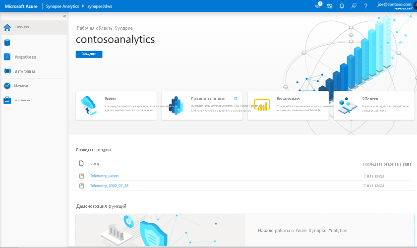

# <a name="quickstart-transform-data-using-mapping-data-flows"></a>Краткое руководство. Преобразование данных с помощью потоков данных сопоставления

В этом кратком руководстве вы будете использовать Azure синапсе Analytics для создания конвейера, который преобразует данные из источника Azure Data Lake Storage 2-го поколения (ADLS 2-го поколения) в ADLS 2-го поколения приемника с помощью потока данных сопоставления. Шаблон конфигурации в этом кратком руководстве можно расширить при преобразовании данных с помощью потока данных сопоставления.

В этом кратком руководстве вы выполните следующие действия:

> [!div class="checklist"]
> * Создание конвейера с действием потока данных в Azure синапсе Analytics.
> * Создание потока данных сопоставления с четырьмя преобразованиями.
> * тестовый запуск конвейера;
> * Наблюдение за действием потока данных

## <a name="prerequisites"></a>Предварительные требования

* **Подписка Azure**: Если у вас еще нет подписки Azure, [создайте бесплатную учетную запись](https://azure.microsoft.com/free/), прежде чем начинать работу.
* **Рабочая область Azure синапсе**. Создайте рабочую область синапсе с помощью портал Azure следуя инструкциям в разделе [Краткое руководство по созданию рабочей области синапсе](quickstart-create-workspace.md).
* **Учетная запись хранения Azure**. вы используете хранилище ADLS в качестве *исходных* и *приемниковых* хранилищ данных. Если у вас нет учетной записи хранения, создайте ее, следуя действиям в [этом разделе](../storage/common/storage-account-create.md).

    Файл, который мы преобразовывать в этом учебнике, MoviesDB.csv, который можно найти [здесь](https://raw.githubusercontent.com/djpmsft/adf-ready-demo/master/moviesDB.csv). Чтобы получить файл из GitHub, скопируйте его содержимое в текстовый редактор по своему усмотрению, чтобы сохранить его локально в виде CSV-файла. Сведения о передаче файла в учетную запись хранения см. [в разделе Отправка больших двоичных объектов с помощью портал Azure](../storage/blobs/storage-quickstart-blobs-portal.md). Примеры будут ссылаться на контейнер с именем Sample-Data.

### <a name="navigate-to-the-synapse-studio"></a>Переход к Synapse Studio

После создания рабочей области Azure Synapse можно открыть Synapse Studio двумя способами:

* Откройте рабочую область Synapse на [портале Azure](https://ms.portal.azure.com/#home). Выберите **Открыть** на карточке Open синапсе Studio в разделе Приступая к работе.
* Откройте [Azure Synapse Analytics](https://web.azuresynapse.net/) и войдите в рабочую область.

Для целей этого краткого руководства в качестве примера мы используем рабочую область с именем adftest2020. При этом вы автоматически перейдете на домашнюю страницу Synapse Studio.



## <a name="create-a-pipeline-with-a-data-flow-activity"></a>Создание конвейера с действием потока данных

Конвейер содержит логический поток для выполнения набора действий. В этом разделе вы создадите конвейер, содержащий действие потока данных.

1. Перейдите на вкладку **Integrate** (Интеграция). Нажмите значок плюса рядом с заголовком конвейеров и выберите "Конвейер".

   

1. На странице Параметры **свойств** конвейера введите **Трансформмовиес** в поле **имя**.

1. В разделе *Перемещение и преобразование* на панели *действия* перетащите элемент **поток данных** на холст конвейера.

1. Во всплывающем окне **Добавление страницы потока данных** выберите **создать новый** поток  ->  **данных** потока данных. Когда закончите, нажмите кнопку **ОК**.

   

1. Назовите **трансформмовиес** потока данных на странице **свойств** .

## <a name="build-transformation-logic-in-the-data-flow-canvas"></a>Логика преобразования "сборка" на холсте потока данных

После создания потока данных он будет автоматически отправлен на холст потока данных. На этом шаге вы создадите поток данных, который принимает MoviesDB.csv в хранилище ADLS и суммирует среднюю оценку комедиес с 1910 до 2000. Затем вы запишете этот файл обратно в хранилище ADLS.

1. Над холстом потока данных продвиньте ползунок **Отладка потока данных** . Режим отладки позволяет выполнять интерактивное тестирование логики преобразования в динамическом кластере Spark. Подготовка кластеров потоков данных занимает 5-7 минут, и пользователям рекомендуется включить отладку первыми, если планируется разработка потока данных. Дополнительные сведения см. в статье [Режим отладки](https://docs.microsoft.com/azure/data-factory/concepts-data-flow-debug-mode?toc=/azure/synapse-analytics/toc.json&bc=/azure/synapse-analytics/breadcrumb/toc.json).

    

1. В холсте потока данных добавьте источник, щелкнув поле **Добавить источник** .

1. Присвойте имя исходному **мовиесдб**. Щелкните **создать** , чтобы создать новый исходный набор данных.

    

1. Выберите **Azure Data Lake Storage 2-го поколения**. Нажмите кнопку "Продолжить".

    

1. Выберите **DelimitedText**. Нажмите кнопку "Продолжить".

1. Назовите свой набор данных **мовиесдб**. В раскрывающемся списке связанная служба выберите **создать**.

1. На экране создания связанной службы присвойте имя связанной Службе ADLS 2-го поколения **ADLSGen2** и укажите метод проверки подлинности. Затем введите учетные данные подключения. В этом кратком руководстве мы используем ключ учетной записи для подключения к нашей учетной записи хранения. Можно нажать кнопку **проверить подключение** , чтобы проверить правильность ввода учетных данных. После завершения нажмите **Создать**.

    

1. Когда вы вернетесь на экран создания набора данных, в поле **путь к файлу** введите, где находится файл. В этом кратком руководстве файл "MoviesDB.csv" находится в контейнере "Sample-Data". Так как файл содержит заголовки, установите флажок **Первая строка в качестве заголовка**. Выберите **из подключения или хранилища** , чтобы импортировать схему заголовка непосредственно из файла в хранилище. Когда закончите, нажмите кнопку **ОК**.

    

1. Если кластер отладки запущен, перейдите на вкладку **Предварительный просмотр данных** преобразования источник и нажмите кнопку **Обновить** , чтобы получить моментальный снимок данных. Вы можете использовать предварительный просмотр данных, чтобы убедиться, что преобразование настроено правильно.

    

1. Рядом с исходным узлом на холсте потока данных щелкните значок "плюс", чтобы добавить новое преобразование. Первое добавляемое преобразование является **фильтром**.

    

1. Назовите преобразование фильтра **филтереарс**. Щелкните поле Выражение рядом с полем **Фильтр** , чтобы открыть построитель выражений. Здесь вы укажете условие фильтрации.

1. Построитель выражений потока данных позволяет интерактивно создавать выражения для использования в различных преобразованиях. Выражения могут включать встроенные функции, столбцы из входной схемы и определяемые пользователем параметры. Дополнительные сведения о построении выражений см. в разделе [Построитель выражений потока данных](https://docs.microsoft.com/azure/data-factory/concepts-data-flow-expression-builder?toc=/azure/synapse-analytics/toc.json&bc=/azure/synapse-analytics/breadcrumb/toc.json).

    В этом кратком руководстве вы хотите отфильтровать фильмы для жанра комедия, которые поступили между годами 1910 и 2000. Поскольку в настоящее время в качестве года используется строка, ее необходимо преобразовать в целое число с помощью ```toInteger()``` функции. Используйте операторы "больше или равно" (>=) и "меньше или равно" (<=) для сравнения значений литерального года 1910 и 200-. Объедините эти выражения вместе с оператором AND (&&). Выражение выйдет следующим образом:

    ```toInteger(year) >= 1910 && toInteger(year) <= 2000```

    Чтобы узнать, какие фильмы являются комедиес, можно использовать ```rlike()``` функцию, чтобы найти шаблон "комедия" в столбцах жанров. Объединение выражения рлике с сравнением year для получения:

    ```toInteger(year) >= 1910 && toInteger(year) <= 2000 && rlike(genres, 'Comedy')```

    

    Если кластер отладки активен, можно проверить логику, нажав кнопку **Обновить** , чтобы увидеть результат выражения по сравнению с используемыми входными данными. Существует более одного правого ответа на то, как можно реализовать эту логику с помощью языка выражений потока данных.

    После завершения работы с выражением нажмите кнопку **сохранить и завершить** .

1. Получите **Предварительный просмотр данных** , чтобы убедиться, что фильтр работает правильно.

1. Следующее преобразование, которое вы добавите, является преобразованием « **Статистическая обработка** » в **модификаторе схемы**.

    

1. Назовите **аггрегатекомедиратингс** преобразования «Статистическая обработка». На вкладке **Группировать по** выберите **год** из раскрывающегося списка, чтобы сгруппировать агрегаты по году, в котором был получен фильм.

    

1. Перейдите на вкладку **статистические выражения** . В левом текстовом поле Назовите столбец Aggregate **аверажекомедиратинг**. Щелкните правой кнопкой мыши поле выражения, чтобы ввести статистическое выражение с помощью построителя выражений.

    

1. Чтобы получить среднее значение **рейтинга** столбца, используйте ```avg()``` агрегатную функцию. Так как **Оценка** является строкой и ```avg()``` принимает числовой ввод, необходимо преобразовать значение в число с помощью ```toInteger()``` функции. Это выражение выглядит следующим образом:

    ```avg(toInteger(Rating))```

    По завершении нажмите кнопку **сохранить и завершить** .

    

1. Перейдите на вкладку **Предварительный просмотр данных** , чтобы просмотреть выходные данные преобразования. Обратите внимание, что здесь есть только два столбца: **year** и **аверажекомедиратинг**.

    

1. Затем необходимо добавить преобразование « **приемник** » в **место назначения**.

    

1. Присвойте имя **приемнику** приемника. Нажмите кнопку **создать** , чтобы создать набор данных приемника.

1. Выберите **Azure Data Lake Storage 2-го поколения**. Нажмите кнопку "Продолжить".

1. Выберите **DelimitedText**. Нажмите кнопку "Продолжить".

1. Назовите свой набор данных приемника **мовиессинк**. В поле связанная служба выберите связанную службу ADLS 2-го поколения, созданную на шаге 7. Введите выходную папку для записи данных. В этом кратком руководстве мы делаем запись в папку Output в контейнере Sample-Data. Папка не должна существовать заранее и может быть создана динамически. Задайте для параметра **Первая строка в качестве заголовка** значение true и выберите значение **нет** для параметра **схема импорта**. Когда закончите, нажмите кнопку **ОК**.

    

Теперь вы завершили сборку потока данных. Все готово для запуска в конвейере.

## <a name="running-and-monitoring-the-data-flow"></a>Выполнение и мониторинг потока данных

Вы можете выполнить отладку конвейера перед его публикацией. На этом шаге будет активирован запуск отладки конвейера потока данных. В то время как предварительный просмотр данных не записывает данные, отладочный запуск будет записывать данные в место назначения приемника.

1. Перейдите на холст конвейера. Нажмите кнопку **Отладка** , чтобы запустить отладку.

    

1. При отладке конвейера для действий потока данных используется активный кластер отладки, но инициализация по-прежнему займет не менее минуты. Ход выполнения можно отслеживать с помощью вкладки **вывод** . После успешного выполнения щелкните значок очков, чтобы открыть панель "Мониторинг".

    

1. На панели "Мониторинг" можно увидеть количество строк и время, потраченное на каждый шаг преобразования.

    

1. Щелкните преобразование, чтобы получить подробные сведения о столбцах и секционировании данных.

    

Если вы выполнили это краткое руководство правильно, в папку приемника должны быть записаны 83 строк и 2 столбца. Данные можно проверить, проверив хранилище BLOB-объектов.


## <a name="next-steps"></a>Дальнейшие действия

Перейдите к следующим статьям, чтобы узнать о поддержке Azure синапсе Analytics.

> [!div class="nextstepaction"]
> [Конвейер и действия](https://docs.microsoft.com/azure/data-factory/concepts-pipelines-activities?toc=/azure/synapse-analytics/toc.json&bc=/azure/synapse-analytics/breadcrumb/toc.json) 
>  [Общие сведения о](https://docs.microsoft.com/azure/data-factory/concepts-data-flow-overview?toc=/azure/synapse-analytics/toc.json&bc=/azure/synapse-analytics/breadcrumb/toc.json) 
>  потоке данных сопоставления [Язык выражений потока данных](https://docs.microsoft.com/azure/data-factory/data-flow-expression-functions?toc=/azure/synapse-analytics/toc.json&bc=/azure/synapse-analytics/breadcrumb/toc.json)
