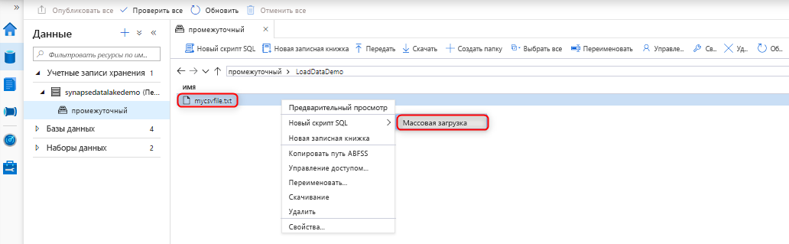
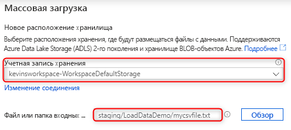
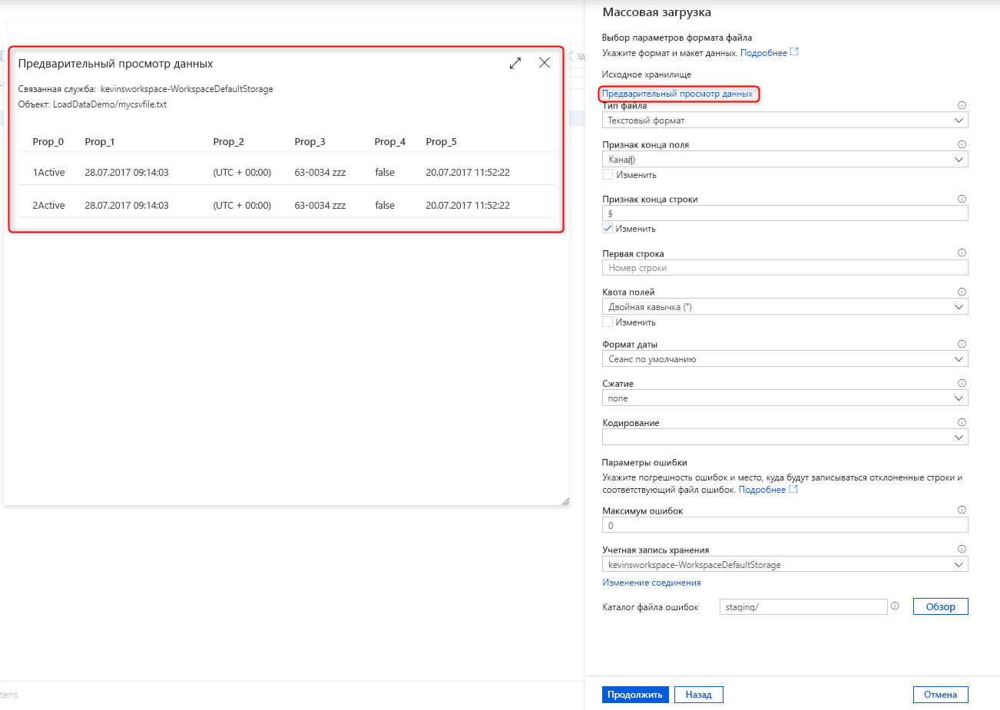
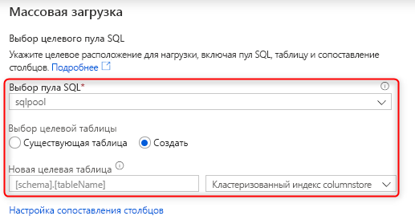
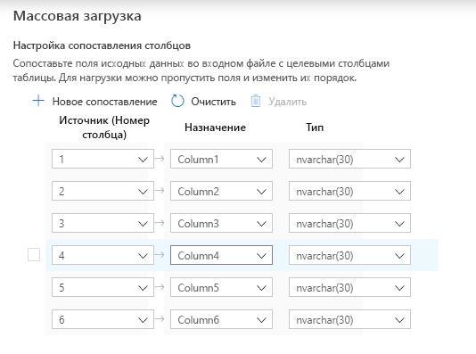

# Краткое руководство. Массовая загрузка в Synapse SQL

Благодаря мастеру массовой загрузки в Synapse Studio загружать данные стало гораздо проще. Этот мастер поможет вам создать скрипт T-SQL с использованием [инструкции COPY](/sql/t-sql/statements/copy-into-transact-sql?view=azure-sqldw-latest&preserve-view=true) для массовой загрузки данных. 

## Точки входа в мастер массовой загрузки

Вы можете без труда выполнять массовую загрузку данных с использованием выделенных пулов SQL, щелкнув правой кнопкой мыши в следующих областях Synapse Studio:

- Файл или папка в учетной записи хранения Azure, присоединенной к рабочей области. 

## Предварительные требования

- Этот мастер создает инструкцию COPY, которая использует сквозную передачу через Azure AD для аутентификации. У [пользователя Azure AD должны быть разрешения на доступ](
./sql-data-warehouse/quickstart-bulk-load-copy-tsql-examples.md#d-azure-active-directory-authentication) к рабочей области по меньшей мере с ролью Azure участника данных BLOB-объектов хранилища в учетной записи ADLS 2-го поколения. 

- У вас должны быть [разрешения на использование инструкции COPY](/sql/t-sql/statements/copy-into-transact-sql?view=azure-sqldw-latest&preserve-view=true#permissions) и разрешения на создание таблиц, если для загрузки будет создаваться новая таблица.

- У соответствующей службы, связанной с учетной записью ADLS 2-го поколения, **должны быть разрешения на доступ к файлу**/**папке** для загрузки. Например, если для связанной службы используется механизм аутентификации "Управляемое удостоверение", у управляемого удостоверения рабочей области должна быть по меньшей мере роль читателя для BLOB-объектов хранилища в учетной записи хранения.

- Если в рабочей области включена виртуальная сеть, убедитесь, что для интегрированной среды выполнения, связанной с соответствующими службами учетной записи ADLS 2-го поколения для определения исходных данных и файлов ошибок, включена интерактивная разработка. Интерактивная разработка требуется для автоматического обнаружения схемы, а также просмотра содержимого исходного файла и учетных записей хранения ADLS 2-го поколения в мастере.

### Шаги

1. Выберите учетную запись хранения и файл или папку, из которых вы загружаете данные, на панели в месте хранения исходных данных. Мастер попытается автоматически обнаружить файлы Parquet, а также текстовые файлы с разделителями (CSV), включая сопоставление исходных полей из файла с соответствующими типами данных SQL. 

   

2. Выберите параметры формата файла, включая параметры ошибок, если в процессе выполнения массовой загрузки были отклонены строки. Кроме того, выбрав элемент "Предварительный просмотр данных", вы увидите, как инструкция COPY будет анализировать файл. Это поможет вам настроить параметры формата файла. Выбирайте элемент "Предварительный просмотр данных" при каждом изменении параметров формата файла, чтобы увидеть, как инструкция COPY анализирует файл с обновленными параметрами:

    

> [!NOTE]  
>
> - Предварительный просмотр данных с признаками конца поля в виде нескольких символов не поддерживается в мастере массовой загрузки. Мастер массовой загрузки обеспечит предварительный просмотр данных в одном столбце, если задан признак конца поля в виде нескольких символов. 
> - При выборе параметра Infer column names (Вывод имен столбцов) мастер массовой загрузки будет анализировать имена столбцов из первой строки, указанной в поле "Первая строка". Мастер массовой загрузки автоматически увеличит значение FIRSTROW в инструкции COPY на 1, чтобы пропустить эту строку заголовка. 
> - Указание признаков конца поля в виде нескольких символов поддерживается в инструкции COPY, но не в мастере массовой загрузки, где возникнет ошибка.

3. Выберите выделенный пул SQL, который вы используете для загрузки, и укажите, куда загружать данные — в существующую или новую таблицу: 
4. Выберите элемент "Настроить сопоставление столбцов", чтобы проверить правильность сопоставления. Обратите внимание, что имена столбцов будут автоматически обнаружены, если был включен вывод имен столбцов. Для новых таблиц очень важно настроить сопоставление столбцов, так как это позволяет обновлять типы данных для целевого столбца.

   
5. Выберите элемент "Открыть скрипт" и вы получите скрипт T-SQL с инструкцией COPY для загрузки данных из озера данных: 

## Дальнейшие действия

- См. сведения о возможностях [инструкции COPY](/sql/t-sql/statements/copy-into-transact-sql?view=azure-sqldw-latest&preserve-view=true#syntax).
- См. сведения о [загрузке данных](./sql-data-warehouse/design-elt-data-loading.md#what-is-elt).
