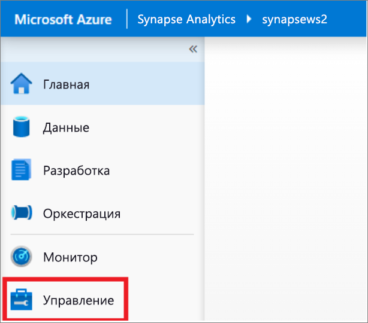
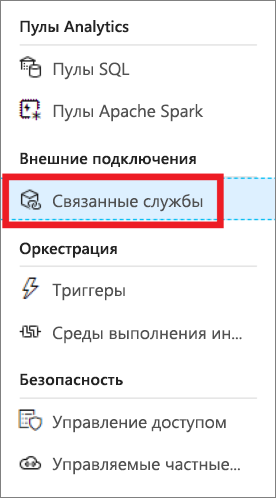
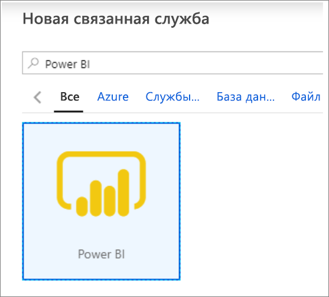
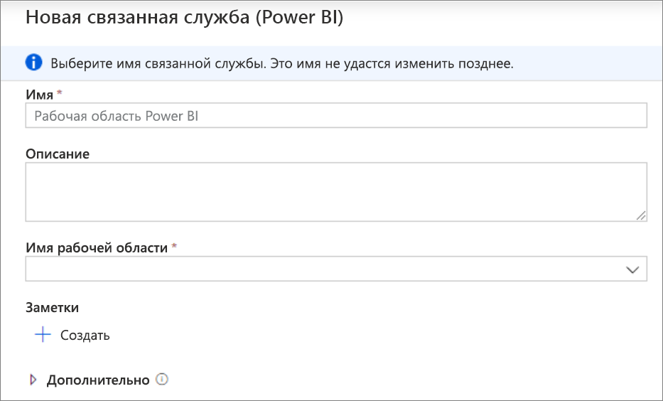
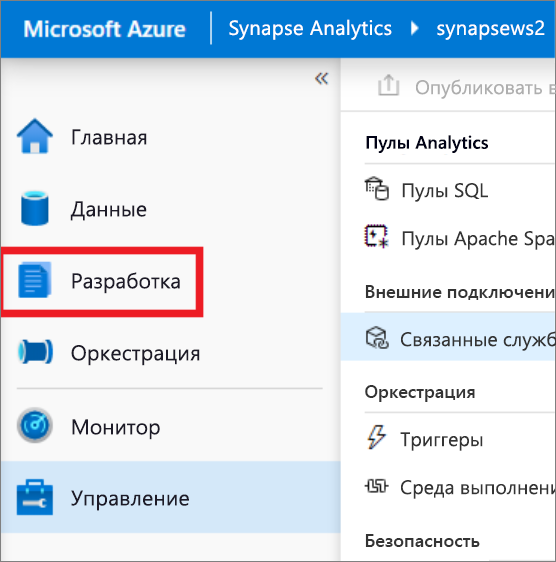
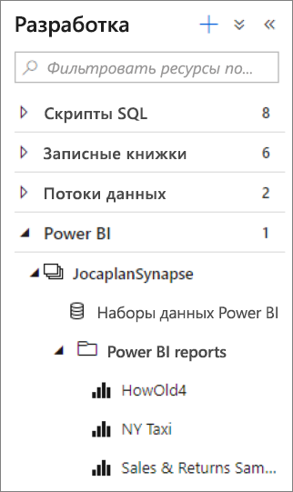
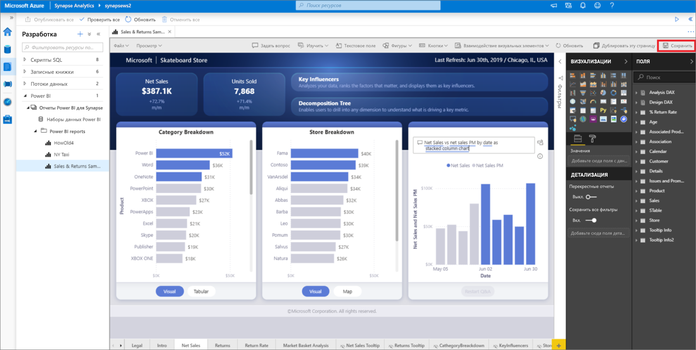

# Краткое руководство. Связывание рабочей области Power BI с рабочей областью Synapse

В этом кратком руководстве вы узнаете, как подключить рабочую область Power BI к рабочей области Synapse Analytics для создания новых отчетов и наборов данных Power BI с помощью Synapse Studio (предварительная версия).

Если у вас еще нет подписки Azure, [создайте бесплатную учетную запись, прежде чем начинать работу](https://azure.microsoft.com/free/).

## Предварительные требования

- [Создайте рабочую область Azure Synapse и связанную с ней учетную запись хранения](quickstart-create-workspace.md).
- [Рабочая область Power BI Professional или Premium](https://docs.microsoft.com/power-bi/service-create-the-new-workspaces)

## Связывание рабочей области Power BI с рабочей областью Synapse

1. Откройте Synapse Studio и щелкните **Управление**.

    

2. В разделе **Внешние подключения** щелкните **Связанные службы**.

    

3. Щелкните **+ Создать**.

    

4. Щелкните **Power BI** и выберите **Продолжить**.

    

5. Введите имя для связанной службы и выберите рабочую область из раскрывающегося списка.

    

6. Нажмите кнопку **Создать**.

## Просмотр рабочей области Power BI в Synapse Studio

После связывания рабочих областей вы сможете просматривать наборы данных Power BI, изменять и создавать новые отчеты Power BI из Synapse Studio.

1. Щелкните **Develop** (Разработка).

    

2. Разверните Power BI и рабочую область, которую вы намерены использовать.

    

Новые отчеты можно создать, щелкнув **+** в верхней части вкладки **Разработка**. Чтобы изменить существующий отчет, щелкните имя этого отчета. Все сохраненные изменения будут записаны обратно в рабочую область Power BI.

## Дальнейшие действия

Дополнительные сведения: [Создание отчета Power BI о файлах, хранящихся в службе хранилища Azure](sql/tutorial-connect-power-bi-desktop.md).
