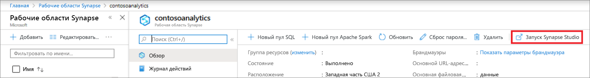
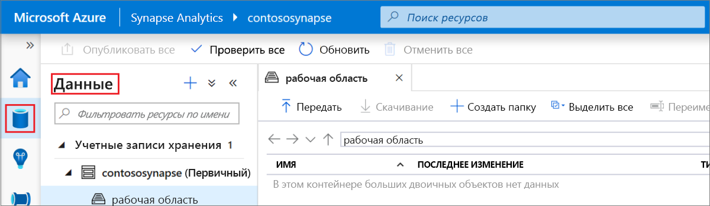
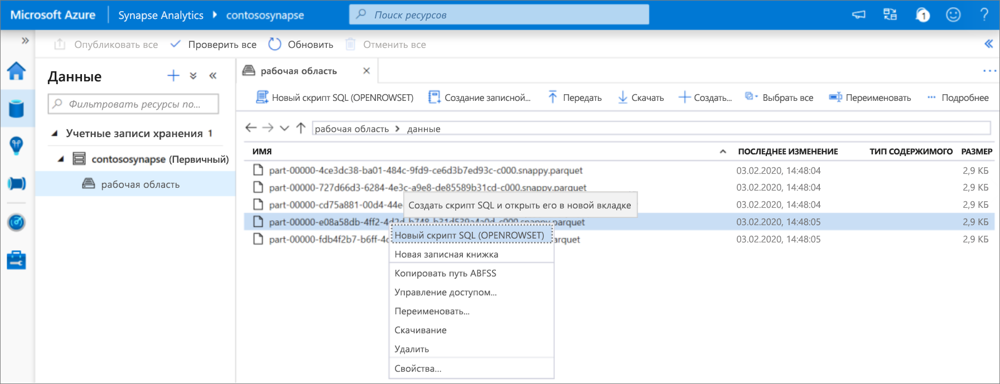
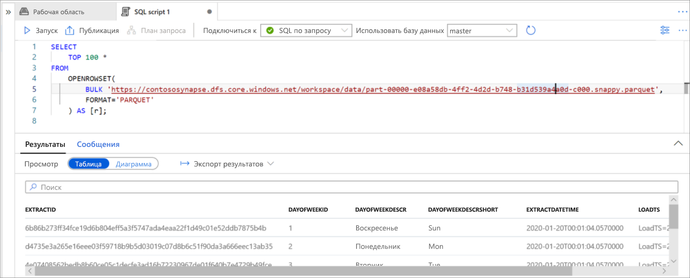

# Краткое руководство. Использование Synapse Studio (предварительная версия)

В этом кратком руководстве вы узнаете, как запрашивать файлы с помощью Synapse Studio.

Если у вас еще нет подписки Azure, создайте [бесплатную](https://azure.microsoft.com/free/) учетную запись Azure, прежде чем начинать работу.

## Вход на портал Azure

Войдите на [портал Azure](https://portal.azure.com/).

## Предварительные требования

[Создайте рабочую область Azure Synapse и связанную с ней учетную запись хранения](quickstart-create-workspace.md).

## Запуск Synapse Studio

На портале в рабочей области Azure Synapse щелкните **Запустить Synapse Studio**.

Кроме того, Synapse Studio можно запустить, щелкнув [Azure Synapse Analytics](https://web.azuresynapse.net) и указав соответствующие значения для клиента, подписки и рабочей области.

## Просмотр учетных записей хранения

После открытия Synapse Studio перейдите к **данным**, а затем разверните **учетные записи хранения** для просмотра учетной записи хранения в рабочей области.

Вы можете создать новые папки и передать файлы с помощью ссылок на панели инструментов, чтобы упорядочить файлы.

## Файлы запросов в учетной записи хранения

> [!IMPORTANT]
> Чтобы иметь возможность запрашивать файлы, необходимо быть членом роли `Storage Blob Reader` в базовом хранилище. Узнайте, как [назначить для **Модуля чтения данных BLOB-объектов хранилища** или **Участника для данных BLOB-объектов хранилища** разрешения RBAC в службе хранилища Azure](../storage/common/storage-auth-aad-rbac-portal.md?toc=/azure/synapse-analytics/toc.json&bc=/azure/synapse-analytics/breadcrumb/toc.json#assign-an-azure-built-in-role).

1. Отправьте некоторые файлы `PARQUET`.
2. Выберите один или несколько файлов, а затем создайте новый скрипт SQL или записную книжку Spark, чтобы просмотреть содержимое файлов. Если вы хотите создать записную книжку, необходимо создать [пул Apache Spark в рабочих областях Synapse](quickstart-create-apache-spark-pool-studio.md).

   

3. Запустите созданный запрос или записную книжку, чтобы просмотреть содержимое файла.

   

4. Вы можете изменить запрос, чтобы выполнять фильтрацию и сортировку результатов. Узнайте о функциях языка, доступных в SQL по запросу, в статье [Функции Transact-SQL, поддерживаемые в Azure Synapse SQL](sql/overview-features.md).

## Дальнейшие действия

- Включение пользователей Azure AD для запроса файлов [путем назначения для **Модуля чтения данных BLOB-объектов хранилища** или **Участника для данных BLOB-объектов хранилища** разрешений RBAC в службе хранилища Azure](../storage/common/storage-auth-aad-rbac-portal.md?toc=/azure/synapse-analytics/toc.json&bc=/azure/synapse-analytics/breadcrumb/toc.json#assign-an-azure-built-in-role)
- [Запросы к файлам в службе хранилища Azure с помощью SQL по запросу](sql/on-demand-workspace-overview.md)
- [Создание пула Apache Spark с помощью портала Azure](quickstart-create-apache-spark-pool-portal.md)
- [Создание отчета Power BI о файлах, хранящихся в службе хранилища Azure](sql/tutorial-connect-power-bi-desktop.md)
