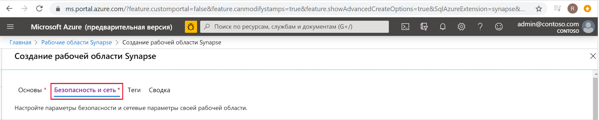
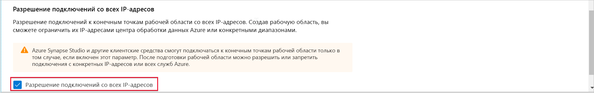
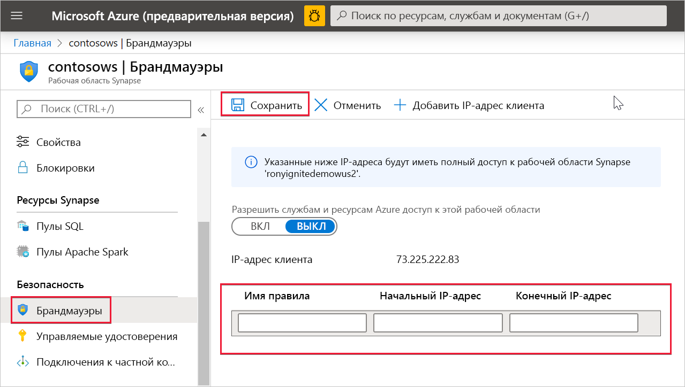

# Правила брандмауэра для IP-адресов Azure Synapse Analytics (предварительная версия)

В этой статье вы узнаете о правилах брандмауэра для IP-адресов и научитесь настраивать их в Azure Synapse Analytics.

## Правила брандмауэра для IP-адресов

Правила брандмауэра для IP-адресов предоставляют или запрещают доступ к рабочей области Synapse на основе исходного IP-адреса каждого запроса. Вы можете настроить правила брандмауэра для IP-адресов для рабочей области. Правила брандмауэра для IP-адресов, настроенные на уровне рабочей области, применяются ко всем общедоступным конечным точкам рабочей области (пулы SQL, SQL по запросу и разработка).

## Создание и администрирование правил брандмауэра для IP-адресов

Существует два способа добавления правил брандмауэра для IP-адресов в рабочую область Synapse. Чтобы добавить брандмауэр для IP-адресов в рабочую область, выберите **Безопасность и сеть** и установите флажок **Allow connections from all IP addresses** (Разрешить подключения со всех IP-адресов) во время создания рабочей области.

Вы также можете добавить правила брандмауэра для IP-адресов в рабочую область Synapse после создания рабочей области. Выберите **брандмауэры** в разделе **Безопасность** на портале Azure. Чтобы добавить новое правило брандмауэра для IP-адресов, присвойте ему имя, начальный и конечный IP-адреса. По завершении нажмите кнопку **Сохранить**.

## Подключение к Synapse из вашей сети

Вы можете подключиться к рабочей области Synapse с помощью Synapse Studio. SQL Server Management Studio (SSMS) можно также использовать в рабочей области для подключения к ресурсам SQL (пулам SQL и SQL по запросу).

Убедитесь, что брандмауэр в сети и на локальном компьютере допускают исходящие подключения через TCP-порты 80, 443 и 1443 для Synapse Studio.

Кроме того, для Synapse Studio необходимо разрешить исходящий обмен данными через UDP-порт 53. Для подключения с помощью таких средств, как SSMS и Power BI, необходимо разрешить исходящие подключения через TCP-порт 1433.

Если вы используете параметр политики подключения перенаправления по умолчанию, может потребоваться разрешить исходящие подключения на дополнительных портах. Дополнительные сведения о политиках подключения см. [здесь](https://docs.microsoft.com/azure/sql-database/sql-database-connectivity-architecture#connection-policy).

## Дальнейшие действия

Создание [рабочей области Azure Synapse](../quickstart-create-workspace.md).

Создание управляемой рабочей области Azure Synapse с [виртуальной сетью](./synapse-workspace-managed-vnet.md).