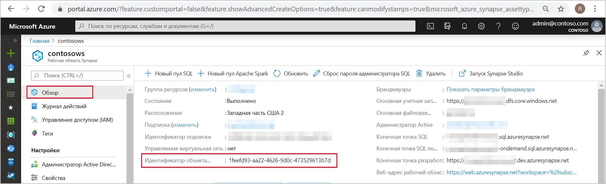
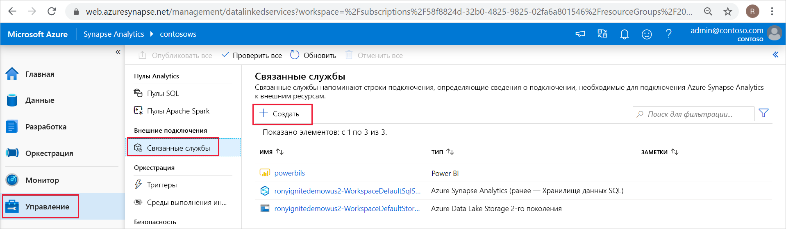
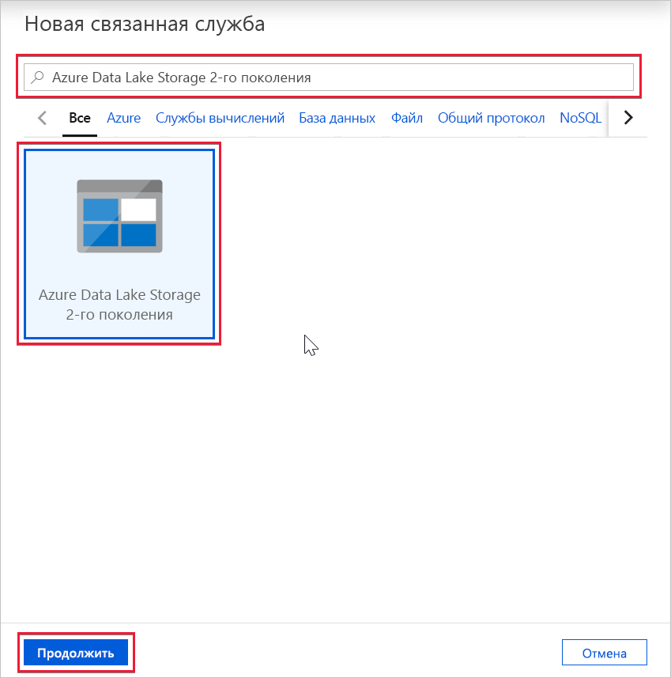
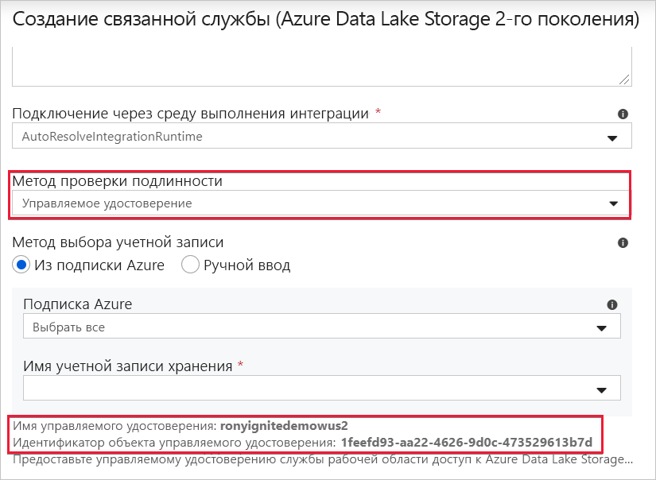

# Управляемое удостоверение рабочей области Azure Synapse

В этой статье вы узнаете об управляемом удостоверении в рабочей области Azure Synapse.

## Управляемые удостоверения

Управляемое удостоверение для ресурсов Azure — это компонент Azure Active Directory. Функция предоставляет службам Azure автоматически управляемое удостоверение в Azure AD. Управляемое удостоверение можно использовать для проверки подлинности в любой службе, поддерживающей аутентификацию Azure AD.

Управляемые удостоверения для ресурсов Azure — это новое название службы "Управляемое удостоверение службы" (MSI). Дополнительные сведения см. в статье [Что такое управляемые удостоверения для ресурсов Azure?](../../active-directory/managed-identities-azure-resources/overview.md?toc=/azure/synapse-analytics/toc.json&bc=/azure/synapse-analytics/breadcrumb/toc.json).

## Управляемое удостоверение рабочей области Azure Synapse

Управляемое удостоверение, назначаемое системой, создается для рабочей области Azure Synapse при создании рабочей области.

>[!NOTE]
>Это управляемое удостоверение рабочей области будет называться управляемым удостоверением далее в этом документе.

Azure Synapse использует управляемое удостоверение для интеграции конвейеров. Жизненный цикл управляемого удостоверения напрямую связан с рабочей областью Azure Synapse. Если удалить рабочую область Azure Synapse, то управляемое удостоверение также будет очищено.

Управляемому удостоверению рабочей области требуются разрешения на выполнение операций в конвейерах. Вы можете использовать идентификатор объекта или имя рабочей области Azure Synapse, чтобы найти управляемое удостоверение при предоставлении разрешений.

## Получение управляемого удостоверения на портале Azure

Получить назначаемое пользователем управляемое удостоверение можно на портале Azure. Откройте рабочую область Azure Synapse на портале Azure и щелкните раздел **Обзор** в области навигации слева. На главном экране будет показан идентификатор объекта управляемого удостоверения.

Сведения об управляемых удостоверениях также будут отображаться при создании связанной службы, поддерживающей проверку подлинности с использованием управляемых удостоверений в среде Azure Synapse Studio.

Запустите **Azure Synapse Studio** и выберите вкладку **Управление** в области навигации слева. Затем выберите раздел **Связанные службы** и нажмите кнопку **+ Создать**, чтобы создать связанную службу.

В окне **New linked service** (Новая связанная служба) введите *Azure Data Lake Storage 2-го поколения*. Выберите тип ресурса **Azure Data Lake Storage 2-го поколения** в списке ниже и нажмите кнопку **Продолжить**.

В следующем окне выберите значение **Управляемое удостоверение** для параметра **Способ проверки подлинности**. Вы увидите **имя** и **идентификатор объекта** управляемого удостоверения.

## Дальнейшие действия

Ознакомьтесь со статьей [Предоставление разрешений для управляемого удостоверения рабочей области Azure Synapse (предварительная версия)](./how-to-grant-workspace-managed-identity-permissions.md).
