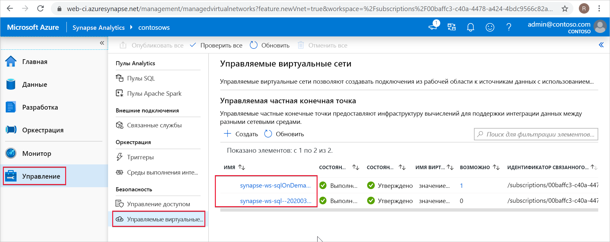

# Управляемые частные конечные точки в Azure Synapse.

В этой статье объясняется принцип работы с управляемыми частными конечными точками в Azure Synapse Analytics.

## Управляемые частные конечные точки

Управляемые частные конечные точки — это частные конечные точки, созданные в управляемой рабочей области в виртуальной сети Microsoft Azure, через которую проходит частный канал доступа к ресурсам Azure. Azure Synapse управляет этими частными конечными точками от вашего имени.

Azure Synapse поддерживает приватные каналы. Приватный канал обеспечивает безопасный доступ к службам Azure (таким как служба хранилища Azure и Azure Cosmos DB), а также к службам Azure клиентов и партнеров в виртуальной сети Azure.

При использовании частного канала трафик между виртуальной сетью и рабочей областью полностью проходит через магистральную сеть Майкрософт. Приватный канал обеспечивает защиту от угроз кражи данных. Чтобы установить приватный канал для ресурса, создайте частную конечную точку.

Частная конечная точка использует частный IP-адрес из виртуальной сети, по сути перемещая службу в виртуальную сеть. Частная конечная точка сопоставляется с конкретным ресурсом в Azure, а не со всей службой. Клиенты могут ограничить возможности подключения к определенному ресурсу, утверждаемому их организацией. 

Дополнительные сведения о приватных каналах и частных конечных точках см. [здесь](https://docs.microsoft.com/azure/private-link/).

>[!IMPORTANT]
>Управляемые частные конечные точки поддерживаются только в управляемых рабочих областях Azure Synapse с виртуальной сетью.

>[!NOTE]
>В будущем весь исходящий трафик из виртуальной сети управляемой рабочей области, не проходящий через управляемые частные конечные точки, будет блокироваться. Мы рекомендуем создать управляемые частные конечные точки для подключения ко всем источникам данных Azure за пределами рабочей области. 

Если управляемая частная конечная точка создана в Azure Synapse, подключение к ней создается в состоянии ожидания. Запускается рабочий процесс утверждения. Владелец ресурса для приватного канала должен утвердить это подключение.

Если владелец утверждает подключение, устанавливается приватный канал. Если же владелец не утвердит подключение, то приватный канал не будет установлен. В любом случае состояние подключения к управляемой частной конечной точке будет обновлено.

Только управляемая частная конечная точка в утвержденном состоянии может передавать трафик на заданный ресурс приватного канала.

## Управляемые частные конечные точки для выделенного бессерверного пулов SQL

Выделенный и бессерверный пулы SQL реализуют аналитические возможности в рабочей области Azure Synapse. Для этого используется мультитенантная инфраструктура, которая не развертывается в [виртуальной сети управляемой рабочей области](./synapse-workspace-managed-vnet.md).

При создании рабочей области Azure Synapse создает в ней две управляемые частные конечные точки — по одной для выделенного и бессерверного пулов SQL. 

Эти управляемые конечные точки указываются в Synapse Studio. Выберите в левой области навигации раздел **Управление**, а затем выберите **Managed private endpoints** (Управляемые частные конечные точки), чтобы увидеть эти конечные точки в Studio.

Управляемая частная конечная точка, предназначенная для выделенного пула SQL, называется *synapse-ws-sql--\<workspacename\>* , а для бессерверного пула SQL — *synapse-ws-sqlOnDemand--\<workspacename\>* .

Эти конечные точки создаются автоматически при создании рабочей области Azure Synapse. За эти две управляемые частные конечные точки не начисляется плата.

## Дальнейшие действия

Дополнительные сведения см. в статье [Создание управляемых частных конечных точек для источников данных](./how-to-create-managed-private-endpoints.md).
