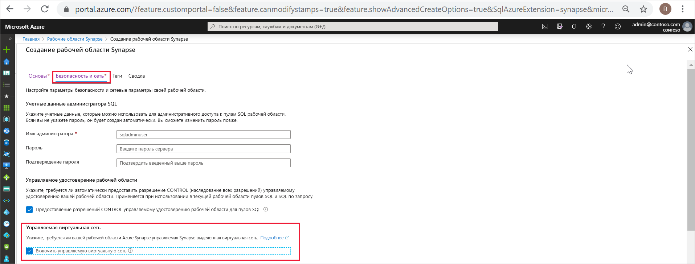
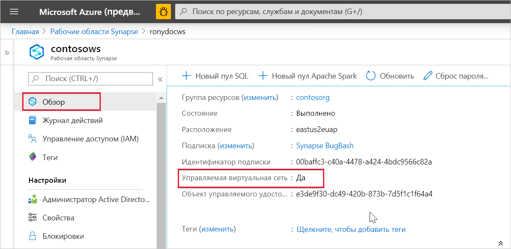

# Управляемая виртуальная сеть Azure Synapse Analytics (предварительная версия)

В этой статье объясняется принцип работы с управляемой виртуальной сетью в Azure Synapse Analytics.

## Управляемая виртуальная сеть рабочей области

При создании рабочей области Azure Synapse ее можно связать с виртуальной сетью. Управление виртуальной сетью, связанной с рабочей областью, происходит с помощью Azure Synapse. Такая виртуальная сеть называется *управляемой виртуальной сетью рабочей области*.

Управляемая виртуальная сеть рабочей области предоставляет четыре преимущества:

- С помощью управляемой виртуальной сети рабочей области можно перенести нагрузку управления виртуальной сетью в Azure Synapse.
- Вам не нужно настраивать входящие правила группы безопасности сети (NSG) для собственных виртуальных сетей, чтобы обеспечить возможность входа в виртуальную сеть для трафика управления Azure Synapse. Неправильная настройка этих правил NSG приводит к прерыванию работы службы для клиентов.
- Вам не нужно создавать подсеть для кластеров Spark на основе пиковой нагрузки.
- Управляемая виртуальная сеть рабочей области вместе с управляемыми частными конечными точками обеспечивают защиту от кражи данных. Вы можете создавать управляемые частные конечные точки только в той рабочей области, у которой есть связанная управляемая виртуальная сеть.

Создание рабочей области со связанной с ней управляемой виртуальной сетью гарантирует, что ваша рабочая область будет изолирована от других рабочих областей. Azure Synapse предоставляет различные аналитические возможности в рабочей области: интеграцию данных, Apache Spark, пул SQL и SQL по запросу.

Если у рабочей области есть управляемая виртуальная сеть, в ней развертываются ресурсы Spark и интеграции данных. Управляемая виртуальная сеть рабочей области также обеспечивает изоляцию на уровне пользователя для действий Spark, так как каждый кластер Spark располагается в собственной подсети.

Пул SQL и SQL по запросу являются мультитенантными компонентами, поэтому остаются за пределами управляемой виртуальной сети рабочей области. Для обмена данными с пулом SQL и SQL по запросу в рабочей области используются приватные каналы Azure. Эти приватные каналы создаются автоматически при создании рабочей области со связанной с ней управляемой виртуальной сетью.

>[!IMPORTANT]
>Эту конфигурацию рабочей области нельзя изменить после ее создания. Например, нельзя перенастроить рабочую область без связанной с ней управляемой виртуальной сети, чтобы связать эту область с виртуальной сетью. Аналогичным образом нельзя перенастроить рабочую область со связанной с ней управляемой виртуальной сетью, чтобы отменить связь между ней и виртуальной сетью.

## Создание рабочей области Azure Synapse с управляемой виртуальной сетью

Зарегистрируйте поставщик сетевых ресурсов, если вы еще этого не сделали. Регистрация поставщика ресурсов настраивает подписку для работы с поставщиком ресурсов. В процессе *регистрации* выберите значение [Microsoft.Network](https://docs.microsoft.com/azure/azure-resource-manager/management/resource-providers-and-types) из списка поставщиков ресурсов.

Чтобы создать рабочую область Azure Synapse, у которой есть связанная с ней управляемая виртуальная сеть, выберите вкладку **Security + networking** (Безопасность и сеть) на портале Azure и установите флажок **Enable managed virtual network** (Включить управляемую виртуальную сеть).

Если флажок не установлен, виртуальная сеть не будет связана с рабочей областью.

>[!IMPORTANT]
>В рабочей области с управляемой виртуальной сетью можно использовать только приватные каналы.

>[!NOTE]
>В будущем весь исходящий трафик из управляемой виртуальной сети рабочей области, не проходящий через управляемые частные конечные точки, будет блокироваться. Мы рекомендуем создать управляемые частные конечные точки для подключения ко всем источникам данных Azure за пределами рабочей области. 

Вы можете проверить, связана ли рабочая область Azure Synapse с управляемой виртуальной сетью, выбрав **Обзор** на портале Azure.

## Дальнейшие действия

Дополнительные сведения о создании рабочей области Azure Synapse см. [здесь](../quickstart-create-workspace.md).

См. дополнительные сведения об [управляемых частных конечных точках](./synapse-workspace-managed-private-endpoints.md) и статью

[Создание управляемой частной конечной точки для источника данных](./how-to-create-managed-private-endpoints.md).
