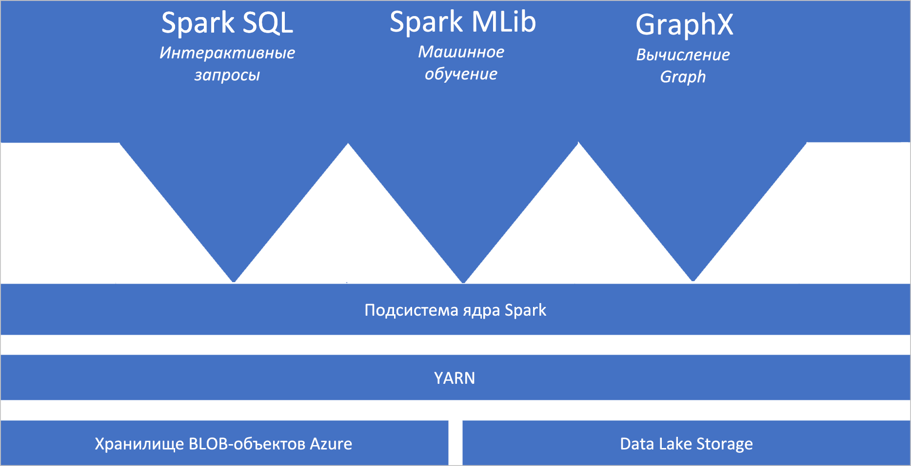
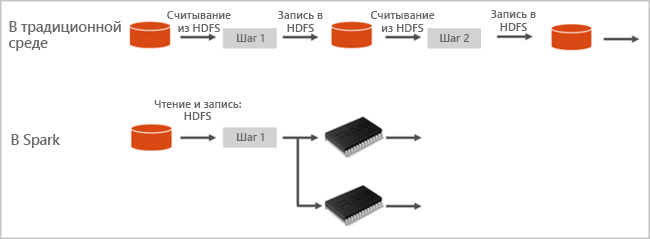

# Что такое Apache Spark в Azure Synapse Analytics

Apache Spark — это платформа параллельной обработки, которая поддерживает обработку в памяти, чтобы повысить производительность приложений для анализа больших данных. Apache Spark в Azure Synapse Analytics — это одна из реализаций Apache Spark в облаке, предоставляемая корпорацией Майкрософт. Azure Synapse упрощает создание и настройку пула Spark (предварительной версии) в Azure. Пулы Spark в Azure Synapse совместимы со службой хранилища Azure и Azure Data Lake Storage 2-го поколения. Следовательно, пулы Azure Spark можно использовать для обработки данных, хранящихся в Azure.

[!INCLUDE [preview](../includes/note-preview.md)]

## Основные сведения об Apache Spark

Apache Spark предоставляет примитивы для кластерных вычислений в памяти. Задание Spark может загрузить данные, поместить их в кэш в памяти и запрашивать их неоднократно. Вычисления в памяти выполняются намного быстрее, чем в приложениях, использующих диски. Spark также интегрируется с несколькими языками программирования, что дает возможность управлять распределенными наборами данных, такими как локальные коллекции. Нет необходимости структурировать обмен данными как операции сопоставления и редукции.

Пулы Spark в Azure Synapse предлагают полностью управляемую службу Spark. Ниже приведены преимущества создания пула Spark в Synapse Analytics.

| Компонент | Описание |
| --- | --- |
| Скорость и эффективность |Запуск экземпляров Spark для менее чем 60 узлов занимает примерно две минуты, а для более 60 узлов — около пяти минут. По умолчанию экземпляр завершает работу через пять минут после последнего выполненного задания, если работа экземпляра не поддерживается через подключение к записной книжке. |
| Простота создания |Создание пула Spark в Azure Synapse с помощью портала Azure, Azure PowerShell или пакета SDK для .NET в Synapse Analytics занимает всего несколько минут. См. статью [Краткое руководство. Создание пула Apache Spark (предварительной версии) в Synapse Analytics с помощью веб-средств](../quickstart-create-apache-spark-pool-studio.md). |
| Простота использования |Synapse Analytics включает в себя настраиваемую записную книжку, производную от [Nteract](https://nteract.io/). Их можно использовать для интерактивной обработки и визуализации данных.|
| Интерфейсы REST API |Spark в Synapse Analytics включает в себя [Apache Livy](https://github.com/cloudera/hue/tree/master/apps/spark/java#welcome-to-livy-the-rest-spark-server), сервер заданий Spark на основе REST API, который позволяет удаленно отправлять и отслеживать задания. |
| Поддержка Azure Data Lake Storage 2-го поколения| Пулы Spark в Azure Synapse могут использовать Azure Data Lake Storage 2-го поколения, а также хранилище BLOB-объектов. Дополнительные сведения о Data Lake Storage см. в [обзоре Azure Data Lake Storage](../../data-lake-store/data-lake-store-overview.md). |
| Интеграция со сторонними IDE | Azure Synapse предоставляет подключаемый модуль интегрированной среды разработки для [IntelliJ IDEA JetBrains](https://www.jetbrains.com/idea/), который можно использовать для создания и отправки приложений в пул Spark. |
| Предварительно загруженные библиотеки Anaconda |Пулы Spark в Azure Synapse поставляются с предустановленными библиотеками Anaconda. [Anaconda](https://docs.continuum.io/anaconda/) содержит порядка 200 библиотек для машинного обучения, анализа данных, визуализации и т. д. |
| Масштабируемость | В Apache Spark в пулах Azure Synapse может быть включено автомасштабирование, чтобы при необходимости масштаб пулов можно было изменить путем добавления или удаления кластера. Кроме того, завершить работу пулов Spark можно без потери данных, так как все данные хранятся в службе хранилища Azure или Data Lake Storage. |

Пулы Spark в Azure Synapse включают в себя указанные ниже компоненты, доступные в пулах по умолчанию.

- [Ядро Spark](https://spark.apache.org/docs/latest/). Включает в себя ядро Spark, Spark SQL, GraphX и MLlib.
- [Anaconda](https://docs.continuum.io/anaconda/)
- [Apache Livy](https://github.com/cloudera/hue/tree/master/apps/spark/java#welcome-to-livy-the-rest-spark-server)
- [Записная книжка Nteract](https://nteract.io/)

## Архитектура пула Spark

Чтобы разобраться с компонентами Spark, нужно понять принцип работы Spark в Synapse Analytics.

Приложения Spark выполняются как независимые наборы процессов в пуле, координируемые объектом SparkContext в основной программе (называемой программой драйвера).

SparkContext может подключаться к диспетчеру кластеров, который распределяет ресурсы между приложениями. Диспетчером кластеров является [Apache Hadoop YARN](https://hadoop.apache.org/docs/current/hadoop-yarn/hadoop-yarn-site/YARN.html). После подключения Spark получает исполнители на узлах пула. Исполнители представляют собой процессы, которые выполняют вычисления и хранят данные для приложения. Затем Spark отправляет исполнителям код приложения (определенный в JAR- или Python-файлах, переданных в SparkContext). Наконец, SparkContext отправляет исполнителям задачи для выполнения.

SparkContext выполняет основную функцию пользователя и осуществляет различные параллельные операции на узлах. Затем SparkContext собирает результаты операций. Узлы считывают данные из файловой системы и записывают их в нее. Кроме того, узлы помещают преобразованные данные в кэш в памяти как устойчивые распределенные наборы данных (RDD).

SparkContext подключается к пулу Spark и отвечает за преобразование приложения в ориентированный граф (направленный ациклический граф, DAG). Граф состоит из отдельных задач, которые выполняются в рамках процесса исполнителя в узлах. Каждое приложение получает отдельные процессы исполнителя, которые остаются активными во время выполнения приложения и обрабатывают задачи в нескольких потоках.

## Варианты использования Apache Spark в Synapse Analytics

Ниже представлены сценарии для использования пулов Spark в Synapse Analytics.

### Инжиниринг и подготовка данных

Apache Spark предусматривает множество языковых функций для поддержки подготовки и обработки больших объемов данных, чтобы их можно было сделать более полезными, а затем использовать их в других службах Synapse Analytics. Это обеспечивается с помощью нескольких языков (C#, Scala, PySpark, Spark SQL) и предоставляемых библиотек для обработки и подключения.

### Машинное обучение

В состав Apache Spark входит [MLlib](https://spark.apache.org/mllib/), библиотека машинного обучения, созданная на основе Spark, которую вы можете использовать из пула Spark в Synapse Analytics. Пулы Spark в Synapse Analytics также включают в себя библиотеку Anaconda, дистрибутив Python, содержащий различные пакеты для обработки и анализа данных, в том числе для машинного обучения. В сочетании со встроенной поддержкой записных книжек вы получаете в свое распоряжение среду для создания приложений машинного обучения.

## С чего начать

Дополнительные сведения об Apache Spark в Synapse Analytics см. в следующих документах:

- [Краткое руководство. Создание пула Apache Spark (предварительной версии) в Synapse Analytics с помощью веб-средств](../quickstart-create-apache-spark-pool-portal.md)
- [Краткое руководство. Создание записной книжки Apache Spark](../quickstart-apache-spark-notebook.md)
- [Руководство. Использование машинного обучения с Apache Spark](./apache-spark-machine-learning-mllib-notebook.md)
- [Официальная документация по Apache Spark](https://spark.apache.org/docs/latest/)

> [!NOTE]
> Некоторые из официальных документов по Apache Spark предполагают использование консоли Spark, которая недоступна в Azure Synapse Spark. Вместо этого используйте интерфейсы записной книжки или IntelliJ.

## Дальнейшие действия

В этой обзорной статье вы получили основные сведения об Apache Spark в Azure Synapse Analytics. Перейдите к следующей статье, чтобы узнать, как создать пул Spark в Azure Synapse Analytics:

- [Создание пула Apache Spark (предварительной версии) в Synapse Analytics с помощью веб-средств](../quickstart-create-apache-spark-pool-portal.md)
