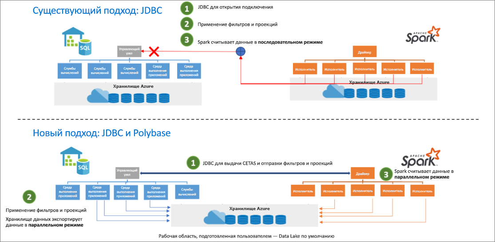

# <a name="introduction"></a>Введение

Соединитель Spark для Synapse SQL в службе Azure Synapse разработан для эффективной передачи данных между пулом Spark (предварительной версии) и пулами SQL в Azure Synapse. Соединитель Spark для Synapse SQL в службе Azure Synapse работает только в пулах SQL и не поддерживает SQL по запросу.

## <a name="design"></a>Конструирование

Передача данных между пулами Spark и SQL может выполняться с помощью JDBC. Но при наличии двух распределенных систем, таких как пулы Spark и SQL, как правило, JDBC является узким местом при последовательной передаче данных.

Соединитель Spark для Synapse SQL в службе Azure Synapse реализует источник данных для Apache Spark. Он использует Azure Data Lake Storage 2-го поколения и PolyBase в пулах SQL для эффективной передачи данных между кластером Spark и экземпляром Synapse SQL.



## <a name="authentication-in-azure-synapse-analytics"></a>Проверка подлинности в Azure Synapse Analytics

Проверка подлинности между системами упрощена в Azure Synapse Analytics. Служба токенов подключается к Azure Active Directory (AAD), чтобы получить маркеры безопасности, используемые при доступе к учетной записи хранения или к серверу хранилища данных.

По этой причине нет необходимости создавать учетные данные или указывать их в API соединителя, если проверка подлинности AAD настроена для учетной записи хранения и сервера хранилища данных. В противном случае можно указать проверку подлинности SQL. Дополнительные сведения см. в разделе [Использование](#usage).

## <a name="constraints"></a>Ограничения

- Этот соединитель работает только в Scala.

## <a name="prerequisites"></a>Предварительные требования

- Наличие роли **db_exporter** в базе данных и пуле SQL, между которыми будут передаваться данные.
- Наличие роли "Участник данных BLOB-объектов хранилища" в учетной записи хранения по умолчанию.

Чтобы создать пользователей, подключитесь к базе данных пула SQL и используйте следующие примеры:

```sql
--SQL User
CREATE USER Mary FROM LOGIN Mary;

--Azure Active Directory User
CREATE USER [mike@contoso.com] FROM EXTERNAL PROVIDER;
```

Чтобы назначить роль, выполните следующий код:

```sql
--SQL User
EXEC sp_addrolemember 'db_exporter', 'Mary';

--Azure Active Directory User
EXEC sp_addrolemember 'db_exporter',[mike@contoso.com]
```

## <a name="usage"></a>Использование

Инструкции импорта необязательны, так как они уже импортированы для интерфейса записной книжки.

### <a name="transferring-data-to-or-from-a-sql-pool-attached-with-the-workspace"></a>Передача данных в пул SQL, подключенный к рабочей области, и из него

> [!NOTE]
> **Импорт в интерфейсе записной книжки не требуется.**

```scala
 import com.microsoft.spark.sqlanalytics.utils.Constants
 import org.apache.spark.sql.SqlAnalyticsConnector._
```

#### <a name="read-api"></a>API чтения

```scala
val df = spark.read.sqlanalytics("<DBName>.<Schema>.<TableName>")
```

Указанный выше API будет работать как для внутренних (управляемых), так и для внешних таблиц в пуле SQL.

#### <a name="write-api"></a>API записи

```scala
df.write.sqlanalytics("<DBName>.<Schema>.<TableName>", <TableType>)
```

API записи создает таблицу в пуле SQL, а затем вызывает Polybase для загрузки данных.  Таблица не должна существовать в пуле SQL, или будет возвращена ошибка с информацией о том, что объект с определенным именем уже существует.

Значения TableType

- Constants.INTERNAL — управляемая таблица в пуле SQL
- Constants.EXTERNAL — внешняя таблица в пуле SQL

Управляемая таблица пула SQL

```scala
df.write.sqlanalytics("<DBName>.<Schema>.<TableName>", Constants.INTERNAL)
```

Внешняя таблица пула SQL

Для записи во внешнюю таблицу пула SQL в пуле SQL должны существовать EXTERNAL DATA SOURCE и EXTERNAL FILE FORMAT.  См. дополнительные сведения о [создании внешнего источника данных](/sql/t-sql/statements/create-external-data-source-transact-sql?toc=/azure/synapse-analytics/sql-data-warehouse/toc.json&bc=/azure/synapse-analytics/sql-data-warehouse/breadcrumb/toc.json&view=azure-sqldw-latest) и о [форматах внешних файлов](/sql/t-sql/statements/create-external-file-format-transact-sql?toc=/azure/synapse-analytics/sql-data-warehouse/toc.json&bc=/azure/synapse-analytics/sql-data-warehouse/breadcrumb/toc.json&view=azure-sqldw-latest) в пуле SQL.  Ниже приведены примеры создания внешнего источника данных и форматов внешних файлов в пуле SQL.

```sql
--For an external table, you need to pre-create the data source and file format in SQL pool using SQL queries:
CREATE EXTERNAL DATA SOURCE <DataSourceName>
WITH
  ( LOCATION = 'abfss://...' ,
    TYPE = HADOOP
  ) ;

CREATE EXTERNAL FILE FORMAT <FileFormatName>
WITH (  
    FORMAT_TYPE = PARQUET,  
    DATA_COMPRESSION = 'org.apache.hadoop.io.compress.SnappyCodec'  
);
```

Объект EXTERNAL CREDENTIAL не требуется при использовании сквозной аутентификации Azure Active Directory в учетной записи хранения.  Убедитесь, что у вас есть роль "Участник данных BLOB-объектов хранилища" в учетной записи хранения.

```scala

df.write.
    option(Constants.DATA_SOURCE, <DataSourceName>).
    option(Constants.FILE_FORMAT, <FileFormatName>).
    sqlanalytics("<DBName>.<Schema>.<TableName>", Constants.EXTERNAL)

```

### <a name="if-you-are-transferring-data-to-or-from-a-sql-pool-or-database-outside-the-workspace"></a>Передача данных в пул SQL или базу данных вне рабочей области и из них

> [!NOTE]
> Импорт в интерфейсе записной книжки не требуется.

```scala
 import com.microsoft.spark.sqlanalytics.utils.Constants
 import org.apache.spark.sql.SqlAnalyticsConnector._
```

#### <a name="read-api"></a>API чтения

```scala
val df = spark.read.
option(Constants.SERVER, "samplews.database.windows.net").
sqlanalytics("<DBName>.<Schema>.<TableName>")
```

#### <a name="write-api"></a>API записи

```scala
df.write.
option(Constants.SERVER, "samplews.database.windows.net").
sqlanalytics("<DBName>.<Schema>.<TableName>", <TableType>)
```

### <a name="using-sql-auth-instead-of-aad"></a>Использование проверки подлинности SQL вместо AAD

#### <a name="read-api"></a>API чтения

В настоящее время соединитель не поддерживает проверку подлинности на основе маркеров безопасности для пула SQL, который находится за пределами рабочей области. Необходимо использовать проверку подлинности SQL.

```scala
val df = spark.read.
option(Constants.SERVER, "samplews.database.windows.net").
option(Constants.USER, <SQLServer Login UserName>).
option(Constants.PASSWORD, <SQLServer Login Password>).
sqlanalytics("<DBName>.<Schema>.<TableName>")
```

#### <a name="write-api"></a>API записи

```scala
df.write.
option(Constants.SERVER, "samplews.database.windows.net").
option(Constants.USER, <SQLServer Login UserName>).
option(Constants.PASSWORD, <SQLServer Login Password>).
sqlanalytics("<DBName>.<Schema>.<TableName>", <TableType>)
```

### <a name="using-the-pyspark-connector"></a>Использование соединителя PySpark

> [!NOTE]
> В этом примере используется тот же интерфейс записной книжки.

Предположим, что у вас есть кадр данных pyspark_df, который необходимо записать в хранилище данных.

Создайте временную таблицу с помощью кадра данных в PySpark:

```py
pyspark_df.createOrReplaceTempView("pysparkdftemptable")
```

Запустите ячейку Scala в записной книжке PySpark с помощью магических команд:

```scala
%%spark
val scala_df = spark.sqlContext.sql ("select * from pysparkdftemptable")

pysparkdftemptable.write.sqlanalytics("sqlpool.dbo.PySparkTable", Constants.INTERNAL)
```

Аналогично в сценарии для чтения выполните считывание данных с помощью Scala и запишите их во временную таблицу. Используйте Spark SQL в PySpark, чтобы запросить перенос временной таблицы в кадр данных.

## <a name="allowing-other-users-to-use-the-azure-synapse-apache-spark-to-synapse-sql-connector-in-your-workspace"></a>Предоставление другим пользователям возможности использовать соединитель между Azure Synapse Apache Spark и Synapse SQL в вашей рабочей области

Чтобы изменить отсутствующие разрешения для других пользователей, необходимо быть владельцем данных для BLOB-объекта хранилища в учетной записи хранения ADLS 2-го поколения, подключенной к рабочей области. Убедитесь, что у пользователя есть доступ к этой рабочей области и разрешения на запуск записных книжек.

### <a name="option-1"></a>Вариант 1

- Присвойте пользователю права участника или владельца данных BLOB-объекта хранилища.

### <a name="option-2"></a>Вариант 2

- Укажите следующие списки управления доступом для структуры папок.

| Папка | / | synapse | workspaces  | \<workspacename> | sparkpools | \<sparkpoolname>  | sparkpoolinstances  |
|--|--|--|--|--|--|--|--|
| Права доступа | --X | --X | --X | --X | --X | --X | -WX |
| Разрешения по умолчанию | ---| ---| ---| ---| ---| ---| ---|

- Вам нужны разрешения на установку списков управления доступом для папки synapse и всех ее вложенных папок с помощью портала Azure Чтобы установить список управления доступом для корневой папки ("/"), следуйте приведенным ниже инструкциям.

- Подключение к учетной записи хранения, подключенной к рабочей области, из Обозревателя службы хранилища через AAD
- Выберите учетную запись и укажите для рабочей области URL-адрес ADLS 2-го поколения и файловую систему по умолчанию.
- Когда учетная запись хранения появится в списке, щелкните ее правой кнопкой мыши и выберите пункт "Управление доступом".
- Добавьте пользователя в папку "/" с правами на выполнение. Щелкните "ОК".

> [!IMPORTANT]
> Не выбирайте вариант "По умолчанию", если не уверены в его необходимости.

## <a name="next-steps"></a>Дальнейшие действия

- [Создание пула SQL с помощью портала Azure](../../synapse-analytics/quickstart-create-apache-spark-pool-portal.md).
- [Создание пула Apache Spark с помощью портала Azure](../../synapse-analytics/quickstart-create-apache-spark-pool-portal.md) 
