# <a name="quickstart-create-and-query-a-synapse-sql-pool-using-the-azure-portal"></a>Краткое руководство. Создание пула SQL Synapse и отправка в него запросов, используя портал Azure

Вы можете быстро создать пул SQL Synapse (хранилище данных) в Azure Synapse Analytics (прежнее название — Хранилище данных SQL) на портале Azure.

## <a name="prerequisites"></a>Предварительные требования

1. Если у вас еще нет подписки Azure, создайте [бесплатную](https://azure.microsoft.com/free/) учетную запись Azure, прежде чем начинать работу.

   > [!NOTE]
   > Создание пула SQL в Azure Synapse может привести к дополнительным расходам. Дополнительные сведения см. на странице [цен на Azure Synapse Analytics](https://azure.microsoft.com/pricing/details/synapse-analytics/).

2. Скачайте и установите последнюю версию [SQL Server Management Studio](/sql/ssms/download-sql-server-management-studio-ssms?toc=/azure/synapse-analytics/sql-data-warehouse/toc.json&bc=/azure/synapse-analytics/sql-data-warehouse/breadcrumb/toc.json&view=azure-sqldw-latest) (SSMS).

## <a name="sign-in-to-the-azure-portal"></a>Вход на портал Azure

Войдите на [портал Azure](https://portal.azure.com/).

## <a name="create-a-sql-pool"></a>Создание пула SQL

Хранилища данных создаются с использованием пула SQL в Azure Synapse Analytics. Пул SQL создается с определенным набором [вычислительных ресурсов](memory-concurrency-limits.md). База данных создается в пределах [группы ресурсов Azure](../../azure-resource-manager/management/overview.md?toc=/azure/synapse-analytics/sql-data-warehouse/toc.json&bc=/azure/synapse-analytics/sql-data-warehouse/breadcrumb/toc.json) и [логического сервера SQL Azure](../../sql-database/sql-database-servers.md?toc=/azure/synapse-analytics/sql-data-warehouse/toc.json&bc=/azure/synapse-analytics/sql-data-warehouse/breadcrumb/toc.json).

Следуйте приведенным инструкциям по созданию пула SQL, содержащего пример данных **AdventureWorksDW**.

1. Щелкните значок **Создать ресурс** в верхнем левом углу окна портала Azure.

   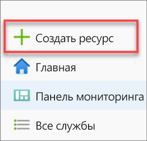

2. Щелкните раздел **Базы данных** на странице **Создать** и выберите **Azure Synapse Analytics (ранее — Хранилище данных SQL)** в списке **Подборка**.

   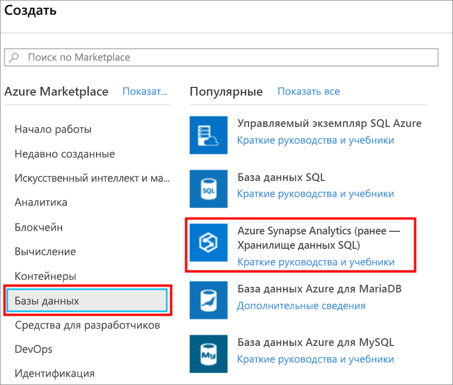

3. На вкладке **Основные сведения** укажите подписку, группу ресурсов, имя пула SQL, а также имя сервера:

   | Параметр | Рекомендуемое значение | Описание |
   | :------ | :-------------- | :---------- |
   | **Подписка** | Ваша подписка | Дополнительные сведения о подписках см. [здесь](https://account.windowsazure.com/Subscriptions). |
   | **Группа ресурсов** | myResourceGroup | Допустимые имена групп ресурсов см. в статье о [правилах и ограничениях именования](/azure/architecture/best-practices/resource-naming?toc=/azure/synapse-analytics/sql-data-warehouse/toc.json&bc=/azure/synapse-analytics/sql-data-warehouse/breadcrumb/toc.json). |
   | **Имя пула SQL** | Любое глобально уникальное имя (например, *mySampleDataWarehouse*). | Допустимые имена баз данных см. в статье об [идентификаторах базы данных](/sql/relational-databases/databases/database-identifiers?toc=/azure/synapse-analytics/sql-data-warehouse/toc.json&bc=/azure/synapse-analytics/sql-data-warehouse/breadcrumb/toc.json&view=azure-sqldw-latest). Обратите внимание, что пул SQL является одним из типов базы данных. |
   | **Server** | Любое глобально уникальное имя | Выберите существующий сервер или создайте сервер с новым именем, щелкнув ссылку **Создать новый**. Допустимые имена серверов см. в статье о [правилах и ограничениях именования](/azure/architecture/best-practices/resource-naming?toc=/azure/synapse-analytics/sql-data-warehouse/toc.json&bc=/azure/synapse-analytics/sql-data-warehouse/breadcrumb/toc.json). |

   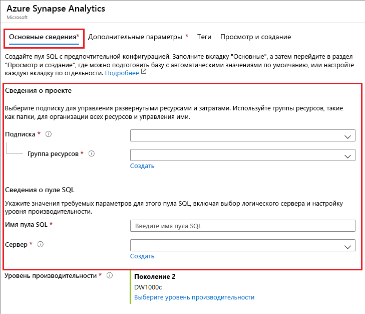

4. В подразделе **Уровень производительности** щелкните ссылку **Выберите уровень производительности**, чтобы дополнительно изменить конфигурацию с помощью ползунка.

     

   Дополнительные сведения об уровне производительности см. в статье [Управление вычислительными ресурсами в хранилище данных Azure Synapse Analytics](sql-data-warehouse-manage-compute-overview.md).

5. Заполнив форму Azure Synapse Analytics на вкладке "Основные сведения", выберите элемент **Просмотр и создание**, а затем нажмите кнопку **Создать**, чтобы создать пул SQL. Подготовка занимает несколько минут.

   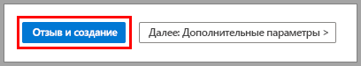

   

6. На панели инструментов щелкните значок **Уведомления**, чтобы отслеживать процесс развертывания.

   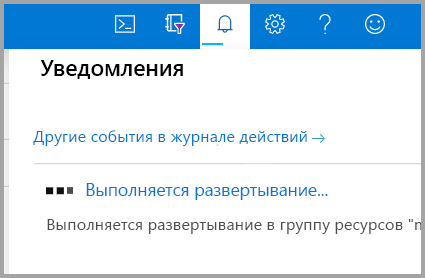

## <a name="create-a-server-level-firewall-rule"></a>создадим правило брандмауэра на уровне сервера;

Служба Azure Synapse создает брандмауэр на уровне сервера. Этот брандмауэр предотвращает подключение внешних приложений и инструментов к серверу или базам данных на сервере. Чтобы разрешить это подключение, можно добавить правила брандмауэра, открывающие подключение для определенных IP-адресов. Выполните приведенные ниже действия, чтобы создать [правило брандмауэра уровня сервера](../../sql-database/sql-database-firewall-configure.md?toc=/azure/synapse-analytics/sql-data-warehouse/toc.json&bc=/azure/synapse-analytics/sql-data-warehouse/breadcrumb/toc.json) для IP-адреса клиента.

> [!NOTE]
> Azure Synapse обменивается данными через порт 1433. Если вы пытаетесь подключиться из корпоративной сети, то исходящий трафик через порт 1433 может быть запрещен сетевым брандмауэром. В таком случае вы не сможете подключиться к серверу Базы данных SQL Azure, пока ваш ИТ-отдел не откроет порт 1433.

1. После завершения развертывания в меню слева выберите **Все службы**. Щелкните значок **Базы данных**, затем выберите значок звездочки рядом с полем **Azure Synapse Analytics**, чтобы добавить Azure Synapse Analytics в избранное.

2. Выберите **Azure Synapse Analytics** в меню слева, а затем — **mySampleDataWarehouse** на странице **Azure Synapse Analytics**. После этого откроется страница обзора базы данных, где будет указано полное имя сервера (например, **sqlpoolservername.database.windows.net**) и будут предоставлены параметры для дальнейшей настройки.

3. Скопируйте полное имя сервера. Оно понадобится для подключения к серверу и размещенным на нем базам данных при работе с этим и последующими краткими руководствами. Щелкните имя сервера, чтобы открыть параметры этого сервера.

   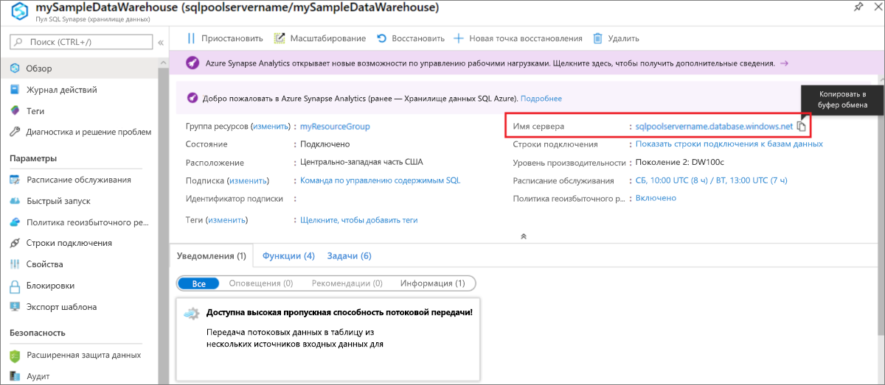

4. Щелкните ссылку **Показать параметры брандмауэра**.

   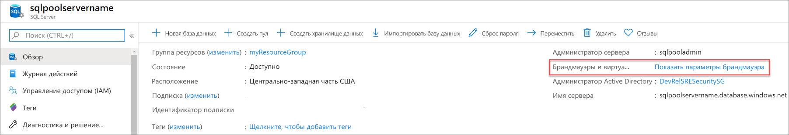

5. Откроется страница **параметров брандмауэра** для сервера Базы данных SQL.

   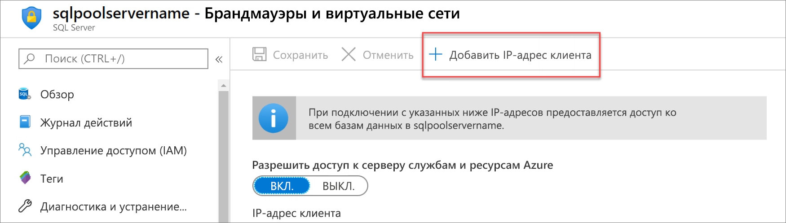

6. На панели инструментов нажмите кнопку **Добавить IP-адрес клиента**, чтобы добавить текущий IP-адрес в новое правило брандмауэра. С использованием правила брандмауэра можно открыть порт 1433 для одного IP-адреса или диапазона IP-адресов.

7. Щелкните **Save** (Сохранить). Для текущего IP-адреса будет создано правило брандмауэра уровня сервера, с помощью которого можно открыть порт 1433 логического сервера.

8. Нажмите кнопку **ОК**, а затем закройте страницу **Параметры брандмауэра**.

Теперь с помощью этого IP-адреса можно подключиться к серверу SQL и его пулам SQL. Подключение выполняется из SQL Server Management Studio или другого инструмента на ваше усмотрение. При подключении используйте созданную ранее учетную запись ServerAdmin.

> [!IMPORTANT]
> По умолчанию доступ через брандмауэр базы данных SQL включен для всех служб Azure. На этой странице щелкните положение **Выкл.** переключателя, а затем нажмите кнопку **Сохранить**, чтобы отключить брандмауэр для всех служб Azure.

## <a name="get-the-fully-qualified-server-name"></a>Получение полного имени сервера

Получите полное имя сервера SQL на портале Azure. Позже это полное имя понадобится при подключении к серверу.

1. Войдите на [портал Azure](https://portal.azure.com/).

2. Выберите элемент **Azure Synapse Analytics** в меню слева, а затем выберите нужное значение на странице **Azure Synapse Analytics**.

3. На странице портала Azure вашей базы данных в области **Основные компоненты** найдите и скопируйте **имя сервера**. В этом примере полное имя — sqlpoolservername.database.windows.net.

    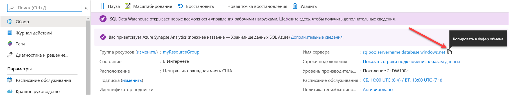

## <a name="connect-to-the-server-as-server-admin"></a>Подключение к серверу от имени администратора сервера

В этом разделе для подключения к серверу SQL Azure используется [SQL Server Management Studio](/sql/ssms/download-sql-server-management-studio-ssms?toc=/azure/synapse-analytics/sql-data-warehouse/toc.json&bc=/azure/synapse-analytics/sql-data-warehouse/breadcrumb/toc.json&view=azure-sqldw-latest) (SSMS).

1. Откройте среду SQL Server Management Studio.

2. В диалоговом окне **Соединение с сервером** введите следующие данные:

   | Параметр | Рекомендуемое значение | Описание |
   | :------ | :-------------- | :---------- |
   | Тип сервера | Ядро СУБД | Это обязательное значение |
   | Имя сервера | Полное имя сервера | Пример: **sqlpoolservername.database.windows.net**. |
   | Аутентификация | Проверка подлинности SQL Server | В рамках работы с этим руководством мы настроили только один тип аутентификации — аутентификацию SQL. |
   | Имя входа | Учетная запись администратора сервера | Это учетная запись, указанная при создании сервера. |
   | Пароль | Пароль для учетной записи администратора сервера | Пароль, указанный при создании сервера. |
   ||||

   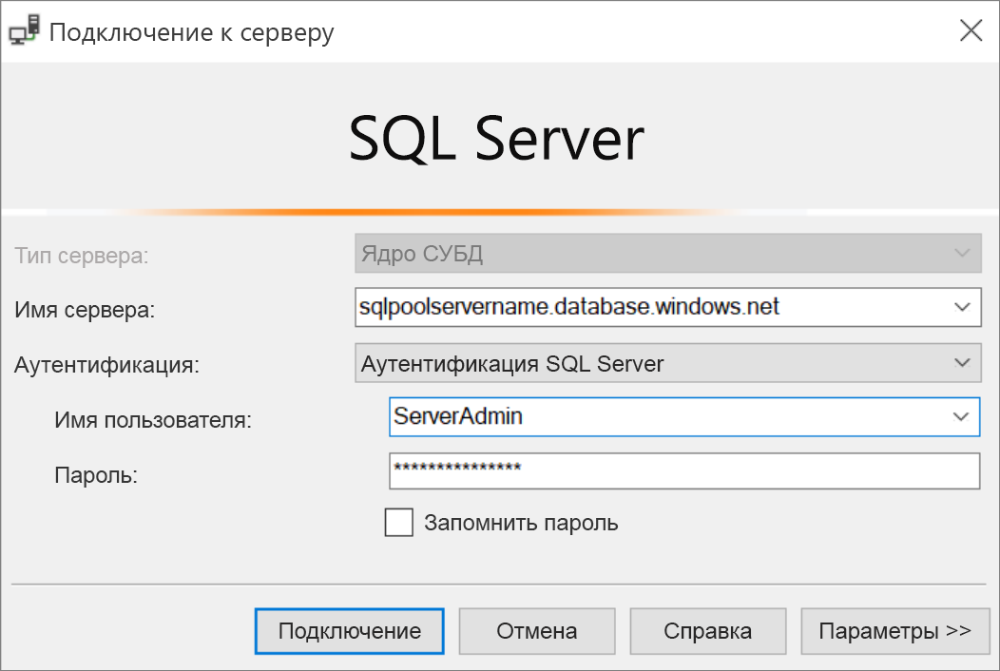

3. Нажмите кнопку **Подключиться**. В SSMS открывается окно обозревателя объектов.

4. В обозревателе объектов разверните узел **Базы данных**. Затем разверните папку **mySampleDatabase**, чтобы просмотреть объекты в новой базе данных.

   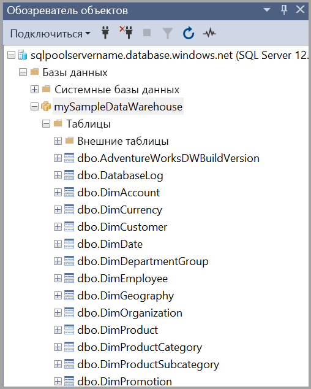

## <a name="run-some-queries"></a>Выполнение запросов

Хранилище данных SQL использует язык запросов T-SQL. Чтобы открыть окно запросов и выполнить несколько запросов T-SQL, выполните следующие действия.

1. Щелкните правой кнопкой мыши **mySampleDataWarehouse** и выберите команду**Создать запрос**. Откроется новое окно запроса.

2. В окне запросов введите приведенную ниже команду, чтобы просмотреть список баз данных.

    ```sql
    SELECT * FROM sys.databases
    ```

3. Щелкните **Выполнить**. Результаты запроса содержат две базы данных: **master** и **mySampleDataWarehouse**.

   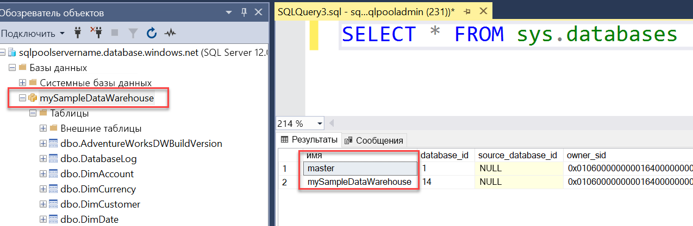

4. Чтобы просмотреть некоторые данные, используйте следующую команду. Она позволяет узнать количество клиентов с фамилией "Adams", у которых трое детей. Список результатов содержит шесть клиентов.

    ```sql
    SELECT LastName, FirstName FROM dbo.dimCustomer
    WHERE LastName = 'Adams' AND NumberChildrenAtHome = 3;
    ```

   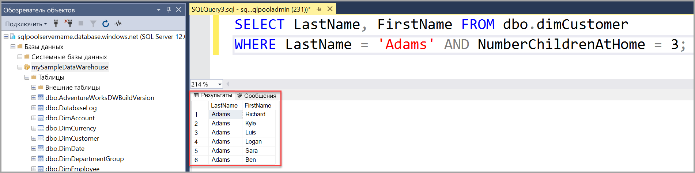

## <a name="clean-up-resources"></a>Очистка ресурсов

Плата взимается за единицы хранилища данных и данные, хранящиеся в пуле SQL. Плата за вычислительные ресурсы и ресурсы хранилища взимается отдельно.

- Если вы хотите сохранить данные в хранилище, то можете приостановить работу вычислительных ресурсов, когда не используете пул SQL. При приостановке вычислений плата взимается только за хранение данных. Когда вы будете готовы работать с данными, можно будет возобновить вычисления.

- Если вы хотите исключить будущие расходы, то можете удалить пул SQL.

Выполните следующие действия, чтобы очистить ресурсы, которые больше не нужны.

1. Войдите на [портал Azure](https://portal.azure.com) и выберите пул SQL.

   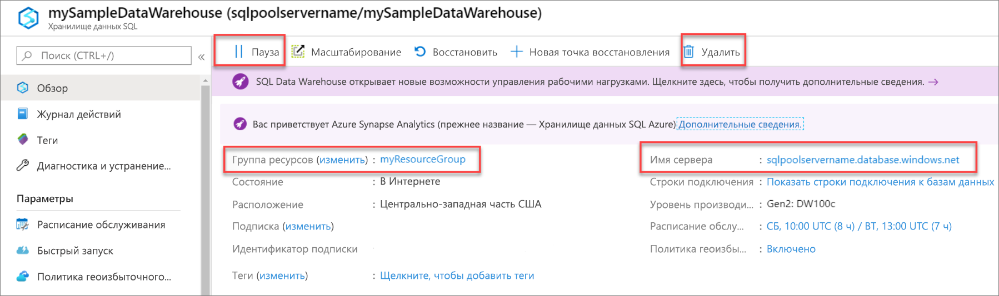

2. Чтобы приостановить вычисление, нажмите кнопку **Пауза**. Если работа пула SQL приостановлена, вы увидите кнопку **Возобновить**. Чтобы возобновить вычисление, нажмите кнопку **Возобновить**.

3. Чтобы удалить пул SQL во избежание дальнейших платежей за вычисления или хранение, нажмите кнопку **Удалить**.

4. Чтобы удалить созданный вами сервер SQL, выберите сервер **sqlpoolservername.database.windows.net**, выделенный на предыдущем изображении, а затем нажмите кнопку **Удалить**. Будьте внимательны, так как удаление сервера приведет к удалению всех баз данных, назначенных этому серверу.

5. Чтобы удалить группу ресурсов, выберите **myResourceGroup**, а затем **Удалить группу ресурсов**.

## <a name="next-steps"></a>Дальнейшие действия

Дополнительные сведения см. в статье о [загрузке данных в пул SQL](load-data-from-azure-blob-storage-using-polybase.md).
