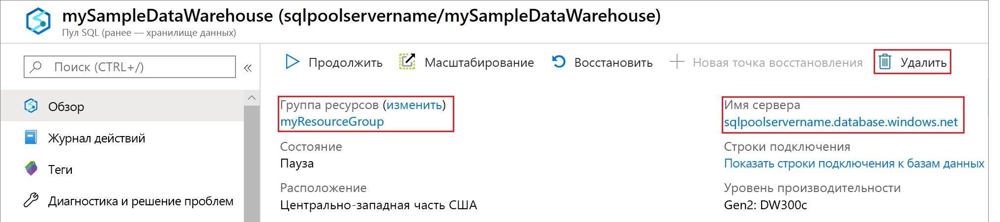

# <a name="tutorial-load-data-to--azure-synapse-analytics-sql-pool"></a>Учебник. Загрузка данных в пул SQL Azure синапсе Analytics

В этом руководстве для загрузки хранилища данных WideWorldImportersDW из хранилища BLOB-объектов Azure в хранилище данных в пуле SQL Azure синапсе Analytics используется Polybase. В рамках этого руководства [портал Azure](https://portal.azure.com) и [SQL Server Management Studio](/sql/ssms/download-sql-server-management-studio-ssms?toc=/azure/synapse-analytics/sql-data-warehouse/toc.json&bc=/azure/synapse-analytics/sql-data-warehouse/breadcrumb/toc.json&view=azure-sqldw-latest) (SSMS) используются, чтобы выполнить такие действия:

> [!div class="checklist"]
>
> * Создание хранилища данных с помощью пула SQL в портал Azure
> * настроить правило брандмауэра на уровне сервера на портале Azure;
> * Подключение к пулу SQL с помощью SSMS
> * создать учетную запись пользователя, предназначенную для загрузки данных;
> * создать внешние таблицы, использующие большой двоичный объект Azure в качестве источника данных;
> * использовать инструкцию T-SQL CTAS для загрузки данных в хранилище данных;
> * просмотреть ход выполнения загрузки данных;
> * создать годичный объем данных в таблицах фактов по продажам и измерениям дат;
> * создать статистику для вновь загруженных данных.

Если у вас еще нет подписки Azure, [создайте бесплатную учетную запись Azure](https://azure.microsoft.com/free/), прежде чем начинать работу.

## <a name="before-you-begin"></a>Перед началом

Перед началом работы с этим руководством скачайте и установите последнюю версию [SQL Server Management Studio](/sql/ssms/download-sql-server-management-studio-ssms?toc=/azure/synapse-analytics/sql-data-warehouse/toc.json&bc=/azure/synapse-analytics/sql-data-warehouse/breadcrumb/toc.json&view=azure-sqldw-latest) (SSMS).

## <a name="sign-in-to-the-azure-portal"></a>Вход на портал Azure

Войдите на [портал Azure](https://portal.azure.com/).

## <a name="create-a-blank-data-warehouse-in-sql-pool"></a>Создание пустого хранилища данных в пуле SQL

Пул SQL создается с определенным набором [вычислительных ресурсов](memory-concurrency-limits.md). Пул SQL создается в [группе ресурсов Azure](../../azure-resource-manager/management/overview.md?toc=/azure/synapse-analytics/sql-data-warehouse/toc.json&bc=/azure/synapse-analytics/sql-data-warehouse/breadcrumb/toc.json) и на [логическом сервере SQL](../../azure-sql/database/logical-servers.md?toc=/azure/synapse-analytics/sql-data-warehouse/toc.json&bc=/azure/synapse-analytics/sql-data-warehouse/breadcrumb/toc.json)Server.

Выполните следующие действия, чтобы создать пустой пул SQL.

1. Выберите **создать ресурс** в портал Azure.

1. Выберите **базы данных** на **новой** странице и выберите **Azure синапсе Analytics** в разделе **Избранное** на **новой** странице.

    

1. Заполните раздел **сведения о проекте** следующими сведениями:

   | Параметр | Пример | Описание |
   | ------- | --------------- | ----------- |
   | **Подписка** | Ваша подписка  | Дополнительные сведения о подписках см. [здесь](https://account.windowsazure.com/Subscriptions). |
   | **Группа ресурсов** | myResourceGroup | Допустимые имена групп ресурсов см. в статье о [правилах и ограничениях именования](/azure/architecture/best-practices/resource-naming?toc=/azure/synapse-analytics/sql-data-warehouse/toc.json&bc=/azure/synapse-analytics/sql-data-warehouse/breadcrumb/toc.json). |

1. В разделе **сведения о пуле SQL**укажите имя для пула SQL. Затем выберите существующий сервер из раскрывающегося списка или щелкните **создать новый** в разделе Параметры **сервера** , чтобы создать новый сервер. Заполните форму, указав следующую информацию.

    | Параметр | Рекомендуемое значение | Описание |
    | ------- | --------------- | ----------- |
    |**Имя пула SQL**|SampleDW| Допустимые имена баз данных см. в статье об [идентификаторах базы данных](/sql/relational-databases/databases/database-identifiers?toc=/azure/synapse-analytics/sql-data-warehouse/toc.json&bc=/azure/synapse-analytics/sql-data-warehouse/breadcrumb/toc.json&view=azure-sqldw-latest). |
    | **Имя сервера** | Любое глобально уникальное имя | Допустимые имена серверов см. в статье о [правилах и ограничениях именования](/azure/architecture/best-practices/resource-naming?toc=/azure/synapse-analytics/sql-data-warehouse/toc.json&bc=/azure/synapse-analytics/sql-data-warehouse/breadcrumb/toc.json). |
    | **Имя для входа администратора сервера** | Любое допустимое имя | Допустимые имена входа см. в статье об [идентификаторах базы данных](/sql/relational-databases/databases/database-identifiers?toc=/azure/synapse-analytics/sql-data-warehouse/toc.json&bc=/azure/synapse-analytics/sql-data-warehouse/breadcrumb/toc.json&view=azure-sqldw-latest).|
    | **Пароль** | Любой допустимый пароль | Длина пароля должна составлять минимум 8 символов. Пароль должен содержать символы трех категорий из перечисленных: прописные буквы, строчные буквы, цифры и специальные символы. |
    | **Расположение** | Любое допустимое расположение | Дополнительные сведения о регионах Azure см. [здесь](https://azure.microsoft.com/regions/). |

    

1. **Выберите уровень производительности**. Ползунок по умолчанию имеет значение **DW1000c**. Переместите ползунок вверх и вниз, чтобы выбрать нужную шкалу производительности.

    

1. На странице **Дополнительные параметры** задайте для параметра **использовать существующие данные** значение нет и оставьте **Параметры сортировки** в *SQL_Latin1_General_CP1_CI_AS*по умолчанию.

1. Выберите **проверить и создать** , чтобы проверить параметры, а затем щелкните **создать** , чтобы создать хранилище данных. Вы можете отслеживать ход выполнения, открыв страницу **развертывание в ходе выполнения** в меню **уведомления** .

     

## <a name="create-a-server-level-firewall-rule"></a>создадим правило брандмауэра на уровне сервера;

Служба Azure синапсе Analytics создает брандмауэр на уровне сервера, который предотвращает подключение внешних приложений и средств к серверу или к любой базе данных на сервере. Чтобы разрешить это подключение, можно добавить правила брандмауэра, открывающие подключение для определенных IP-адресов.  Выполните приведенные ниже действия, чтобы создать [правило брандмауэра уровня сервера](../../azure-sql/database/firewall-configure.md?toc=/azure/synapse-analytics/sql-data-warehouse/toc.json&bc=/azure/synapse-analytics/sql-data-warehouse/breadcrumb/toc.json) для IP-адреса клиента.

> [!NOTE]
> Пул SQL Azure синапсе Analytics взаимодействует через порт 1433. Если вы пытаетесь подключиться из корпоративной сети, то исходящий трафик через порт 1433 может быть запрещен сетевым брандмауэром. В таком случае вы не сможете подключиться к серверу, пока ваш ИТ-отдел не откроет порт 1433.
>

1. После завершения развертывания найдите имя пула в поле поиска в меню навигации и выберите ресурс пула SQL. Выберите имя сервера.

    

1. Выберите имя сервера.
    

1. Щелкните ссылку **Показать параметры брандмауэра**. Откроется страница **Параметры брандмауэра** сервера.

    

1. На странице **брандмауэры и виртуальные сети** выберите **Добавить IP-адрес клиента** , чтобы добавить текущий IP-адреса в новое правило брандмауэра. С использованием правила брандмауэра можно открыть порт 1433 для одного IP-адреса или диапазона IP-адресов.

    

1. Щелкните **Сохранить**. Для текущего IP-адреса будет создано правило брандмауэра на уровне сервера, с помощью которого можно открыть порт 1433 на сервере.

Теперь можно подключиться к серверу с помощью IP-адреса клиента. Подключение выполняется из SQL Server Management Studio или другого инструмента на ваше усмотрение. При подключении используйте созданную ранее учетную запись serveradmin.  

> [!IMPORTANT]
> По умолчанию доступ через брандмауэр базы данных SQL включен для всех служб Azure. На этой странице щелкните **Откл.**, а затем нажмите кнопку **Сохранить**, чтобы отключить брандмауэр для всех служб Azure.

## <a name="get-the-fully-qualified-server-name"></a>Получение полного имени сервера

Полное имя сервера используется для подключения к серверу. Перейдите к ресурсу пула SQL в портал Azure и просмотрите полное имя в разделе **имя сервера**.


## <a name="connect-to-the-server-as-server-admin"></a>Подключение к серверу от имени администратора сервера

В этом разделе для подключения к серверу используется [SQL Server Management Studio](/sql/ssms/download-sql-server-management-studio-ssms?toc=/azure/synapse-analytics/sql-data-warehouse/toc.json&bc=/azure/synapse-analytics/sql-data-warehouse/breadcrumb/toc.json&view=azure-sqldw-latest) (SSMS).

1. Откройте среду SQL Server Management Studio.

2. В диалоговом окне **Соединение с сервером** введите следующие данные:

    | Параметр      | Рекомендуемое значение | Описание |
    | ------------ | --------------- | ----------- |
    | Тип сервера | Ядро СУБД | Это обязательное значение |
    | Имя сервера | Полное имя сервера | Например, **sqlpoolservername.Database.Windows.NET** является полным именем сервера. |
    | Аутентификация | Проверка подлинности SQL Server | В рамках работы с этим руководством мы настроили только один тип аутентификации — аутентификацию SQL. |
    | Имя входа | Учетная запись администратора сервера | Это учетная запись, которая была указана при создании сервера. |
    | Пароль | Пароль для учетной записи администратора сервера | Это пароль, указанный при создании сервера. |

    

3. Нажмите кнопку **Подключить**. В SSMS открывается окно обозревателя объектов.

4. В обозревателе объектов разверните узел **Базы данных**. Затем разверните **Системные базы данных** и **master**, чтобы просмотреть объекты в базе данных master.  Разверните **SampleDW** , чтобы просмотреть объекты в новой базе данных.

    

## <a name="create-a-user-for-loading-data"></a>Создание учетной записи пользователя для загрузки данных

Учетная запись администратора сервера предназначена для операций управления и не подходит для выполнения запросов к пользовательским данным. Загрузка данных — это операция с интенсивным использованием памяти. Максимальные объемы памяти определяются в соответствии с поколением пула SQL, который вы используете, [единицами хранилища данных](what-is-a-data-warehouse-unit-dwu-cdwu.md)и [классом ресурсов](resource-classes-for-workload-management.md).

Лучше всего создать имя для входа и имя пользователя, предназначенные для загрузки данных. Затем добавьте пользователя загрузки в [класс ресурсов](resource-classes-for-workload-management.md), позволяющий выполнять соответствующее выделение максимальной памяти.

Поскольку вы подключены в качестве администратора сервера, вы можете создавать пользователей и имена для входа. В результате выполнения этих действий создаются учетные данные пользователя **LoaderRC60**. Затем назначаем пользователя классу ресурсов **staticrc60**.

1. В среде SSMS щелкните правой кнопкой мыши папку **master**, чтобы отобразилось раскрывающееся меню. Затем щелкните **Новый запрос**. Откроется новое окно запроса.

    

2. В окне запроса введите следующие команды T-SQL, чтобы создать учетные данные для входа пользователя LoaderRC60, заменив 'a123STRONGpassword!' на собственный пароль.

    ```sql
    CREATE LOGIN LoaderRC60 WITH PASSWORD = 'a123STRONGpassword!';
    CREATE USER LoaderRC60 FOR LOGIN LoaderRC60;
    ```

3. Нажмите кнопку **Выполнить**.

4. Щелкните правой кнопкой мыши **SampleDW** и выберите **Создать запрос**. Откроется окно нового запроса.  

    

5. Введите следующие команды T-SQL, чтобы создать пользователя базы данных с именем LoaderRC60 для входа в LoaderRC60. Вторая строка предоставляет новому пользователю разрешения на управление (CONTROL) новым хранилищем данных.  Эти разрешения аналогичны назначению пользователя владельцем базы данных. Третья строка добавляет нового пользователя в качестве члена `staticrc60` [класса ресурсов](resource-classes-for-workload-management.md).

    ```sql
    CREATE USER LoaderRC60 FOR LOGIN LoaderRC60;
    GRANT CONTROL ON DATABASE::[SampleDW] to LoaderRC60;
    EXEC sp_addrolemember 'staticrc60', 'LoaderRC60';
    ```

6. Нажмите кнопку **Выполнить**.

## <a name="connect-to-the-server-as-the-loading-user"></a>Подключение к серверу от имени пользователя, выполняющего загрузку

Первый шаг к загрузке данных — это войти в систему как пользователь LoaderRC60.  

1. В обозревателе объектов щелкните раскрывающееся меню **Подключить** и выберите пункт **Ядро СУБД**. Откроется диалоговое окно **Соединение с сервером** .

    

2. Введите полное имя сервера и в качестве имени для входа укажите **LoaderRC60**.  Введите пароль для LoaderRC60.

3. Нажмите кнопку **Соединить**.

4. Когда подключение будет готово, вы увидите в обозревателе объектов два подключения к серверу. Одно подключение — как ServerAdmin, а второе — как LoaderRC60.

    

## <a name="create-external-tables-and-objects"></a>Создание внешних таблиц и объектов

Все готово для начала процесса загрузки данных в новое хранилище данных. Дополнительные сведения о том, как получить данные в хранилище BLOB-объектов Azure или загрузить их непосредственно из источника в пул SQL, см. в разделе [Общие сведения о загрузке](design-elt-data-loading.md).

Выполните следующие скрипты SQL и укажите сведения о данных, которые требуется загрузить. К этим сведениям относится информация о расположении данных, формате содержимого данных и определении таблицы для данных. Данные находятся в глобальном большом двоичном объекте Azure.

1. В предыдущем разделе вы вошли в свое хранилище данных как пользователь LoaderRC60. В среде SSMS щелкните правой кнопкой мыши **SampleDW** под подключением LoaderRC60 и выберите **Создать запрос**.  Откроется окно нового запроса.

    

2. Сравните окно запроса с предыдущим изображением.  Проверьте работоспособность нового окна запросов с учетными данными LoaderRC60 и выполнение запросов к базе данных SampleDW. Используйте это окно запроса для выполнения всех шагов загрузки.

3. Создайте главный ключ базы данных SampleDW. Главный ключ создается для каждой базы данных только один раз.

    ```sql
    CREATE MASTER KEY;
    ```

4. Выполните приведенную ниже инструкцию [CREATE EXTERNAL DATA SOURCE](/sql/t-sql/statements/create-external-data-source-transact-sql?toc=/azure/synapse-analytics/sql-data-warehouse/toc.json&bc=/azure/synapse-analytics/sql-data-warehouse/breadcrumb/toc.json&view=azure-sqldw-latest), чтобы определить расположение большого двоичного объекта Azure. Это расположение внешних данных об импорте по всему миру.  Для выполнения команды, добавленной в окно запроса, выделите команды, которые необходимо выполнить, и нажмите кнопку **Выполнить**.

    ```sql
    CREATE EXTERNAL DATA SOURCE WWIStorage
    WITH
    (
        TYPE = Hadoop,
        LOCATION = 'wasbs://wideworldimporters@sqldwholdata.blob.core.windows.net'
    );
    ```

5. Выполните приведенную ниже инструкцию T-SQL [CREATE EXTERNAL FILE FORMAT](/sql/t-sql/statements/create-external-file-format-transact-sql?toc=/azure/synapse-analytics/sql-data-warehouse/toc.json&bc=/azure/synapse-analytics/sql-data-warehouse/breadcrumb/toc.json&view=azure-sqldw-latest), чтобы указать характеристики и параметры форматирования для внешнего файла данных. Эта инструкция указывает, что внешние данные хранятся в виде текста, а значения разделяются символом вертикальной черты (|).  

    ```sql
    CREATE EXTERNAL FILE FORMAT TextFileFormat
    WITH
    (
        FORMAT_TYPE = DELIMITEDTEXT,
        FORMAT_OPTIONS
        (
            FIELD_TERMINATOR = '|',
            USE_TYPE_DEFAULT = FALSE
        )
    );
    ```

6. Выполните приведенные ниже инструкции [CREATE SCHEMA](/sql/t-sql/statements/create-schema-transact-sql?toc=/azure/synapse-analytics/sql-data-warehouse/toc.json&bc=/azure/synapse-analytics/sql-data-warehouse/breadcrumb/toc.json&view=azure-sqldw-latest), чтобы создать схему форматирования внешних файлов. Эта схема форматирования внешних файлов описывает способ организации внешних таблиц, которые будут созданы. Схема wwi организует стандартные таблицы для хранения данных.

    ```sql
    CREATE SCHEMA ext;
    GO
    CREATE SCHEMA wwi;
    ```

7. Создайте внешние таблицы. Определения таблиц хранятся в базе данных, но таблицы ссылаются на данные, хранящиеся в хранилище BLOB-объектов Azure. Выполните следующие команды T-SQL, чтобы создать несколько внешних таблиц, и при этом все они будут указывать на большой двоичный объект Azure, определенный нами ранее во внешнем источнике данных.

    ```sql
    CREATE EXTERNAL TABLE [ext].[dimension_City](
        [City Key] [int] NOT NULL,
        [WWI City ID] [int] NOT NULL,
        [City] [nvarchar](50) NOT NULL,
        [State Province] [nvarchar](50) NOT NULL,
        [Country] [nvarchar](60) NOT NULL,
        [Continent] [nvarchar](30) NOT NULL,
        [Sales Territory] [nvarchar](50) NOT NULL,
        [Region] [nvarchar](30) NOT NULL,
        [Subregion] [nvarchar](30) NOT NULL,
        [Location] [nvarchar](76) NULL,
        [Latest Recorded Population] [bigint] NOT NULL,
        [Valid From] [datetime2](7) NOT NULL,
        [Valid To] [datetime2](7) NOT NULL,
        [Lineage Key] [int] NOT NULL
    )
    WITH (LOCATION='/v1/dimension_City/',
        DATA_SOURCE = WWIStorage,  
        FILE_FORMAT = TextFileFormat,
        REJECT_TYPE = VALUE,
        REJECT_VALUE = 0
    );  
    CREATE EXTERNAL TABLE [ext].[dimension_Customer] (
        [Customer Key] [int] NOT NULL,
        [WWI Customer ID] [int] NOT NULL,
        [Customer] [nvarchar](100) NOT NULL,
        [Bill To Customer] [nvarchar](100) NOT NULL,
           [Category] [nvarchar](50) NOT NULL,
        [Buying Group] [nvarchar](50) NOT NULL,
        [Primary Contact] [nvarchar](50) NOT NULL,
        [Postal Code] [nvarchar](10) NOT NULL,
        [Valid From] [datetime2](7) NOT NULL,
        [Valid To] [datetime2](7) NOT NULL,
        [Lineage Key] [int] NOT NULL
    )
    WITH (LOCATION='/v1/dimension_Customer/',
        DATA_SOURCE = WWIStorage,  
        FILE_FORMAT = TextFileFormat,
        REJECT_TYPE = VALUE,
        REJECT_VALUE = 0
    );  
    CREATE EXTERNAL TABLE [ext].[dimension_Employee] (
        [Employee Key] [int] NOT NULL,
        [WWI Employee ID] [int] NOT NULL,
        [Employee] [nvarchar](50) NOT NULL,
        [Preferred Name] [nvarchar](50) NOT NULL,
        [Is Salesperson] [bit] NOT NULL,
        [Photo] [varbinary](300) NULL,
        [Valid From] [datetime2](7) NOT NULL,
        [Valid To] [datetime2](7) NOT NULL,
        [Lineage Key] [int] NOT NULL
    )
    WITH ( LOCATION='/v1/dimension_Employee/',
        DATA_SOURCE = WWIStorage,  
        FILE_FORMAT = TextFileFormat,
        REJECT_TYPE = VALUE,
        REJECT_VALUE = 0
    );
    CREATE EXTERNAL TABLE [ext].[dimension_PaymentMethod] (
        [Payment Method Key] [int] NOT NULL,
        [WWI Payment Method ID] [int] NOT NULL,
        [Payment Method] [nvarchar](50) NOT NULL,
        [Valid From] [datetime2](7) NOT NULL,
        [Valid To] [datetime2](7) NOT NULL,
        [Lineage Key] [int] NOT NULL
    )
    WITH ( LOCATION ='/v1/dimension_PaymentMethod/',
        DATA_SOURCE = WWIStorage,  
        FILE_FORMAT = TextFileFormat,
        REJECT_TYPE = VALUE,
        REJECT_VALUE = 0
    );
    CREATE EXTERNAL TABLE [ext].[dimension_StockItem](
        [Stock Item Key] [int] NOT NULL,
        [WWI Stock Item ID] [int] NOT NULL,
        [Stock Item] [nvarchar](100) NOT NULL,
        [Color] [nvarchar](20) NOT NULL,
        [Selling Package] [nvarchar](50) NOT NULL,
        [Buying Package] [nvarchar](50) NOT NULL,
        [Brand] [nvarchar](50) NOT NULL,
        [Size] [nvarchar](20) NOT NULL,
        [Lead Time Days] [int] NOT NULL,
        [Quantity Per Outer] [int] NOT NULL,
        [Is Chiller Stock] [bit] NOT NULL,
        [Barcode] [nvarchar](50) NULL,
        [Tax Rate] [decimal](18, 3) NOT NULL,
        [Unit Price] [decimal](18, 2) NOT NULL,
        [Recommended Retail Price] [decimal](18, 2) NULL,
        [Typical Weight Per Unit] [decimal](18, 3) NOT NULL,
        [Photo] [varbinary](300) NULL,
        [Valid From] [datetime2](7) NOT NULL,
        [Valid To] [datetime2](7) NOT NULL,
        [Lineage Key] [int] NOT NULL
    )
    WITH ( LOCATION ='/v1/dimension_StockItem/',
        DATA_SOURCE = WWIStorage,  
        FILE_FORMAT = TextFileFormat,
        REJECT_TYPE = VALUE,
        REJECT_VALUE = 0
    );
    CREATE EXTERNAL TABLE [ext].[dimension_Supplier](
        [Supplier Key] [int] NOT NULL,
        [WWI Supplier ID] [int] NOT NULL,
        [Supplier] [nvarchar](100) NOT NULL,
        [Category] [nvarchar](50) NOT NULL,
        [Primary Contact] [nvarchar](50) NOT NULL,
        [Supplier Reference] [nvarchar](20) NULL,
        [Payment Days] [int] NOT NULL,
        [Postal Code] [nvarchar](10) NOT NULL,
        [Valid From] [datetime2](7) NOT NULL,
        [Valid To] [datetime2](7) NOT NULL,
        [Lineage Key] [int] NOT NULL
    )
    WITH ( LOCATION ='/v1/dimension_Supplier/',
        DATA_SOURCE = WWIStorage,  
        FILE_FORMAT = TextFileFormat,
        REJECT_TYPE = VALUE,
        REJECT_VALUE = 0
    );
    CREATE EXTERNAL TABLE [ext].[dimension_TransactionType](
        [Transaction Type Key] [int] NOT NULL,
        [WWI Transaction Type ID] [int] NOT NULL,
        [Transaction Type] [nvarchar](50) NOT NULL,
        [Valid From] [datetime2](7) NOT NULL,
        [Valid To] [datetime2](7) NOT NULL,
        [Lineage Key] [int] NOT NULL
    )
    WITH ( LOCATION ='/v1/dimension_TransactionType/',
        DATA_SOURCE = WWIStorage,  
        FILE_FORMAT = TextFileFormat,
        REJECT_TYPE = VALUE,
        REJECT_VALUE = 0
    );
    CREATE EXTERNAL TABLE [ext].[fact_Movement] (
        [Movement Key] [bigint] NOT NULL,
        [Date Key] [date] NOT NULL,
        [Stock Item Key] [int] NOT NULL,
        [Customer Key] [int] NULL,
        [Supplier Key] [int] NULL,
        [Transaction Type Key] [int] NOT NULL,
        [WWI Stock Item Transaction ID] [int] NOT NULL,
        [WWI Invoice ID] [int] NULL,
        [WWI Purchase Order ID] [int] NULL,
        [Quantity] [int] NOT NULL,
        [Lineage Key] [int] NOT NULL
    )
    WITH ( LOCATION ='/v1/fact_Movement/',
        DATA_SOURCE = WWIStorage,  
        FILE_FORMAT = TextFileFormat,
        REJECT_TYPE = VALUE,
        REJECT_VALUE = 0
    );
    CREATE EXTERNAL TABLE [ext].[fact_Order] (
        [Order Key] [bigint] NOT NULL,
        [City Key] [int] NOT NULL,
        [Customer Key] [int] NOT NULL,
        [Stock Item Key] [int] NOT NULL,
        [Order Date Key] [date] NOT NULL,
        [Picked Date Key] [date] NULL,
        [Salesperson Key] [int] NOT NULL,
        [Picker Key] [int] NULL,
        [WWI Order ID] [int] NOT NULL,
        [WWI Backorder ID] [int] NULL,
        [Description] [nvarchar](100) NOT NULL,
        [Package] [nvarchar](50) NOT NULL,
        [Quantity] [int] NOT NULL,
        [Unit Price] [decimal](18, 2) NOT NULL,
        [Tax Rate] [decimal](18, 3) NOT NULL,
        [Total Excluding Tax] [decimal](18, 2) NOT NULL,
        [Tax Amount] [decimal](18, 2) NOT NULL,
        [Total Including Tax] [decimal](18, 2) NOT NULL,
        [Lineage Key] [int] NOT NULL
    )
    WITH ( LOCATION ='/v1/fact_Order/',
        DATA_SOURCE = WWIStorage,
        FILE_FORMAT = TextFileFormat,
        REJECT_TYPE = VALUE,
        REJECT_VALUE = 0
    );
    CREATE EXTERNAL TABLE [ext].[fact_Purchase] (
        [Purchase Key] [bigint] NOT NULL,
        [Date Key] [date] NOT NULL,
        [Supplier Key] [int] NOT NULL,
        [Stock Item Key] [int] NOT NULL,
        [WWI Purchase Order ID] [int] NULL,
        [Ordered Outers] [int] NOT NULL,
        [Ordered Quantity] [int] NOT NULL,
        [Received Outers] [int] NOT NULL,
        [Package] [nvarchar](50) NOT NULL,
        [Is Order Finalized] [bit] NOT NULL,
        [Lineage Key] [int] NOT NULL
    )
    WITH ( LOCATION ='/v1/fact_Purchase/',
        DATA_SOURCE = WWIStorage,  
        FILE_FORMAT = TextFileFormat,
        REJECT_TYPE = VALUE,
        REJECT_VALUE = 0
    );
    CREATE EXTERNAL TABLE [ext].[fact_Sale] (
        [Sale Key] [bigint] NOT NULL,
        [City Key] [int] NOT NULL,
        [Customer Key] [int] NOT NULL,
        [Bill To Customer Key] [int] NOT NULL,
        [Stock Item Key] [int] NOT NULL,
        [Invoice Date Key] [date] NOT NULL,
        [Delivery Date Key] [date] NULL,
        [Salesperson Key] [int] NOT NULL,
        [WWI Invoice ID] [int] NOT NULL,
        [Description] [nvarchar](100) NOT NULL,
        [Package] [nvarchar](50) NOT NULL,
        [Quantity] [int] NOT NULL,
        [Unit Price] [decimal](18, 2) NOT NULL,
        [Tax Rate] [decimal](18, 3) NOT NULL,
        [Total Excluding Tax] [decimal](18, 2) NOT NULL,
        [Tax Amount] [decimal](18, 2) NOT NULL,
        [Profit] [decimal](18, 2) NOT NULL,
        [Total Including Tax] [decimal](18, 2) NOT NULL,
        [Total Dry Items] [int] NOT NULL,
        [Total Chiller Items] [int] NOT NULL,
        [Lineage Key] [int] NOT NULL
    )
    WITH ( LOCATION ='/v1/fact_Sale/',
        DATA_SOURCE = WWIStorage,  
        FILE_FORMAT = TextFileFormat,
        REJECT_TYPE = VALUE,
        REJECT_VALUE = 0
    );
    CREATE EXTERNAL TABLE [ext].[fact_StockHolding] (
        [Stock Holding Key] [bigint] NOT NULL,
        [Stock Item Key] [int] NOT NULL,
        [Quantity On Hand] [int] NOT NULL,
        [Bin Location] [nvarchar](20) NOT NULL,
        [Last Stocktake Quantity] [int] NOT NULL,
        [Last Cost Price] [decimal](18, 2) NOT NULL,
        [Reorder Level] [int] NOT NULL,
        [Target Stock Level] [int] NOT NULL,
        [Lineage Key] [int] NOT NULL
    )
    WITH ( LOCATION ='/v1/fact_StockHolding/',
        DATA_SOURCE = WWIStorage,  
        FILE_FORMAT = TextFileFormat,
        REJECT_TYPE = VALUE,
        REJECT_VALUE = 0
    );
    CREATE EXTERNAL TABLE [ext].[fact_Transaction] (
        [Transaction Key] [bigint] NOT NULL,
        [Date Key] [date] NOT NULL,
        [Customer Key] [int] NULL,
        [Bill To Customer Key] [int] NULL,
        [Supplier Key] [int] NULL,
        [Transaction Type Key] [int] NOT NULL,
        [Payment Method Key] [int] NULL,
        [WWI Customer Transaction ID] [int] NULL,
        [WWI Supplier Transaction ID] [int] NULL,
        [WWI Invoice ID] [int] NULL,
        [WWI Purchase Order ID] [int] NULL,
        [Supplier Invoice Number] [nvarchar](20) NULL,
        [Total Excluding Tax] [decimal](18, 2) NOT NULL,
        [Tax Amount] [decimal](18, 2) NOT NULL,
        [Total Including Tax] [decimal](18, 2) NOT NULL,
        [Outstanding Balance] [decimal](18, 2) NOT NULL,
        [Is Finalized] [bit] NOT NULL,
        [Lineage Key] [int] NOT NULL
    )
    WITH ( LOCATION ='/v1/fact_Transaction/',
        DATA_SOURCE = WWIStorage,  
        FILE_FORMAT = TextFileFormat,
        REJECT_TYPE = VALUE,
        REJECT_VALUE = 0
    );
    ```

8. В обозревателе объектов разверните узел SampleDW, чтобы просмотреть список созданных внешних таблиц.

    

## <a name="load-the-data-into-sql-pool"></a>Загрузка данных в пул SQL

В этом разделе используются внешние таблицы, которые вы определили для загрузки примера данных из большого двоичного объекта Azure в пул SQL.  

> [!NOTE]
> В этом руководстве данные загружаются непосредственно в итоговую таблицу. Как правило, в рабочей среде для загрузки данных в промежуточную таблицу используется команда CREATE TABLE AS SELECT. Если данные расположены в промежуточной таблице, вы можете выполнять все необходимые преобразования. Чтобы добавить данные из промежуточной таблицы в рабочую, используйте выражение INSERT...SELECT. Дополнительные сведения см. в разделе [Вставка данных в рабочую таблицу](guidance-for-loading-data.md#inserting-data-into-a-production-table).

В сценарии используется инструкция T-SQL [CREATE TABLE AS SELECT (CTAS)](/sql/t-sql/statements/create-table-as-select-azure-sql-data-warehouse?toc=/azure/synapse-analytics/sql-data-warehouse/toc.json&bc=/azure/synapse-analytics/sql-data-warehouse/breadcrumb/toc.json&view=azure-sqldw-latest), чтобы загрузить данные из Azure Storage Blob в новые таблицы в хранилище данных. CTAS создает таблицу на основе результатов инструкции Select. В новой таблице содержатся те же столбцы и типы данных, которые были выведены инструкцией Select. Когда инструкция SELECT выбирает из внешней таблицы, данные импортируются в реляционную таблицу в хранилище данных.

Этот скрипт не загружает данные в таблицы WWI. dimension_Date и WWI. fact_Sale. Эти таблицы создаются на следующих этапах для ограничения числа строк в таблицах с допустимыми пределами.

1. Выполните следующий сценарий для загрузки данных в новые таблицы в хранилище данных.

    ```sql
    CREATE TABLE [wwi].[dimension_City]
    WITH
    (
        DISTRIBUTION = REPLICATE,
        CLUSTERED COLUMNSTORE INDEX
    )
    AS
    SELECT * FROM [ext].[dimension_City]
    OPTION (LABEL = 'CTAS : Load [wwi].[dimension_City]')
    ;

    CREATE TABLE [wwi].[dimension_Customer]
    WITH
    (
        DISTRIBUTION = REPLICATE,
        CLUSTERED COLUMNSTORE INDEX
    )
    AS
    SELECT * FROM [ext].[dimension_Customer]
    OPTION (LABEL = 'CTAS : Load [wwi].[dimension_Customer]')
    ;

    CREATE TABLE [wwi].[dimension_Employee]
    WITH
    (
        DISTRIBUTION = REPLICATE,
        CLUSTERED COLUMNSTORE INDEX
    )
    AS
    SELECT * FROM [ext].[dimension_Employee]
    OPTION (LABEL = 'CTAS : Load [wwi].[dimension_Employee]')
    ;

    CREATE TABLE [wwi].[dimension_PaymentMethod]
    WITH
    (
        DISTRIBUTION = REPLICATE,
        CLUSTERED COLUMNSTORE INDEX
    )
    AS
    SELECT * FROM [ext].[dimension_PaymentMethod]
    OPTION (LABEL = 'CTAS : Load [wwi].[dimension_PaymentMethod]')
    ;

    CREATE TABLE [wwi].[dimension_StockItem]
    WITH
    (
        DISTRIBUTION = REPLICATE,
        CLUSTERED COLUMNSTORE INDEX
    )
    AS
    SELECT * FROM [ext].[dimension_StockItem]
    OPTION (LABEL = 'CTAS : Load [wwi].[dimension_StockItem]')
    ;

    CREATE TABLE [wwi].[dimension_Supplier]
    WITH
    (
        DISTRIBUTION = REPLICATE,
        CLUSTERED COLUMNSTORE INDEX
    )
    AS
    SELECT * FROM [ext].[dimension_Supplier]
    OPTION (LABEL = 'CTAS : Load [wwi].[dimension_Supplier]')
    ;

    CREATE TABLE [wwi].[dimension_TransactionType]
    WITH
    (
        DISTRIBUTION = REPLICATE,
        CLUSTERED COLUMNSTORE INDEX
    )
    AS
    SELECT * FROM [ext].[dimension_TransactionType]
    OPTION (LABEL = 'CTAS : Load [wwi].[dimension_TransactionType]')
    ;

    CREATE TABLE [wwi].[fact_Movement]
    WITH
    (
        DISTRIBUTION = HASH([Movement Key]),
        CLUSTERED COLUMNSTORE INDEX
    )
    AS
    SELECT * FROM [ext].[fact_Movement]
    OPTION (LABEL = 'CTAS : Load [wwi].[fact_Movement]')
    ;

    CREATE TABLE [wwi].[fact_Order]
    WITH
    (
        DISTRIBUTION = HASH([Order Key]),
        CLUSTERED COLUMNSTORE INDEX
    )
    AS
    SELECT * FROM [ext].[fact_Order]
    OPTION (LABEL = 'CTAS : Load [wwi].[fact_Order]')
    ;

    CREATE TABLE [wwi].[fact_Purchase]
    WITH
    (
        DISTRIBUTION = HASH([Purchase Key]),
        CLUSTERED COLUMNSTORE INDEX
    )
    AS
    SELECT * FROM [ext].[fact_Purchase]
    OPTION (LABEL = 'CTAS : Load [wwi].[fact_Purchase]')
    ;

    CREATE TABLE [wwi].[seed_Sale]
    WITH
    (
        DISTRIBUTION = HASH([WWI Invoice ID]),
        CLUSTERED COLUMNSTORE INDEX
    )
    AS
    SELECT * FROM [ext].[fact_Sale]
    OPTION (LABEL = 'CTAS : Load [wwi].[seed_Sale]')
    ;

    CREATE TABLE [wwi].[fact_StockHolding]
    WITH
    (
        DISTRIBUTION = HASH([Stock Holding Key]),
        CLUSTERED COLUMNSTORE INDEX
    )
    AS
    SELECT * FROM [ext].[fact_StockHolding]
    OPTION (LABEL = 'CTAS : Load [wwi].[fact_StockHolding]')
    ;

    CREATE TABLE [wwi].[fact_Transaction]
    WITH
    (
        DISTRIBUTION = HASH([Transaction Key]),
        CLUSTERED COLUMNSTORE INDEX
    )
    AS
    SELECT * FROM [ext].[fact_Transaction]
    OPTION (LABEL = 'CTAS : Load [wwi].[fact_Transaction]')
    ;
    ```

2. Просмотрите данные при загрузке. Вы загружаете несколько гигабайт данных и сжимаете их в высокопроизводительные кластеризованные индексы columnstore. Откройте новое окно запроса на SampleDW и выполните следующий запрос для отображения состояния загрузки. После запуска запроса захватите кофе и мини урок, когда пул SQL выполняет некоторую тяжелую работу.

    ```sql
    SELECT
        r.command,
        s.request_id,
        r.status,
        count(distinct input_name) as nbr_files,
        sum(s.bytes_processed)/1024/1024/1024 as gb_processed
    FROM
        sys.dm_pdw_exec_requests r
        INNER JOIN sys.dm_pdw_dms_external_work s
        ON r.request_id = s.request_id
    WHERE
        r.[label] = 'CTAS : Load [wwi].[dimension_City]' OR
        r.[label] = 'CTAS : Load [wwi].[dimension_Customer]' OR
        r.[label] = 'CTAS : Load [wwi].[dimension_Employee]' OR
        r.[label] = 'CTAS : Load [wwi].[dimension_PaymentMethod]' OR
        r.[label] = 'CTAS : Load [wwi].[dimension_StockItem]' OR
        r.[label] = 'CTAS : Load [wwi].[dimension_Supplier]' OR
        r.[label] = 'CTAS : Load [wwi].[dimension_TransactionType]' OR
        r.[label] = 'CTAS : Load [wwi].[fact_Movement]' OR
        r.[label] = 'CTAS : Load [wwi].[fact_Order]' OR
        r.[label] = 'CTAS : Load [wwi].[fact_Purchase]' OR
        r.[label] = 'CTAS : Load [wwi].[fact_StockHolding]' OR
        r.[label] = 'CTAS : Load [wwi].[fact_Transaction]'
    GROUP BY
        r.command,
        s.request_id,
        r.status
    ORDER BY
        nbr_files desc,
        gb_processed desc;
    ```

3. Просмотрите все запросы в системе.

    ```sql
    SELECT * FROM sys.dm_pdw_exec_requests;
    ```

4. Посмотрите, как данные упорядоченно загружаются в хранилище данных.

    

## <a name="create-tables-and-procedures-to-generate-the-date-and-sales-tables"></a>Создание таблиц и процедур для создания таблиц Date и Sales

В этом разделе создаются таблицы WWI. dimension_Date и WWI. fact_Sale. Он также создает хранимые процедуры, которые могут формировать миллионы строк в таблицах WWI. dimension_Date и WWI. fact_Sale.

1. Создайте таблицы dimension_Date и fact_Sale.  

    ```sql
    CREATE TABLE [wwi].[dimension_Date]
    (
        [Date] [datetime] NOT NULL,
        [Day Number] [int] NOT NULL,
        [Day] [nvarchar](10) NOT NULL,
        [Month] [nvarchar](10) NOT NULL,
        [Short Month] [nvarchar](3) NOT NULL,
        [Calendar Month Number] [int] NOT NULL,
        [Calendar Month Label] [nvarchar](20) NOT NULL,
        [Calendar Year] [int] NOT NULL,
        [Calendar Year Label] [nvarchar](10) NOT NULL,
        [Fiscal Month Number] [int] NOT NULL,
        [Fiscal Month Label] [nvarchar](20) NOT NULL,
        [Fiscal Year] [int] NOT NULL,
        [Fiscal Year Label] [nvarchar](10) NOT NULL,
        [ISO Week Number] [int] NOT NULL
    )
    WITH
    (
        DISTRIBUTION = REPLICATE,
        CLUSTERED INDEX ([Date])
    );
    CREATE TABLE [wwi].[fact_Sale]
    (
        [Sale Key] [bigint] IDENTITY(1,1) NOT NULL,
        [City Key] [int] NOT NULL,
        [Customer Key] [int] NOT NULL,
        [Bill To Customer Key] [int] NOT NULL,
        [Stock Item Key] [int] NOT NULL,
        [Invoice Date Key] [date] NOT NULL,
        [Delivery Date Key] [date] NULL,
        [Salesperson Key] [int] NOT NULL,
        [WWI Invoice ID] [int] NOT NULL,
        [Description] [nvarchar](100) NOT NULL,
        [Package] [nvarchar](50) NOT NULL,
        [Quantity] [int] NOT NULL,
        [Unit Price] [decimal](18, 2) NOT NULL,
        [Tax Rate] [decimal](18, 3) NOT NULL,
        [Total Excluding Tax] [decimal](18, 2) NOT NULL,
        [Tax Amount] [decimal](18, 2) NOT NULL,
        [Profit] [decimal](18, 2) NOT NULL,
        [Total Including Tax] [decimal](18, 2) NOT NULL,
        [Total Dry Items] [int] NOT NULL,
        [Total Chiller Items] [int] NOT NULL,
        [Lineage Key] [int] NOT NULL
    )
    WITH
    (
        DISTRIBUTION = HASH ( [WWI Invoice ID] ),
        CLUSTERED COLUMNSTORE INDEX
    )
    ```

2. Создайте [wwi].[InitialSalesDataPopulation], чтобы увеличить число строк в [wwi].[seed_Sale] в восемь раз.

    ```sql
    CREATE PROCEDURE [wwi].[InitialSalesDataPopulation] AS
    BEGIN
        INSERT INTO [wwi].[seed_Sale] (
            [Sale Key], [City Key], [Customer Key], [Bill To Customer Key], [Stock Item Key], [Invoice Date Key], [Delivery Date Key], [Salesperson Key], [WWI Invoice ID], [Description], [Package], [Quantity], [Unit Price], [Tax Rate], [Total Excluding Tax], [Tax Amount], [Profit], [Total Including Tax], [Total Dry Items], [Total Chiller Items], [Lineage Key]
        )
        SELECT
            [Sale Key], [City Key], [Customer Key], [Bill To Customer Key], [Stock Item Key], [Invoice Date Key], [Delivery Date Key], [Salesperson Key], [WWI Invoice ID], [Description], [Package], [Quantity], [Unit Price], [Tax Rate], [Total Excluding Tax], [Tax Amount], [Profit], [Total Including Tax], [Total Dry Items], [Total Chiller Items], [Lineage Key]
        FROM [wwi].[seed_Sale]

        INSERT INTO [wwi].[seed_Sale] (
            [Sale Key], [City Key], [Customer Key], [Bill To Customer Key], [Stock Item Key], [Invoice Date Key], [Delivery Date Key], [Salesperson Key], [WWI Invoice ID], [Description], [Package], [Quantity], [Unit Price], [Tax Rate], [Total Excluding Tax], [Tax Amount], [Profit], [Total Including Tax], [Total Dry Items], [Total Chiller Items], [Lineage Key]
        )
        SELECT
            [Sale Key], [City Key], [Customer Key], [Bill To Customer Key], [Stock Item Key], [Invoice Date Key], [Delivery Date Key], [Salesperson Key], [WWI Invoice ID], [Description], [Package], [Quantity], [Unit Price], [Tax Rate], [Total Excluding Tax], [Tax Amount], [Profit], [Total Including Tax], [Total Dry Items], [Total Chiller Items], [Lineage Key]
        FROM [wwi].[seed_Sale]

        INSERT INTO [wwi].[seed_Sale] (
            [Sale Key], [City Key], [Customer Key], [Bill To Customer Key], [Stock Item Key], [Invoice Date Key], [Delivery Date Key], [Salesperson Key], [WWI Invoice ID], [Description], [Package], [Quantity], [Unit Price], [Tax Rate], [Total Excluding Tax], [Tax Amount], [Profit], [Total Including Tax], [Total Dry Items], [Total Chiller Items], [Lineage Key]
        )
        SELECT
            [Sale Key], [City Key], [Customer Key], [Bill To Customer Key], [Stock Item Key], [Invoice Date Key], [Delivery Date Key], [Salesperson Key], [WWI Invoice ID], [Description], [Package], [Quantity], [Unit Price], [Tax Rate], [Total Excluding Tax], [Tax Amount], [Profit], [Total Including Tax], [Total Dry Items], [Total Chiller Items], [Lineage Key]
        FROM [wwi].[seed_Sale]
    END
    ```

3. Создайте эту хранимую процедуру для заполнения строк в wwi.dimension_Date.

    ```sql
    CREATE PROCEDURE [wwi].[PopulateDateDimensionForYear] @Year [int] AS
    BEGIN
        IF OBJECT_ID('tempdb..#month', 'U') IS NOT NULL
            DROP TABLE #month
        CREATE TABLE #month (
            monthnum int,
            numofdays int
        )
        WITH ( DISTRIBUTION = ROUND_ROBIN, heap )
        INSERT INTO #month
            SELECT 1, 31 UNION SELECT 2, CASE WHEN (@YEAR % 4 = 0 AND @YEAR % 100 <> 0) OR @YEAR % 400 = 0 THEN 29 ELSE 28 END UNION SELECT 3,31 UNION SELECT 4,30 UNION SELECT 5,31 UNION SELECT 6,30 UNION SELECT 7,31 UNION SELECT 8,31 UNION SELECT 9,30 UNION SELECT 10,31 UNION SELECT 11,30 UNION SELECT 12,31

        IF OBJECT_ID('tempdb..#days', 'U') IS NOT NULL
            DROP TABLE #days
        CREATE TABLE #days (days int)
        WITH (DISTRIBUTION = ROUND_ROBIN, HEAP)

        INSERT INTO #days
            SELECT 1 UNION SELECT 2 UNION SELECT 3 UNION SELECT 4 UNION SELECT 5 UNION SELECT 6 UNION SELECT 7 UNION SELECT 8 UNION SELECT 9 UNION SELECT 10 UNION SELECT 11 UNION SELECT 12 UNION SELECT 13 UNION SELECT 14 UNION SELECT 15 UNION SELECT 16 UNION SELECT 17 UNION SELECT 18 UNION SELECT 19 UNION SELECT 20    UNION SELECT 21 UNION SELECT 22 UNION SELECT 23 UNION SELECT 24 UNION SELECT 25 UNION SELECT 26 UNION SELECT 27 UNION SELECT 28 UNION SELECT 29 UNION SELECT 30 UNION SELECT 31

        INSERT [wwi].[dimension_Date] (
            [Date], [Day Number], [Day], [Month], [Short Month], [Calendar Month Number], [Calendar Month Label], [Calendar Year], [Calendar Year Label], [Fiscal Month Number], [Fiscal Month Label], [Fiscal Year], [Fiscal Year Label], [ISO Week Number]
        )
        SELECT
            CAST(CAST(monthnum AS VARCHAR(2)) + '/' + CAST([days] AS VARCHAR(3)) + '/' + CAST(@year AS CHAR(4)) AS DATE) AS [Date]
            ,DAY(CAST(CAST(monthnum AS VARCHAR(2)) + '/' + CAST([days] AS VARCHAR(3)) + '/' + CAST(@year AS CHAR(4)) AS DATE)) AS [Day Number]
            ,CAST(DATENAME(day, CAST(CAST(monthnum AS VARCHAR(2)) + '/' + CAST([days] AS VARCHAR(3)) + '/' + CAST(@year AS CHAR(4)) AS DATE)) AS NVARCHAR(10)) AS [Day]
            ,CAST(DATENAME(month, CAST(CAST(monthnum AS VARCHAR(2)) + '/' + CAST([days] AS VARCHAR(3)) + '/' + CAST(@year as char(4)) AS DATE)) AS nvarchar(10)) AS [Month]
            ,CAST(SUBSTRING(DATENAME(month, CAST(CAST(monthnum as varchar(2)) + '/' + CAST([days] as varchar(3)) + '/' + CAST(@year as char(4)) AS DATE)), 1, 3) AS nvarchar(3)) AS [Short Month]
            ,MONTH(CAST(CAST(monthnum as varchar(2)) + '/' + CAST([days] as varchar(3)) + '/' + CAST(@year as char(4)) AS DATE)) AS [Calendar Month Number]
            ,CAST(N'CY' + CAST(YEAR(CAST(CAST(monthnum as varchar(2)) + '/' + CAST([days] as varchar(3)) + '/' + CAST(@year as char(4)) AS DATE)) AS nvarchar(4)) + N'-' + SUBSTRING(DATENAME(month, CAST(CAST(monthnum as varchar(2)) + '/' + CAST([days] as varchar(3)) + '/' + CAST(@year as char(4)) AS DATE)), 1, 3) AS nvarchar(10)) AS [Calendar Month Label]
            ,YEAR(CAST(CAST(monthnum as varchar(2)) + '/' + CAST([days] as varchar(3)) + '/' + CAST(@year as char(4)) AS DATE)) AS [Calendar Year]
            ,CAST(N'CY' + CAST(YEAR(CAST(CAST(monthnum as varchar(2)) + '/' + CAST([days] as varchar(3)) + '/' + CAST(@year as char(4)) AS DATE)) AS nvarchar(4)) AS nvarchar(10)) AS [Calendar Year Label]
            ,CASE WHEN MONTH(CAST(CAST(monthnum as varchar(2)) + '/' + CAST([days] as varchar(3)) + '/' + CAST(@year as char(4)) AS DATE)) IN (11, 12)
            THEN MONTH(CAST(CAST(monthnum as varchar(2)) + '/' + CAST([days] as varchar(3)) + '/' + CAST(@year as char(4)) AS DATE)) - 10
            ELSE MONTH(CAST(CAST(monthnum as varchar(2)) + '/' + CAST([days] as varchar(3)) + '/' + CAST(@year as char(4)) AS DATE)) + 2 END AS [Fiscal Month Number]
            ,CAST(N'FY' + CAST(CASE WHEN MONTH(CAST(CAST(monthnum as varchar(2)) + '/' + CAST([days] as varchar(3)) + '/' + CAST(@year as char(4)) AS DATE)) IN (11, 12)
            THEN YEAR(CAST(CAST(monthnum as varchar(2)) + '/' + CAST([days] as varchar(3)) + '/' + CAST(@year as char(4)) AS DATE)) + 1
            ELSE YEAR(CAST(CAST(monthnum as varchar(2)) + '/' + CAST([days] as varchar(3)) + '/' + CAST(@year as char(4)) AS DATE)) END AS nvarchar(4)) + N'-' + SUBSTRING(DATENAME(month, CAST(CAST(monthnum as varchar(2)) + '/' + CAST([days] as varchar(3)) + '/' + CAST(@year as char(4)) AS DATE)), 1, 3) AS nvarchar(20)) AS [Fiscal Month Label]
            ,CASE WHEN MONTH(CAST(CAST(monthnum as varchar(2)) + '/' + CAST([days] as varchar(3)) + '/' + CAST(@year as char(4)) AS DATE)) IN (11, 12)
            THEN YEAR(CAST(CAST(monthnum as varchar(2)) + '/' + CAST([days] as varchar(3)) + '/' + CAST(@year as char(4)) AS DATE)) + 1
            ELSE YEAR(CAST(CAST(monthnum as varchar(2)) + '/' + CAST([days] as varchar(3)) + '/' + CAST(@year as char(4)) AS DATE)) END AS [Fiscal Year]
            ,CAST(N'FY' + CAST(CASE WHEN MONTH(CAST(CAST(monthnum as varchar(2)) + '/' + CAST([days] as varchar(3)) + '/' + CAST(@year as char(4)) AS DATE)) IN (11, 12)
            THEN YEAR(CAST(CAST(monthnum as varchar(2)) + '/' + CAST([days] as varchar(3)) + '/' + CAST(@year as char(4)) AS DATE)) + 1
            ELSE YEAR(CAST(CAST(monthnum as varchar(2)) + '/' + CAST([days] as varchar(3)) + '/' + CAST(@year as char(4)) AS DATE))END AS nvarchar(4)) AS nvarchar(10)) AS [Fiscal Year Label]
            , DATEPART(ISO_WEEK, CAST(CAST(monthnum as varchar(2)) + '/' + CAST([days] as varchar(3)) + '/' + CAST(@year as char(4)) AS DATE)) AS [ISO Week Number]
    FROM #month m
        CROSS JOIN #days d
    WHERE d.days <= m.numofdays

    DROP table #month;
    DROP table #days;
    END;
    ```

4. Создайте эту процедуру, которая заполняет таблицы WWI. dimension_Date и WWI. fact_Sale. Она осуществляет вызов [wwi].[PopulateDateDimensionForYear] для заполнения wwi.dimension_Date.

    ```sql
    CREATE PROCEDURE [wwi].[Configuration_PopulateLargeSaleTable] @EstimatedRowsPerDay [bigint],@Year [int] AS
    BEGIN
        SET NOCOUNT ON;
        SET XACT_ABORT ON;

        EXEC [wwi].[PopulateDateDimensionForYear] @Year;

        DECLARE @OrderCounter bigint = 0;
        DECLARE @NumberOfSalesPerDay bigint = @EstimatedRowsPerDay;
        DECLARE @DateCounter date;
        DECLARE @StartingSaleKey bigint;
        DECLARE @MaximumSaleKey bigint = (SELECT MAX([Sale Key]) FROM wwi.seed_Sale);
        DECLARE @MaxDate date;
        SET @MaxDate = (SELECT MAX([Invoice Date Key]) FROM wwi.fact_Sale)
        IF ( @MaxDate < CAST(@YEAR AS CHAR(4)) + '1231') AND (@MaxDate > CAST(@YEAR AS CHAR(4)) + '0101')
            SET @DateCounter = @MaxDate
        ELSE
            SET @DateCounter= CAST(@Year as char(4)) + '0101';

        PRINT 'Targeting ' + CAST(@NumberOfSalesPerDay AS varchar(20)) + ' sales per day.';

        DECLARE @OutputCounter varchar(20);
        DECLARE @variance DECIMAL(18,10);
        DECLARE @VariantNumberOfSalesPerDay BIGINT;

        WHILE @DateCounter < CAST(@YEAR AS CHAR(4)) + '1231'
        BEGIN
            SET @OutputCounter = CONVERT(varchar(20), @DateCounter, 112);
            RAISERROR(@OutputCounter, 0, 1);
            SET @variance = (SELECT RAND() * 10)*.01 + .95
            SET @VariantNumberOfSalesPerDay = FLOOR(@NumberOfSalesPerDay * @variance)

            SET @StartingSaleKey = @MaximumSaleKey - @VariantNumberOfSalesPerDay - FLOOR(RAND() * 20000);
            SET @OrderCounter = 0;

            INSERT [wwi].[fact_Sale] (
                [City Key], [Customer Key], [Bill To Customer Key], [Stock Item Key], [Invoice Date Key], [Delivery Date Key], [Salesperson Key], [WWI Invoice ID], [Description], Package, Quantity, [Unit Price], [Tax Rate], [Total Excluding Tax], [Tax Amount], Profit, [Total Including Tax], [Total Dry Items], [Total Chiller Items], [Lineage Key]
            )
            SELECT TOP(@VariantNumberOfSalesPerDay)
                [City Key], [Customer Key], [Bill To Customer Key], [Stock Item Key], @DateCounter, DATEADD(day, 1, @DateCounter), [Salesperson Key], [WWI Invoice ID], [Description], Package, Quantity, [Unit Price], [Tax Rate], [Total Excluding Tax], [Tax Amount], Profit, [Total Including Tax], [Total Dry Items], [Total Chiller Items], [Lineage Key]
            FROM [wwi].[seed_Sale]
            WHERE
                 --[Sale Key] > @StartingSaleKey and /* IDENTITY DOES NOT WORK THE SAME IN SQLDW AND CAN'T USE THIS METHOD FOR VARIANT */
                [Invoice Date Key] >=cast(@YEAR AS CHAR(4)) + '-01-01'
            ORDER BY [Sale Key];

            SET @DateCounter = DATEADD(day, 1, @DateCounter);
        END;

    END;
    ```

## <a name="generate-millions-of-rows"></a>Создание нескольких миллионов строк

Используйте созданные хранимые процедуры для создания миллионов строк в таблице WWI. fact_Sale и соответствующие данные в таблице WWI. dimension_Date.

1. Запустите эту процедуру, чтобы задать начальное значение [wwi].[seed_Sale] с несколькими строками.

    ```sql
    EXEC [wwi].[InitialSalesDataPopulation]
    ```

2. Выполните эту процедуру, чтобы заполнить WWI. fact_Sale с 100 000 строк в день для каждого дня в году 2000.

    ```sql
    EXEC [wwi].[Configuration_PopulateLargeSaleTable] 100000, 2000
    ```

3. Создание данных на предыдущем шаге может занять некоторое время, так как заполняются данные для всех дней года.  Чтобы узнать, данные какого дня заполняются, выполните новый запрос и команду SQL:

    ```sql
    SELECT MAX([Invoice Date Key]) FROM wwi.fact_Sale;
    ```

4. Выполните следующую команду, чтобы узнать, сколько места уже заполнено.

    ```sql
    EXEC sp_spaceused N'wwi.fact_Sale';
    ```

## <a name="populate-the-replicated-table-cache"></a>Заполнение кэша реплицируемой таблицы

Пул SQL реплицирует таблицу путем кэширования данных на каждый узел вычислений. Кэш заполняется при выполнении запросов к таблице. Поэтому первый запрос к реплицированной таблице может потребовать дополнительного времени на заполнение кэша. После заполнения кэша запросы к реплицированным таблицам выполняться быстрее.

Выполите запросы SQL для заполнения кэша реплицируемой таблицы на вычислительных узлах.

```sql
SELECT TOP 1 * FROM [wwi].[dimension_City];
SELECT TOP 1 * FROM [wwi].[dimension_Customer];
SELECT TOP 1 * FROM [wwi].[dimension_Date];
SELECT TOP 1 * FROM [wwi].[dimension_Employee];
SELECT TOP 1 * FROM [wwi].[dimension_PaymentMethod];
SELECT TOP 1 * FROM [wwi].[dimension_StockItem];
SELECT TOP 1 * FROM [wwi].[dimension_Supplier];
SELECT TOP 1 * FROM [wwi].[dimension_TransactionType];
```

## <a name="create-statistics-on-newly-loaded-data"></a>Создание статистики для вновь загруженных данных

Поэтому после первой загрузки нужно создать статистику для каждого столбца каждой таблицы, чтобы обеспечить высокую производительность. Также важно обновлять статистику после существенных изменений данных.

1. Создайте хранимую процедуру обновления статистики по всем столбцам всех таблиц.

    ```sql
    CREATE PROCEDURE    [dbo].[prc_sqldw_create_stats]
    (   @create_type    tinyint -- 1 default 2 Fullscan 3 Sample
    ,   @sample_pct     tinyint
    )
    AS

    IF @create_type IS NULL
    BEGIN
        SET @create_type = 1;
    END;

    IF @create_type NOT IN (1,2,3)
    BEGIN
        THROW 151000,'Invalid value for @stats_type parameter. Valid range 1 (default), 2 (fullscan) or 3 (sample).',1;
    END;

    IF @sample_pct IS NULL
    BEGIN;
        SET @sample_pct = 20;
    END;

    IF OBJECT_ID('tempdb..#stats_ddl') IS NOT NULL
    BEGIN;
        DROP TABLE #stats_ddl;
    END;

    CREATE TABLE #stats_ddl
    WITH    (   DISTRIBUTION    = HASH([seq_nmbr])
            ,   LOCATION        = USER_DB
            )
    AS
    WITH T
    AS
    (
    SELECT      t.[name]                        AS [table_name]
    ,           s.[name]                        AS [table_schema_name]
    ,           c.[name]                        AS [column_name]
    ,           c.[column_id]                   AS [column_id]
    ,           t.[object_id]                   AS [object_id]
    ,           ROW_NUMBER()
                OVER(ORDER BY (SELECT NULL))    AS [seq_nmbr]
    FROM        sys.[tables] t
    JOIN        sys.[schemas] s         ON  t.[schema_id]       = s.[schema_id]
    JOIN        sys.[columns] c         ON  t.[object_id]       = c.[object_id]
    LEFT JOIN   sys.[stats_columns] l   ON  l.[object_id]       = c.[object_id]
                                        AND l.[column_id]       = c.[column_id]
                                        AND l.[stats_column_id] = 1
    LEFT JOIN    sys.[external_tables] e    ON    e.[object_id]        = t.[object_id]
    WHERE       l.[object_id] IS NULL
    AND            e.[object_id] IS NULL -- not an external table
    )
    SELECT  [table_schema_name]
    ,       [table_name]
    ,       [column_name]
    ,       [column_id]
    ,       [object_id]
    ,       [seq_nmbr]
    ,       CASE @create_type
            WHEN 1
            THEN    CAST('CREATE STATISTICS '+QUOTENAME('stat_'+table_schema_name+ '_' + table_name + '_'+column_name)+' ON '+QUOTENAME(table_schema_name)+'.'+QUOTENAME(table_name)+'('+QUOTENAME(column_name)+')' AS VARCHAR(8000))
            WHEN 2
            THEN    CAST('CREATE STATISTICS '+QUOTENAME('stat_'+table_schema_name+ '_' + table_name + '_'+column_name)+' ON '+QUOTENAME(table_schema_name)+'.'+QUOTENAME(table_name)+'('+QUOTENAME(column_name)+') WITH FULLSCAN' AS VARCHAR(8000))
            WHEN 3
            THEN    CAST('CREATE STATISTICS '+QUOTENAME('stat_'+table_schema_name+ '_' + table_name + '_'+column_name)+' ON '+QUOTENAME(table_schema_name)+'.'+QUOTENAME(table_name)+'('+QUOTENAME(column_name)+') WITH SAMPLE '+CONVERT(varchar(4),@sample_pct)+' PERCENT' AS VARCHAR(8000))
            END AS create_stat_ddl
    FROM T
    ;

    DECLARE @i INT              = 1
    ,       @t INT              = (SELECT COUNT(*) FROM #stats_ddl)
    ,       @s NVARCHAR(4000)   = N''
    ;

    WHILE @i <= @t
    BEGIN
        SET @s=(SELECT create_stat_ddl FROM #stats_ddl WHERE seq_nmbr = @i);
        PRINT @s
        EXEC sp_executesql @s
        SET @i+=1;
    END

    DROP TABLE #stats_ddl;
    ```

2. Выполните команду создания статистики для всех столбцов всех таблиц хранилища данных.

    ```sql
    EXEC [dbo].[prc_sqldw_create_stats] 1, NULL;
    ```

## <a name="clean-up-resources"></a>Очистка ресурсов

Плата взимается за вычислительные ресурсы и данные, которые загружаются в хранилище данных. По ним выставляется отдельный счет.  

Выполните следующие действия, чтобы очистить ресурсы по необходимости.

1. Войдите на [портал Azure](https://portal.azure.com) и щелкните хранилище данных.

    

2. Если вы хотите сохранить данные в хранилище, то можете приостановить работу вычислительных ресурсов, когда не используете хранилище данных. Применяя приостановку вычислений, вы будете взимать плату только за хранилище данных, и вы сможете возобновить вычисление, когда будете готовы работать с данными. Чтобы приостановить работу вычислительных ресурсов, нажмите кнопку **Приостановить**. Если работа хранилища данных приостановлена, то отобразится кнопка **Запуск**.  Чтобы возобновить работу вычислительных ресурсов, нажмите кнопку **Запуск**.

3. Если вы хотите исключить будущие расходы, то можете удалить хранилище данных. Чтобы удалить хранилище данных во избежание дальнейших платежей за вычисления или хранение, нажмите кнопку **Удалить**.

4. Чтобы удалить созданный сервер, щелкните **Sample-SVR.Database.Windows.NET** на предыдущем изображении, а затем нажмите кнопку **Удалить**.  Будьте внимательны, так как удаление сервера приведет к удалению всех баз данных, назначенных этому серверу.

5. Чтобы удалить группу ресурсов, щелкните **SampleRG**, а затем нажмите кнопку **Удалить группу ресурсов**.

## <a name="next-steps"></a>Дальнейшие действия

Из этого руководства вы узнали, как создать хранилище данных, а также как создать пользователя для загрузки данных. Вы создали внешние таблицы для определения структуры данных, хранящихся в Azure Storage Blob, а затем использовали инструкцию PolyBase CREATE TABLE AS SELECT для загрузки данных в хранилище данных.

Вы выполнили такие действия:
> [!div class="checklist"]
>
> * Создано хранилище данных с помощью пула SQL в портал Azure
> * настроить правило брандмауэра на уровне сервера на портале Azure;
> * Подключение к пулу SQL с помощью SSMS
> * создали учетную запись пользователя, предназначенную для загрузки данных;
> * создали внешние таблицы для данных в Azure Storage Blob;
> * использовали инструкцию T-SQL CTAS для загрузки данных в хранилище данных;
> * просмотрели ход выполнения загрузки данных;
> * создали статистику для вновь загруженных данных.

Перейдите к обзору разработки, чтобы узнать, как перенести существующую базу данных в пул SQL Azure синапсе.

> [!div class="nextstepaction"]
>[Разработка решений для переноса существующей базы данных в пул SQL](sql-data-warehouse-overview-develop.md)
