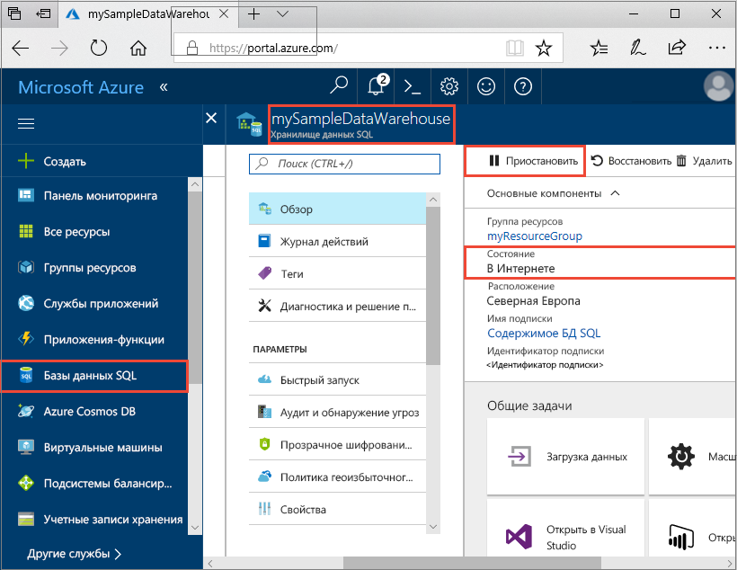
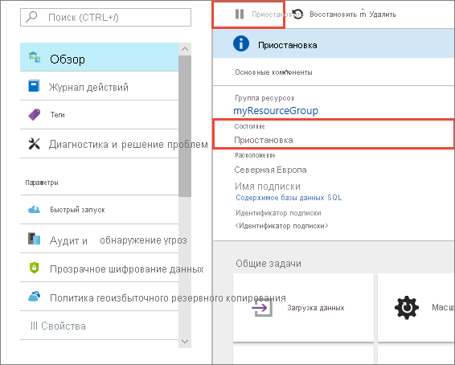
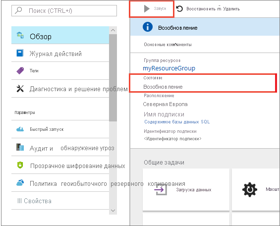
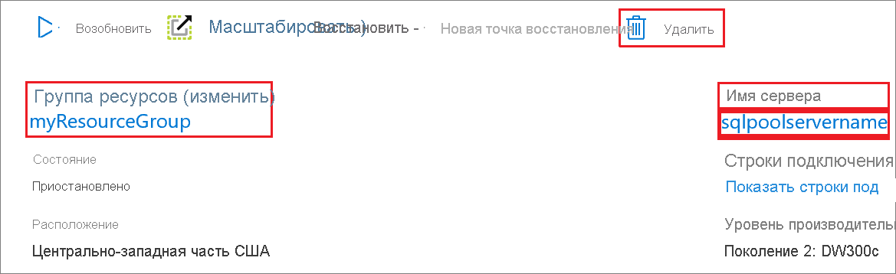

# Краткое руководство. Приостановка и возобновление вычислений в выделенном пуле SQL с помощью портала Azure

Для приостановки и возобновления работы вычислительных ресурсов выделенного пула SQL можно использовать портал Azure. Если у вас еще нет подписки Azure, создайте [бесплатную](https://azure.microsoft.com/free/) учетную запись Azure, прежде чем начинать работу.

## Вход на портал Azure

Войдите на [портал Azure](https://portal.azure.com/).

## Перед началом

Используйте инструкции из статьи [Краткое руководство. Создание выделенного пула SQL с помощью портала Azure](../quickstart-create-sql-pool-portal.md), чтобы создать выделенный пул SQL **mySampleDataWarehouse**. 

## Приостановка работы вычислительных ресурсов

Для сокращения затрат можно приостанавливать и возобновлять работу вычислительных ресурсов по требованию. Например, если база данных не будет использоваться ночью и по выходным, ее работу можно приостанавливать на это время и возобновлять днем.
 
>[!NOTE]
>Когда база данных приостановлена, оплата за вычислительные ресурсы не взимается. Тем не менее плата за хранение по-прежнему будет взиматься. 

Чтобы приостановить работу выделенного пула SQL, сделайте следующее:

1. Войдите на [портал Azure](https://portal.azure.com/).
2. Перейдите на страницу **Выделенный пул SQL**, чтобы открыть пул SQL. 
3. В поле **Состояние** должно отображаться значение **В сети**.

    

4. Чтобы приостановить выделенный пул SQL, нажмите на кнопку **Пауза**. 
5. Отобразится запрос подтверждения операции. Нажмите кнопку **Да**.
6. Подождите несколько секунд, и вы увидите, что значение параметра **Состояние** изменилось на **Приостановка**.

    

7. После завершения операции приостановки пул пребывает в состоянии **Приостановлен** и доступен переключатель **Возобновить**.
8. Теперь вычислительные ресурсы для выделенного пула SQL пребывают вне сети. Вы не будете платить за вычисления, пока работа службы не будет возобновлена.

    

## Возобновление работы вычислительных ресурсов

Чтобы возобновить работу выделенного пула SQL, сделайте следующее:

1. Перейдите на страницу **Выделенный пул SQL**, чтобы открыть пул SQL.
3. На странице **mySampleDataWarehouse** обратите внимание на то, что параметр **Состояние** имеет значение **Приостановлено**.

    

1. Чтобы возобновить вычисления для пула SQL, нажмите кнопку **Возобновить**. 
1. Отобразится запрос подтверждения запуска. Нажмите кнопку **Да**.
1. Обратите внимание на то, что значение параметра **Состояние** изменилось на **Возобновление**.

    

1. После возвращения в сеть пул SQL пребывает в состоянии **В сети** и доступен переключатель **Пауза**.
1. Вычислительные ресурсы для пула SQL теперь находятся в сети, и вы можете использовать службу. Плата за вычисления будет взиматься.

    

## Очистка ресурсов

Плата взимается за единицы хранилища данных и данные, хранящиеся в выделенном пуле SQL. Плата за вычислительные ресурсы и ресурсы хранилища взимается отдельно. 

- Если вы хотите сохранить данные в хранилище, приостановите вычисления.
- Если вы хотите исключить будущие расходы, то можете удалить выделенный пул SQL. 

Выполните следующие действия, чтобы очистить ресурсы по необходимости.

1. Войдите на [портал Azure](https://portal.azure.com) и выберите выделенный пул SQL.

    

1. Чтобы приостановить работу вычислительных ресурсов, нажмите кнопку **Приостановить**. 

1. Чтобы удалить выделенный пул SQL во избежание дальнейших платежей за вычисления или хранение, нажмите кнопку **Удалить**.

## Дальнейшие действия

Вы приостановили и возобновили вычисления для выделенного пула SQL. Перейдите к следующей статье, чтобы узнать больше о том, как [загрузить данные в выделенный пул SQL](./load-data-from-azure-blob-storage-using-copy.md). Дополнительные сведения об управлении возможностями вычислений см. в статье [Управление вычислениями](sql-data-warehouse-manage-compute-overview.md).