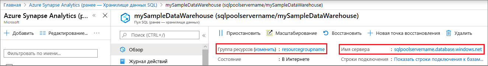

# <a name="quickstart-pause-and-resume-compute-in-synapse-sql-pool-with-azure-powershell"></a>Краткое руководство. Приостановка и возобновление вычислений в пуле SQL Synapse с помощью Azure PowerShell

Для приостановки и возобновления работы вычислительных ресурсов пула SQL Synapse (хранилища данных) можно использовать Azure PowerShell.
Если у вас еще нет подписки Azure, создайте [бесплатную](https://azure.microsoft.com/free/) учетную запись Azure, прежде чем начинать работу.

## <a name="before-you-begin"></a>Перед началом

[!INCLUDE [updated-for-az](../../../includes/updated-for-az.md)]

В этом кратком руководстве предполагается, что у вас уже есть пул SQL, работу которого можно приостановить и возобновить. Если его требуется создать, используйте инструкции из раздела [Создание хранилища данных SQL Azure на портале Azure и отправка запросов к этому хранилищу данных](create-data-warehouse-portal.md) для создания пула SQL **mySampleDataWarehouse**.

## <a name="log-in-to-azure"></a>Вход в Azure

С помощью команды [Connect-AzAccount](/powershell/module/az.accounts/connect-azaccount?toc=/azure/synapse-analytics/sql-data-warehouse/toc.json&bc=/azure/synapse-analytics/sql-data-warehouse/breadcrumb/toc.json) войдите в подписку Azure и следуйте инструкциям на экране.

```powershell
Connect-AzAccount
```

Чтобы узнать, какие подписки вы используете, выполните [Get-AzSubscription](/powershell/module/az.accounts/get-azsubscription?toc=/azure/synapse-analytics/sql-data-warehouse/toc.json&bc=/azure/synapse-analytics/sql-data-warehouse/breadcrumb/toc.json).

```powershell
Get-AzSubscription
```

Если необходимо использовать подписку не по умолчанию, выполните [Set-AzContext](/powershell/module/az.accounts/set-azcontext?toc=/azure/synapse-analytics/sql-data-warehouse/toc.json&bc=/azure/synapse-analytics/sql-data-warehouse/breadcrumb/toc.json).

```powershell
Set-AzContext -SubscriptionName "MySubscription"
```

## <a name="look-up-sql-pool-information"></a>Поиск сведений о пуле SQL

Найдите имя базы данных, имя сервера и группу ресурсов для пула SQL, работу которого вы собираетесь приостановить и возобновить.

Выполните следующие шаги, чтобы найти сведения о расположении пула SQL.

1. Войдите на [портал Azure](https://portal.azure.com/).
1. На портале Azure в области слева щелкните **Azure Synapse Analytics (ранее — Хранилище данных SQL)** .
1. Выберите **mySampleDataWarehouse** на странице **Azure Synapse Analytics (ранее — Хранилище данных SQL)** . Откроется пул SQL.

    

1. Запишите имя пула SQL, которое является именем базы данных. Также запишите имя сервера и группу ресурсов.
1. Используйте только первую часть имени сервера в командлетах PowerShell. На предыдущем изображении полное имя сервера — sqlpoolservername.database.windows.net. Мы используем **sqlpoolservername** в качестве имени сервера в командлете PowerShell.

## <a name="pause-compute"></a>Приостановка работы вычислительных ресурсов

Для сокращения затрат можно приостанавливать и возобновлять работу вычислительных ресурсов по требованию. Например, если база данных не будет использоваться ночью и по выходным, ее работу можно приостанавливать на это время и возобновлять днем.

>[!NOTE]
>Когда база данных приостановлена, оплата за вычислительные ресурсы не взимается. Тем не менее плата за хранение по-прежнему будет взиматься.

Чтобы приостановить базу данных, используйте командлет [Suspend-AzSqlDatabase](/powershell/module/az.sql/suspend-azsqldatabase?toc.json&bc=/azure/synapse-analytics/sql-data-warehouse/breadcrumb/toc.json). В следующем примере приостанавливается работа пула SQL с именем **mySampleDataWarehouse**, размещенного на сервере **sqlpoolservername**. Этот сервер находится в группе ресурсов Azure **myResourceGroup**.

```Powershell
Suspend-AzSqlDatabase –ResourceGroupName "myResourceGroup" `
–ServerName "nsqlpoolservername" –DatabaseName "mySampleDataWarehouse"
```

В приведенном ниже примере база данных извлекается в объект $database. Затем объект передается по конвейеру в [Suspend-AzSqlDatabase](/powershell/module/az.sql/suspend-azsqldatabase?toc.json&bc=/azure/synapse-analytics/sql-data-warehouse/breadcrumb/toc.json). Результаты сохраняются в объекте resultDatabase. Последняя команда отображает результаты.

```Powershell
$database = Get-AzSqlDatabase –ResourceGroupName "myResourceGroup" `
–ServerName "sqlpoolservername" –DatabaseName "mySampleDataWarehouse"
$resultDatabase = $database | Suspend-AzSqlDatabase
$resultDatabase
```

## <a name="resume-compute"></a>Возобновление работы вычислительных ресурсов

Чтобы запустить базу данных, используйте командлет [Resume-AzSqlDatabase](/powershell/module/az.sql/resume-azsqldatabase?toc.json&bc=/azure/synapse-analytics/sql-data-warehouse/breadcrumb/toc.json). В следующем примере запускается база данных **mySampleDataWarehouse**, размещенная на сервере **sqlpoolservername**. Этот сервер находится в группе ресурсов Azure **myResourceGroup**.

```Powershell
Resume-AzSqlDatabase –ResourceGroupName "myResourceGroup" `
–ServerName "sqlpoolservername" -DatabaseName "mySampleDataWarehouse"
```

В следующем примере база данных извлекается в объект $database. Затем объект передается в [Resume-AzSqlDatabase](/powershell/module/az.sql/resume-azsqldatabase?toc=/azure/synapse-analytics/sql-data-warehouse/toc.json&bc=/azure/synapse-analytics/sql-data-warehouse/breadcrumb/toc.json), и результаты сохраняются в объекте $resultDatabase. Последняя команда отображает результаты.

```Powershell
$database = Get-AzSqlDatabase –ResourceGroupName "myResourceGroup" `
–ServerName "sqlpoolservername" –DatabaseName "mySampleDataWarehouse"
$resultDatabase = $database | Resume-AzSqlDatabase
$resultDatabase
```

## <a name="check-status-of-your-sql-pool-operation"></a>Проверка состояния операции пула SQL

Чтобы проверить состояние пула SQL, используйте командлет [Get-AzSqlDatabaseActivity](/powershell/module/az.sql/Get-AzSqlDatabaseActivity?toc.json&bc=/azure/synapse-analytics/sql-data-warehouse/breadcrumb/toc.json).

```Powershell
Get-AzSqlDatabaseActivity -ResourceGroupName "myResourceGroup" -ServerName "sqlpoolservername" -DatabaseName "mySampleDataWarehouse"
```

## <a name="clean-up-resources"></a>Очистка ресурсов

Плата взимается за единицы хранилища данных и данные, хранящиеся в пуле SQL. Плата за вычислительные ресурсы и ресурсы хранилища взимается отдельно.

- Если вы хотите сохранить данные в хранилище, приостановите вычисления.
- Если вы хотите исключить будущие расходы, то можете удалить пул SQL.

Выполните следующие действия, чтобы очистить ресурсы по необходимости.

1. Войдите на [портал Azure](https://portal.azure.com) и щелкните пул SQL.

    

2. Чтобы приостановить работу вычислительных ресурсов, нажмите кнопку **Приостановить**. Если работа пула SQL приостановлена, вы увидите кнопку **Запуск**.  Чтобы возобновить работу вычислительных ресурсов, нажмите кнопку **Запуск**.

3. Чтобы удалить пул SQL во избежание дальнейших платежей за вычисления или хранение, нажмите кнопку **Удалить**.

4. Чтобы удалить созданный вами сервер SQL Server, щелкните **sqlpoolservername.database.windows.net**, а затем нажмите кнопку **Удалить**.  Будьте внимательны, так как удаление сервера приведет к удалению всех баз данных, назначенных этому серверу.

5. Чтобы удалить группу ресурсов, щелкните **myResourceGroup**, а затем нажмите кнопку **Удалить группу ресурсов**.

## <a name="next-steps"></a>Дальнейшие действия

Чтобы узнать больше о пуле SQL, перейдите к статье о [загрузке данных в пул SQL](load-data-from-azure-blob-storage-using-polybase.md). Дополнительные сведения об управлении возможностями вычислений см. в статье [Управление вычислениями](sql-data-warehouse-manage-compute-overview.md).
