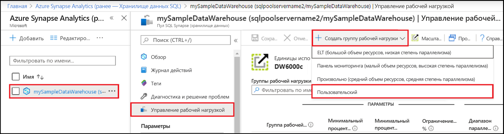
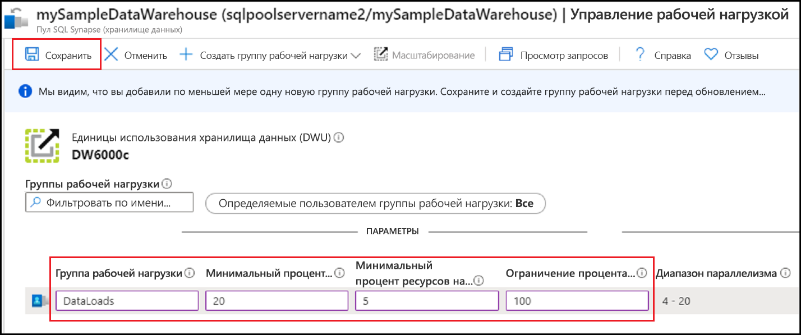
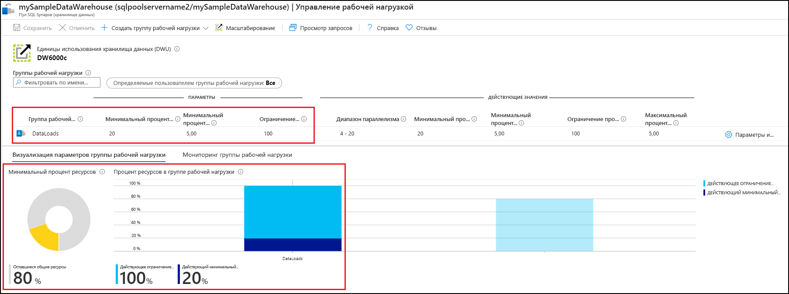
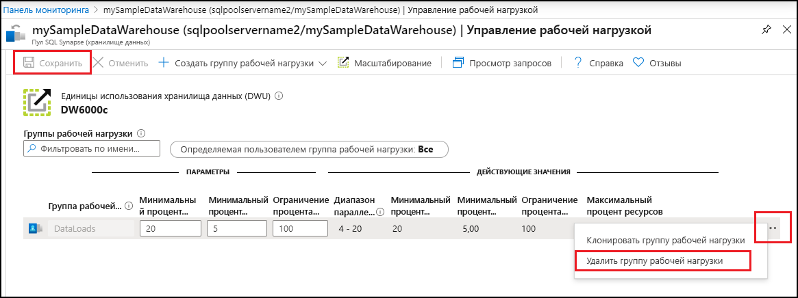

# Краткое руководство. Настройка изоляции рабочих нагрузок пула SQL Synapse с помощью группы рабочей нагрузки на портале Azure

В этом кратком руководстве показано, как настроить [изоляцию рабочих нагрузок](sql-data-warehouse-workload-isolation.md), создав группу рабочей нагрузки для резервирования ресурсов.  Мы создадим группу рабочей нагрузки для загрузки данных с именем `DataLoads`. Группа рабочей нагрузки будет резервировать 20 % системных ресурсов.  Изоляция загрузки данных на уровне 20 % обеспечит доступность ресурсов для этих операций в соответствии с действующими соглашениями об уровне обслуживания.  После создания группы рабочей нагрузки [создайте классификатор рабочих нагрузок](quickstart-create-a-workload-classifier-portal.md) для назначения запросов этой группе рабочей нагрузки.

Если у вас еще нет подписки Azure, создайте [бесплатную](https://azure.microsoft.com/free/) учетную запись Azure, прежде чем начинать работу.

## Вход на портал Azure

Войдите на [портал Azure](https://portal.azure.com/).

> [!NOTE]
> Создание экземпляра пула SQL в Azure Synapse Analytics может повлечь дополнительные расходы.  Дополнительные сведения см. на странице [цен на Azure Synapse Analytics](https://azure.microsoft.com/pricing/details/sql-data-warehouse/).

## Предварительные требования

В этом кратком руководстве предполагается, что у вас уже есть экземпляр пула SQL в Synapse SQL и права доступа CONTROL DATABASE. Если его требуется создать, используйте инструкции из раздела [Создание хранилища данных SQL Azure на портале Azure и отправка запросов к этому хранилищу данных](create-data-warehouse-portal.md), чтобы создать хранилище данных **mySampleDataWarehouse**.

>[!IMPORTANT] 
>Для настройки управления рабочими нагрузками ваш пул SQL должен быть подключен. 

## Настройка изоляции рабочей нагрузки
Вы можете изолировать и зарезервировать ресурсы пула SQL для конкретных рабочих нагрузок, создав группы рабочей нагрузки.  См. сведения о том, как группы рабочей нагрузки помогают управлять рабочей нагрузкой, в руководстве по [изоляции рабочих нагрузок](sql-data-warehouse-workload-isolation.md).  В кратком руководстве по [созданию хранилища данных SQL Azure на портале Azure и отправке запросов к этому хранилищу данных](create-data-warehouse-portal.md) показано, как создать хранилище **mySampleDataWarehouse** и инициализировать его со значением 400 DWU. Следующие действия создают группу рабочей нагрузки в **mySampleDataWarehouse**.

Чтобы создать группу рабочей нагрузки с изоляцией на уровне 20 %, выполните следующие действия.
1.  На портале Azure в области слева щелкните **Azure Synapse Analytics (ранее — Хранилище данных SQL)** .
2.  Выберите **mySampleDataWarehouse** на странице **Azure Synapse Analytics (ранее — Хранилище данных SQL)** . Откроется пул SQL.
3.  Щелкните **Управление рабочими нагрузками**.
4.  Щелкните **Создать группу рабочей нагрузки**.
5.  Щелкните **Настраиваемая**.

    

6.  Введите значение `DataLoads` в поле **Группа рабочей нагрузки**.
7.  Введите значение `20` в поле **Минимальный процент ресурсов**.
8.  Введите значение `5` в поле **Минимальный процент ресурсов на запрос**.
9.  Введите значение `100` в поле **Ограничение ресурсов (%)** .
10.   Выберите команду **Сохранить**.

   

При создании группы рабочей нагрузки на портале отображается уведомление.  Ресурсы группы рабочей нагрузки отображаются на диаграммах под заданными значениями.

   

## Очистка ресурсов

Чтобы удалить созданный с помощью этого руководства классификатор рабочих нагрузок `DataLoads`, выполните следующие действия.
1. Щелкните **`...`** справа от строки, определяющей группу рабочей нагрузки `DataLoads`.
2. Щелкните **Удалить группу рабочей нагрузки**.
3. Щелкните **Да** при появлении запроса на подтверждение удаления группы рабочей нагрузки.
4. Щелкните **Save**(Сохранить).

   

Плата взимается за единицы хранилища данных и данные, которые содержатся в нем. Плата за вычислительные ресурсы и ресурсы хранилища взимается отдельно.

- Если вы хотите сохранить данные в хранилище, то можете приостановить работу вычислительных ресурсов, когда не используете хранилище данных. При приостановке вычислений плата взимается только за хранение данных. Когда вы будете готовы работать с данными, возобновите вычисление.
- Если вы хотите исключить будущие расходы, то можете удалить хранилище данных.

Выполните следующие действия, чтобы очистить ресурсы.

1. Войдите на [портал Azure](https://portal.azure.com) и выберите хранилище данных.

    

2. Чтобы приостановить вычисление, нажмите кнопку **Пауза**. Если работа хранилища данных приостановлена, вы увидите кнопку **Запуск**.  Чтобы возобновить вычисление, нажмите кнопку **Пуск**.

3. Чтобы удалить хранилище данных во избежание дальнейших платежей за вычисления или хранение, нажмите кнопку **Удалить**.

4. Чтобы удалить созданный вами сервер SQL, выберите сервер **sqlpoolservername.database.windows.net**, выделенный на предыдущем изображении, а затем нажмите кнопку **Удалить**.  Будьте внимательны, так как удаление сервера приведет к удалению всех баз данных, назначенных этому серверу.

5. Чтобы удалить группу ресурсов, выберите **myResourceGroup**, а затем **Удалить группу ресурсов**.

## Дальнейшие действия

Чтобы использовать группу рабочей нагрузки `DataLoads`, необходимо создать [классификатор рабочих нагрузок](/sql/t-sql/statements/create-workload-classifier-transact-sql?toc=/azure/synapse-analytics/sql-data-warehouse/toc.json&bc=/azure/synapse-analytics/sql-data-warehouse/breadcrumb/toc.json&view=azure-sqldw-latest) для направления запросов к группе рабочей нагрузки.  См. сведения о [создании классификатора рабочих нагрузок](quickstart-create-a-workload-classifier-portal.md) для `DataLoads`.

## См. также раздел
См. сведения о [мониторинге рабочих нагрузок для управления рабочими нагрузками](sql-data-warehouse-how-to-manage-and-monitor-workload-importance.md).
