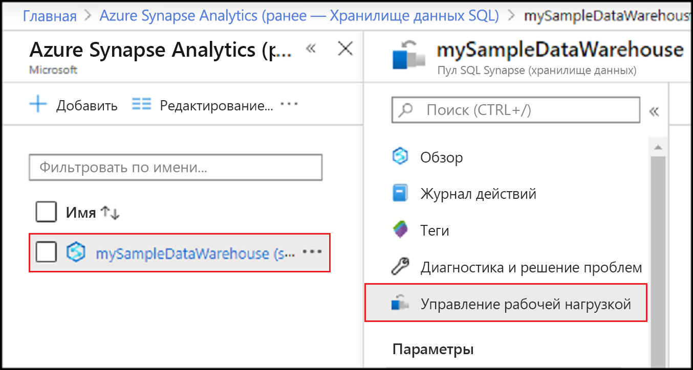
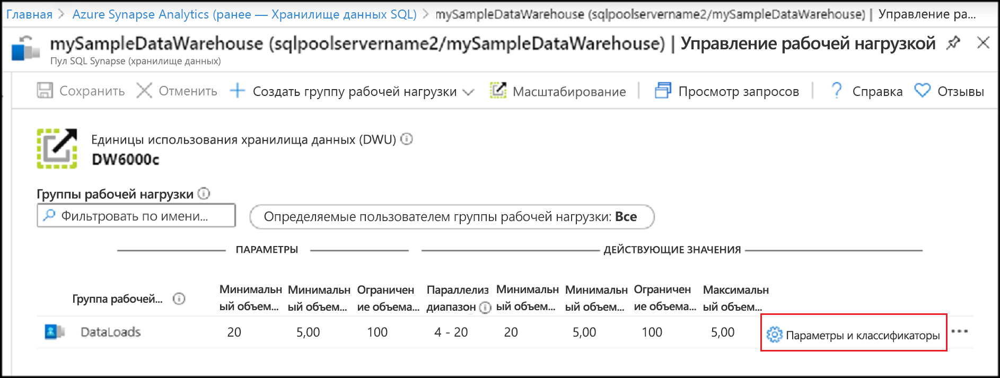
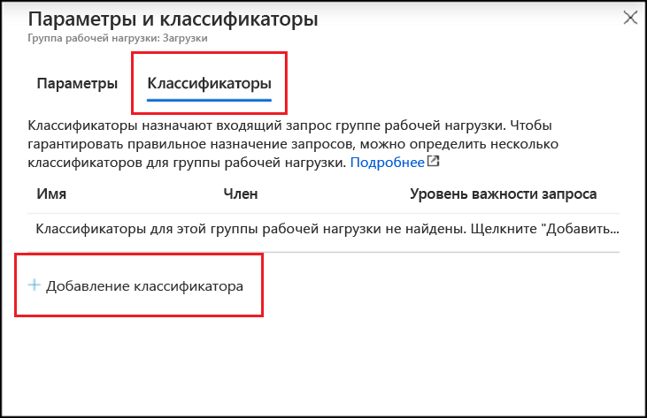
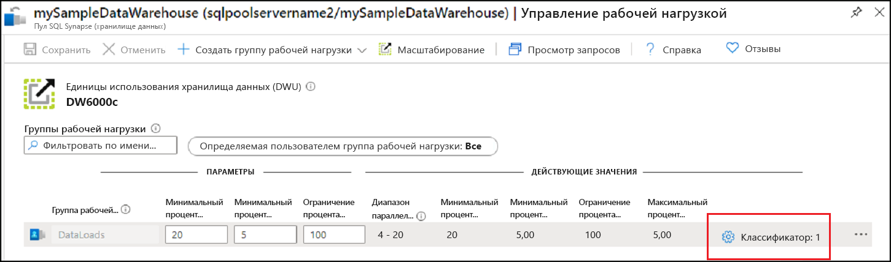

# <a name="quickstart-create-a-synapse-sql-pool-workload-classifier-using-the-azure-portal"></a>Краткое руководство. Создание классификатора рабочих нагрузок пула SQL Synapse с помощью портала Azure

В этом кратком руководстве показано, как создать [классификатор рабочих нагрузок](sql-data-warehouse-workload-classification.md) для назначения запросов группе рабочей нагрузки.  Классификатор будет назначать запросы от пользователя `ELTLogin` группе рабочей нагрузки `DataLoads`.   Выполните инструкции по [ настройке изоляции рабочих нагрузок](quickstart-configure-workload-isolation-portal.md), чтобы создать группу рабочей нагрузки `DataLoads`.  В этом руководстве показано, как создать классификатор рабочих нагрузок с параметром WLM_LABEL, чтобы настроить правильную классификацию запросов.  Классификатор также назначит этим запросам [важность рабочей нагрузки](sql-data-warehouse-workload-importance.md) уровня `HIGH`.


Если у вас еще нет подписки Azure, создайте [бесплатную](https://azure.microsoft.com/free/) учетную запись Azure, прежде чем начинать работу.


## <a name="sign-in-to-the-azure-portal"></a>Вход на портал Azure

Войдите на [портал Azure](https://portal.azure.com/).

> [!NOTE]
> Создание экземпляра пула SQL в Azure Synapse Analytics может повлечь дополнительные расходы.  Дополнительные сведения см. на странице [цен на Azure Synapse Analytics](https://azure.microsoft.com/pricing/details/sql-data-warehouse/).

## <a name="prerequisites"></a>Предварительные требования

В этом кратком руководстве предполагается, что у вас уже есть экземпляр пула SQL в Synapse SQL и права доступа CONTROL DATABASE. Если его требуется создать, используйте инструкции из раздела [Создание хранилища данных SQL Azure на портале Azure и отправка запросов к этому хранилищу данных](create-data-warehouse-portal.md), чтобы создать хранилище данных **mySampleDataWarehouse**.
<br><br>
Группа рабочей нагрузки `DataLoads` существует.  Если нужно создать новую группу рабочей нагрузки, выполните инструкции по [ настройке изоляции рабочих нагрузок](quickstart-configure-workload-isolation-portal.md).
<br><br>
>[!IMPORTANT] 
>Для настройки управления рабочими нагрузками ваш пул SQL должен быть подключен. 


## <a name="create-a-login-for-eltlogin"></a>Создание имени для входа для ELTLogin

Создайте имя для входа с проверкой подлинности SQL Server в базе данных `master`, используя инструкцию[CREATE LOGIN](/sql/t-sql/statements/create-login-transact-sql?toc=/azure/synapse-analytics/sql-data-warehouse/toc.json&bc=/azure/synapse-analytics/sql-data-warehouse/breadcrumb/toc.json&view=azure-sqldw-latest) для `ELTLogin`.

```sql
IF NOT EXISTS (SELECT * FROM sys.sql_logins WHERE name = 'ELTLogin')
BEGIN
CREATE LOGIN [ELTLogin] WITH PASSWORD='<strongpassword>'
END
;
```

## <a name="create-user-and-grant-permissions"></a>Создание пользователя и предоставление разрешений

После создания имени для входа необходимо создать пользователя в базе данных.  Используйте инструкцию [CREATE USER](/sql/t-sql/statements/create-user-transact-sql?toc=/azure/synapse-analytics/sql-data-warehouse/toc.json&bc=/azure/synapse-analytics/sql-data-warehouse/breadcrumb/toc.json&view=azure-sqldw-latest), чтобы создать пользователя SQL `ELTRole` в **mySampleDataWarehouse**.  Так как при работе с этим руководством мы будем тестировать классификацию, предоставьте `ELTLogin` разрешения на доступ к **mySampleDataWarehouse**. 

```sql
IF NOT EXISTS (SELECT * FROM sys.database_principals WHERE name = 'ELTLogin')
BEGIN
CREATE USER [ELTLogin] FOR LOGIN [ELTLogin]
GRANT CONTROL ON DATABASE::mySampleDataWarehouse TO ELTLogin 
END
;
```

## <a name="configure-workload-classification"></a>Настройка классификации рабочих нагрузок
Классификация позволяет направлять запросы к группе рабочей нагрузки на основе набора правил.  Выполнив инструкции по [ настройке изоляции рабочих нагрузок](quickstart-configure-workload-isolation-portal.md), мы создали группу рабочей нагрузки `DataLoads`.  Теперь мы создадим классификатор рабочих нагрузок, чтобы направлять запросы к группе рабочей нагрузки `DataLoads`.


1.  На портале Azure в области слева щелкните **Azure Synapse Analytics (ранее — Хранилище данных SQL)** .
2.  Выберите **mySampleDataWarehouse** на странице **Azure Synapse Analytics (ранее — Хранилище данных SQL)** . Откроется пул SQL.
3.  Щелкните **Управление рабочими нагрузками**.

    

4.  Щелкните **Параметры и классификаторы** справа от строки, определяющей группу рабочей нагрузки `DataLoads`.

    

5. Щелкните **Классификаторы**.
6. Щелкните **Добавить классификатор**.

    

7.  Введите в поле **Имя** значение `ELTLoginDataLoads`.
8.  Введите в поле **Участник** значение `ELTLogin`.
9.  Выберите значение `High` для параметра **Уровень важности запроса**.  (*Необязательно:* по умолчанию используется обычный уровень важности.)
10. Введите значение `fact_loads` в поле **Метка**.
11. Нажмите кнопку **Добавить**.
12. Выберите команду **Сохранить**.

    

## <a name="verify-and-test-classification"></a>Проверка и тестирование классификации
Проверьте наличие классификатора `ELTLoginDataLoads` в представлении каталога [sys.workload_management_workload_classifiers](/sql/relational-databases/system-catalog-views/sys-workload-management-workload-classifiers-transact-sql?view=azure-sqldw-latest).

```sql
SELECT * FROM sys.workload_management_workload_classifiers WHERE name = 'ELTLoginDataLoads'
```

Проверьте сведения классификатора в представлении каталога [sys.workload_management_workload_classifier_details](/sql/relational-databases/system-catalog-views/sys-workload-management-workload-classifier-details-transact-sql?view=azure-sqldw-latest).

```sql
SELECT c.[name], c.group_name, c.importance, cd.classifier_type, cd.classifier_value
  FROM sys.workload_management_workload_classifiers c
  JOIN sys.workload_management_workload_classifier_details cd
    ON cd.classifier_id = c.classifier_id
  WHERE c.name = 'ELTLoginDataLoads'
```

Выполните следующие инструкции, чтобы протестировать классификацию.  Убедитесь, что вы подключены с именем ``ELTLogin`` и что в запросе используется ``Label``.
```sql
CREATE TABLE factstaging (ColA int)
INSERT INTO factstaging VALUES(0)
INSERT INTO factstaging VALUES(1)
INSERT INTO factstaging VALUES(2)
GO

CREATE TABLE testclassifierfact WITH (DISTRIBUTION = ROUND_ROBIN)
AS
SELECT * FROM factstaging
OPTION (LABEL='fact_loads')
```

Убедитесь, что инструкция `CREATE TABLE` относится к группе рабочей нагрузки `DataLoads` с помощью классификатора рабочих нагрузок `ELTLoginDataLoads`.
```sql 
SELECT TOP 1 request_id, classifier_name, group_name, resource_allocation_percentage, submit_time, [status], [label], command 
FROM sys.dm_pdw_exec_requests 
WHERE [label] = 'fact_loads'
ORDER BY submit_time DESC
```


## <a name="clean-up-resources"></a>Очистка ресурсов

Чтобы удалить классификатор рабочих нагрузок `ELTLoginDataLoads`, созданный с помощью этого руководства, выполните следующие действия.

1. Щелкните **Классификаторы: 1** справа от строки, определяющей группу рабочей нагрузки `DataLoads`.

    

2. Щелкните **Классификаторы**.
3. Щелкните **`...`** справа от строки, определяющей классификатор рабочих нагрузок`ELTLoginDataLoads`.
4. Нажмите кнопку **Удалить**.
5. Щелкните **Save**(Сохранить).

    

Плата взимается за единицы хранилища данных и данные, которые содержатся в нем. Плата за вычислительные ресурсы и ресурсы хранилища взимается отдельно.

- Если вы хотите сохранить данные в хранилище, то можете приостановить работу вычислительных ресурсов, когда не используете хранилище данных. При приостановке вычислений плата взимается только за хранение данных. Когда вы будете готовы работать с данными, возобновите вычисление.
- Если вы хотите исключить будущие расходы, то можете удалить хранилище данных.

Выполните следующие действия, чтобы очистить ресурсы.

1. Войдите на [портал Azure](https://portal.azure.com) и выберите хранилище данных.

    

2. Чтобы приостановить вычисление, нажмите кнопку **Пауза**. Если работа хранилища данных приостановлена, вы увидите кнопку **Запуск**.  Чтобы возобновить вычисление, нажмите кнопку **Пуск**.

3. Чтобы удалить хранилище данных во избежание дальнейших платежей за вычисления или хранение, нажмите кнопку **Удалить**.

4. Чтобы удалить созданный вами сервер SQL, выберите сервер **sqlpoolservername.database.windows.net**, выделенный на предыдущем изображении, а затем нажмите кнопку **Удалить**.  Будьте внимательны, так как удаление сервера приведет к удалению всех баз данных, назначенных этому серверу.

5. Чтобы удалить группу ресурсов, выберите **myResourceGroup**, а затем **Удалить группу ресурсов**.

## <a name="next-steps"></a>Дальнейшие действия

Отслеживайте рабочую нагрузку с помощью метрик мониторинга на портале Azure.  См. сведения об [управлении рабочими нагрузками и их мониторинге](sql-data-warehouse-how-to-manage-and-monitor-workload-importance.md).
