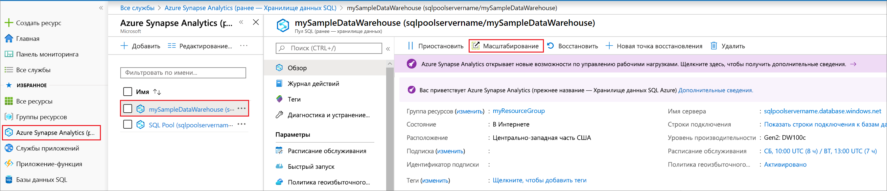
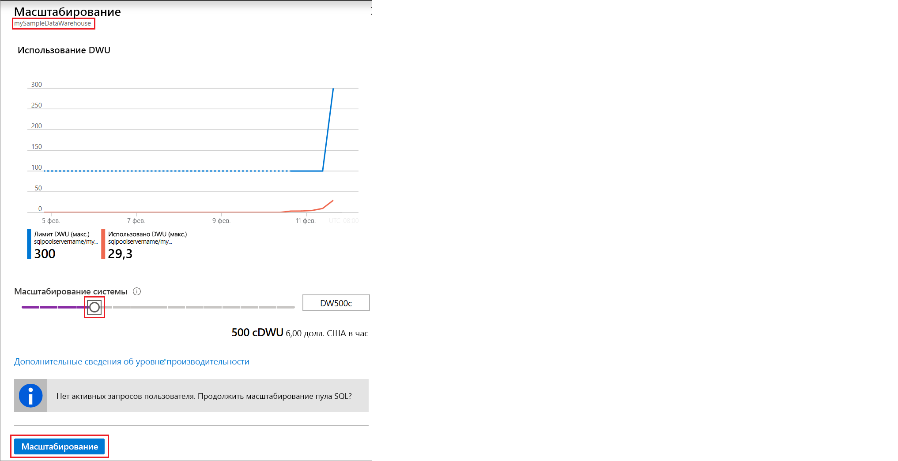

# Краткое руководство. Масштабирование вычислительных ресурсов пула SQL Synapse с помощью портала Azure

Вы можете масштабировать вычислительные ресурсы для пула SQL Synapse (хранилища данных) с помощью портал Azure. [Горизонтально увеличивайте масштаб вычислительных ресурсов](sql-data-warehouse-manage-compute-overview.md), чтобы повысить производительность, или уменьшайте их масштаб, чтобы сократить затраты. 

Если у вас еще нет подписки Azure, создайте [бесплатную](https://azure.microsoft.com/free/) учетную запись Azure, прежде чем начинать работу.

## Вход на портал Azure

Войдите на [портал Azure](https://portal.azure.com/).

## Перед началом

Вы можете масштабировать уже существующий пул SQL или создать его с именем **mySampleDataWarehouse**, воспользовавшись кратким руководством по [созданию и подключению на портале](create-data-warehouse-portal.md). В этом кратком руководстве масштабируется хранилище **mySampleDataWarehouse**.

>[!IMPORTANT] 
>Чтобы можно было изменить масштаб пула SQL, он должен быть подключен к сети. 

## Масштабирование вычислительных ресурсов

Вычислительные ресурсы пула SQL можно масштабировать путем увеличения или уменьшения единиц использования хранилища данных. В статье "Краткое руководство. Создание хранилища данных SQL Azure на портале Azure и отправка запросов к этому хранилищу данных" мы создали хранилище **mySampleDataWarehouse** и инициализировали его со значением 400 DWU. Ниже описаны шаги по изменению числа единиц DWU для **mySampleDataWarehouse**.

Изменить число единиц использования хранилища данных можно так:

1. На портале Azure в области слева щелкните **Azure Synapse Analytics (ранее — Хранилище данных SQL)** .
2. Выберите **mySampleDataWarehouse** на странице **Azure Synapse Analytics (ранее — Хранилище данных SQL)** . Откроется пул SQL.
3. Щелкните пункт **Масштаб**.

    

2. В области "Масштаб" передвиньте ползунок влево или вправо, чтобы изменить число единиц DWU. Затем выберите масштаб.

    

## Дальнейшие действия
Чтобы узнать больше о пуле SQL, перейдите к руководству по [загрузке данных в пул SQL](load-data-from-azure-blob-storage-using-polybase.md). 
