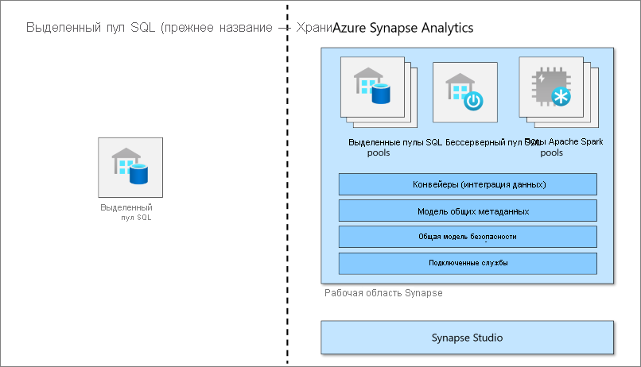

# Сведения о выделенном пуле SQL (ранее — Хранилище данных SQL) в Azure Synapse Analytics

Azure Synapse Analytics — это служба аналитики, которая объединяет корпоративные хранилища данных и аналитику больших данных. Выделенный пул SQL (ранее — Хранилище данных SQL) относится к функциям хранения корпоративных данных, доступным в Azure Synapse Analytics.

Выделенный пул SQL (ранее — Хранилище данных SQL) представляет коллекцию аналитических ресурсов, которые подготавливаются при использовании Synapse SQL. Размер выделенного пула SQL (ранее — Хранилище данных SQL) определяется единицами использования хранилища данных (DWU).

После создания выделенного пула SQL можно импортировать большие данные с помощью простых запросов T-SQL [PolyBase](/sql/relational-databases/polybase/polybase-guide?toc=/azure/synapse-analytics/sql-data-warehouse/toc.json&bc=/azure/synapse-analytics/sql-data-warehouse/breadcrumb/toc.json&view=azure-sqldw-latest). Затем используйте возможности обработчика распределенных запросов для выполнения высокопроизводительной аналитики. По мере интеграции и анализа данных выделенный пул SQL (ранее — Хранилище данных SQL) станет единственной оптимальной и достоверной версией для получения надежных и своевременных аналитических сведений для вашей компании.

> [!NOTE]
>Изучите [документацию по Azure Synapse Analytics](../overview-what-is.md).
> 

## Ключевой компонент решения для больших данных

Хранилище данных — это ключевой компонент комплексного решения для больших данных в облаке.

В облачном решении для работы с данными данные принимаются в хранилища больших данных из различных источников. После отправки в хранилище больших данных алгоритмы Hadoop, Spark и машинного обучения выполняют подготовку и обучение данных. Когда данные будут готовы к сложному анализу, выделенный пул SQL запрашивает хранилища больших данных с помощью PolyBase. PolyBase использует стандартные запросы T-SQL для передачи данных в таблицы выделенного пула SQL (ранее — Хранилище данных SQL).

Выделенный пул SQL (ранее — Хранилище данных SQL) сохраняет данные в реляционных таблицах с хранением по столбцам. Этот формат значительно снижает затраты на хранение данных и повышает производительность запросов. После сохранения данных вы сможете вести аналитику в большом масштабе. По сравнению с традиционными системами баз данных запросы анализа выполняются за секунды вместо минут или за часы вместо дней.

Результаты анализа можно передать в базы данных и приложения отчетности по всему миру. Специалисты по бизнес-аналитике могут получить данные для принятия обоснованных бизнес-решений.

## Дальнейшие действия

- Знакомство с [архитектурой Azure Synapse](massively-parallel-processing-mpp-architecture.md)
- Быстрое [создание выделенного пула SQL](create-data-warehouse-portal.md)
- [Загрузите демонстрационные данные](load-data-from-azure-blob-storage-using-polybase.md).
- Просмотрите [видео](https://azure.microsoft.com/documentation/videos/index/?services=sql-data-warehouse).

Или ознакомьтесь со следующими ресурсами, посвященными SQL Analytics.

- Ищите информацию в [блогах](https://azure.microsoft.com/blog/tag/azure-sql-data-warehouse/).
- Отправьте [запрос на функцию](https://feedback.azure.com/forums/307516-sql-data-warehouse).
- [Создание запроса в службу поддержки](sql-data-warehouse-get-started-create-support-ticket.md)
- Ищите информацию на [странице вопросов (раздел вопросов и ответов на сайте Майкрософт)](https://docs.microsoft.com/answers/topics/azure-synapse-analytics.html)
- Ищите информацию на [форуме Stack Overflow](https://stackoverflow.com/questions/tagged/azure-sqldw).
