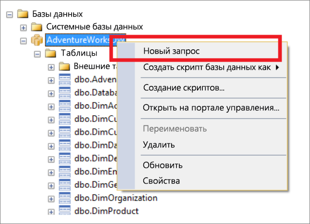
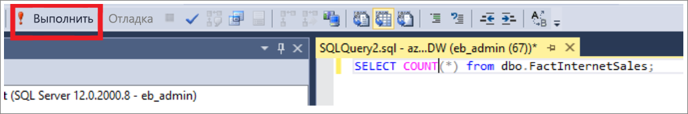
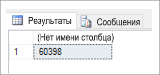

# <a name="connect-to-a-dedicated-sql-pool-formerly-sql-dw-in-azure-synapse-analytics-with-sql-server-management-studio-ssms"></a>Подключение к выделенному пулу SQL (ранее SQL DW) в Azure синапсе Analytics с помощью SQL Server Management Studio (SSMS)

> [!div class="op_single_selector"]
>
> * [Power BI](/power-bi/connect-data/service-azure-sql-data-warehouse-with-direct-connect)
> * [Машинное обучение Azure](sql-data-warehouse-get-started-analyze-with-azure-machine-learning.md)
> * [Visual Studio](sql-data-warehouse-query-visual-studio.md)
> * [sqlcmd](sql-data-warehouse-get-started-connect-sqlcmd.md)
> * [SSMS](sql-data-warehouse-query-ssms.md)

Используйте SQL Server Management Studio (SSMS) для подключения и запроса выделенного пула SQL (ранее — хранилища данных SQL).

## <a name="prerequisites"></a>Предварительные условия

Для работы с этим руководством необходимы указанные ниже компоненты.

* Существующий выделенный пул SQL. Чтобы создать его, см. раздел [Создание выделенного пула SQL (ранее — хранилище данных SQL)](create-data-warehouse-portal.md).
* Установленный SQL Server Management Studio (SSMS). [Скачайте SSMS](/sql/ssms/download-sql-server-management-studio-ssms?toc=/azure/synapse-analytics/sql-data-warehouse/toc.json&bc=/azure/synapse-analytics/sql-data-warehouse/breadcrumb/toc.json&view=azure-sqldw-latest&preserve-view=true) бесплатно, если у вас его еще нет.
* Полное имя сервера SQL Server. Чтобы найти эти сведения, см. раздел [выделенный пул SQL (ранее — хранилище данных SQL)](sql-data-warehouse-connect-overview.md).

## <a name="1-connect-to-your-dedicated-sql-pool-formerly-sql-dw"></a>1. подключение к выделенному пулу SQL (ранее — хранилище данных SQL)

1. Откройте SSMS.
2. Откройте обозреватель объектов, выбрав **файл**  >  **подключить обозреватель объектов**.

    
3. Заполните поля в окне «Подключение к серверу».

   

   * **Имя сервера**. Введите найденное **имя сервера** .
   * **Проверка подлинности**. Выберите **Проверка подлинности SQL Server** или **Встроенная проверка подлинности Active Directory**.
   * **Имя пользователя** и **пароль**. Если вы выбрали проверку подлинности SQL Server, введите имя пользователя и пароль.
   * Нажмите кнопку **Соединить**.
4. Чтобы исследовать данные, разверните сервер Azure SQL Server. Вы можете просмотреть базы данных, связанные с сервером. Разверните AdventureWorksDW, чтобы просмотреть таблицы в образце базы данных.

   

## <a name="2-run-a-sample-query"></a>2. Запуск пробного запроса

Теперь, когда мы подключились к базе данных, давайте напишем запрос.

1. Щелкните правой кнопкой мыши базу данных в обозревателе объектов SQL Server.
2. Выберите **Создать запрос**. Откроется новое окно запроса.

   
3. Скопируйте следующий запрос T-SQL в окно запроса.

   ```sql
   SELECT COUNT(*) FROM dbo.FactInternetSales;
   ```

4. Выполните запрос, щелкнув `Execute` или воспользовавшись следующим сочетанием клавиш: `F5` .

   
5. Просмотрите результаты запроса. В этом примере таблица FactInternetSales содержит 60 398 строк.

   

## <a name="next-steps"></a>Дальнейшие действия

Теперь, когда вы можете подключаться к базе данных и отправлять запросы, попробуйте [визуализировать данные с помощью Power BI](/power-bi/connect-data/service-azure-sql-data-warehouse-with-direct-connect). Сведения о настройке среды для проверки подлинности Azure Active Directory см. [в разделе аутентификация в выделенном пуле SQL](sql-data-warehouse-authentication.md).