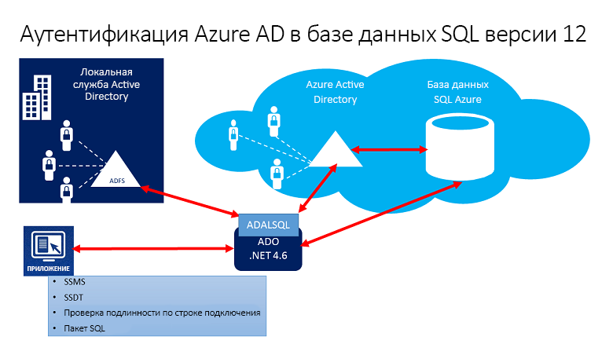
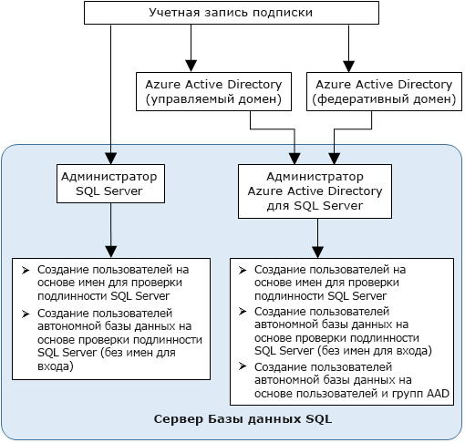

# Использование Azure Active Directory для проверки подлинности в SQL Synapse

Аутентификация Azure Active Directory — это механизм подключения к [Azure Synapse Analytics](../overview-faq.md) с использованием идентификаторов в Azure Active Directory (Azure AD).

С помощью аутентификации Azure AD вы можете централизованно управлять идентификаторами пользователей, которые имеют доступ к Azure Synapse, что упрощает управление разрешениями. Это дает такие преимущества:

- альтернатива обычной проверке подлинности по имени пользователя и паролю;
- возможность остановить увеличение количества пользователей на серверах;
- возможность чередования паролей в одном расположении;
- клиенты могут управлять разрешениями базы данных, используя внешние группы (Azure AD);
- возможность исключить хранение паролей с помощью встроенной проверки подлинности Windows и других видов проверки подлинности, поддерживаемых Azure Active Directory;
- для приложений, подключающихся к Azure Synapse, Azure AD поддерживает аутентификацию на основе маркеров.
- Azure AD поддерживает проверку подлинности с использованием AD FS (федерация доменов) или собственную проверку подлинности с помощью имени пользователя и пароля для локального каталога Azure Active Directory без синхронизации домена.
- Azure AD поддерживает подключения из SQL Server Management Studio, использующие универсальную проверку подлинности Active Directory, в том числе Многофакторную идентификацию (MFA).  MFA обеспечивает надежную аутентификацию с использованием ряда простых вариантов проверки посредством телефонного звонка, текстового сообщения, смарт-карты с ПИН-кодом или уведомления в мобильном приложении. Дополнительные сведения о поддержке Многофакторной идентификации Azure AD в SSMS для использования с SQL Synapse см. [здесь](mfa-authentication.md).
- Azure AD поддерживает аналогичные подключения из SQL Server Data Tools (SSDT), использующие интерактивную аутентификацию Active Directory. Дополнительные сведения см. в статье [Поддержка Azure Active Directory в SQL Server Data Tools (SSDT)](/sql/ssdt/azure-active-directory?toc=/azure/synapse-analytics/toc.json&bc=/azure/synapse-analytics/breadcrumb/toc.json&view=azure-sqldw-latest&preserve-view=true).

Для настройки и использования проверки подлинности Azure Active Directory выполните следующие действия.

1. Создайте и заполните каталог Azure AD.
2. Создайте идентификатор Azure AD.
3. Назначьте роль созданному идентификатору Azure Active Directory в рабочей области Synapse.
4. Подключитесь к Synapse Studio, используя идентификаторы Azure AD.

## Сквозная передача Azure AD в Synapse Analytics

Azure Synapse Analytics позволяет получать доступ к данным в озере, используя идентификатор Azure AD.

Определение прав доступа к файлам и данным, которые учитываются в разных подсистемах обработки, упрощает работу с озерами данных, так как разрешения определяются в одном месте, и теперь не нужно определять их в нескольких местах.

## Архитектура доверия

На общей схеме ниже показана архитектура решения, в котором используется аутентификация Azure AD для SQL Synapse. Для поддержки собственной проверки подлинности Azure AD с использованием пароля пользователя учитывается только облачная часть, Azure AD и SQL Synapse. Для поддержки федеративной проверки подлинности (или имени пользователя и пароля в качестве учетных данных Windows) требуется взаимодействие с блоком ADFS. Стрелки обозначают пути обмена данными.

На следующей схеме показаны федерация, отношения доверия и отношения размещения. Все эти компоненты позволяют клиенту подключиться к базе данных, отправив маркер. Маркер проходит аутентификацию в Azure AD и становится доверенным для базы данных. 

Клиент 1 может представлять каталог Azure AD с собственными пользователями или федеративными пользователями. Клиент 2 представляет возможное решение, включая импортированных пользователей. В этом примере пользователи импортированы из федеративной службы Azure Active Directory, при этом службы ADFS синхронизированы с Azure Active Directory. 

Важно понимать, что для доступа к базе данных с использованием проверки подлинности Azure AD необходимо связать подписку размещения с Azure AD. Эту же подписку нужно использовать, чтобы создать сервер SQL Server для размещения Базы данных SQL Azure или выделенного пула SQL.

## Структура администраторов

При использовании аутентификации Azure AD существуют две учетные записи администратора SQL Synapse: учетная запись первоначального администратора сервера SQL Server и учетная запись администратора Azure AD. Создать в пользовательской базе данных первого пользователя автономной базы данных Azure AD может только администратор с учетной записью Azure AD. 

Администратор Azure AD может использовать для входа имя пользователя Azure AD или имя группы Azure AD. Если учетная запись администратора является учетной записью группы, ее может использовать любой член группы. По этой причине для одного экземпляра SQL Synapse может существовать несколько администраторов Azure AD. 

Использование учетной записи группы в качестве учетной записи администратора упрощает управление. Это позволяет централизованно добавлять и удалять участников группы в Azure AD, не изменяя пользователей или разрешения в рабочей области Azure Synapse Analytics. За один раз можно настроить только одного администратора Azure AD (пользователя или группу).

## Разрешения

Чтобы создавать новых пользователей, у вас должно быть разрешение `ALTER ANY USER` в базе данных. Разрешение `ALTER ANY USER` можно предоставить любому пользователю базы данных. Разрешение `ALTER ANY USER` также предоставляется учетным записям администратора сервера и пользователям базы данных с разрешениями `CONTROL ON DATABASE` или `ALTER ON DATABASE` для этой базы данных, а также участникам роли `db_owner` в базе данных.

Чтобы создать учетную запись пользователя автономной базы данных в SQL Synapse, необходимо подключиться к базе данных с использованием идентификатора Azure AD. Чтобы создать первого пользователя автономной базы данных, необходимо подключиться к ней с использованием учетной записи администратора Azure AD (который является владельцем базы данных). 

Проверка подлинности Azure AD любого типа возможна только в том случае, если для SQL Synapse создана учетная запись администратора Azure AD. Если учетная запись администратора Azure AD удалена с сервера, то существующие пользователи Azure Active Directory, учетные записи которых созданы ранее в SQL Synapse, больше не смогут подключаться к базе данных, используя свои текущие учетные данные Azure AD.
 
## Функции и ограничения Azure AD

- В SQL Synapse можно подготовить такие члены Azure AD:

  - Собственные члены. Члены, созданные в Azure AD в управляемом домене или в домене клиента. Дополнительные сведения см. в статье [Добавление имени личного домена в Azure Active Directory](../../active-directory/fundamentals/add-custom-domain.md?toc=/azure/synapse-analytics/toc.json&bc=/azure/synapse-analytics/breadcrumb/toc.json).
  - Члены федеративного домена. Члены, созданные в Azure AD с федеративным доменом. Дополнительные сведения см. в статье [Microsoft Azure now supports federation with Windows Server Active Directory](https://azure.microsoft.com/blog/20../../windows-azure-now-supports-federation-with-windows-server-active-directory/) (Microsoft Azure теперь поддерживает федерацию с Windows Server Active Directory).
  - Импортированные члены из других каталогов Azure AD, являющиеся собственными или федеративными членами домена.
  - Группы Active Directory, созданные как группы безопасности.

- Пользователи Azure AD, которые входят в группу с ролью сервера `db_owner`, не могут использовать синтаксис **[CREATE DATABASE SCOPED CREDENTIAL](/sql/t-sql/statements/create-database-scoped-credential-transact-sql?toc=/azure/synapse-analytics/toc.json&bc=/azure/synapse-analytics/breadcrumb/toc.json&view=azure-sqldw-latest&preserve-view=true)** для SQL Synapse. Отобразится следующая ошибка:

    `SQL Error [2760] [S0001]: The specified schema name 'user@mydomain.com' either does not exist or you do not have permission to use it.`

    Предоставляйте роль `db_owner` напрямую отдельным пользователям Azure AD во избежание проблем с синтаксисом **CREATE DATABASE SCOPED CREDENTIAL**.

- Эти системные функции возвращают значения NULL при выполнении с помощью субъектов Azure AD:

  - `SUSER_ID()`
  - `SUSER_NAME(<admin ID>)`
  - `SUSER_SNAME(<admin SID>)`
  - `SUSER_ID(<admin name>)`
  - `SUSER_SID(<admin name>)`

## Подключение с использованием удостоверений Azure AD

Проверка подлинности Azure Active Directory поддерживает следующие способы подключения к базе данных с помощью удостоверений Azure AD:

- Пароль Azure Active Directory.
- Встроенная служба Azure Active Directory.
- Универсальная служба Azure Active Directory с поддержкой MFA.
- Использование маркера проверки подлинности приложения

Для субъектов сервера (имен для входа) Azure AD поддерживаются следующие способы проверки подлинности:

- Пароль Azure Active Directory.
- Встроенная служба Azure Active Directory.
- Универсальная служба Azure Active Directory с поддержкой MFA.

### Дополнительные сведения

- Для повышения управляемости рекомендуем подготовить специальную группу Azure AD от имени администратора.
- За один раз для пула SQL можно настроить только одного администратора Azure AD (пользователя или группу).
  - Добавление субъектов сервера (имен для входа) Azure AD Synapse SQL позволяет создавать несколько субъектов сервера (имен для входа) Azure AD, которые можно добавить к роли `sysadmin`.
- Только администратор Azure AD для Synapse SQL может подключаться к Synapse SQL, используя учетную запись Azure AD. Затем администратор Active Directory может настроить других пользователей базы данных Azure AD.
- Мы рекомендуем установить время ожидания подключения в 30 секунд.
- Проверку подлинности Azure Active Directory поддерживают SQL Server 2016 Management Studio и SQL Server Data Tools для Visual Studio 2015 (версии 14.0.60311.1, выпущенной в апреле 2016 г., или более поздней). (Проверку подлинности Azure AD поддерживает **поставщик данных .NET Framework для SQL Server**, требуется версия .NET Framework не ниже 4.6.) Поэтому для последних версий этих инструментов и приложений уровня данных (DAC и BACPAC-файлов) можно применять аутентификацию Azure AD.
- Начиная с версии 15.0.1, служебные программы[SQLCMD](/sql/tools/sqlcmd-utility?toc=/azure/synapse-analytics/toc.json&bc=/azure/synapse-analytics/breadcrumb/toc.json&view=azure-sqldw-latest&preserve-view=true) и [BCP](/sql/tools/bcp-utility?toc=/azure/synapse-analytics/toc.json&bc=/azure/synapse-analytics/breadcrumb/toc.json&view=azure-sqldw-latest&preserve-view=true) поддерживают интерактивную аутентификацию Active Directory с возможностью MFA.
- Для SQL Server Data Tools для Visual Studio 2015 требуется версия Data Tools, выпущенная в апреле 2016 г. (14.0.60311.1), или более поздняя. Сейчас пользователи Azure AD не отображаются в обозревателе объектов SSDT. Сведения о пользователях можно просмотреть в файле [sys.database_principals](/sql/relational-databases/system-catalog-views/sys-database-principals-transact-sql?toc=/azure/synapse-analytics/toc.json&bc=/azure/synapse-analytics/breadcrumb/toc.json&view=azure-sqldw-latest&preserve-view=true).
- [Драйвер Microsoft JDBC 6.0 для SQL Server](https://www.microsoft.com/download/details.aspx?id=11774) поддерживает проверку подлинности Azure AD. Вы можете также ознакомиться с [настройкой свойств подключения](/sql/connect/jdbc/setting-the-connection-properties?toc=/azure/synapse-analytics/toc.json&bc=/azure/synapse-analytics/breadcrumb/toc.json&view=azure-sqldw-latest&preserve-view=true).

## Дальнейшие действия

- Общие сведения о доступе к SQL Synapse и управлении им см. в разделе [Управление доступом к SQL Synapse](../security/synapse-workspace-access-control-overview.md).
- Дополнительные сведения о субъектах базы данных см. в [этой статье](/sql/relational-databases/security/authentication-access/principals-database-engine?toc=/azure/synapse-analytics/toc.json&bc=/azure/synapse-analytics/breadcrumb/toc.json&view=azure-sqldw-latest&preserve-view=true).
- Дополнительные сведения о ролях баз данных см. в статье [Роли уровня базы данных](/sql/relational-databases/security/authentication-access/database-level-roles?toc=/azure/synapse-analytics/toc.json&bc=/azure/synapse-analytics/breadcrumb/toc.json&view=azure-sqldw-latest&preserve-view=true).

