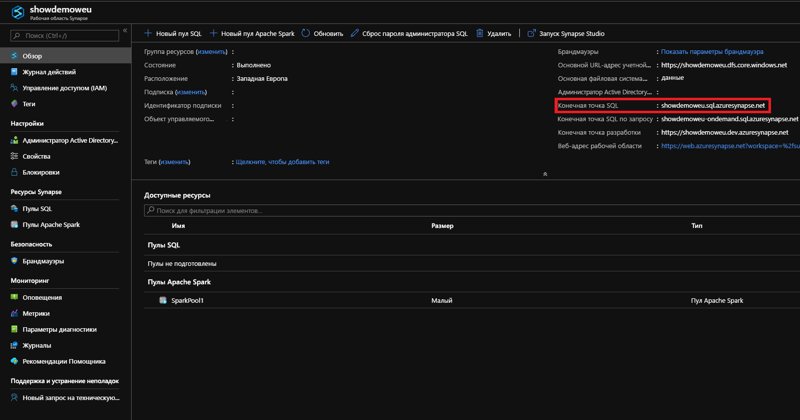
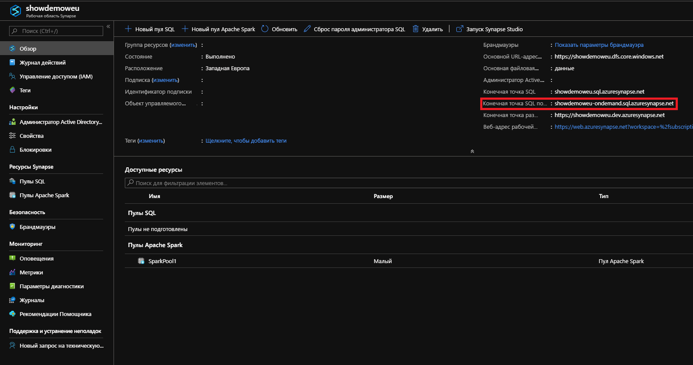

# <a name="connect-to-synapse-sql"></a>Подключение к Synapse SQL
Установите подключение к функции Synapse SQL в Azure Synapse Analytics.

## <a name="supported-tools-for-serverless-sql-pool"></a>Поддерживаемые средства для бессерверного пула SQL

[Azure Data Studio](/sql/azure-data-studio/download-azure-data-studio) полностью поддерживается, начиная с версии 1.18.0. SSMS частично поддерживается, начиная с версии 18.5, и используется только для подключения и выполнения запросов.

> [!NOTE]
> Если для имени входа AAD открыто подключение в течение более 1 часа во время выполнения запроса, все запросы, зависящие от AAD, завершатся ошибкой. Сюда входят запросы к хранилищу с помощью сквозной аутентификации AAD и инструкций, которые взаимодействуют с AAD (например, CREATE EXTERNAL PROVIDER). Это влияет на все средства, которые поддерживают подключения открытыми, например редактор запросов в SSMS и ADS. Средства, которые открывают новые подключения для выполнения запроса, например Synapse Studio, не затрагиваются.

> Чтобы устранить эту ошибку, можно перезапустить SSMS или выполнить подключение и отключение в ADS. 

## <a name="find-your-server-name"></a>Поиск имени сервера

Имя сервера для выделенного пула SQL в приведенном ниже примере — showdemoweu.sql.azuresynapse.net.
Имя сервера для бессерверного пула SQL в приведенном ниже примере — showdemoweu-ondemand.sql.azuresynapse.net.

Чтобы найти полное имя сервера, сделайте следующее.

1. Перейдите на [портал Azure](https://portal.azure.com).
2. Выберите **Рабочие области Synapse**.
3. Выберите рабочую область, к которой нужно подключиться.
4. Перейдите на вкладку "Обзор".
5. Найдите полное имя сервера.

## <a name="sql-pool"></a>**Пул SQL**



## <a name="serverless-sql-pool"></a>**Бессерверный пул SQL**



## <a name="supported-drivers-and-connection-strings"></a>Поддерживаемые драйверы и строки подключения
Synapse SQL поддерживает драйверы [ADO.NET](https://msdn.microsoft.com/library/e80y5yhx(v=vs.110).aspx), [ODBC](https://msdn.microsoft.com/library/jj730314.aspx), [PHP](https://msdn.microsoft.com/library/cc296172.aspx?f=255&MSPPError=-2147217396) и [JDBC](https://msdn.microsoft.com/library/mt484311(v=sql.110).aspx). Выберите один из указанных типов драйверов для получения информации об обновлениях и документации. Чтобы автоматически создать строку подключения для используемого драйвера на портале Azure, щелкните **Показать строки подключения к базам данных** на странице из предыдущего примера. Ниже приведены примеры синтаксиса строк подключения для каждого драйвера.

> [!NOTE]
> Рекомендуем задать время ожидания подключения, равное 300 секундам, чтобы подключение могло выдерживать короткие периоды недоступности.

### <a name="adonet-connection-string-example"></a>Пример строки подключения ADO.NET

```csharp
Server=tcp:{your_server}.sql.azuresynapse.net,1433;Database={your_database};User ID={your_user_name};Password={your_password_here};Encrypt=True;TrustServerCertificate=False;Connection Timeout=30;
```

### <a name="odbc-connection-string-example"></a>Пример строки подключения ODBC

```csharp
Driver={SQL Server Native Client 11.0};Server=tcp:{your_server}.sql.azuresynapse.net,1433;Database={your_database};Uid={your_user_name};Pwd={your_password_here};Encrypt=yes;TrustServerCertificate=no;Connection Timeout=30;
```

### <a name="php-connection-string-example"></a>Пример строки подключения PHP

```PHP
Server: {your_server}.sql.azuresynapse.net,1433 \r\nSQL Database: {your_database}\r\nUser Name: {your_user_name}\r\n\r\nPHP Data Objects(PDO) Sample Code:\r\n\r\ntry {\r\n   $conn = new PDO ( \"sqlsrv:server = tcp:{your_server}.sql.azuresynapse.net,1433; Database = {your_database}\", \"{your_user_name}\", \"{your_password_here}\");\r\n    $conn->setAttribute( PDO::ATTR_ERRMODE, PDO::ERRMODE_EXCEPTION );\r\n}\r\ncatch ( PDOException $e ) {\r\n   print( \"Error connecting to SQL Server.\" );\r\n   die(print_r($e));\r\n}\r\n\rSQL Server Extension Sample Code:\r\n\r\n$connectionInfo = array(\"UID\" => \"{your_user_name}\", \"pwd\" => \"{your_password_here}\", \"Database\" => \"{your_database}\", \"LoginTimeout\" => 30, \"Encrypt\" => 1, \"TrustServerCertificate\" => 0);\r\n$serverName = \"tcp:{your_server}.sql.azuresynapse.net,1433\";\r\n$conn = sqlsrv_connect($serverName, $connectionInfo);
```

### <a name="jdbc-connection-string-example"></a>Пример строки подключения JDBC

```Java
jdbc:sqlserver://yourserver.sql.azuresynapse.net:1433;database=yourdatabase;user={your_user_name};password={your_password_here};encrypt=true;trustServerCertificate=false;hostNameInCertificate=*.sql.azuresynapse.net;loginTimeout=30;
```

## <a name="connection-settings"></a>Параметры подключения
Synapse SQL стандартизирует некоторые параметры при установке подключения и создании объектов. Такие параметры нельзя переопределить. К ним относятся следующие:

| Параметр базы данных | Значение |
|:--- |:--- |
| [ANSI_NULLS](/sql/t-sql/statements/set-ansi-nulls-transact-sql?toc=/azure/synapse-analytics/toc.json&bc=/azure/synapse-analytics/breadcrumb/toc.json&view=azure-sqldw-latest&preserve-view=true) |ON |
| [QUOTED_IDENTIFIERS](/sql/t-sql/statements/set-quoted-identifier-transact-sql?toc=/azure/synapse-analytics/toc.json&bc=/azure/synapse-analytics/breadcrumb/toc.json&view=azure-sqldw-latest&preserve-view=true) |ON |
| [DATEFORMAT](/sql/t-sql/statements/set-dateformat-transact-sql?toc=/azure/synapse-analytics/toc.json&bc=/azure/synapse-analytics/breadcrumb/toc.json&view=azure-sqldw-latest&preserve-view=true) |mdy |
| [DATEFIRST](/sql/t-sql/statements/set-datefirst-transact-sql?toc=/azure/synapse-analytics/toc.json&bc=/azure/synapse-analytics/breadcrumb/toc.json&view=azure-sqldw-latest&preserve-view=true) |7 |

## <a name="recommendations"></a>Рекомендации

Для выполнения запросов **бессерверного пула SQL** мы рекомендуем использовать [Azure Data Studio](get-started-azure-data-studio.md) и Azure Synapse Studio.

## <a name="next-steps"></a>Дальнейшие действия
Чтобы подключиться и отправить запрос с помощью Visual Studio, см. инструкции в статье [Подключение к Azure Synapse Analytics с помощью Visual Studio и SSDT](../sql-data-warehouse/sql-data-warehouse-query-visual-studio.md?toc=/azure/synapse-analytics/toc.json&bc=/azure/synapse-analytics/breadcrumb/toc.json). Подробные сведения о способах проверки подлинности см. в статье [Проверка подлинности в Synapse SQL](../sql-data-warehouse/sql-data-warehouse-authentication.md?toc=/azure/synapse-analytics/toc.json&bc=/azure/synapse-analytics/breadcrumb/toc.json).