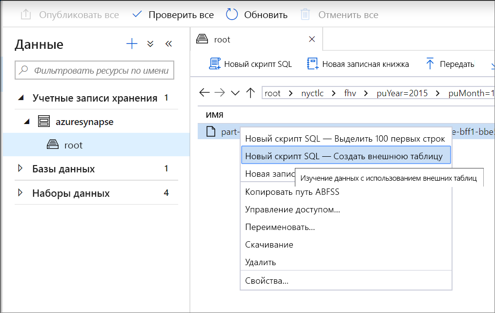
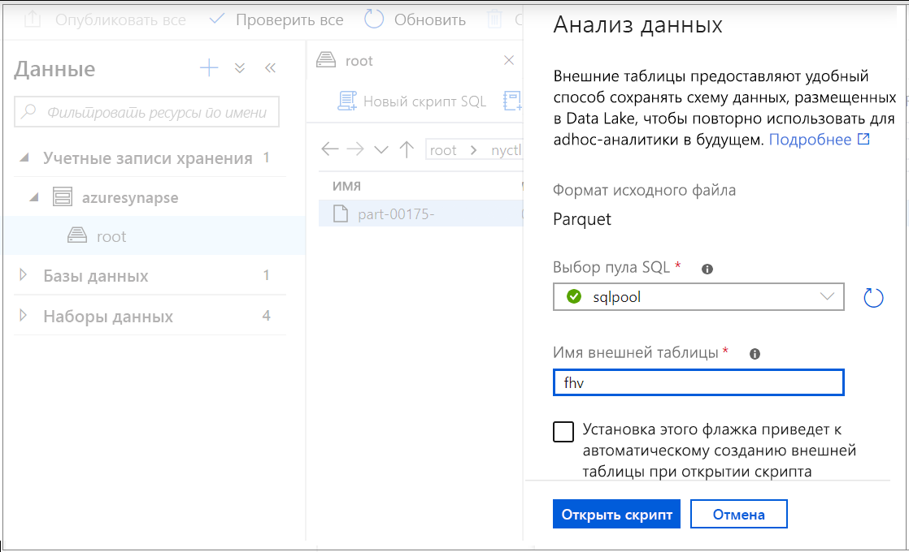
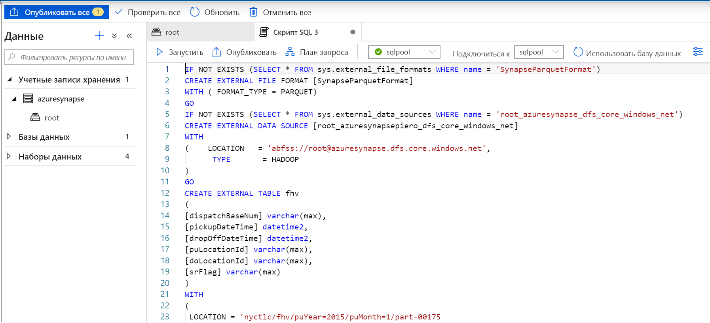
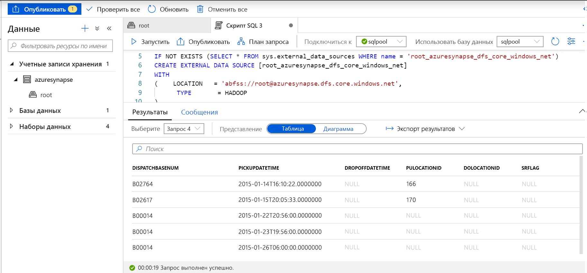
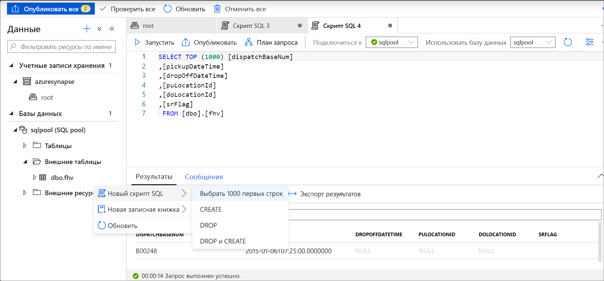

# <a name="use-external-tables-with-synapse-sql"></a>Использование внешних таблиц в Synapse SQL

Внешняя таблица указывает на данные, расположенные в Hadoop, большом двоичном объекте в службе хранилища Azure или Azure Data Lake Storage. Внешние таблицы используются для чтения данных из файлов или записи данных в файлы, расположенные в службе хранилища Azure. В Synapse SQL можно использовать внешние таблицы для чтения и записи данных в пул SQL или SQL по запросу (предварительная версия).

## <a name="external-tables-in-sql-pool"></a>Внешние таблицы в пуле SQL

В пуле SQL внешняя таблица используется в следующих целях.

- Запрос по данным в хранилище BLOB-объектов Azure и Azure Data Lake Storage 2-го поколения с использованием инструкций Transact-SQL.
- Импорт данных из хранилища BLOB-объектов Azure и Azure Data Lake Storage с сохранением в пул SQL.

При использовании в сочетании с инструкцией [CREATE TABLE AS SELECT](../sql-data-warehouse/sql-data-warehouse-develop-ctas.md?toc=/azure/synapse-analytics/toc.json&bc=/azure/synapse-analytics/breadcrumb/toc.json) выбранные из внешней таблицы данные импортируются в таблицу в пуле SQL. Внешние таблицы можно использовать для загрузки данных в дополнение к [инструкции COPY](/sql/t-sql/statements/copy-into-transact-sql?toc=/azure/synapse-analytics/toc.json&bc=/azure/synapse-analytics/breadcrumb/toc.json&view=azure-sqldw-latest). Учебник по загрузке данных см. в статье [Загрузка данных из хранилища BLOB-объектов Azure в хранилище данных SQL Azure с помощью PolyBase](../sql-data-warehouse/load-data-from-azure-blob-storage-using-polybase.md?toc=/azure/synapse-analytics/toc.json&bc=/azure/synapse-analytics/breadcrumb/toc.json).

## <a name="external-tables-in-sql-on-demand-preview"></a>Внешние таблицы в SQL по запросу (предварительная версия)

В SQL по запросу внешняя таблица используется в следующих целях.

- Запрос по данным в хранилище BLOB-объектов Azure и Azure Data Lake Storage с использованием инструкций Transact-SQL.
- Сохранение результатов запросов, выполняемых в SQL по запросу, в файлах в хранилище BLOB-объектов Azure или Azure Data Lake Storage с помощью [CETAS](develop-tables-cetas.md).

Вы можете создать внешние таблицы в SQL по запросу, выполнив следующие действия:

1. CREATE EXTERNAL DATA SOURCE
2. CREATE EXTERNAL FILE FORMAT
3. CREATE EXTERNAL TABLE

## <a name="create-external-data-source"></a>CREATE EXTERNAL DATA SOURCE

Внешние источники данных используются для подключения к учетным записям хранения. Полная документация приводится [здесь](/sql/t-sql/statements/create-external-data-source-transact-sql?toc=/azure/synapse-analytics/toc.json&bc=/azure/synapse-analytics/breadcrumb/toc.json&view=azure-sqldw-latest).

## <a name="syntax-for-create-external-data-source"></a>Синтаксис инструкции CREATE EXTERNAL DATA SOURCE

```syntaxsql
CREATE EXTERNAL DATA SOURCE <data_source_name>
WITH
(    LOCATION         = '<prefix>://<path>' )
[;]
```

## <a name="arguments-for-create-external-data-source"></a>Аргументы инструкции CREATE EXTERNAL DATA SOURCE

data_source_name задает определенное пользователем имя для источника данных. В базе данных это имя должно быть уникальным.

LOCATION = `'<prefix>://<path>'` предоставляет протокол и путь подключения к внешнему источнику данных. Этот путь может включать контейнер в формате `'<prefix>://<path>/container'` и папку в формате `'<prefix>://<path>/container/folder'`.

| Внешний источник данных        | Префикс расположения | Путь к расположению                                         |
| --------------------------- | --------------- | ----------------------------------------------------- |
| хранилище BLOB-объектов Azure          | `wasb[s]`       | `<container>@<storage_account>.blob.core.windows.net` |
| Azure Data Lake Store Gen 1 | `adl`           | `<storage_account>.azuredatalake.net`                 |
| Azure Data Lake Store Gen 2 | `abfs[s]`       | `<container>@<storage_account>.dfs.core.windows.net`  |

## <a name="example-for-create-external-data-source"></a>Пример инструкции CREATE EXTERNAL DATA SOURCE

Следующий пример создает внешний источник данных для Azure Data Lake 2-го поколения, который указывает на набор данных New York:

```sql
CREATE EXTERNAL DATA SOURCE AzureDataLakeStore
WITH
  -- Please note the abfss endpoint when your account has secure transfer enabled
  ( LOCATION = 'abfss://newyorktaxidataset.azuredatalakestore.net' ,
    CREDENTIAL = ADLS_credential ,
    TYPE = HADOOP
  ) ;
```

## <a name="create-external-file-format"></a>CREATE EXTERNAL FILE FORMAT

Создает объект формата внешнего файла, в котором определяются внешние данные, сохраненные в хранилище BLOB-объектов Azure или Azure Data Lake Storage. Создание формата внешнего файла — обязательное условие для создания внешней таблицы. Полная документация приводится [здесь](/sql/t-sql/statements/create-external-file-format-transact-sql?toc=/azure/synapse-analytics/toc.json&bc=/azure/synapse-analytics/breadcrumb/toc.json&view=azure-sqldw-latest).

Создавая формат внешнего файла, вы указываете фактическую структуру данных, на которые ссылается внешняя таблица.

## <a name="syntax-for-create-external-file-format"></a>Синтаксис инструкции CREATE EXTERNAL FILE FORMAT

```syntaxsql
-- Create an external file format for PARQUET files.  
CREATE EXTERNAL FILE FORMAT file_format_name  
WITH (  
    FORMAT_TYPE = PARQUET  
    [ , DATA_COMPRESSION = {  
        'org.apache.hadoop.io.compress.SnappyCodec'  
      | 'org.apache.hadoop.io.compress.GzipCodec'      }  
    ]);  

--Create an external file format for DELIMITED TEXT files
CREATE EXTERNAL FILE FORMAT file_format_name  
WITH (  
    FORMAT_TYPE = DELIMITEDTEXT  
    [ , FORMAT_OPTIONS ( <format_options> [ ,...n  ] ) ]  
    );  

<format_options> ::=  
{  
    FIELD_TERMINATOR = field_terminator  
    | STRING_DELIMITER = string_delimiter
    | First_Row = integer
    | USE_TYPE_DEFAULT = { TRUE | FALSE }
    | Encoding = {'UTF8' | 'UTF16'}
}
```

## <a name="arguments-for-create-external-file-format"></a>Аргументы инструкции CREATE EXTERNAL FILE FORMAT

file_format_name задает имя формата внешнего файла.

FORMAT_TYPE = [ PARQUET | DELIMITEDTEXT] задает формат внешних данных.

- PARQUET задает формат Parquet.
- DELIMITEDTEXT задает формат текста с разделителями столбцов (которые также называются признаками конца поля).

FIELD_TERMINATOR = *field_terminator* применяется только для текстовых файлов с разделителями. Признак конца поля задает один или несколько символов, отмечающих окончание каждого поля (столбца) в файле с разделителями текста. По умолчанию используется вертикальная черта ("|").

Примеры:

- FIELD_TERMINATOR = '|'
- FIELD_TERMINATOR = ' '
- FIELD_TERMINATOR = ꞌ\tꞌ

STRING_DELIMITER = *string_delimiter* задает признак конца поля для данных строкового типа в текстовом файле с разделителями. Разделитель строк имеет длину один или несколько символов и заключен в одинарные кавычки. По умолчанию используется пустая строка ("").

Примеры:

- STRING_DELIMITER = '"'
- STRING_DELIMITER = '*'
- STRING_DELIMITER = ꞌ,ꞌ

FIRST_ROW = *First_row_int* указывает номер строки, которая считывается первой во всех файлах. Если задано значение 2, при загрузке данных в каждом файле пропускается первая строка (строка заголовка). Строки пропускаются по признакам конца строк (/r/n, /r, /n).

USE_TYPE_DEFAULT = { TRUE | **FALSE** } указывает способ обработки отсутствующих значений в текстовых файлах с разделителями, когда извлекаются данные из текстового файла.

TRUE обозначает, что при извлечении данных из текстового файла каждое отсутствующее значение заменяется значением по умолчанию для типа данных, указанном в определении внешней таблицы для соответствующего столбца. Например, замените отсутствующее значение следующим:

- 0, если столбец определен как числовой. Столбцы decimal не поддерживаются, а их наличие вызовет ошибку.
- Пустая строка (""), если столбец является строковым.
- 1900-01-01, если столбец является столбцом дат.

FALSE означает, что все отсутствующие значения сохраняются как NULL. Любые значения NULL, сохраненные с использованием слова NULL в текстовом файле с разделителями, импортируются в качестве строки NULL.

Encoding = {'UTF8' | 'UTF16'} — SQL по запросу умеет читать текстовые файлы с разделителями в кодировке UTF8 или UTF16.

DATA_COMPRESSION = *data_compression_method* задает метод сжатия данных для внешних данных. При чтении из внешних таблиц этот параметр игнорируется. Он используется только при записи во внешние таблицы инструкцией [CETAS](develop-tables-cetas.md).

Тип файлового формата PARQUET поддерживает следующие методы сжатия:

- DATA_COMPRESSION = 'org.apache.hadoop.io.compress.GzipCodec'
- DATA_COMPRESSION = 'org.apache.hadoop.io.compress.SnappyCodec'

## <a name="example-for-create-external-file-format"></a>Пример инструкции CREATE EXTERNAL FILE FORMAT

В следующем примере создается формат внешнего файла для данных о переписи населения:

```sql
CREATE EXTERNAL FILE FORMAT census_file_format
WITH
(  
    FORMAT_TYPE = PARQUET,
    DATA_COMPRESSION = 'org.apache.hadoop.io.compress.SnappyCodec'
)
```

## <a name="create-external-table"></a>CREATE EXTERNAL TABLE

Инструкция CREATE EXTERNAL TABLE создает в Synapse SQL внешнюю таблицу для доступа к данным в хранилище BLOB-объектов Azure или Azure Data Lake Storage. 

## <a name="syntax-for-create-external-table"></a>Синтаксис инструкции CREATE EXTERNAL TABLE

```syntaxsql
CREATE EXTERNAL TABLE { database_name.schema_name.table_name | schema_name.table_name | table_name }
    ( <column_definition> [ ,...n ] )  
    WITH (
        LOCATION = 'folder_or_filepath',  
        DATA_SOURCE = external_data_source_name,  
        FILE_FORMAT = external_file_format_name
    )  
[;]  

<column_definition> ::=
column_name <data_type>
    [ COLLATE collation_name ]
```

## <a name="arguments-create-external-table"></a>Аргументы инструкции CREATE EXTERNAL TABLE

*{ database_name.schema_name.table_name | schema_name.table_name | table_name }*

Имя создаваемой таблицы, состоящее из одной, двух или трех частей. Для внешней таблицы SQL по запросу хранит только метаданные таблицы. Никакие данные не перемещаются и не хранятся в SQL по запросу.

<column_definition>, ...*n* ]

CREATE EXTERNAL TABLE поддерживает возможность настроить имя столбца, тип данных, допустимость значений NULL и параметры сортировки. Параметр DEFAULT CONSTRAINT нельзя использовать с внешними таблицами.

>[!IMPORTANT]
>Определения столбцов, включая типы данных и количество столбцов, должны соответствовать данным во внешних файлах. В случае несоответствия при запросе данных строки файла будут отклонены.

При чтении из файлов Parquet можно указать только нужные столбцы, чтобы пропустить все остальные.

LOCATION = *путь_к_папке_или_файлу*

Указывает путь к папке или файлу и имя файла для фактических данных в хранилище больших двоичных объектов Azure. Расположение начинается с корневой папки. Корневая папка — это расположение данных, указанное во внешнем источнике данных.

Если указан параметр LOCATION для папки, SQL по запросу будет выбирать данные из внешней таблицы и получать файлы из указанной папки.

> [!NOTE]
> В отличие от Hadoop и Polybase, SQL по запросу не возвращает вложенные папки. Она возвращает файлы, имена которых начинаются с символов подчеркивания (_) или точки (.).

В нашем примере, если указано LOCATION='/webdata/', запрос SQL по запросу вернет строки из файлов mydata.txt и _hidden.txt. Файлы mydata2.txt и mydata3.txt не возвращаются, так как они находятся во вложенной папке.


DATA_SOURCE = *имя_внешнего_источника_данных*. Задает имя внешнего источника данных, который содержит расположение внешних данных. Для создания внешнего источника данных используйте инструкцию [CREATE EXTERNAL DATA SOURCE](#create-external-data-source).

FILE_FORMAT = *имя_формата_внешнего_файла*. Задает имя объекта формата внешнего файла, который хранит тип файла и метод сжатия внешних данных. Чтобы создать формат внешнего файла, используйте [CREATE EXTERNAL FILE FORMAT](#create-external-file-format).

## <a name="permissions-create-external-table"></a>Разрешения для CREATE EXTERNAL TABLE

Для выбора данных из внешней таблицы нужны учетные данные с разрешениями на чтение и получение списка.

## <a name="example-create-external-table"></a>Пример инструкции CREATE EXTERNAL TABLE

В следующем примере создается внешняя таблица. Далее возвращается ее первая строка.

```sql
CREATE EXTERNAL TABLE census_external_table
(
    decennialTime varchar(20),
    stateName varchar(100),
    countyName varchar(100),
    population int,
    race varchar(50),
    sex    varchar(10),
    minAge int,
    maxAge int
)  
WITH (
    LOCATION = '/parquet/',
    DATA_SOURCE = population_ds,  
    FILE_FORMAT = census_file_format
)
GO

SELECT TOP 1 * FROM census_external_table
```

## <a name="create-and-query-external-tables-from-a-file-in-azure-data-lake"></a>Создание внешних таблиц из файла в Azure Data Lake и запросы по ним

Используя возможности просмотра Data Lake, вы можете создавать внешнюю таблицу и выполнять запросы к ней через пул SQL или SQL по запросу, просто щелкнув файл правой кнопкой мыши.

## <a name="prerequisites"></a>Предварительные требования

- В системе доступа ARM у вас должен быть доступ к рабочей области по меньшей мере с ролью участника данных BLOB-объектов хранилища для учетной записи ADLS 2-го поколения.

- Вам нужны по меньшей мере [права на создание](/sql/t-sql/statements/create-external-table-transact-sql?toc=/azure/synapse-analytics/toc.json&bc=/azure/synapse-analytics/breadcrumb/toc.json&view=azure-sqldw-latest#permissions-2) внешних таблиц и на выполнение запросов в пуле SQL или SQL по запросу.

- Связанная служба, настроенная для учетной записи ADLS 2-го поколения, **должна иметь доступ к нужному файлу**. Например, если для связанной службы используется механизм проверки подлинности "Управляемое удостоверение", управляемое удостоверение рабочей области должно иметь по меньшей мере роль читателя для BLOB-объектов хранилища в учетной записи хранения.

На панели "Данные" выберите файл, из которого нужно создать внешнюю таблицу.
> [!div class="mx-imgBorder"]
>

Откроется диалоговое окно. Выберите пул SQL или SQL по запросу, присвойте таблице имя и щелкните Open Script (Открыть скрипт).

> [!div class="mx-imgBorder"]
>

Автоматически создается скрипт SQL на основании схемы, определенной по файлу.
> [!div class="mx-imgBorder"]
>

Выполните скрипт. Этот скрипт автоматически выполняет инструкцию SELECT Top 100 *.
> [!div class="mx-imgBorder"]
>

Теперь создается внешняя таблица для последующего изучения ее содержимого, для которого пользователь может выполнять запросы непосредственно на панели данных.
> [!div class="mx-imgBorder"]
>

## <a name="next-steps"></a>Дальнейшие действия

В статье [про CETAS](develop-tables-cetas.md) описано, как сохранить результаты запроса во внешней таблице в службе хранилища Azure. Вы также можете изучить запросы по [таблицам Spark](develop-storage-files-spark-tables.md).
