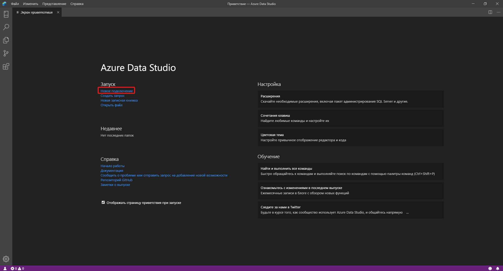
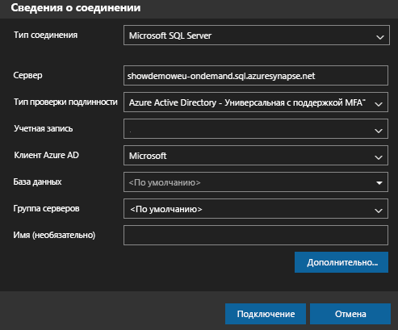
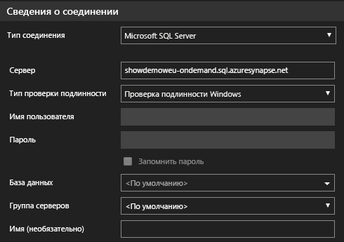
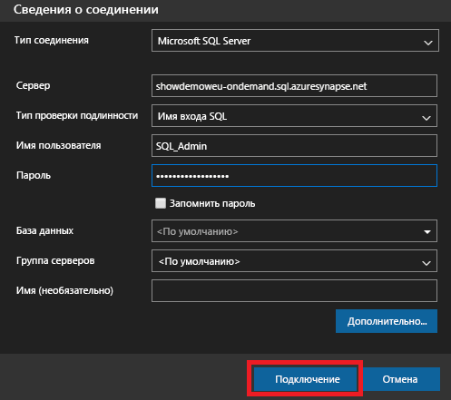
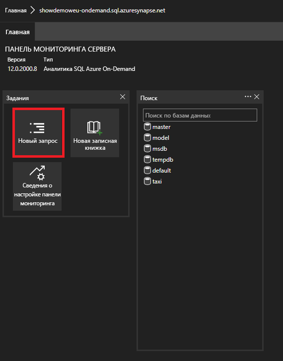

# <a name="connect-to-synapse-sql-with-azure-data-studio"></a>Подключение к Synapse SQL с помощью Azure Data Studio

> [!div class="op_single_selector"]
>
> * [Azure Data Studio](get-started-azure-data-studio.md)
> * [Power BI](get-started-power-bi-professional.md)
> * [Visual Studio](../sql-data-warehouse/sql-data-warehouse-query-visual-studio.md?toc=/azure/synapse-analytics/toc.json&bc=/azure/synapse-analytics/breadcrumb/toc.json)
> * [sqlcmd](get-started-connect-sqlcmd.md)
> * [SSMS](get-started-ssms.md)

Вы можете использовать [Azure Data Studio](/sql/azure-data-studio/download-azure-data-studio?toc=/azure/synapse-analytics/toc.json&bc=/azure/synapse-analytics/breadcrumb/toc.json&view=azure-sqldw-latest&preserve-view=true) в Azure Synapse Analytics для подключения и отправки запросов к Synapse SQL. 

## <a name="connect"></a>Подключение

Чтобы подключиться к Synapse SQL, откройте Azure Data Studio и выберите **Новое подключение**.



Выберите **Microsoft SQL Server** в качестве **типа подключения**.

Для подключения требуются следующие параметры.

* **Сервер:** сервер в формате `<Azure Synapse workspace name>`-ondemand.sql.azuresynapse.net
* **База данных:** Имя базы данных

> [!NOTE]
> Если вы хотите использовать **бессерверный пул SQL**, URL-адрес должен выглядеть следующим образом:
>
> - `<Azure Synapse workspace name>`-ondemand.sql.azuresynapse.net.
>
> Если же вы хотите использовать **выделенный пул SQL**, URL-адрес должен выглядеть так:
>
> - `<Azure Synapse workspace name>`.sql.azuresynapse.net

Выберите в качестве **типа проверки подлинности** **Проверка подлинности Windows**, **Azure Active Directory** или **Имя входа SQL**.

Чтобы использовать **Имя входа SQL** в качестве типа проверки подлинности, добавьте параметры имени пользователя или пароля:

* **Пользователь**: пользователь сервера в формате `<User>`
* **Пароль:** пароль, связанный с пользователем

Чтобы использовать Azure Active Directory, следует выбрать необходимый тип проверки подлинности.



На следующем снимке экрана показаны **сведения о подключении** для **проверки подлинности Windows**:



На следующем снимке экрана показаны **сведения о подключении** с использованием **имени для входа SQL**:



После успешного входа вы увидите следующую информационную панель: 

## <a name="query"></a>Запрос

После подключения Synapse SQL можно запросить с помощью поддерживаемых для экземпляра инструкций [Transact-SQL (T-SQL)](/sql/t-sql/language-reference?toc=/azure/synapse-analytics/toc.json&bc=/azure/synapse-analytics/breadcrumb/toc.json&view=azure-sqldw-latest&preserve-view=true). Чтобы начать работу, выберите в представлении панели мониторинга **Новый запрос**.



Например, чтобы создать [запрос для файлов Parquet](query-parquet-files.md) с помощью бессерверного пула SQL можно использовать следующую инструкцию Transact-SQL:

```sql
SELECT COUNT(*)
FROM  
OPENROWSET(
    BULK 'https://azureopendatastorage.blob.core.windows.net/censusdatacontainer/release/us_population_county/year=20*/*.parquet',
    FORMAT='PARQUET'
)
```
## <a name="next-steps"></a>Дальнейшие действия 
Узнайте о других способах подключения к Synapse SQL: 

- [SSMS](get-started-ssms.md)
- [Power BI](get-started-power-bi-professional.md)
- [Visual Studio](../sql-data-warehouse/sql-data-warehouse-query-visual-studio.md?toc=/azure/synapse-analytics/toc.json&bc=/azure/synapse-analytics/breadcrumb/toc.json)
- [sqlcmd](get-started-connect-sqlcmd.md)

Дополнительные сведения см. в руководстве [Использование Azure Data Studio для подключения и запроса данных с помощью выделенного пула SQL в Azure Synapse Analytics](/sql/azure-data-studio/quickstart-sql-dw).
