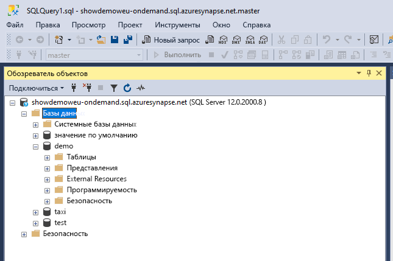
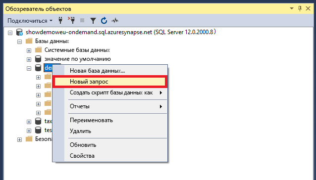
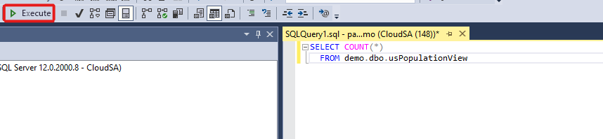
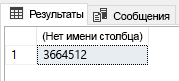

# <a name="connect-to-synapse-sql-with-sql-server-management-studio-ssms"></a>Подключение к Synapse SQL с помощью SQL Server Management Studio (SSMS).
> [!div class="op_single_selector"]
> * [Azure Data Studio](get-started-azure-data-studio.md)
> * [Power BI](get-started-power-bi-professional.md)
> * [Visual Studio](../sql-data-warehouse/sql-data-warehouse-query-visual-studio.md?toc=/azure/synapse-analytics/toc.json&bc=/azure/synapse-analytics/breadcrumb/toc.json)
> * [sqlcmd](../sql/get-started-connect-sqlcmd.md)
> * [SSMS](get-started-ssms.md)
> 
> 

Вы можете использовать [SQL Server Management Studio (SSMS)](/sql/ssms/download-sql-server-management-studio-ssms) для подключения и создания запроса Synapse SQL в Azure Synapse Analytics с помощью ресурсов бессерверного пула SQL (предварительная версия) или выделенного пула SQL. 

### <a name="supported-tools-for-serverless-sql-pool-preview"></a>Поддерживаемые средства для бессерверного пула SQL (предварительная версия)

[Azure Data Studio](/sql/azure-data-studio/download-azure-data-studio) полностью поддерживается, начиная с версии 1.18.0. SSMS частично поддерживается, начиная с версии 18.5, и используется только для подключения и выполнения запросов.

> [!NOTE]
> Если для имени входа AAD открыто подключение в течение более 1 часа во время выполнения запроса, все запросы, зависящие от AAD, завершатся ошибкой. Сюда входят запросы к хранилищу с помощью сквозной аутентификации AAD и инструкций, которые взаимодействуют с AAD (например, CREATE EXTERNAL PROVIDER). Это влияет на все средства, которые поддерживают подключение открытым, например редактор запросов в SSMS и ADS. Средства, которые открывают новое подключение для выполнения запроса, например Synapse Studio, не затрагиваются.
> Чтобы устранить эту ошибку, можно перезапустить SSMS или выполнить подключение и отключение в ADS. .
## <a name="prerequisites"></a>Предварительные требования

Прежде чем приступить к работе, убедитесь, что у вас есть следующие необходимые компоненты.  

* [SQL Server Management Studio (SSMS).](/sql/ssms/download-sql-server-management-studio-ssms) 
* Для выделенного пула SQL требуется существующее хранилище данных. Сведения о его создании см. в статье [Создание выделенного пула SQL](../quickstart-create-sql-pool-portal.md). Если вы хотите использовать бессерверный пул, он уже был подготовлен и именован в вашей рабочей области во время создания. 
* Полное имя сервера SQL Server. Чтобы найти это имя, см. статью [Подключение к Synapse SQL](connect-overview.md).

## <a name="connect"></a>Подключение

### <a name="dedicated-sql-pool"></a>Выделенный пул SQL

Чтобы подключиться к Synapse SQL с помощью выделенного пула SQL, выполните следующие действия: 

1. Откройте SQL Server Management Studio (SSMS). 
1. В диалоговом окне **Подключение к серверу** заполните поля и выберите **Подключить**. 
  
    
   
   * **Имя сервера** : Введите найденное **имя сервера** .
   * **Аутентификация**.  Выберите тип проверки подлинности, например **Проверка подлинности SQL Server** или **Встроенная проверка подлинности Active Directory**.
   * **Имя пользователя** и **пароль**. Если вы выбрали проверку подлинности SQL Server, введите имя пользователя и пароль.

1. Разверните Azure SQL Server в **обозревателе объектов**. Вы можете просмотреть базы данных, связанные с сервером, такие как пример базы данных AdventureWorksDW. Базу данных можно развернуть, чтобы просмотреть таблицы:
   
    


### <a name="serverless-sql-pool-preview"></a>Бессерверный пул SQL (предварительная версия)

Чтобы подключиться к Synapse SQL с помощью бессерверного пула SQL, выполните следующие действия: 

1. Откройте SQL Server Management Studio (SSMS).
1. В диалоговом окне **Подключение к серверу** заполните поля и выберите **Подключить**. 
   
    
   
   * **Имя сервера** : Введите найденное **имя сервера** .
   * **Аутентификация**. Выберите тип проверки подлинности, например **Проверка подлинности SQL Server** или **Встроенная проверка подлинности Active Directory** :
   * **Имя пользователя** и **пароль**. Если вы выбрали проверку подлинности SQL Server, введите имя пользователя и пароль.
   * Выберите **Подключиться**.

4. Чтобы исследовать данные, разверните сервер Azure SQL Server. Вы можете просмотреть базы данных, связанные с сервером. Разверните *демоверсию* , чтобы просмотреть содержимое образца базы данных.
   
    


## <a name="run-a-sample-query"></a>Запуск пробного запроса

### <a name="dedicated-sql-pool"></a>Выделенный пул SQL

Теперь, когда подключение к базе данных установлено, можно выполнить запрос данных.

1. Щелкните правой кнопкой мыши базу данных в обозревателе объектов SQL Server.
2. Выберите **Создать запрос**. Откроется новое окно запроса.
   
    
3. Скопируйте следующий запрос T-SQL в окно запроса.
   
    ```sql
    SELECT COUNT(*) FROM dbo.FactInternetSales;
    ```
4. Выполните запрос, выбрав `Execute`, или используйте следующий ярлык: `F5`.
   
    
5. Просмотрите результаты запроса. В следующем примере таблица FactInternetSales содержит 60 398 строк.
   
    

### <a name="serverless-sql-pool"></a>Бессерверный пул SQL

Теперь, когда вы установили подключение к базе данных, можно выполнить запрос данных.

1. Щелкните правой кнопкой мыши базу данных в обозревателе объектов SQL Server.
2. Выберите **Создать запрос**. Откроется новое окно запроса.
   
    
3. Скопируйте следующий запрос T-SQL в окно запроса.
   
    ```sql
    SELECT COUNT(*) FROM demo.dbo.usPopulationView
    ```
4. Выполните запрос, выбрав `Execute`, или используйте следующий ярлык: `F5`.
   
    
5. Просмотрите результаты запроса. В этом примере представление usPopulationView содержит 3664512 строк.
   
    

## <a name="next-steps"></a>Дальнейшие действия
Теперь, когда вы можете подключаться к базе данных и отправлять запросы, попробуйте [визуализировать данные с помощью Power BI](get-started-power-bi-professional.md).

Сведения о том, как настроить проверку подлинности Azure Active Directory в своей среде, см. в статье [Проверка подлинности в Azure Synapse Analytics](../sql-data-warehouse/sql-data-warehouse-authentication.md?toc=/azure/synapse-analytics/toc.json&bc=/azure/synapse-analytics/breadcrumb/toc.json).

