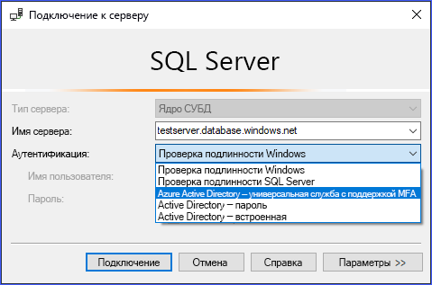
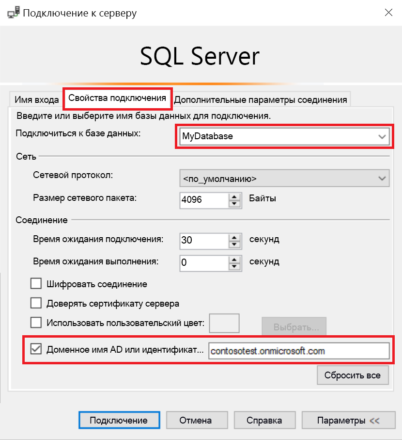
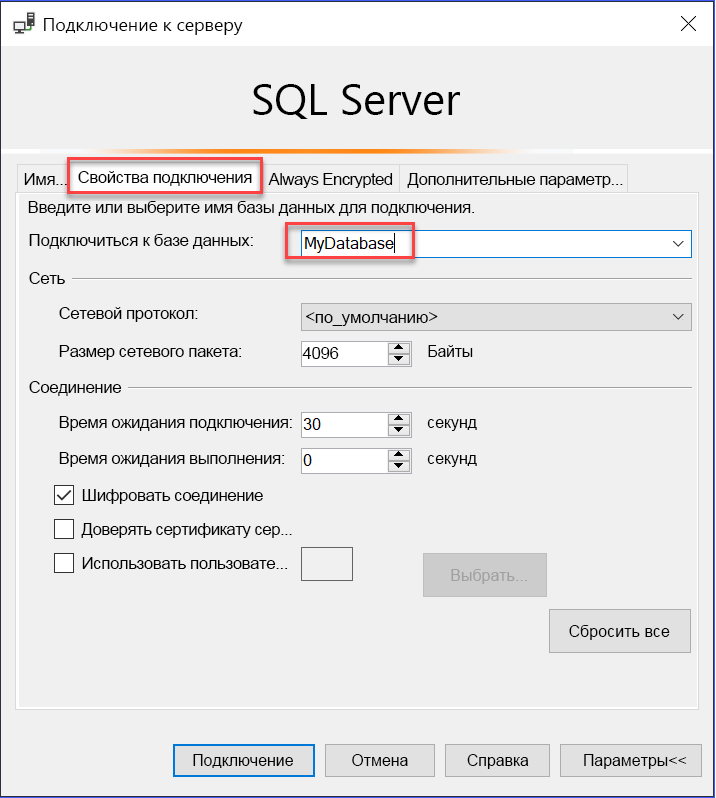

# Использование многофакторной проверки подлинности AAD с Synapse SQL (поддержка SSMS для MFA)

Synapse SQL поддерживает подключения из SQL Server Management Studio (SSMS) при использовании *универсальной проверки подлинности Active Directory*. 

В этой статье обсуждаются отличия между различными вариантами проверки подлинности, а также ограничения, связанные с использованием универсальной проверки подлинности. 

**Скачивание последней версии SSMS.** Скачайте последнюю версию SSMS на клиентский компьютер, воспользовавшись страницей [Скачивание SQL Server Management Studio (SSMS)](https://msdn.microsoft.com/library/mt238290.aspx). 

**Скачивание последней версии SSMS.** Скачайте последнюю версию SSMS на клиентский компьютер, воспользовавшись страницей [Скачивание SQL Server Management Studio (SSMS)](/sql/ssms/download-sql-server-management-studio-ssms?toc=/azure/synapse-analytics/toc.json&bc=/azure/synapse-analytics/breadcrumb/toc.json&view=azure-sqldw-latest).

Для всех функций, описанных в этой статье, используйте по крайней мере версию 17.2 за июль 2017 года.  Диалоговое окно "Последнее подключение" должно выглядеть следующим образом:

  

## Пять параметров аутентификации  

Универсальная проверка подлинности Active Directory поддерживает два неинтерактивных метода:
    - `Active Directory - Password` аутентификация
    - `Active Directory - Integrated` аутентификация

Существуют две неинтерактивные модели проверки подлинности, которые можно использовать во многообразных приложениях (ADO.NET, JDCB, ODC). При использовании этих двух методов никогда не отображаются всплывающие диалоговые окна:

- `Active Directory - Password`
- `Active Directory - Integrated`

Интерактивный метод также поддерживает многофакторную проверку подлинности Azure (MFA).

- `Active Directory - Universal with MFA`

Azure MFA помогает защитить доступ к данным и приложениям, а также удовлетворить потребность пользователей в простом процессе входа. Она обеспечивает надежную аутентификацию с использованием ряда простых вариантов подтверждения: телефонного звонка, текстового сообщения, смарт-карты с ПИН-кодом или уведомления в мобильном приложении. Пользователи сами выбирают предпочтительный способ подтверждения. Интерактивная MFA с использованием Azure AD может привести к появлению всплывающего диалогового окна для реализации проверки.

Общие сведения о Многофакторной идентификации см. в [этой статье](../../active-directory/authentication//concept-mfa-howitworks.md?toc=/azure/synapse-analytics/toc.json&bc=/azure/synapse-analytics/breadcrumb/toc.json).

### Параметр доменного имени или идентификатора клиента Azure AD

Начиная с [SSMS версии 17](/sql/ssms/download-sql-server-management-studio-ssms?toc=/azure/synapse-analytics/toc.json&bc=/azure/synapse-analytics/breadcrumb/toc.json&view=azure-sqldw-latest), пользователи, импортируемые в текущий каталог Active Directory из других каталогов Azure Active Directory в качестве гостевых пользователей, могут при подключении указывать доменное имя или идентификатор клиента Azure AD. 

К гостевым пользователям относятся пользователи, приглашенные из других каталогов Azure AD, учетные записи Майкрософт, такие как outlook.com, hotmail.com и live.com, или другие учетные записи, например, gmail.com. Эта информация позволяет службе **универсальной аутентификации Active Directory с MFA** определить правильный центр аутентификации. Этот параметр также является обязательным для поддержки учетных записей Майкрософт (MSA), таких как outlook.com, hotmail.com или live.com, и сторонних учетных записей. 

Все пользователи, которые хотят выполнить аутентификацию с помощью универсальной проверки подлинности, должны ввести свое доменное имя или идентификатор клиента Azure AD. Этот параметр представляет собой текущее значение доменного имени или идентификатора клиента Azure AD, с которым связан сервер Azure. 

Например, если сервер Azure связан с доменом Azure AD `contosotest.onmicrosoft.com`, где пользователь `joe@contosodev.onmicrosoft.com` размещен в качестве импортированного пользователя из домена Azure AD `contosodev.onmicrosoft.com`, то доменное имя, необходимое для аутентификации этого пользователя, — `contosotest.onmicrosoft.com`. 

Если пользователь является собственным пользователем Azure AD, связанным с сервером Azure, а не пользователем с учетной записью MSA, то доменное имя или идентификатор клиента не требуются. 

Чтобы ввести параметр (начиная с SSMS версии 17.2), заполните поля в диалоговом окне **Подключение к базе данных**, выбрав аутентификацию **Active Directory — универсальная с поддержкой MFA**, нажмите кнопку **Параметры**, заполните поле **Имя пользователя**, а затем щелкните вкладку **Свойства соединения**. 

Установите флажок **Доменное имя AD или идентификатор клиента** и укажите центр аутентификации, введя доменное имя (**contosotest.onmicrosoft.com**) или GUID идентификатора клиента.  

   

Если вы используете SSMS 18.x или более поздней версии, для гостевых пользователей больше не требуется имя домена AD или идентификатор клиента, поскольку 18.x или более поздние версии распознает их автоматически.

   

### Поддержка Azure AD B2B   
Пользователи Azure AD, поддерживаемые в качестве гостевых пользователей в сценариях Azure AD B2B (см. раздел [Что такое служба совместной работы Azure AD B2B](../../active-directory/b2b/what-is-b2b.md?toc=/azure/synapse-analytics/toc.json&bc=/azure/synapse-analytics/breadcrumb/toc.json)), могут подключиться к Synapse SQL только в составе группы, созданной в текущем каталоге Azure AD и вручную сопоставленной в заданной базе данных с помощью инструкции `CREATE USER` Transact-SQL. 

Например, если пользователь `steve@gmail.com` приглашен в Azure AD `contosotest` (с доменом Azure AD `contosotest.onmicrosoft.com`), то в каталоге Azure AD, который содержит участника `steve@gmail.com`, нужно создать группу Azure AD, например `usergroup`. Затем эту группу для конкретной базы данных (т. е. MyDatabase) должен создать администратор SQL Azure AD или владелец базы данных Azure AD, выполнив инструкцию `CREATE USER [usergroup] FROM EXTERNAL PROVIDER` Transact-SQL. 

После создания пользователя базы данных пользователь `steve@gmail.com` сможет войти в `MyDatabase` с помощью параметра аутентификации SSMS `Active Directory – Universal with MFA support`. 

Группа пользователей по умолчанию имеет только разрешение на подключение, и дополнительные возможности доступа к данным потребуется предоставить обычным способом. 

Обратите внимание на то, что пользователь `steve@gmail.com` как гость должен установить флажок и добавить доменное имя AD `contosotest.onmicrosoft.com` в диалоговом окне **Свойства соединения** SSMS. Параметр **Доменное имя AD или идентификатор клиента** поддерживается только для параметра Universal with MFA connection (Универсальная с подключением MFA), в противном случае он неактивен.

## Ограничения универсальной проверки подлинности для Synapse SQL

- SSMS и SqlPackage.exe — единственные инструменты, в настоящее время поддерживающее MFA с помощью универсальной аутентификации Active Directory.
- SSMS версии 17.2 поддерживает одновременный доступ нескольких пользователей с помощью универсальной аутентификации с MFA. В версиях 17.0 и 17.1 только одна учетная запись Azure Active Directory может войти в экземпляр SSMS с использованием универсальной аутентификации. Чтобы войти с другой учетной записью Azure AD, необходимо использовать другой экземпляр SSMS. (Это ограничение относится только к универсальной аутентификации Active Directory. Вы можете войти на разные серверы, используя проверку пароля Active Directory, встроенную аутентификацию Active Directory или аутентификацию SQL Server).
- SSMS поддерживает универсальную аутентификацию Active Directory для отображения обозревателя объектов, редактора запросов и хранилища запросов.
- SSMS версии 17.2 поддерживает мастер DacFx для экспорта, извлечения и развертывания данных базы данных. После того, как пользователь пройдет универсальную аутентификацию в диалоговом окне начальной аутентификации, мастер DacFx функционирует так же, как и для всех других методов аутентификации.
- Конструктор таблиц SSMS не поддерживает универсальную аутентификацию.
- Для универсальной аутентификации Active Directory не требуется дополнительное программное обеспечение, за исключением того, что необходимо использовать поддерживаемую версию SSMS.  
- Версия библиотеки аутентификации Active Directory (ADAL) для универсальной аутентификации была обновлена до последней выпущенной версии ADAL.dll — 3.13.9. Ознакомьтесь с [библиотекой аутентификации Active Directory версии 3.14.1](https://www.nuget.org/packages/Microsoft.IdentityModel.Clients.ActiveDirectory/).  

## Дальнейшие действия
Дополнительные сведения см. в статье [Подключение к Synapse SQL с помощью SQL Server Management Studio](get-started-ssms.md). 

