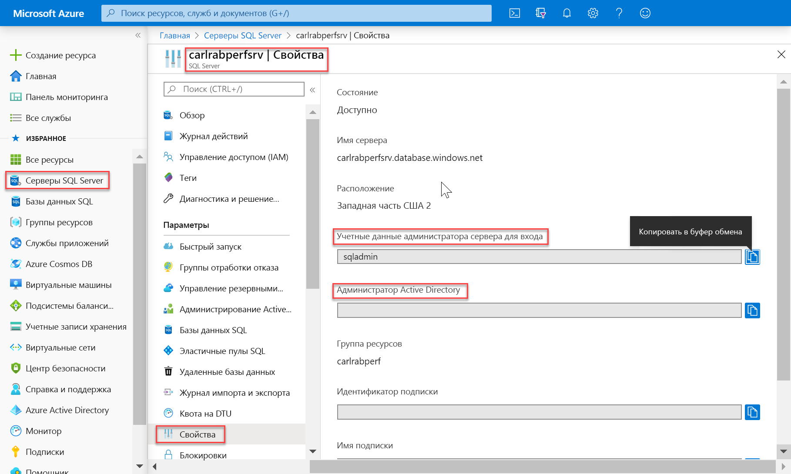
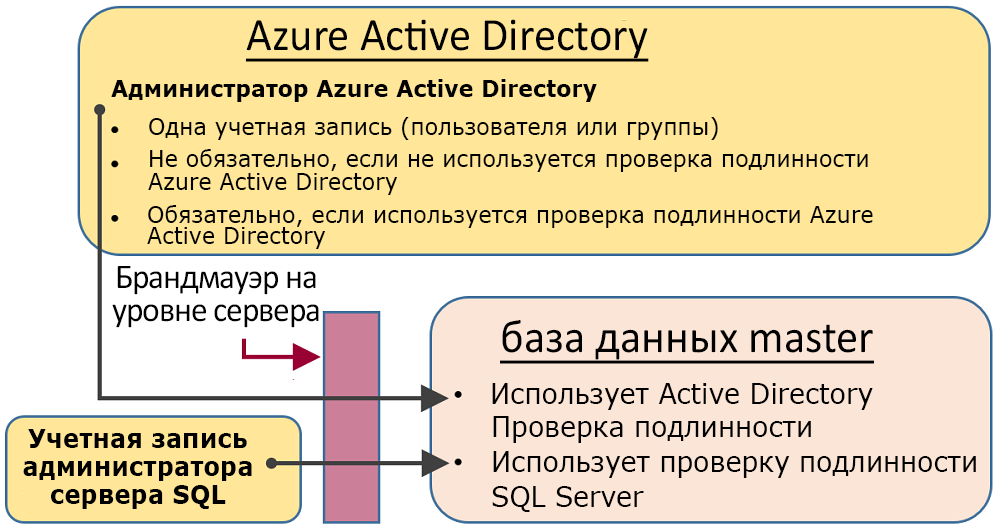
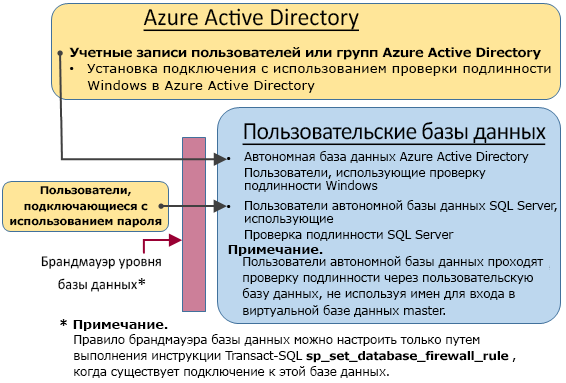

# <a name="sql-authentication"></a>Проверка подлинности SQL

Azure Synapse Analytics имеет два форм-фактора SQL, которые позволяют управлять потреблением ресурсов. В этой статье объясняется, как два форм-фактора контролируют проверку подлинности пользователя.

Для авторизации в Synapse SQL можно использовать два типа авторизации:

- Авторизация Azure Active Directory
- Авторизация SQL

Авторизация AAD зависит от Azure Active Directory и позволяет иметь единое место для управления пользователями. Авторизация SQL позволяет устаревшим приложениям использовать Synapse SQL привычным образом.

## <a name="administrative-accounts"></a>Учетные записи администрирования

В качестве администратора выступают две учетные записи (**администратор сервера** и **администратор Active Directory**). Чтобы определить эти учетные записи администратора для сервера SQL, откройте портал Azure и перейдите на вкладку свойств Synapse SQL.



- **Администратор сервера**

  При создании Azure Synapse Analytics необходимо присвоить имя для **входа администратора сервера**. SQL Server создает эту учетную запись в качестве имени для входа в базе данных master. Эта учетная запись подключается с использованием проверки подлинности SQL Server (с предоставлением имени пользователя и пароля). Может существовать только одна такая учетная запись.

- **Администратор Azure Active Directory**

  Одной отдельной учетной записи или учетной записи группы безопасности Azure Active Directory также можно предоставить права администратора. В целом проводить настройку администратора Azure AD необязательно, но если вы хотите использовать учетные записи Azure AD для подключения к Synapse SQL, администратор Azure AD **обязательно** должен быть настроен.

Учетные записи **администратора сервера** и **администратора Azure AD** имеют следующие характеристики:

- Это единственные учетные записи, которые могут автоматически подключаться к любой базе данных SQL на сервере. (Для подключения к пользовательской базе данных другие учетные записи должны иметь права владельца базы данных или в пользовательской базе данных должна находиться пользовательская учетная запись.)
- Эти учетные записи входят в пользовательские базы данных в качестве пользователя `dbo`. Они обладают всеми разрешениями в пользовательских базах данных. (Владелец пользовательской базы данных также входит в базу данных в качестве пользователя `dbo`.)
- Они не входят в базу данных `master` в качестве пользователя `dbo`. Для них назначены ограниченные разрешения в базе данных master.
- **Не** являются членами предопределенной роли `sysadmin` стандартного сервера SQL Server, недоступной в Базе данных SQL.  
- Могут создавать, изменять и удалять базы данных, имена для входа, пользователей в базе данных master и правила брандмауэра для IP-адресов на уровне сервера.
- Могут добавлять и удалять членов в ролях `dbmanager` и `loginmanager`.
- Могут просматривать системную таблицу `sys.sql_logins`.

## <a name="sql-on-demand-preview"></a>[SQL по запросу (предварительная версия)](#tab/serverless)

Для управления пользователями, имеющими доступ к SQL по запросу, можно использовать приведенные ниже инструкции.

Чтобы создать имя входа для SQL по запросу, используйте следующий синтаксис:

```sql
CREATE LOGIN Mary WITH PASSWORD = '<strong_password>';
-- or
CREATE LOGIN Mary@domainname.net FROM EXTERNAL PROVIDER;
```
Когда имя входа уже существует, можно создать пользователей в отдельных базах данных в конечной точке SQL по запросу и предоставить этим пользователям необходимые разрешения. Чтобы создать пользователя, можно использовать следующий синтаксис.
```sql
CREATE USER Mary FROM LOGIN Mary;
-- or
CREATE USER Mary FROM LOGIN Mary@domainname.net;
-- or
CREATE USER [mike@contoso.com] FROM EXTERNAL PROVIDER;
```

После создания имени входа и пользователя можно использовать стандартный синтаксис SQL Server для предоставления прав.

## <a name="sql-pool"></a>[Пул SQL](#tab/provisioned)

### <a name="administrator-access-path"></a>Путь доступа администратора

При правильной настройке брандмауэра на уровне сервера **администратор SQL Server** и **администратор Azure Active Directory** смогут подключаться с помощью таких клиентских средств, как SQL Server Management Studio или SQL Server Data Tools. Все функции и возможности доступны только в последних версиях средств. 

На схеме ниже показана типичная конфигурация для двух учетных записей администраторов.
 


При использовании открытого порта брандмауэра серверного уровня администраторы могут подключаться к любой базе данных SQL.

### <a name="database-creators"></a>Создатели баз данных.

Одной из этих административных ролей является роль **dbmanager**. Участники этой роли могут создавать базы данных. Чтобы использовать эту роль, создайте пользователя в базе данных `master`, а затем добавьте его к роли базы данных **dbmanager**. 

Создавать базу данных могут лица, использующие учетные данные SQL Server в базе данных `master`, или пользователи автономной базы данных, на основе пользователя Azure Active Directory.

1. Используя учетную запись администратора, подключитесь к базе данных `master`.
2. Создайте имя для входа при проверке подлинности SQL Server с помощью инструкции [CREATE LOGIN](/sql/t-sql/statements/create-login-transact-sql?toc=/azure/synapse-analytics/toc.json&bc=/azure/synapse-analytics/breadcrumb/toc.json&view=azure-sqldw-latest). Пример инструкции:

   ```sql
   CREATE LOGIN Mary WITH PASSWORD = '<strong_password>';
   ```

   > [!NOTE]
   > Создавая имя для входа или пользователя автономной базы данных, используйте надежный пароль. Дополнительные сведения см. в разделе [Strong Passwords](/sql/relational-databases/security/strong-passwords?toc=/azure/synapse-analytics/toc.json&bc=/azure/synapse-analytics/breadcrumb/toc.json&view=azure-sqldw-latest).

   Для повышения производительности имена для входа (субъекты уровня сервера) временно кэшируются на уровне базы данных. Сведения об обновлении кэша проверки подлинности см. в статье [DBCC FLUSHAUTHCACHE (Transact-SQL)](/sql/t-sql/database-console-commands/dbcc-flushauthcache-transact-sql?toc=/azure/synapse-analytics/toc.json&bc=/azure/synapse-analytics/breadcrumb/toc.json&view=azure-sqldw-latest).

3. Создайте пользователя баз данных с помощью инструкции [CREATE USER](/sql/t-sql/statements/create-user-transact-sql?toc=/azure/synapse-analytics/toc.json&bc=/azure/synapse-analytics/breadcrumb/toc.json&view=azure-sqldw-latest). Пользователь может быть пользователем автономной базы данных проверки подлинности Azure Active Directory (если вы настроили среду для проверки подлинности Azure AD), пользователем автономной базы данных проверки подлинности SQL Server или пользователем проверки подлинности SQL Server с именем входа проверки подлинности SQL Server (созданным на предыдущем шаге). Примеры инструкций:

   ```sql
   CREATE USER [mike@contoso.com] FROM EXTERNAL PROVIDER; -- To create a user with Azure Active Directory
   CREATE USER Ann WITH PASSWORD = '<strong_password>'; -- To create a SQL Database contained database user
   CREATE USER Mary FROM LOGIN Mary;  -- To create a SQL Server user based on a SQL Server authentication login
   ```

4. Добавьте нового пользователя в роль базы данных **DBManager** в `master` с помощью процедуры [sp_addrolemember](https://docs.microsoft.com/sql/relational-databases/system-stored-procedures/sp-addrolemember-transact-sql?view=azure-sqldw-latest). Обратите внимание, что инструкция [ALTER ROLE](/sql/t-sql/statements/alter-role-transact-sql?toc=/azure/synapse-analytics/toc.json&bc=/azure/synapse-analytics/breadcrumb/toc.json&view=azure-sqldw-latest) не поддерживается в подготовленной среде SQL. Примеры инструкций:

   ```sql
   EXEC sp_addrolemember 'dbmanager', 'Mary'; 
   EXEC sp_addrolemember 'dbmanager', 'mike@contoso.com]'; 
   ```

   > [!NOTE]
   > Так как dbmanager — это роль базы данных в базе данных master, вы можете назначить роль dbmanager только пользователю базы данных. Невозможно добавить имя входа серверного уровня в роль уровня базы данных.

5. При необходимости настройте правило брандмауэра на уровне сервера, чтобы разрешить подключение новому пользователю. (К новому пользователю может применяться существующее правило брандмауэра.)

Теперь пользователь может подключаться к базе данных `master` и создавать базы данных. Учетная запись, создавшая базу данных, становится владельцем базы данных.

### <a name="login-managers"></a>Диспетчеры входа

Другая административная роль — это роль диспетчера входов. Участники этой роли могут создавать учетные записи в базе данных master. При желании можно выполнить те же действия (создание имени для входа и пользователя и назначение ему роли **loginmanager**), чтобы разрешить пользователю создавать имена для входа в базу данных master. Обычно имена для входа не требуются, так как корпорация Майкрософт рекомендует использовать пользователей автономной базы данных, проверка подлинности которых выполняется на уровне базы данных, а не пользователей с именами для входа. Дополнительные сведения см. в разделе [Пользователи автономной базы данных — создание переносимой базы данных](/sql/relational-databases/security/contained-database-users-making-your-database-portable?toc=/azure/synapse-analytics/toc.json&bc=/azure/synapse-analytics/breadcrumb/toc.json&view=azure-sqldw-latest).

---

## <a name="non-administrator-users"></a>Пользователи без прав администратора

Как правило, для учетных записей без прав администратора не требуется доступ к базе данных master. Создайте пользователей автономной базы данных на уровне базы данных с помощью инструкции [CREATE USER (Transact-SQL)](https://msdn.microsoft.com/library/ms173463.aspx). 

Пользователь может быть пользователем автономной базы данных проверки подлинности Azure Active Directory (если вы настроили среду для проверки подлинности Azure AD), пользователем автономной базы данных проверки подлинности SQL Server или пользователем проверки подлинности SQL Server с именем входа проверки подлинности SQL Server (созданным на предыдущем шаге).  

Чтобы создать пользователей, подключитесь к базе данных и выполните инструкции, аналогичные приведенным ниже.

```sql
CREATE USER Mary FROM LOGIN Mary;
CREATE USER [mike@contoso.com] FROM EXTERNAL PROVIDER;
```

Изначально создавать пользователей может только один администратор или владелец базы данных. Чтобы разрешить другим пользователям создавать пользователей, предоставьте выбранному пользователю разрешение `ALTER ANY USER` с помощью следующей инструкции.

```sql
GRANT ALTER ANY USER TO Mary;
```

Чтобы предоставить другим пользователям полный доступ к базе данных, сделайте их участником фиксированной роли базы данных **db_owner**.

В Базе данных SQL Azure или бессерверной среде Synapse используйте инструкцию `ALTER ROLE`.

```sql
ALTER ROLE db_owner ADD MEMBER Mary;
```

В пуле SQL используйте [EXEC sp_addrolemember](/sql/relational-databases/system-stored-procedures/sp-addrolemember-transact-sql?toc=/azure/synapse-analytics/toc.json&bc=/azure/synapse-analytics/breadcrumb/toc.json&view=azure-sqldw-latest).

```sql
EXEC sp_addrolemember 'db_owner', 'Mary';
```

> [!NOTE]
> Предоставить пользователям доступ к нескольким базам данных — это одна из распространенных причин, по которой нужно создать пользователя базы данных на основе имени входа на сервер. Так как пользователи автономной базы данных являются отдельными сущностями, в каждой базе данных поддерживается отдельный пользователь с собственным паролем. Это может вызвать дополнительные сложности, поскольку пользователь должен запомнить отдельный пароль для каждой базы данных, а смена паролей при большом количестве баз данных станет нестерпимо тягостной. Но если использовать имена входа SQL Server и высокий уровень доступности (активной георепликации и групп отработки отказа), эти имена входа потребуется задать вручную на каждом сервере. В противном случае после отработки отказа пользователь базы данных не будет сопоставляться с именем входа на сервере и не сможет получить доступ к базе данных. 

Дополнительные сведения о настройке имен входа для георепликации см. в статье [Настройка безопасности базы данных SQL Azure и управление ею для геовосстановления или отработки отказа](../../azure-sql/database/active-geo-replication-security-configure.md?toc=/azure/synapse-analytics/toc.json&bc=/azure/synapse-analytics/breadcrumb/toc.json).

### <a name="configuring-the-database-level-firewall"></a>Настройка брандмауэра на уровне базы данных

Пользователям без прав администратора рекомендуется предоставлять доступ к нужным им базам данных только через брандмауэр. Вместо авторизации их IP-адресов с помощью брандмауэра уровня сервера и предоставления им доступа ко всем базам данных используйте инструкцию [sp_set_database_firewall_rule](/sql/relational-databases/system-stored-procedures/sp-set-database-firewall-rule-azure-sql-database?toc=/azure/synapse-analytics/toc.json&bc=/azure/synapse-analytics/breadcrumb/toc.json&view=azure-sqldw-latest), чтобы настроить брандмауэр уровня базы данных. С помощью портала нельзя настроить брандмауэр уровня базы данных.

### <a name="non-administrator-access-path"></a>Путь доступа пользователя без прав администратора

При правильной настройке брандмауэра уровня базы данных пользователи базы данных могут подключаться к базе данных с помощью таких клиентских средств, как SQL Server Management Studio или SQL Server Data Tools. Все функции и возможности доступны только в последних версиях средств. На следующей схеме показан типичный путь доступа пользователя без прав администратора.



## <a name="groups-and-roles"></a>Группы и роли

При эффективном управлении доступом используются разрешения, назначенные группам и ролям, а не отдельным пользователям.

- При использовании проверки подлинности Azure Active Directory поместите пользователей Azure Active Directory в соответствующую группу. Создайте пользователя автономной базы данных для группы. Поместите одного или нескольких пользователей базы данных в [роль базы данных](/sql/relational-databases/security/authentication-access/database-level-roles?toc=/azure/synapse-analytics/toc.json&bc=/azure/synapse-analytics/breadcrumb/toc.json&view=azure-sqldw-latest), а затем назначьте [разрешения](/sql/relational-databases/security/permissions-database-engine?toc=/azure/synapse-analytics/toc.json&bc=/azure/synapse-analytics/breadcrumb/toc.json&view=azure-sqldw-latest) для этой роли.

- При использовании проверки подлинности SQL Server создайте пользователей автономной базы данных в базе данных. Поместите одного или нескольких пользователей базы данных в [роль базы данных](/sql/relational-databases/security/authentication-access/database-level-roles?toc=/azure/synapse-analytics/toc.json&bc=/azure/synapse-analytics/breadcrumb/toc.json&view=azure-sqldw-latest), а затем назначьте [разрешения](/sql/relational-databases/security/permissions-database-engine?toc=/azure/synapse-analytics/toc.json&bc=/azure/synapse-analytics/breadcrumb/toc.json&view=azure-sqldw-latest) для этой роли.

Роли базы данных могут быть встроенными ролями, например **db_owner**, **db_ddladmin**, **db_datawriter**, **db_datareader**, **db_denydatawriter** и **db_denydatareader**. Роль **db_owner** обычно используется для предоставления полных прав ограниченному числу пользователей. Другие фиксированные роли можно использовать для быстрого получения простых баз данных при разработке, но их не рекомендуется использовать для большинства рабочих баз данных. 

Например, фиксированная роль базы данных **db_datareader** предоставляет доступ (как правило, строго обязательный) на чтение к каждой таблице в базе данных. 

Рекомендуется использовать инструкцию [CREATE ROLE](https://msdn.microsoft.com/library/ms187936.aspx), чтобы создавать пользовательские роли базы данных, а затем внимательно предоставлять каждой роли наименьший набор разрешений, необходимый для работы. Если пользователь является участником нескольких ролей, то ему предоставлены разрешения всех этих ролей.

## <a name="permissions"></a>Разрешения

Существует более 100 разрешений, которые можно по отдельности предоставлять или отменять в базе данных SQL. Многие эти разрешения являются частью других разрешений. Например, разрешение `UPDATE` на схеме включает в себя разрешение `UPDATE` для каждой таблицы в этой схеме. Как и в большинстве систем разрешений, отмена разрешения переопределяет предоставление. 

Так как некоторые разрешения включены в другие разрешения и их достаточно много, необходимо внимательно изучить их, чтобы спроектировать соответствующую систему разрешений, которая будет надежно защищать базу данных. 

Изучите список разрешений на [этой странице](https://docs.microsoft.com/sql/relational-databases/security/permissions-database-engine) и ознакомьтесь с [графическим представлением](https://docs.microsoft.com/sql/relational-databases/security/media/database-engine-permissions.png) разрешений.

### <a name="considerations-and-restrictions"></a>Рекомендации и ограничения

При управлении учетными записями и пользователями в базе данных SQL необходимо учитывать следующее.

- Для выполнения инструкций `CREATE/ALTER/DROP DATABASE` необходимо подключение к базе данных **master**.
- Пользователя базы данных, соответствующего имени для входа **администратора сервера**, нельзя изменить или удалить.
- Языком по умолчанию для имени для входа **администратора сервера** является американский вариант английского языка.
- Только администраторы (имя для входа **администратора сервера** или администратор Azure AD) и участники роли базы данных **dbmanager** в базе данных **master** имеют право выполнять инструкции `CREATE DATABASE` и `DROP DATABASE`.
- Необходимо подключение к базе данных master для выполнения инструкций `CREATE/ALTER/DROP LOGIN` . В то же время использовать имена входа не рекомендуется. Вместо них используйте пользователей автономной базы данных.
- Для подключения к пользовательской базе данных необходимо указать имя базы данных в строке подключения.
- Только имя для входа субъекта уровня сервера и участники роли базы данных **loginmanager** в базе данных **master** имеют разрешение на выполнение инструкций `CREATE LOGIN`, `ALTER LOGIN` и `DROP LOGIN`.
- При выполнении инструкций `CREATE/ALTER/DROP LOGIN` и `CREATE/ALTER/DROP DATABASE` в приложении ADO.NET не разрешается использовать параметризованные команды. Дополнительные сведения можно найти в статье [Команды и параметры](/dotnet/framework/data/adonet/commands-and-parameters?toc=/azure/synapse-analytics/toc.json&bc=/azure/synapse-analytics/breadcrumb/toc.json).
- При выполнении инструкций `CREATE/ALTER/DROP DATABASE` и `CREATE/ALTER/DROP LOGIN` каждая из них должна быть единственной инструкцией в пакете Transact-SQL. В противном случае возникает ошибка. Например, следующая инструкция Transact-SQL проверяет существование базы данных. Если она существует, то вызывается инструкция `DROP DATABASE` для удаления базы данных. Так как инструкция `DROP DATABASE` не является единственной инструкцией в пакете, выполнение этой инструкции Transact-SQL приводит к ошибке.

  ```sql
  IF EXISTS (SELECT [name]
           FROM   [sys].[databases]
           WHERE  [name] = N'database_name')
  DROP DATABASE [database_name];
  GO
  ```
  
  Вместо этого выполните следующую инструкцию Transact-SQL:
  
  ```sql
  DROP DATABASE IF EXISTS [database_name]
  ```

- Если применяется инструкция `CREATE USER` с параметром `FOR/FROM LOGIN`, то она должна быть единственной инструкцией в пакете Transact-SQL.
- Если применяется инструкция `ALTER USER` с параметром `WITH LOGIN`, то она должна быть единственной инструкцией в пакете Transact-SQL.
- Для выполнения инструкций `CREATE/ALTER/DROP` пользователю требуется разрешение `ALTER ANY USER` для базы данных.
- Если владелец роли базы данных пытается добавить или удалить другого пользователя базы данных в роль или из роли базы данных, может произойти следующая ошибка: **Пользователь или роль "Имя" отсутствует в этой базе данных**. Эта ошибка возникает, потому что данный пользователь не является видимым для владельца. Чтобы устранить эту проблему, предоставьте владельцу роли разрешение `VIEW DEFINITION` по отношению к данному пользователю. 

## <a name="next-steps"></a>Дальнейшие действия

Дополнительные сведения см. в разделе [Пользователи автономной базы данных — создание переносимой базы данных](https://msdn.microsoft.com/library/ff929188.aspx).
 
