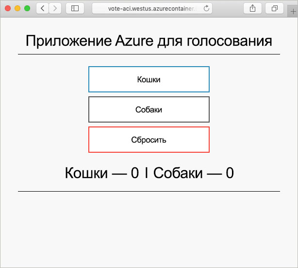

# <a name="create-a-terraform-configuration-for-azure"></a>Создание конфигурации Terraform для Azure

В этом примере вы сможете создать конфигурацию Terraform и развернуть ее в Azure. По завершении будет развернут экземпляр Azure Cosmos DB, экземпляр контейнера Azure и приложение, работающее с этими двумя ресурсами. В этом документе предполагается, что все работы выполняются в Azure Cloud Shell, в которой предварительно установлен инструментарий Terraform. Если вы хотите работать с примером в собственной системе, Terraform можно установить с помощью инструкций, приведенных [здесь](../virtual-machines/linux/terraform-install-configure.md).

## <a name="create-first-configuration"></a>Создание первой конфигурации

В этом разделе будет создана конфигурация для экземпляра Azure Cosmos DB.

Щелкните **Попробовать сейчас**, чтобы открыть Azure Cloud Shell. После открытия введите `code .`, чтобы открыть редактор кода cloud shell.

```azurecli-interactive
code .
```

Скопируйте и вставьте следующую конфигурацию Terraform.

Эта конфигурация моделирует группу ресурсов Azure, случайное целое число и экземпляр базы данных Azure Cosmos DB. Случайное целое число используется в имени экземпляра базы данных Cosmos DB. Кроме того, настраивается несколько параметров Cosmos DB. Полный список конфигураций Terraform Cosmos DB см. в [справочных материалах по Terraform Cosmos DB](https://www.terraform.io/docs/providers/azurerm/r/cosmosdb_account.html).

После завершения сохраните файл с именем `main.tf`. Эту операцию можно выполнить, щелкнув многоточие в верхней правой части редактора кода.

```azurecli-interactive
resource "azurerm_resource_group" "vote-resource-group" {
  name     = "vote-resource-group"
  location = "westus"
}

resource "random_integer" "ri" {
  min = 10000
  max = 99999
}

resource "azurerm_cosmosdb_account" "vote-cosmos-db" {
  name                = "tfex-cosmos-db-${random_integer.ri.result}"
  location            = "${azurerm_resource_group.vote-resource-group.location}"
  resource_group_name = "${azurerm_resource_group.vote-resource-group.name}"
  offer_type          = "Standard"
  kind                = "GlobalDocumentDB"

  consistency_policy {
    consistency_level       = "BoundedStaleness"
    max_interval_in_seconds = 10
    max_staleness_prefix    = 200
  }

  geo_location {
    location          = "westus"
    failover_priority = 0
  }
}
```

Команда [terraform init](https://www.terraform.io/docs/commands/init.html) инициализирует рабочий каталог. Запустите `terraform init` в терминале cloud shell, чтобы подготовиться к развертыванию новой конфигурации.

```azurecli-interactive
terraform init
```

Команду [terraform plan](https://www.terraform.io/docs/commands/plan.html) можно использовать для проверки правильности форматирования конфигурации и визуализации создаваемых, обновляемых или удаляемых ресурсов. Результаты можно сохранить в файле и использовать позже, чтобы применить в конфигурации.

Запустите `terraform plan`, чтобы проверить новую конфигурацию Terraform.

```azurecli-interactive
terraform plan --out plan.out
```

Примените конфигурацию с помощью команды [terraform apply](https://www.terraform.io/docs/commands/apply.html) и укажите имя файла плана. Эта команда развертывает ресурсы в подписке Azure.

```azurecli-interactive
terraform apply plan.out
```

После этого можно увидеть, что группа ресурсов создана и экземпляр базы данных Azure Cosmos DB помещен в группу ресурсов.

## <a name="update-configuration"></a>Обновление конфигурации

Обновите конфигурацию, чтобы включить экземпляр контейнера Azure. Контейнер запускает приложение, которое считывает и записывает данные в Cosmos DB.

Скопируйте следующую конфигурацию в конец файла `main.tf`. После завершения сохраните файл.

Установлены две переменные среды: `COSMOS_DB_ENDPOINT` и `COSMOS_DB_MASTERKEY`. Эти переменные содержат расположение и ключ для доступа к базе данных. Значения этих переменных получены из экземпляра базы данных, созданного на последнем шаге. Этот процесс известен как интерполяция. Дополнительные сведения об интерполяции Terraform см. в документации по [синтаксису интерполяции](https://www.terraform.io/docs/configuration/interpolation.html).


Конфигурация также включает в себя блок выходных данных, который возвращает полное доменное имя экземпляра контейнера.

```azurecli-interactive
resource "azurerm_container_group" "vote-aci" {
  name                = "vote-aci"
  location            = "${azurerm_resource_group.vote-resource-group.location}"
  resource_group_name = "${azurerm_resource_group.vote-resource-group.name}"
  ip_address_type     = "public"
  dns_name_label      = "vote-aci"
  os_type             = "linux"

  container {
    name   = "vote-aci"
    image  = "microsoft/azure-vote-front:cosmosdb"
    cpu    = "0.5"
    memory = "1.5"
    ports  = {
      port     = 80
      protocol = "TCP"
    }

    secure_environment_variables {
      "COSMOS_DB_ENDPOINT"  = "${azurerm_cosmosdb_account.vote-cosmos-db.endpoint}"
      "COSMOS_DB_MASTERKEY" = "${azurerm_cosmosdb_account.vote-cosmos-db.primary_master_key}"
      "TITLE"               = "Azure Voting App"
      "VOTE1VALUE"          = "Cats"
      "VOTE2VALUE"          = "Dogs"
    }
  }
}

output "dns" {
  value = "${azurerm_container_group.vote-aci.fqdn}"
}
```

Запустите `terraform plan`, чтобы создать обновленный план и визуализировать изменения. Вы должны увидеть, что в конфигурацию добавлен ресурс экземпляра контейнера Azure.

```azurecli-interactive
terraform plan --out plan.out
```

Наконец, запустите `terraform apply`, чтобы применить конфигурацию.

```azurecli-interactive
terraform apply plan.out
```

После завершения обратите внимание на полное доменное имя экземпляра контейнера.

## <a name="test-application"></a>Тестирование приложения

Выберите полное доменное имя экземпляра контейнера. Если все настроено правильно, вы увидите следующее приложение.



## <a name="clean-up-resources"></a>Очистка ресурсов

После этого ресурсы и группу ресурсов Azure можно удалить с помощью команды [terraform destroy](https://www.terraform.io/docs/commands/destroy.html).

```azurecli-interactive
terraform destroy -auto-approve
```

## <a name="next-steps"></a>Дополнительная информация

В этом примере вы создали, развернули и удалили конфигурацию Terraform. Дополнительные сведения об использовании Terraform в Azure см. в документации поставщика Terraform Azure.

> [!div class="nextstepaction"]
> [Поставщик Azure Terraform](https://www.terraform.io/docs/providers/azurerm/)
