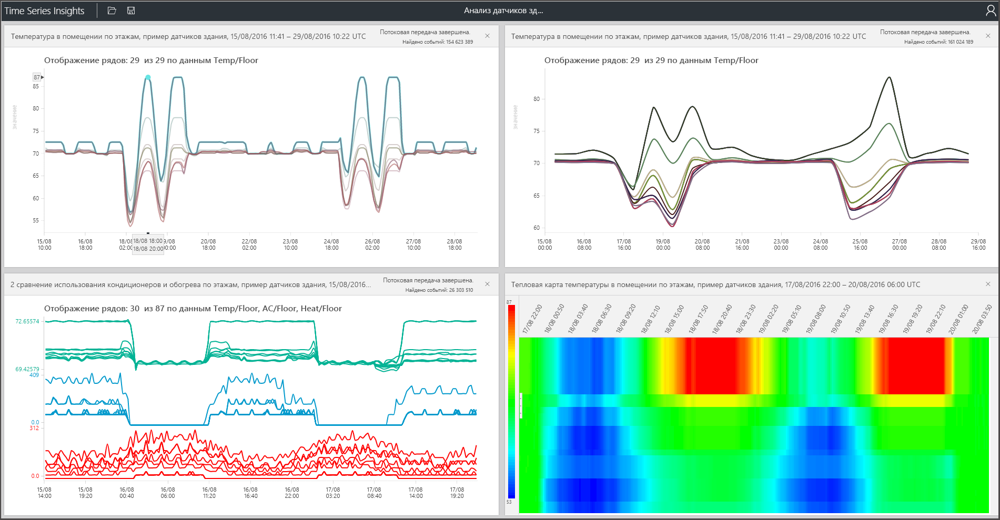

# Что собой представляет служба "Аналитика временных рядов Azure"

Аналитика временных рядов Azure позволяет сохранять, визуализировать и запрашивать большие объемы данных временных рядов, например, созданных устройствами Интернета вещей. Если вам нужно хранить, контролировать, визуализировать и запрашивать данные временных рядов в облаке, служба "Аналитика временных рядов" — идеальный вариант. 

У службы "Аналитика временных рядов" имеются четыре основные задачи.

- Она полностью интегрируется с такими облачными шлюзами, как Центр Интернета вещей и Центры событий Azure. Она легко подключается к этим источникам событий и выполняет анализ JSON из сообщений и структур, содержащих данные в чистых строках и столбцах. Эта служба соединяет метаданные с данными телеметрии и индексирует данные в хранилище данных со столбцами.
- Служба "Аналитика временных рядов" управляет хранением ваших данных. Чтобы обеспечить постоянный удобный доступ к данным, она хранит данные в памяти и на дисках SSD до 400 дней. По требованию вы можете за считанные секунды интерактивно запрашивать миллиарды событий.
- С помощью обозревателя службы "Аналитика временных рядов" предоставляются готовые визуализации. 
- Кроме того, вы можете использовать службу запросов в обозревателе Аналитики временных рядов и интерфейсах API, которые легко интегрировать, чтобы внедрить данные временных рядов в пользовательские приложения.

Если вы создаете приложение для внутреннего использования или для внешних клиентов, то можете использовать Аналитику временных рядов в качестве серверной части. Ее можно использовать для индексации, хранения и агрегирования данных временных рядов. Чтобы создать собственную визуализацию и пользовательский интерфейс, можно использовать [клиентский пакет SDK](tutorial-explore-js-client-lib.md). В службе "Аналитика временных рядов" также есть несколько [интерфейсов API запроса](how-to-shape-query-json.md) для подобных сценариев.

Данные временных рядов — это сведения об изменении состояния ресурса или процесса с течением времени. Данные временных рядов индексируется по меткам времени, и время — это самая важная ось, вдоль которой упорядочены такие данные. Обычно данные временных рядов поступают в порядке очереди, поэтому их добавление в базу данных рассматривается скорее как операция вставки, а не обновления.

Хранение, индексирование, обработка запросов, анализ и визуализация данных временных рядов в больших объемах может оказаться непростой задачей.
Аналитика временных рядов Azure записывает и сохраняет все новые события в виде строк, а также эффективно измеряет изменения с течением времени. Таким образом можно оглянуться назад и получить аналитические сведения из прошлого, чтобы спрогнозировать изменения в будущем.

## Видео

### Узнайте больше об Аналитике временных рядов Azure — облачной платформе аналитики Интернета вещей. 

## Основные сценарии

- Масштабируемое хранение данных временных рядов. 

   В основе службы "Аналитика временных рядов" лежит база данных, разработанная специально для хранения данных временных рядов. Аналитика временных рядов является масштабируемой и полностью управляемой службой, то есть берет на себя все задачи по хранению событий и управлению ими.

- Изучение данных почти в реальном времени. 

   Аналитика временных рядов предоставляет обозреватель, который визуализирует все данные, поступающие в среду этой службы. Вскоре после подключении источника событий можно просмотреть, изучить и запрашивать данные события в Аналитике временных рядов. Эти данные помогает проверить, поступают ли данные с устройства надлежащим образом, а также отслеживать работоспособность, производительность и общую эффективность ресурса Интернета вещей. 

- Анализ первопричин и обнаружение аномалий.

   Аналитика временных рядов предоставляет ряд инструментов для поиска закономерностей и перспектив, которые позволяют проводить многоэтапный анализ первопричин и сохранять его результаты. Кроме того, Аналитика временных рядов взаимодействует со службами оповещения, например Azure Stream Analytics. Это позволяет просматривать оповещения и обнаруженные аномалии в обозревателе Аналитики временных рядов почти в реальном времени. 

- Можно получить глобальное представление данных временных рядов, поступающих из различных расположений, для сравнения нескольких ресурсов или сайтов.

   Вы можете подключить к среде службы "Аналитика временных рядов" сразу несколько источников событий. Таким образом можно одновременно просмотреть данные, поступающие из нескольких различных расположений, почти в реальном времени. Пользователи могут воспользоваться преимуществами такого отображения, чтобы обмениваться данными с бизнес-лидерами. Они могут лучше взаимодействовать со специалистами в предметной области, которые могут использовать свои знания для решения задач, применения рекомендаций и обмена полученными сведениями.

- Разработка клиентского приложения на основе Аналитики временных рядов. 

   Аналитика временных рядов предоставляет интерфейсы REST API для запросов, что позволяет создавать приложения, использующие данные временных рядов.

## Возможности

- **Быстрое начало работы.** Аналитика временных рядов Azure не требует предварительной подготовки данных. Это позволяет быстро подключиться к миллионам событий в Центре Интернета вещей или концентраторе событий. После подключения вы сможете визуализировать и использовать данные датчиков, чтобы быстро проверить свои решения для Интернета вещей. Вы можете взаимодействовать с данными, не создавая код и не изучая новый язык. Аналитика временных рядов обеспечивает интерфейс изучения данных с помощью мыши, а для опытных пользователей — средство создания подробных запросов в свободной текстовой форме.

- **Аналитика практически в реальном времени.** Аналитика временных рядов обрабатывает сотни миллионов событий в день, принимая их от датчиков с задержкой в пределах минуты. Аналитика временных рядов помогает получить сведения о данных датчиков. Используя их, можно выявлять тенденции и аномалии, выполнять анализ первопричин и избегать дорогостоящих простоев. Перекрестная корреляция между данными реального времени и хронологическими данными помогает выявлять скрытые тенденции в данных.

- **Создание собственных решений.** Можно внедрить данные Аналитики временных рядов Azure в существующие приложения. Можно также создавать новые пользовательские решения, использующие интерфейсы REST API Аналитики временных рядов. Создавайте собственные представления и делитесь ими с другими пользователями, чтобы они могли изучать ваши открытия.

- **Масштабируемость.** Служба "Аналитика временных рядов" поддерживает работу в масштабе Интернета вещей. Она может принимать от 1 до 100 миллионов событий ежедневно. Период хранения по умолчанию составляет 31 день. Вы можете визуализировать и анализировать динамические потоки данных почти в реальном времени, а также хронологические данные.

## Начало работы

Чтобы приступить к работе, выполните эти действия.

1. Подготовьте к работе среду Аналитики временных рядов на портале Azure.
1. Подключите к ней источник событий, например Центр Интернета вещей или концентратор событий. 
1. Передайте эталонные данные. Это не дополнительная служба.
1. Уже через несколько минут вы увидите данные в обозревателе службы "Аналитика временных рядов".

## Обозреватель службы "Аналитика временных рядов"

На этой схеме показан пример данных временного ряда, отображаемых в обозревателе Аналитики временных рядов.

## Дополнительная информация

- Изучите общедоступную версию [бесплатной демонстрационной среды](./time-series-quickstart.md) Аналитики временных рядов Azure.
- Узнайте больше о [планировании среды Аналитики временных рядов](time-series-insights-environment-planning.md).
