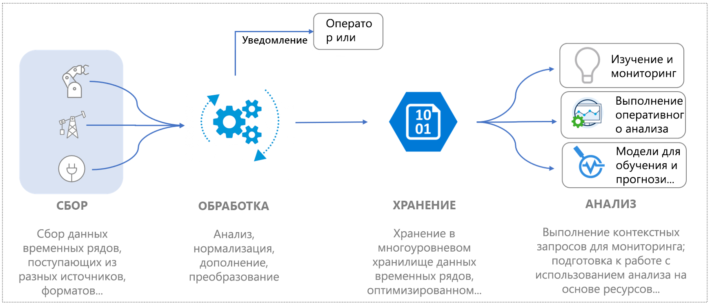
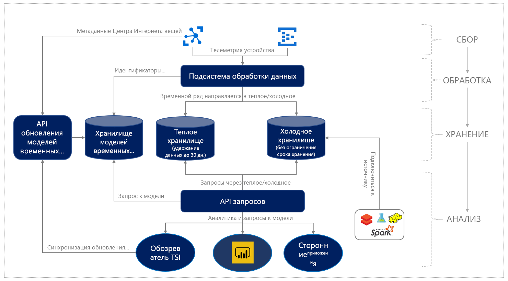

# Что собой представляет предварительная версия службы "Аналитика временных рядов Azure"?

Служба "Аналитика временных рядов Azure" (предварительная версия) — это комплексное предложение модели "платформа как услуга" (PaaS). Эту службу можно использовать для сбора, обработки, хранения, анализа и запроса данных масштаба Интернета вещей — то есть данных, которые сильно контекстуализированы и оптимизированы для временных рядов. 

Аналитика временных рядов предназначена для специализированного исследования данных и оперативного анализа. Это уникальная служба с возможностями расширения и настройки, которая соответствует требованиям промышленных развертываний Интернета вещей.

## Видео

Узнайте больше о предварительной версии Аналитики временных рядов Azure.

> [!VIDEO https://channel9.msdn.com/Shows/Internet-of-Things-Show/Azure-Time-Series-Insights-e2e-solution-for-industrial-IoT-analytics/player]

## Определение данных Интернета вещей

Промышленные данные Интернета вещей в организациях, интенсивно использующих ресурсы, часто структурно несогласованны из-за особенностей различных устройств и датчиков в промышленных средах. Для данных из этих потоков характерны значительные пробелы, а иногда — поврежденные сообщения и ложные показания. Данные Интернета вещей часто имеют смысл в контексте дополнительных входных данных, полученных из основных или сторонних источников, таких как CRM или ERP, которые добавляют контекст для комплексных рабочих процессов. Входные данные из сторонних источников данных, такие как данные о погоде, могут дополнять потоки данных телеметрии в рамках заданной среды. 

Все это подразумевает, что только часть данных используется для эксплуатации и деловой деятельности, а для анализа требуется контекстуализация. Промышленные данные часто накапливаются на протяжении более длинных временных интервалов для углубленного анализа, что позволяет понять и учесть тенденции. Превращение собранных данных Интернета вещей в практические аналитические сведения требует следующего: 

* Обработка данных для очистки, фильтрации, интерполирования, преобразования и подготовки данных к анализу.
* Структура для перехода по данным и их распознавания, то есть для нормализации и контекстуализации данных.
* Экономное хранилище для длительного или неограниченного хранения большого объема обработанных (или производных) и необработанных данных.

Такие данные обеспечивают согласованные, комплексные, актуальные и правильные сведения для бизнес-анализа и отчетности.

На следующем рисунке показан типичный поток данных Интернета вещей.

## Служба "Аналитика временных рядов Azure" для промышленного Интернета вещей

Среда Интернета вещей весьма разнообразна ввиду клиентов, охватывающих разные отраслевые сегменты, включая производство, автомобильную промышленность, энергетику, коммунальные службы, интеллектуальные здания и консалтинг. На этом обширном отраслевом рынке Интернета вещей облачные решения для комплексного анализа больших объемов данных Интернета вещей все еще продолжают развиваться. 

Аналитика временных рядов Azure удовлетворяет эту потребность на рынке, предоставляя полноценное комплексное решение для анализа данных Интернета вещей с широкими возможностями семантического моделирования для контекстуализации данных временных рядов и предоставления аналитических сведений о ресурсах. Кроме того, это решение предлагает лучший в своем классе пользовательский интерфейс для распознавания, выявления тенденций, обнаружения аномалий и оперативной аналитики. 

Благодаря мощной платформе оперативной аналитики и возможностям интерактивного исследования данных Аналитика временных рядов позволяет получать больше возможностей от данных, собранных из ресурсов Интернета вещей. Предложение предварительной версии поддерживает следующее: 

* Многоуровневая система хранения данных с поддержкой "горячей" и "холодной" аналитики позволяет клиентам переносить данные между "горячим" и "холодным" хранилищами для выполнения интерактивной аналитики на основе "горячих" данных и операционной аналитики на основе исторических данных, накопленных за десятилетия. 

    *   Высокоинтерактивное решение для "горячей" аналитики выполняет много частых запросов к данным в течение короткого временного интервала. 
    *   Масштабируемое, оптимизированное для производительности и экономное озеро данных временных рядов на основе службы хранилища Azure позволяет клиентам выявлять тенденции в данных временных рядов за несколько лет за считанные секунды. 

* Поддержка семантической модели для описания предметной области и метаданных, связанных с производными и необработанными сигналами из ресурсов и устройств.

* Гибкая платформа аналитики для хранения исторических данных временных рядов в учетной записи хранения Azure, принадлежащей клиенту, что позволяет клиентам распоряжаться своими данными Интернета вещей. Данные хранятся в формате Apache Parquet с открытым кодом, который обеспечивает подключение и взаимодействие в различных сценариях обработки данных, включая прогнозную аналитику, машинное обучение и другие специализированные вычисления, выполняемые с помощью привычных технологий, включая Spark, Databricks и Jupyter.

* Богатые возможности аналитики с помощью интерфейсов API расширенных запросов и пользовательским интерфейсом, объединяющим аналитические сведения о ресурсах и мощную специализированную аналитику с поддержкой интерполяции, скалярных и агрегатных функций, переменных категорий, точечных диаграмм и сигналов временного сдвига во временных рядах для углубленного анализа.

*   Платформа корпоративного уровня для удовлетворения потребностей в масштабировании, производительности, безопасности и надежности наших корпоративных клиентов, использующих Интернет вещей.

* Поддержка расширяемости и интеграции для комплексного анализа. Аналитика временных рядов предоставляет расширяемую платформу аналитики для различных сценариев обработки данных. Соединитель Power BI для Аналитики временных рядов позволяет клиентам добавить запросы, которые они выполняют в Аналитике временных рядов, непосредственно в Power BI, чтобы получить унифицированное представление бизнес-аналитики и аналитики временных рядов на одной панели.

Детализированный поток данных показан на схеме ниже.

  

Аналитика временных рядов Azure предоставляет масштабируемую модель с оплатой по мере использования для обработки, хранения (данных и метаданных) и запроса данных, позволяя клиентам адаптировать их использование в соответствии с потребностями компании. 
 
После добавления этих ключевых возможностей промышленного Интернета вещей Аналитика временных рядов также предоставляет ряд приведенных ниже преимуществ.  

| | |
| ---| ---|
| Многоуровневое хранение для масштабируемых данных временных рядов Интернета вещей | С помощью общего конвейера обработки данных можно принимать данные как в "горячее", так и в "холодное" хранилище. Используйте "горячее" хранилище для выполнения интерактивных запросов, а "холодное" хранилище — для хранения больших объемов данных. Чтобы узнать больше о том, как использовать преимущества высокопроизводительных запросов на основе ресурсов, ознакомьтесь с [запросами](./time-series-insights-update-tsq.md). |
| Модель временных рядов для контекстуализации необработанных данных телеметрии и получения аналитики на основе ресурсов | Модель временных рядов можно использовать для создания экземпляров, иерархий, типов и переменных для данных временных рядов. Чтобы узнать больше о модели временных рядов, ознакомьтесь с разделом [Модель временных рядов](./time-series-insights-update-tsm.md).  |
| Удобная и непрерывная интеграция с другими решениями для работы с данными | Данные в "холодном" хранилище Аналитики временных рядов [хранятся](./time-series-insights-update-storage-ingress.md) в файлах в формате Apache Parquet с открытым кодом. Это обеспечивает интеграцию данных с другими решениями для обработки данных (от основных или сторонних производителей) для реализации сценариев, которые включают в себя бизнес-аналитику, расширенное машинное обучение и прогнозную аналитику. |
| Изучение данных почти в реальном времени | [Пользовательское решение обозревателя предварительной версии службы "Аналитика временных рядов Azure"](./time-series-insights-update-explorer.md) предоставляет визуализацию для всех потоков данных через конвейер приема данных. После подключении источника событий можно просматривать, изучать и запрашивать данные события. Таким образом, вы можете проверить, отправляет ли устройство данные должным образом. Вы также можете отслеживать работоспособность, производительность и общую эффективность ресурса Интернета вещей. | 
| Расширяемость и интеграция | Интеграция соединителя Power BI для Аналитики временных рядов Azure доступна непосредственно в обозревателе временных рядов с помощью параметра **Экспорт**. С его помощью пользователи могут экспортировать запросы временных рядов, которые они создают в пользовательском интерфейсе, непосредственно в Power BI Desktop и просматривать диаграммы временных рядов вместе с другими данными бизнес-аналитики. Это открывает возможности для нового класса сценариев для промышленных предприятий Интернета вещей, которые вкладывают средства в Power BI, предоставляя им единую панель для анализа данных из различных источников, включая временные ряды Интернета вещей. | 
| Пользовательские приложения, созданные на платформе Аналитики временных рядов | Аналитика временных рядов поддерживает [пакет SDK для JavaScript](https://github.com/microsoft/tsiclient/blob/master/docs/API.md). Пакет SDK предоставляет широкие возможности элементов управления и упрощенный доступ к запросам. Используйте пакет SDK для создания пользовательских приложений Интернета вещей на основе Аналитики временных рядов в соответствии с потребностями своей компании. Вы можете напрямую использовать [программные интерфейсы API для запросов](./time-series-insights-update-tsq.md) Аналитики временных рядов для данных на диске в пользовательских приложениях Интернета вещей. |

## Дополнительная информация

Приступите к работе с предварительной версией службы "Аналитика временных рядов Azure":

> [!div class="nextstepaction"]
> [Краткое руководство](./time-series-insights-update-quickstart.md)

Ниже приведены примеры использования:

> [!div class="nextstepaction"]
> [Примеры использования предварительной версии службы "Аналитика временных рядов Azure"](./time-series-insights-update-use-cases.md)