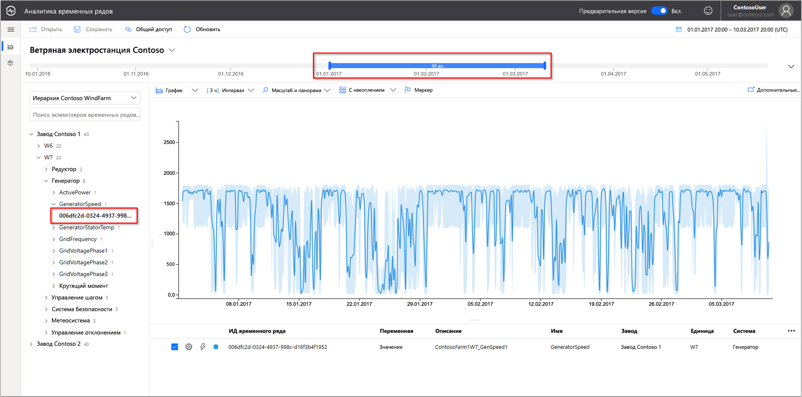
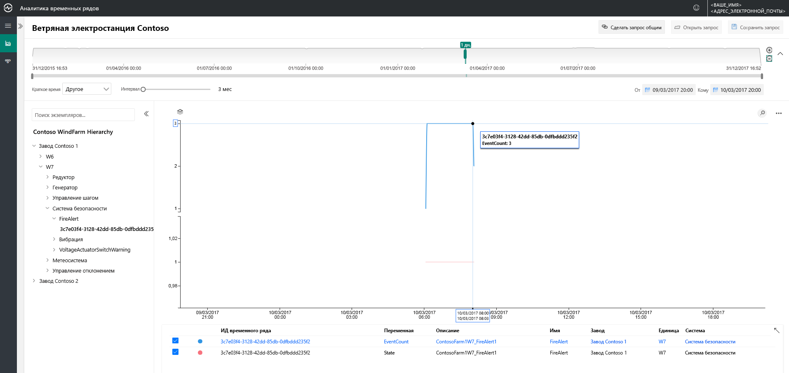
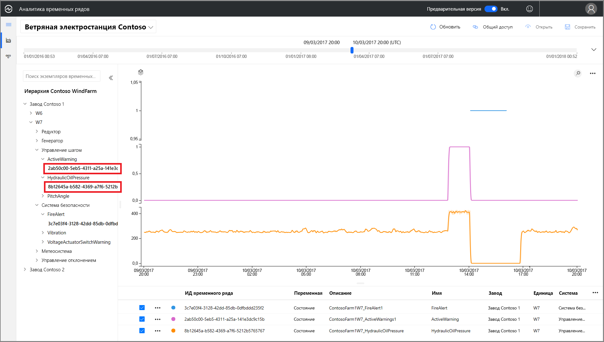
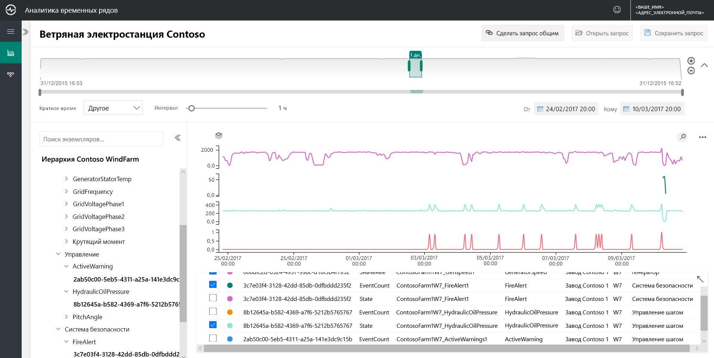
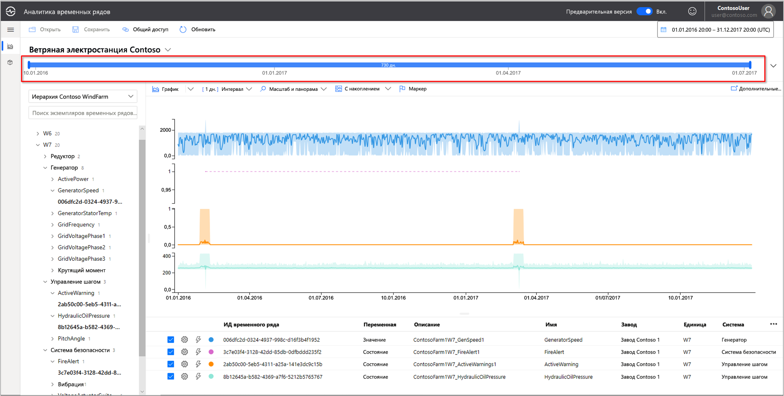
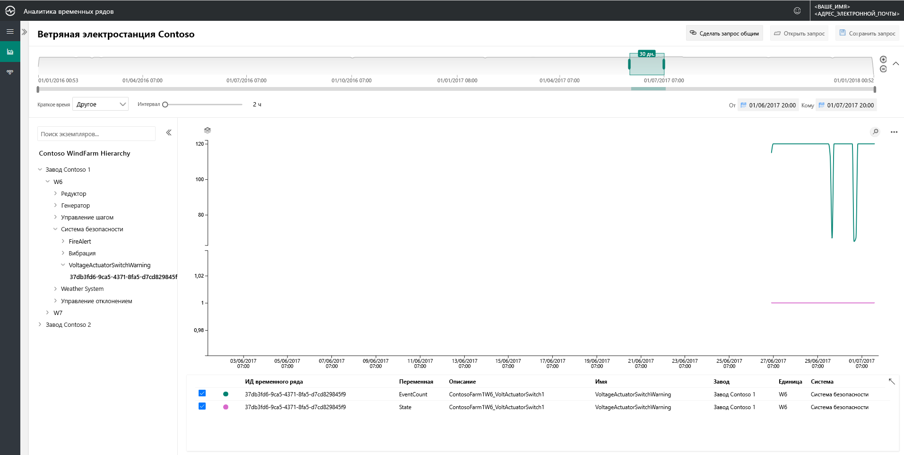
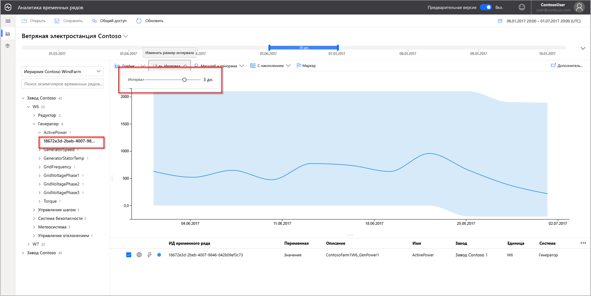
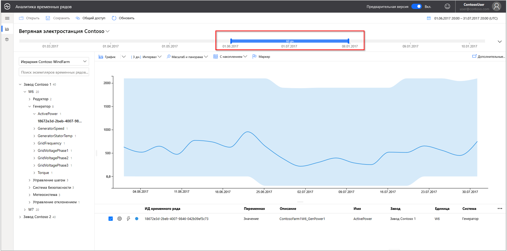
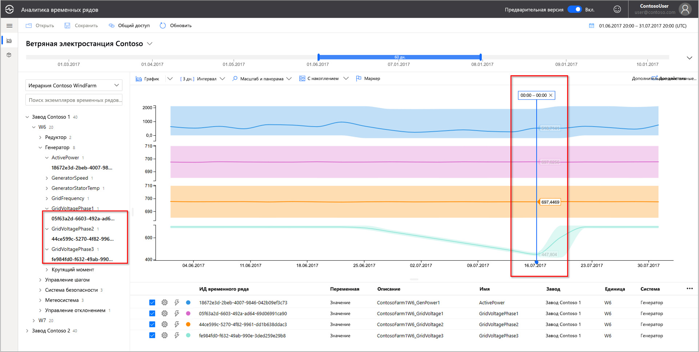
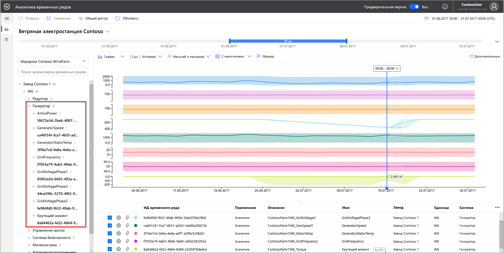

# Краткое руководство. Общие сведения о демонстрационной среде службы "Аналитика временных рядов Azure" (предварительная версия)

Это краткое руководство поможет вам приступить к работе со средой службы "Аналитика временных рядов Azure" (предварительная версия). Опробуйте бесплатную демонстрационную версию и ознакомьтесь с ключевыми функциями, которые были добавлены в службу "Аналитика временных рядов" (предварительная версия).

Демонстрационная среда службы "Аналитика временных рядов" (предварительная версия) содержит сценарий для компании Contoso, которая эксплуатирует две ветряные электростанции. На каждой электростанции используются 10 генераторов. Каждая установка содержит 20 датчиков, ежеминутно передающих данные в Центр Интернета вещей Azure. Датчики выполняют сбор данных о погодных условиях, шаге лопастей и ориентации винта. Кроме того, записываются данные о производительности генератора, состоянии редуктора и мониторах безопасности.

В этом кратком руководстве описывается, как использовать Аналитику временных рядов, чтобы находить аналитические сведения для принятия решений в данных Contoso. Кроме того, вы выполните краткий анализ первопричин, чтобы точнее прогнозировать критические сбои и осуществлять техническое обслуживание.

## Изучение обозревателя службы "Аналитика временных рядов" в демонстрационной среде

Обозреватель предварительной версии службы "Аналитика временных рядов" отображает анализ исторических данных и основных причин. Чтобы начать работу:

1. Если у вас нет учетной записи, создайте  [бесплатную учетную запись Azure](https://azure.microsoft.com/free/?ref=microsoft.com&utm_source=microsoft.com&utm_medium=docs&utm_campaign=visualstudio) .

1. Перейдите в среду  [демонстрационной версии ветроэлектростанции Contoso](https://insights.timeseries.azure.com/preview/samples).  

1. Если появится соответствующий запрос, войдите в обозреватель Аналитики временных рядов, используя данные своей учетной записи Azure.

## Работа с историческими данными

1. Рассмотрим ветрогенератор **W7** на электростанции **Contoso Plant 1**.  

   1. Выберите диапазон просмотра с **20:00 1.01.17 до 20:00 10.03.17 (UTC)** .
   1. Чтобы выбрать датчик, выберите **Contoso Plant 1** > **W7** > **Generator System** (Система генерации)  > **GeneratorSpeed** (Скорость генератора). Просмотрите значения на экране.

      

1. Недавно Contoso обнаружила пожар на ветроэлектрической установке **W7**. Мнения о причине пожара расходятся. В Аналитике временных рядов можно увидеть, что датчик оповещения о пожаре сработал во время пожара.

   1. Выберите диапазон просмотра с **20:00 9.03.17 до 20:00 10.03.17 (UTC)** .
   1. Выберите **Safety System** (Система безопасности)  > **FireAlert** (Оповещение о пожаре).

      

1. Просмотрите другие события во время пожара, чтобы понять, что именно произошло. Сразу перед пожаром резко возросли показатели давления масла и активные предупреждения.

   1. Выберите **Pitch System** (Система управления дифферентом)  > **HydraulicOilPressure** (Давление турбинного масла).
   1. Выберите **Pitch System** (Система управления дифферентом)  > **ActiveWarning** (Активное предупреждение).

      

1. Прямо перед пожаром резко возросли показатели давления масла и активные предупреждения. Разверните отображаемый временной ряд, чтобы увидеть другие признаки, свидетельствовавшие о приближающемся пожаре. Показания обоих датчиков колебались со временем. Устойчивые колебания показаний — это тревожный признак.

    * Выберите диапазон просмотра с **20:00 24.02.17 до 20:00 10.03.17 (UTC)** .

      

1. Анализ исторических данных двухлетней давности выявляет еще один пожар с такими же колебаниями датчика.

    * Выберите диапазон просмотра с **1.01.16 до 31.12.17** (все данные).

      

Благодаря Аналитике временных рядов и телеметрии датчиков мы обнаружили долгосрочную и проблемную тенденцию, скрытую в исторических данных. С помощью этих новых аналитических сведений мы можем выполнить следующее.

> [!div class="checklist"]
> * Понять, что произошло на самом деле.
> * Исправить проблему.
> * Установить более совершенные системы оповещения.

## Анализ первопричин

1. Для некоторых сценариев, чтобы раскрыть в данных более тонкие процессы, требуется более сложный анализ. Выберите ветрогенератор **W6** и дату **6/25** (25.06).

    1. Выберите диапазон просмотра с **20:00 1.06.17 до 20:00 1.07.17 (UTC)** .
    1. Выберите датчик **Contoso Plant 1** > **W6** > **Safety System** (Система безопасности)  > **VoltageActuatorSwitchWarning** (Предупреждение о переключателе напряжения).

       

1. Предупреждение означает проблему с напряжением, которое подает генератор. Общая мощность генератора находится в пределах нормальных параметров для текущего временного интервала. Увеличив интервал, можно увидеть другую закономерность: появляется четкий спад.

    1. Удалите датчик **VoltageActuatorSwitchWarning**.
    1. Выберите **Generator System** (Система генерации)  > **ActivePower** (Активная мощность).
    1. Измените значение интервала на **3d** (3 дня).

       

1. Расширяя диапазон времени, мы можем определить момент, когда проблема исчезла, или определить, что она сохранилась.

    * Расширьте интервал времени до 60 дней.

      

1. Чтобы получить более полный контекст, можно давить точки данных других датчиков. Чем больше датчиков мы видим, тем полнее наше понимание проблемы. Давайте разместим маркер, чтобы просмотреть фактические значения. 

    1. Выберите **Generator System** (Система генерации), а затем выберите три датчика: **GridVoltagePhase1** (Сеточное напряжение, фаза 1), **GridVoltagePhase2** (Сеточное напряжение, фаза 2) и **GridVoltagePhase3** (Сеточное напряжение, фаза 3).
    1. Разместите маркер на последней точке данных в видимой области.

       

    Два датчика напряжения работают примерно одинаково и в пределах нормальных параметров. Вероятно, виновником является датчик **GridVoltagePhase3**.

1. При добавлении контекстно-зависимых данных спад в фазе 3 становится еще более очевидной проблемой. Теперь мы выявили вескую причину возникновения предупреждения. И мы можем сообщить о ней группе технического обслуживания.  

    * Обновите изображение, чтобы наложить значения всех датчиков **Generator System** (Система генерации) на одну и ту же шкалу диаграммы.

      

## Дополнительная информация

Теперь вы готовы создать собственную среду службы "Аналитика временных рядов" (предварительная версия). Начните с этого:

> [!div class="nextstepaction"]
> [Планирование среды службы "Аналитика временных рядов" (предварительная версия)](time-series-insights-update-plan.md)

Знакомство с демонстрационной версией и ее компонентами.

> [!div class="nextstepaction"]
> [Обозреватель службы "Аналитика временных рядов" (предварительная версия)](time-series-insights-update-explorer.md)
