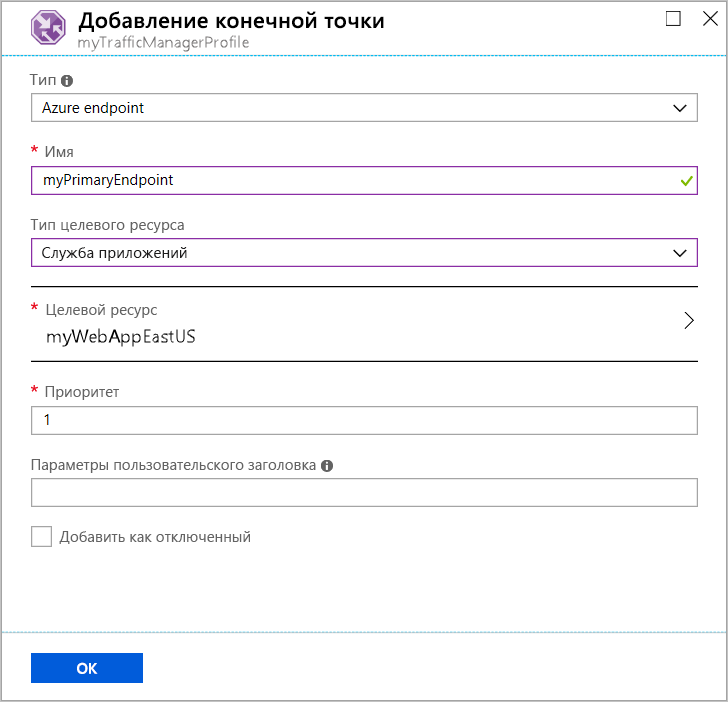
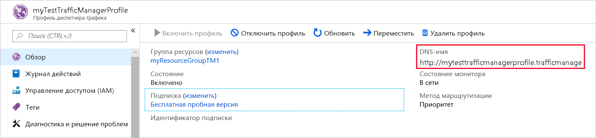
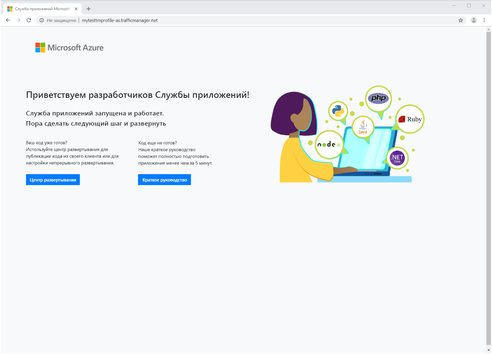

# Краткое руководство. Создание профиля диспетчера трафика с помощью портала Azure

В этом кратком руководстве показано, как создать профиль диспетчера трафика, который обеспечивает высокий уровень доступности веб-приложения.

В этом кратком руководстве вы узнаете о двух экземплярах веб-приложения. Каждый из них выполняется в разном регионе Azure. Будет создан профиль диспетчера трафика, который основывается на [приоритете конечной точки](traffic-manager-routing-methods.md#priority-traffic-routing-method). Профиль будет направлять пользовательский трафик к первичному сайту, который запускает веб-приложение. Диспетчер трафика постоянно отслеживает веб-приложение. Если основной сайт недоступен, он предоставляет автоматический переход на резервный сайт.

Если у вас еще нет подписки Azure, [создайте бесплатную учетную запись](https://azure.microsoft.com/free/?WT.mc_id=A261C142F).

## Вход в Azure

Войдите на [портале Azure](https://portal.azure.com).

## Предварительные требования

Для этого краткого руководства необходимо развернуть два экземпляра веб-приложения в разных регионах Azure (*восточная часть США* и *Западная Европа*). Каждый будет использоваться в качестве основных конечных точек и конечных точек отработки отказа для диспетчера трафика.

1. Вверху с левой стороны экрана выберите **Создать ресурс** > **Интернет** > **Веб-приложение**.

1. В разделе **Создание веб-приложения**  введите или выберите следующие значения на вкладке **Основные сведения**:

   - **Подписка** > **Группа ресурсов**. Выберите **Создать**, а затем введите **myResourceGroupTM1**.
   - **Сведения об экземпляре**  > **Имя**. Введите *myWebAppEastUS*.
   - **Сведения об экземпляре**  > **Публикация**. Выберите **Код**.
   - **Сведения об экземпляре** > **Стек времени выполнения**. Выберите **ASP.NET V4.7**.
   - **Сведения об экземпляре** > **Операционная система**. Выберите **Windows**.
   - **Сведения об экземпляре** > **Регион**.  Выберите **Восточная часть США**.
   - **План службы приложений** > **План Windows Plan (восточная часть США)** . Выберите **Создать**, а затем введите **myAppServicePlanEastUS**.
   - **План службы приложений** > **Номер SKU и размер**. Выберите **"Стандартный" S1**.
   
3. перейдите на вкладку **Мониторинг** или выберите **Далее, Мониторинг**.  На вкладке **Мониторинг** задайте параметру **Application Insights** > **Включить Application Insights** значение **Нет**.

4. Выберите **Просмотреть и создать**.

5. Проверьте значения параметров и щелкните **Создать**.  Если веб-приложение развертывается успешно, создается веб-сайт по умолчанию.

6. Повторите эти действия, чтобы создать второе веб-приложение с именем *myWebAppWestEurope* в **группе ресурсов** с именем *myResourceGroupTM2* в **регионе** *Западная Европа* с **планом службы приложений** с именем **myAppServicePlanWestEurope** и остальными параметрами как у веб-приложения *myWebAppEastUS*.

## Создание профиля диспетчера трафика

Создайте профиль диспетчера трафика, который направляет пользовательский трафик по приоритету конечной точки.

1. В верхней левой части экрана выберите **Создать ресурс** > **Сети** > **Профиль диспетчера трафика**.
2. В разделе **Создать профиль диспетчера трафика** введите или выберите следующие параметры:

    | Параметр | Значение |
    | --------| ----- |
    | ИМЯ | Для профиля диспетчера трафика введите уникальное имя.|
    | Метод маршрутизации | Выберите **Приоритет**.|
    | Subscription | Выберите подписку, к которой будет применяться профиль диспетчера трафика. |
    | группа ресурсов. | Выберите *myResourceGroupTM1*.|
    | Location |Эти параметры касаются расположения группы ресурсов. Это не влияет на профиль диспетчера трафика, который будет развернут глобально.|

3. Нажмите кнопку **Создать**.

## Добавление конечных точек диспетчера трафика

Добавьте веб-сайт в регионе *Восточная часть США* как основную конечную точку для маршрутизации всего пользовательского трафика. Добавьте веб-сайт в регионе *Западная Европа* как конечную точку отработки отказа. Если основная конечная точка недоступна, трафик автоматически направляется на конечную точку отработки отказа.

1. На панели поиска портала введите имя созданного в предыдущем разделе профиля диспетчера трафика.
2. В результатах поиска выберите профиль.
3. В колонке **Профиль диспетчера трафика** в разделе **Параметры** щелкните **Конечные точки**, а затем выберите **Добавить**.
4. Введите или выберите следующие параметры:

    | Параметр | Значение |
    | ------- | ------|
    | type | Выберите **Конечная точка Azure**. |
    | ИМЯ | Введите *myPrimaryEndpoint*. |
    | Тип целевого ресурса | Выберите **Служба приложений Azure**. |
    | Целевой ресурс | Щелкните **Выбрать службу приложений** > **Восточная часть США**. |
    | Приоритет | Выберите **1**. Если трафик находится в работоспособном состоянии, он направляется к этой конечной точке. |

    

5. Нажмите кнопку **ОК**.
6. Для создания конечной точки отработки отказа для своего второго региона Azure повторите шаги 3 и 4, используя следующие параметры:

    | Параметр | Значение |
    | ------- | ------|
    | type | Выберите **Конечная точка Azure**. |
    | ИМЯ | Введите *myFailoverEndpoint*. |
    | Тип целевого ресурса | Выберите **Служба приложений Azure**. |
    | Целевой ресурс | Щелкните **Выбрать службу приложений** > **Западная Европа**. |
    | Приоритет | Выберите **2**. Если основная конечная точка находится в неработоспособном состоянии, весь трафик направляется к конечной точке отработки отказа. |

7. Нажмите кнопку **ОК**.

После добавления двух конечных точек, они отображаются на панели **Профиль диспетчера трафика**. Обратите внимание, что теперь их состояние мониторинга — **В сети**.

## Тестирование профиля диспетчера трафика

В этом разделе произойдет проверка доменного имени профиля диспетчера трафика. Основная конечная точка должна быть недоступной. В результате вы увидите, что веб-приложение по-прежнему доступно. Причиной этого является отправление трафика к конечной точке отработки отказа диспетчером трафика.

### Проверка DNS-имени

1. На панели поиска портала выполните поиск имени **профиля диспетчера трафика**, созданного в предыдущем разделе.
2. Выберите профиль диспетчера трафика. Появится страница **Обзор**.
3. В **профиле диспетчера трафика** отображается DNS-имя только что созданного профиля диспетчера трафика.
  
   

### Просмотр диспетчера трафика в действии

1. В веб-браузере введите DNS-имя вашего профиля диспетчера трафика, чтобы просмотреть веб-сайт по умолчанию для веб-приложения.

    > [!NOTE]
    > В этом кратком сценарии все запросы направляются к основной конечной точке, которой присваивается **Приоритет 1**.

    

2. Чтобы просмотреть отработку отказа диспетчера трафика в действии, отключите ваш основной сайт.
    1. На странице профиля диспетчера трафика из раздела **Обзор** выберите **myPrimaryEndpoint**.
    2. Для *MyPrimaryEndpoint* выберите **Отключить** > **Сохранить**.
    3. Закройте **myPrimaryEndpoint**. Убедитесь, что для состояния установлено значение **Отключено**.
3. Скопируйте DNS-имя вашего профиля диспетчера трафика из предыдущего шага, чтобы просмотреть веб-сайт в новом сеансе веб-браузера.
4. Убедитесь, что веб-приложение по-прежнему доступно.

Основная конечная точка недоступна, поэтому вас направили к конечной точки отработки отказа.

## Очистка ресурсов

Выполнив все, удалите группы ресурсов, веб-приложения и все связанные ресурсы. Чтобы сделать это, отдельно выберите каждый элемент из панели мониторинга и щелкните **Удалить** в верхней части каждой страницы.

## Дополнительная информация

В этом кратком руководстве был создан профиль диспетчера трафика. Он позволяет перенаправлять трафик пользователя для веб-приложений высокого уровня доступности. Дополнительные сведения о маршрутизации трафика см. в руководствах по диспетчеру трафика.

> [!div class="nextstepaction"]
> [Руководства по диспетчеру трафика](tutorial-traffic-manager-improve-website-response.md)
