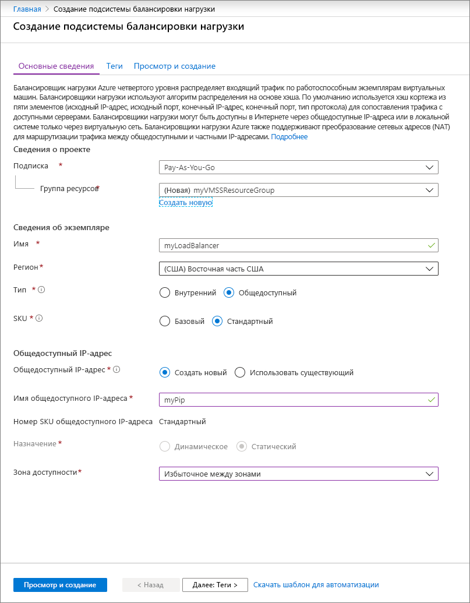

# Краткое руководство. Создание масштабируемого набора виртуальных машин на портале Azure

Масштабируемый набор виртуальных машин обеспечивает развертывание и администрирование набора идентичных автомасштабируемых виртуальных машин. Вы можете вручную изменить число виртуальных машин в масштабируемом наборе или определить правила для автоматического масштабирования в зависимости от использования ЦП, объема памяти или сетевого трафика. После этого Azure Load Balancer будет распределять трафик между экземплярам виртуальных машин в масштабируемом наборе. С помощью этого краткого руководства вы создали масштабируемый набор виртуальных машин с помощью портала Azure.

Если у вас еще нет подписки Azure, [создайте бесплатную учетную запись Azure](https://azure.microsoft.com/free/?WT.mc_id=A261C142F), прежде чем начинать работу.

## Вход в Azure
Войдите на портал Azure по адресу https://portal.azure.com.

## Создание балансировщика нагрузки

[Подсистема балансировки нагрузки](../load-balancer/load-balancer-overview.md) Azure распределяет входящий трафик между работоспособными экземплярами виртуальных машин. 

Сначала создайте Load Balancer категории "Базовый" с помощью портала. Имя и общедоступный IP-адрес, созданный вами, автоматически настроен в качестве внешнего интерфейса подсистемы балансировки нагрузки.

1. В поле поиска введите **подсистема балансировки нагрузки**. В разделе **Marketplace** в результатах поиска выберите элемент **Подсистема балансировки нагрузки**.
1. На странице **Создание подсистемы балансировки нагрузки** на вкладке **Основные сведения** введите или выберите следующую информацию:

    | Параметр                 | Значение   |
    | ---| ---|
    | Subscription  | Выберите свою подписку.    |    
    | группа ресурсов. | Выберите **Создать** и в текстовом поле введите *myVMSSResourceGroup*.|
    | ИМЯ           | *myLoadBalancer*         |
    | Регион         | Выберите **Восточная часть США**.       |
    | type          | Щелкните **Общедоступный**.       |
    | SKU           | Выберите **Стандартная**.       |
    | Общедоступный IP-адрес | Выберите **Создать**. |
    | Имя общедоступного IP-адреса  | *MyPip*   |
    | Назначение| Статическое |

1. Когда все будет готово, выберите элемент **Просмотр и создание**. 
1. После прохождения проверки щелкните **Создать**. 

## Создание масштабируемого набора виртуальных машин
Масштабируемый набор можно развернуть с помощью образа Windows Server или Linux, например RHEL, CentOS, Ubuntu или SLES.

1. В поле поиска введите **Масштабируемый набор**. В результатах в разделе **Marketplace** выберите **Масштабируемые наборы виртуальных машин**. Откроется страница **Создание масштабируемого набора виртуальных машин**. 
1. На вкладке **Основные сведения** в разделе **Сведения о проекте** убедитесь, что выбрана правильная подписка, и при необходимости щелкните **Создать** для группы ресурсов. Введите *myVMSSResourceGroup* в качестве имени и нажмите кнопку **ОК**. 
1. Введите *myScaleSet* в качестве имени для масштабируемого набора.
1. В поле **Регион** выберите ближайший регион.
1. Оставьте для параметра **Оркестратор** значение по умолчанию **ScaleSet VMs** (Виртуальные машины масштабируемого набора).
1. Выберите образ Marketplace в качестве **образа**. В этом примере мы выбрали *сервер Ubuntu 18.04 LTS*.
1. Введите нужное имя пользователя и выберите тип аутентификации.
   - **Пароль** должен содержать от 12 до 123 знаков и включать по меньшей мере три из следующих знаков: одна строчная буква, одна прописная буква, одна цифра и один специальный знак. Дополнительные сведения см. в разделе [Какие требования к имени пользователя при создании виртуальной машины?](../virtual-machines/windows/faq.md#what-are-the-username-requirements-when-creating-a-vm).
   - При выборе образа диска ОС Linux можно вместо него выбрать **открытый ключ SSH**. Только укажите свой открытый ключ, например *~/.ssh/id_rsa.pub*. Для [создания и использования ключей SSH](../virtual-machines/linux/mac-create-ssh-keys.md) можно применять Azure Cloud Shell на портале.
   
    

1. Нажимайте кнопку **Далее**, чтобы переходить на другие страницы. 
1. Оставьте значения по умолчанию для страниц **Экземпляр** и **Диски**.
1. На странице **Сеть** в разделе **Балансировка нагрузки** выберите **Да**, чтобы разместить экземпляры масштабируемых наборов в подсистеме балансировки нагрузки. 
1. В списке **Параметры балансировки нагрузки** выберите **Подсистема балансировки нагрузки Azure**.
1. Для параметра **Выберите подсистему балансировки нагрузки** выберите *myLoadBalancer*, созданную раннее.
1. В разделе **Выберите серверный пул** выберите **Создать новый**, введите *MyBackendPool*, а затем — **Создать**.
1. Когда все будет готово, нажмите кнопку **Просмотр и создание**. 
1. После прохождения проверки выберите **Создать**, чтобы развернуть масштабируемый набор.

## Очистка ресурсов
Удалите ставшие ненужными группу ресурсов, масштабируемый набор и все связанные ресурсы. Для этого выберите группу ресурсов для масштабируемого набора и щелкните **Удалить**.

## Дополнительная информация
С помощью этого краткого руководства вы создали базовый масштабируемый набор с помощью портала Azure. Чтобы получить дополнительные сведения, продолжите роботу с руководством по созданию масштабируемых наборов виртуальных машин Azure и управлению ими.

> [!div class="nextstepaction"]
> [Создание масштабируемых наборов виртуальных машин Azure и управление ими](tutorial-create-and-manage-powershell.md)
