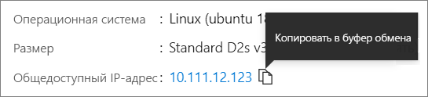

# <a name="quickstart-create-a-linux-virtual-machine-in-the-azure-portal"></a>Краткое руководство. Создание виртуальной машины Linux на портале Azure

Виртуальные машины Azure можно создать на портале Azure. Портал Azure — это браузерный пользовательский интерфейс, который позволяет создавать ресурсы Azure. В этом кратком руководстве показано, как использовать портал Azure для создания виртуальной машины Linux под управлением Ubuntu 18.04 LTS. Чтобы проверить работу виртуальной машины, вы также подключитесь к ней по протоколу SSH и установите веб-сервер NGINX.

Если у вас еще нет подписки Azure, [создайте бесплатную учетную запись](https://azure.microsoft.com/free/?WT.mc_id=A261C142F), прежде чем начинать работу.

## <a name="sign-in-to-azure"></a>Вход в Azure

Войдите на [портал Azure](https://portal.azure.com), если вы еще этого не сделали.

## <a name="create-virtual-machine"></a>Создание виртуальной машины

1. В поле поиска введите **виртуальные машины**.
1. В разделе **Службы** выберите **Виртуальные машины**.
1. На странице **Виртуальные машины** выберите **Добавить**. Откроется страница **Создание виртуальной машины**.
1. На вкладке **Основные сведения** в разделе **Сведения о проекте** убедитесь, что выбрана правильная подписка, и при необходимости щелкните **Создать** для группы ресурсов. Введите имя *myResourceGroup*. 

    

1. В разделе **Подробности об экземпляре** введите *myVM* в поле **Имя виртуальной машины**, выберите *Восточная часть США* в поле **Регион** и выберите *Ubuntu 18.04 LTS* в поле **Образ**. Оставьте другие значения по умолчанию.

    

1. В разделе **Учетная запись администратора** выберите **Открытый ключ SSH**.

1. В поле **Имя пользователя** введите *azureuser*.

1. Для параметра **Источник открытого ключа SSH** оставьте значение по умолчанию **Создать новую пару ключей**, а затем введите *myKey* в поле **Имя пары ключей**.

    

1. В разделе **Правила входящего порта** > **Общедоступные входящие порты**, щелкните **Разрешить выбранные порты**, а затем выберите **SSH (22)** и **HTTP (80)** из раскрывающегося списка. 

    

1. Оставьте остальные значения по умолчанию и нажмите кнопку **Просмотр и создание**, расположенную в нижней части страницы.

1. На странице **Создание виртуальной машины** отображаются сведения о создаваемой виртуальной машине. Когда вы будете готовы, нажмите **Создать**.

1. Когда откроется окно **Создать новую пару ключей**, выберите **Download private key and create resource** (Скачать закрытый ключ и создать ресурс). Файл ключа будет скачан в таком виде: **myKey.pem**. Убедитесь, что знаете, куда был скачан файл `.pem`. Путь к нему вам потребуется на следующем шаге.

1. Когда развертывание будет завершено, выберите **Перейти ресурсу**.

1. На странице новой виртуальной машины выберите общедоступный IP-адрес и скопируйте его в буфер обмена.


    

## <a name="connect-to-virtual-machine"></a>Подключение к виртуальной машине

Создайте SSH-подключение к виртуальной машине.

1. Если вы используете компьютер Mac или Linux, откройте командную строку Bash. Если вы используете компьютер Windows, откройте командную строку PowerShell. 

1. В командной строке установите SSH-подключение к виртуальной машине. Измените IP-адрес на IP-адрес виртуальной машины и вместо пути `.pem` укажите путь к скачанному файлу ключа.

```console
ssh -i .\Downloads\myKey1.pem azureuser@10.111.12.123
```

> [!TIP]
> Созданный вами ключ SSH можно использовать при следующем создании виртуальной машины в Azure. Только при этом выберите для параметра **Источник открытого ключа SSH** значение **Use a key stored in Azure** (Использовать ключ, сохраненный в Azure). У вас уже есть закрытый ключ на компьютере, поэтому вам не нужно ничего скачивать.

## <a name="install-web-server"></a>Установка веб-сервера

Чтобы проверить работу виртуальной машины, установите веб-сервер NGINX. Из сеанса SSH обновите источники пакетов, а затем установите последнюю версию пакета NGINX.

```bash
sudo apt-get -y update
sudo apt-get -y install nginx
```

После этого введите `exit`, чтобы выйти из сеанса SSH.


## <a name="view-the-web-server-in-action"></a>Проверка работы веб-сервера

Страницу приветствия NGINX по умолчанию можно просмотреть в любом веб-браузере. Введите общедоступный IP-адрес виртуальной машины в качестве веб-адреса. Общедоступный IP-адрес можно найти на странице общих сведений о виртуальной машине. Также он является частью строки подключения SSH, использованной ранее.


## <a name="clean-up-resources"></a>Очистка ресурсов

Если группа ресурсов, виртуальная машина и все связанные с ними ресурсы вам больше не требуются, их можно удалить. Для этого выберите группу ресурсов для виртуальной машины, выберите действие **Удалить** и подтвердите имя удаляемой группы ресурсов.

## <a name="next-steps"></a>Дальнейшие действия

При работе с этим кратким руководство вы развернули простую виртуальную машину, создали группу безопасности сети и правило для нее, а также установили простой веб-сервер. Дополнительные сведения о виртуальных машинах Azure см. в руководстве для виртуальных машин Linux.

> [!div class="nextstepaction"]
> [Создание виртуальных машин Linux и управление ими с помощью Azure CLI](./tutorial-manage-vm.md)
