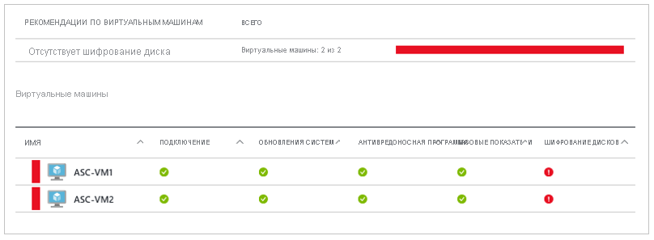

# Шифрование дисков Azure для виртуальных машин Windows 

Шифрование дисков Azure помогает защитить данные в соответствии с обязательствами по обеспечению безопасности и соответствия требованиям Организации. Он использует функцию [BitLocker](https://en.wikipedia.org/wiki/BitLocker) в Windows, чтобы обеспечить шифрование томов для дисков ОС и данных виртуальных машин Azure, а также интегрировано с [Azure Key Vault](../../key-vault/index.yml) для управления ключами и секретами шифрования диска и их администрирования. 

Если вы используете [Центр безопасности Azure](../../security-center/index.yml), вы получаете оповещения, если у вас есть виртуальные машины, которые не шифруются. Вы получите оповещение высокого уровня серьезности вместе c рекомендацией о шифровании таких виртуальных машин.

> [!WARNING]
> - Если вы ранее использовали шифрование дисков Azure с Azure AD для шифрования виртуальной машины, необходимо продолжить использовать этот параметр для шифрования виртуальной машины. Дополнительные сведения см. [в статье шифрование дисков Azure с помощью Azure AD (предыдущий выпуск)](disk-encryption-overview-aad.md) . 
> - Выполнение некоторых приведенных рекомендаций может привести к более интенсивному использованию данных, сети или вычислительных ресурсов, а следовательно к дополнительным затратам на лицензии или подписки. Необходима действующая подписка Azure, которая позволяет создавать ресурсы Azure в поддерживаемых регионах.

Вы можете изучить основы шифрования дисков Azure для Windows всего за несколько минут с помощью [краткого руководства создание и шифрование виртуальной машины Windows с Azure CLI](disk-encryption-cli-quickstart.md) или [Создание и шифрование виртуальной машины Windows с помощью Azure PowerShell](disk-encryption-powershell-quickstart.md).

## Поддерживаемые виртуальные машины и операционные системы

### Поддерживаемые размеры виртуальных машин

Виртуальные машины Windows доступны в [различных размерах](sizes-general.md). Шифрование дисков Azure недоступно на виртуальных машинах [уровня "базовый", "серия](https://azure.microsoft.com/pricing/details/virtual-machines/series/)" или на виртуальных машинах с объемом памяти менее 2 ГБ.

Шифрование дисков Azure также доступно для виртуальных машин с хранилищем класса Premium.

### Поддерживаемые операционные системы

- Клиент Windows: Windows 8 и более поздней версии.
- Windows Server: Windows Server 2008 R2 и более поздние версии.  
 
> [!NOTE]
> Windows Server 2008 R2 требует установки .NET Framework 4,5 для шифрования; Установите его из Центр обновления Windows с помощью необязательного обновления Microsoft .NET Framework 4.5.2 для 64-разрядных систем Windows Server 2008 R2 x64 ([KB2901983](https://www.catalog.update.microsoft.com/Search.aspx?q=KB2901983)).  
>  
> Windows Server 2012 R2 Core и Windows Server 2016 Core требуют, чтобы компонент BdeHdCfg был установлен на виртуальной машине для шифрования.

## Требования к сети
Чтобы включить шифрование дисков Azure, виртуальные машины должны соответствовать следующим требованиям к конфигурации конечной точки сети.
  - Чтобы получить маркер для подключения к хранилищу ключей, виртуальная машина Windows должна иметь возможность подключения к конечной точке Azure Active Directory, \[login.microsoftonline.com\].
  - Чтобы записать ключи шифрования в хранилище ключей, виртуальная машина Windows должна иметь возможность подключения к конечной точке хранилища ключей.
  - Виртуальная машина Windows должна иметь возможность подключения к конечной точке службы хранилища Azure, в которой размещен репозиторий расширения Azure, и учетной записи хранения Azure, в которой размещены VHD-файлы.
  -  Если ваша политика безопасности ограничивает доступ к Интернету с виртуальных машин Azure, можно разрешить указанный выше универсальный код ресурса (URI) и настроить определенное правило, чтобы разрешить исходящие подключения к данным IP-адресам. Дополнительные сведения см. в статье [Доступ к Azure Key Vault из-за брандмауэра](../../key-vault/key-vault-access-behind-firewall.md).    

## Требования к групповая политика

Шифрование дисков Azure использует предохранитель внешнего ключа BitLocker для виртуальных машин Windows. Если виртуальные машины присоединены к домену, не применяйте групповые политики, требующие использования предохранителей TPM. Сведения о групповой политике "Разрешить использование BitLocker без совместимого TPM" см. в [справке по групповым политикам BitLocker](/windows/security/information-protection/bitlocker/bitlocker-group-policy-settings#bkmk-unlockpol1).

Политика BitLocker на виртуальных машинах, присоединенных к домену, с пользовательской групповой политикой должна включать следующий параметр: [Настройка хранилища пользователя сведений о восстановлении BitLocker — > разрешить 256-разрядный ключ восстановления](/windows/security/information-protection/bitlocker/bitlocker-group-policy-settings). Шифрование дисков Azure завершится ошибкой, если параметры настраиваемой групповой политики для BitLocker несовместимы. На компьютерах без соответствующего параметра политики может потребоваться применить новую политику, принудительно обновить ее (gpupdate.exe /force) и перезагрузить компьютер.

Шифрование дисков Azure завершится ошибкой, если групповая политика уровня домена блокирует алгоритм AES-CBC, который используется BitLocker.

## Требования к хранилищу ключей шифрования  

Для шифрования дисков Azure требуется Azure Key Vault, чтобы управлять ключами и секретами шифрования дисков и управлять ими. Ваше хранилище ключей и виртуальные машины должны находиться в одном регионе Azure и подписке.

Дополнительные сведения см. [в статье Создание и Настройка хранилища ключей для шифрования дисков Azure](disk-encryption-key-vault.md).

## Терминология
В следующей таблице описаны некоторые распространенные термины, используемые в документации по шифрованию дисков Azure.

| Терминология | Определение |
| --- | --- |
| хранилищем ключей Azure | Key Vault представляет собой службу управления криптографическими ключами. Она основана на аппаратных модулях безопасности, соответствующих Федеральному стандарту обработки информации (FIPS). Эти стандарты позволяют надежно хранить криптографические ключи и конфиденциальные данные. Дополнительные сведения см. в [Azure Key Vault](https://azure.microsoft.com/services/key-vault/) документации, а также [о создании и настройке хранилища ключей для шифрования дисков Azure](disk-encryption-key-vault.md). |
| Интерфейс командной строки Azure | [Azure CLI](/cli/azure/install-azure-cli) оптимизирован для администрирования ресурсов Azure и управления ими из командной строки.|
| BitLocker |[BitLocker](https://technet.microsoft.com/library/hh831713.aspx) — это известная промышленным стандартам технология шифрования томов Windows, которая используется для включения шифрования дисков на виртуальных машинах Windows. |
| Ключ шифрования ключа (KEK) | Асимметричный ключ (RSA 2048), который можно использовать для защиты или перетекания секрета. Вы можете использовать защищенный HSM ключ или ключ с программной защитой. Дополнительные сведения см. в [Azure Key Vault](https://azure.microsoft.com/services/key-vault/) документации, а также [о создании и настройке хранилища ключей для шифрования дисков Azure](disk-encryption-key-vault.md). |
| Командлеты PowerShell | Дополнительные сведения см. в статье [Общие сведения об Azure PowerShell](/powershell/azure/overview). |

## Дополнительная информация

- [Краткое руководство. Создание и шифрование виртуальной машины Windows с помощью Azure CLI](disk-encryption-cli-quickstart.md)
- [Краткое руководство. Создание и шифрование виртуальной машины Windows с помощью Azure PowerShell](disk-encryption-powershell-quickstart.md)
- [Сценарии шифрования дисков Azure для виртуальных машин Windows](disk-encryption-windows.md)
- [Сценарий CLI для предварительных требований к шифрованию дисков Azure](https://github.com/ejarvi/ade-cli-getting-started)
- [Сценарий PowerShell для предварительных требований к шифрованию дисков Azure](https://github.com/Azure/azure-powershell/tree/master/src/Compute/Compute/Extension/AzureDiskEncryption/Scripts)
- [Создание и настройка хранилища ключей для шифрования дисков Azure](disk-encryption-key-vault.md)

