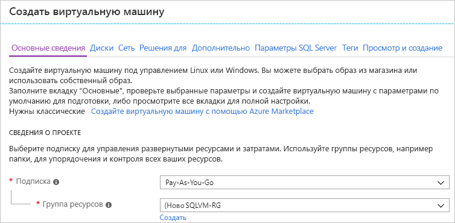
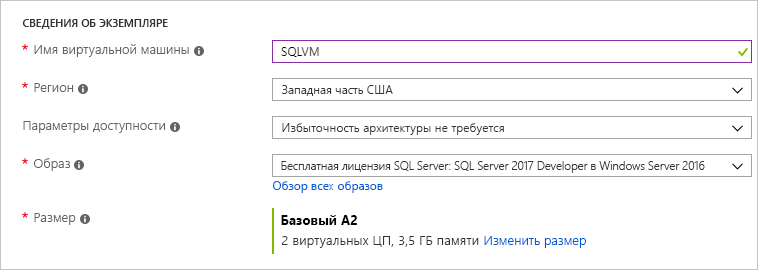

# Как подготовить виртуальную машину SQL Server на платформе Windows на портале Azure

В этом руководстве рассматриваются различные варианты, доступные при создании виртуальной машины SQL Server на платформе Windows на портале Azure. В этой статье рассматривается больше параметров конфигурации, чем в [кратком руководстве по виртуальным машинам SQL Server](quickstart-sql-vm-create-portal.md), и описывается одна возможная задача подготовки. 

Используйте это руководство, чтобы создать собственную виртуальную машину SQL Server. Его также можно использовать как справочник по параметрам, доступным на портале Azure.

> [!TIP]
> Если у вас есть вопросы по виртуальным машинам SQL Server, см. раздел [часто задаваемых вопросов](virtual-machines-windows-sql-server-iaas-faq.md).

Если у вас еще нет подписки Azure, [создайте бесплатную учетную запись Azure](https://azure.microsoft.com/free/?WT.mc_id=A261C142F) , прежде чем начинать работу.

##  Образы из коллекции виртуальных машин SQL Server

При создании виртуальной машины SQL Server можно выбрать один из нескольких предварительно настроенных образов, доступных в коллекции виртуальных машин. Ниже приведены инструкции по выбору одного из образов SQL Server 2017.

1. На портале Azure в меню слева выберите **Azure SQL**. Если **SQL Azure** отсутствует в списке, выберите **все службы**, а затем введите Azure SQL в поле поиска. (Необязательно) Щелкните звезду рядом с **Azure SQL**, чтобы добавить этот элемент в избранное и область навигации слева. 
1. Щелкните **+ Добавить**, чтобы открыть страницу **Выбор варианта развертывания SQL**. Чтобы просмотреть дополнительные сведения, выберите **Показать подробности**. 
1. Введите `2017` в поле поиска изображений SQL Server на плитке **виртуальные машины SQL** , а затем выберите **бесплатную SQL Server лицензия: SQL Server 2017 Developer на Windows Server 2016** из раскрывающегося списка. 

   

   > [!TIP]
   > В этом пошаговом руководстве используется выпуск Developer, так как это полнофункциональный выпуск SQL Server, предоставляемый бесплатно для тестирования в процессе разработки. Вы оплачиваете только стоимость выполнения виртуальной машины. Но вы можете выбрать для использования в этом пошаговом руководстве любой образ. Описание доступных образов см. в разделе [Начало работы с виртуальными машинами SQL](virtual-machines-windows-sql-server-iaas-overview.md#payasyougo).

   > [!TIP]
   > Стоимость лицензий для SQL Server включена в цену секунды использования создаваемой виртуальной машины и зависит от выпуска и числа ядер. Тем не менее выпуск SQL Server Developer предоставляется бесплатно для разработки и тестирования (не для рабочей среды), а выпуск SQL Express предоставляется бесплатно для упрощенных рабочих нагрузок (требующих менее 1 ГБ памяти и 10 ГБ хранилища). Можно также использовать собственную лицензию (BYOL) и платить только за виртуальную машину. Имена таких образов содержат префикс {BYOL}. 
   >
   > Дополнительные сведения об этих параметрах см. в [руководстве по выбору ценовой категории для виртуальных машин Azure SQL Server](virtual-machines-windows-sql-server-pricing-guidance.md).

1. Нажмите кнопку **Создать**.

## 1. Настройка основных параметров

На вкладке **Основные сведения** укажите следующую информацию.

* В разделе **сведения о проекте**убедитесь, что выбрана правильная подписка. 
*  В разделе **Группа ресурсов** либо выберите существующую группу ресурсов из списка, либо щелкните **создать** , чтобы создать новую группу ресурсов. Группа ресурсов — это коллекция связанных ресурсов в Azure (виртуальные машины, учетные записи хранения, виртуальные сети и т. д.). 

    

  > [!NOTE]
  > Рекомендуется использовать новую группу ресурсов для тестирования или изучения процесса развертывания SQL Server в Azure. После завершения теста удалите группу ресурсов, чтобы автоматически удалить виртуальную машину и все ресурсы, связанные с этой группой ресурсов. Дополнительные сведения о группах ресурсов см. в статье [Общие сведения об Azure Resource Manager](../../../azure-resource-manager/resource-group-overview.md).

* В разделе **Сведения об экземпляре**:
    1. Введите уникальное **имя виртуальной машины**.  
    1. Выберите расположение для параметра **Регион**. 
    1. В этом разделе **параметрам доступности** присвоено значение _не требуется избыточность инфраструктуры_. См. подробнее о [регионах и доступности виртуальных машин в Azure](../../windows/availability.md). 
    1. В списке **образов** выберите _бесплатная лицензия SQL Server: SQL Server 2017 Developer на Windows Server 2016_.  
    1. Выберите **Изменить размер** для параметра **Размер** виртуальной машины, а затем выберите предложение **A2 Basic**. Обязательно очистите ресурсы после завершения работы с ними, чтобы предотвратить любые непредвиденные расходы. Для рабочих нагрузок изучите рекомендации по размерам машин SQL Server и их настройке в статье [Рекомендации по оптимизации производительности SQL Server в виртуальных машинах Azure](virtual-machines-windows-sql-performance.md).

    

> [!IMPORTANT]
> В расчетную ежемесячную стоимость, указанную в окне **Выбор размера**, не включена стоимость лицензирования SQL Server. Это только стоимость виртуальной машины. Для выпусков SQL Server Express и Developer указана итоговая расчетная стоимость. Получить сведения о других выпусках можно на странице [цен на виртуальные машины Windows](https://azure.microsoft.com/pricing/details/virtual-machines/windows/), где вы можете выбрать целевой выпуск SQL Server. См. также [руководство по ценам для SQL Server](virtual-machines-windows-sql-server-pricing-guidance.md) виртуальных [машин и размеров](../sizes.md?toc=%2fazure%2fvirtual-machines%2fwindows%2ftoc.json)Azure.

* В разделе **учетная запись администратора**укажите имя пользователя и пароль. Пароль должен включать минимум 12 символов и соответствовать [определенным требованиям к сложности](../../windows/faq.md#what-are-the-password-requirements-when-creating-a-vm).

   

* В разделе **Правила входящего порта** щелкните **Разрешить выбранные порты**, а затем выберите **RDP (3389)** из раскрывающегося списка. 

   

## 2. Настройка дополнительных функций

### диски;

На вкладке **диски** настройте параметры диска. 

* В разделе **тип диска ОС**выберите тип диска для операционной системы из раскрывающегося списка. Для рабочих систем рекомендуется использовать Premium, но он недоступен для базовой виртуальной машины. Чтобы использовать SSD (цен. категория "Премиум"), измените размер виртуальной машины. 
* В разделе **Дополнительно**выберите **Да** в разделе использовать **управляемые диски**.

   > [!NOTE]
   > Корпорация Майкрософт рекомендует использовать управляемые диски для SQL Server. Управляемые диски управляют хранилищем в фоновом режиме. Кроме того, когда виртуальные машины с управляемыми дисками находятся в одной группе доступности, Azure распределяет ресурсы хранения, чтобы обеспечить соответствующую избыточность. Дополнительные сведения см. в статье [Обзор управляемых дисков Azure](../managed-disks-overview.md). Подробные сведения об управляемых дисках в группе доступности см. в статье [Управление доступностью виртуальных машин Windows в Azure](../manage-availability.md).

  
  
### Сеть

На вкладке **Сетевые подключения** настройте параметры сети. 

* Создайте новую **виртуальную сеть**или используйте имеющуюся для SQL Server виртуальной машины. Также назначьте **подсеть** . 

* В разделе **Сетевая группа безопасности сети**выберите базовую группу безопасности или расширенную группу безопасности. Выбор параметра "базовый" позволяет выбрать входящие порты для SQL Server виртуальной машины (те же значения, которые были настроены на вкладке " **основные** "). Выбор параметра дополнительно позволяет выбрать существующую группу безопасности сети или создать новую. 

* Вы можете изменить другие параметры сети или оставить их значения по умолчанию.

#### Мониторинг

На вкладке **мониторинг** Настройте мониторинг и автоматическое завершение работы. 

* Azure включает **диагностику загрузки** по умолчанию с той же учетной записью хранения, которая НАЗНАЧЕНА виртуальной машине. Эти параметры можно изменить здесь, а также включить **диагностику гостевых ОС**. 
* Также можно включить **управляемое системой удостоверение** и автоматическое **Завершение работы** на этой вкладке. 

## 3. Настройка параметров SQL Server

На вкладке **параметры SQL Server** настройте определенные параметры и оптимизации для SQL Server. Ниже приведены параметры, которые можно настроить для SQL Server.

| Настройка |
| --- |
| [Соединение](#connectivity) |
| [Аутентификация](#authentication) |
| [Интеграция с хранилищем ключей Azure](#azure-key-vault-integration) |
| [Конфигурация хранилища](#storage-configuration) |
| [Автоматическое исправление](#automated-patching) |
| [Автоматическое резервное копирование](#automated-backup) |
| [Службы R Services (Расширенная аналитика)](#r-services-advanced-analytics) |

### Соединение

В разделе **Подключение SQL**укажите необходимый тип доступа к экземпляру SQL Server на этой виртуальной машине. В рамках этого пошагового руководства выберите **Общедоступный (Интернет)** для подключения к SQL Server с компьютеров или из служб в Интернете. Если выбран этот параметр, Azure автоматически настроит брандмауэр и группу безопасности сети, чтобы разрешить трафик по выбранному порту.

> [!TIP]
> По умолчанию сервер SQL Server ожидает передачи данных через стандартный порт **1433**. Для повышения безопасности измените порт в предыдущем диалоговом окне, чтобы ожидать передачи данных через нестандартный порт, например 1401. После изменения порта необходимо выполнить подключение, используя этот порт, с помощью любого клиентского инструмента, например SSMS.

Чтобы подключиться к SQL Server через Интернет, также необходимо включить проверку подлинности SQL Server, как описано в следующем разделе.

Если вы не хотите включать подключения к ядру СУБД через Интернет, выберите один из следующих вариантов:

* **Локальное (только в виртуальной машине)** — для подключения к SQL Server только в пределах самой виртуальной машины.
* **Частное (в виртуальной сети)** — для подключения к SQL Server с машин или из служб в той же виртуальной сети.

Как правило, чтобы повысить уровень безопасности, необходимо выбрать наиболее подходящий тип подключения для выполнения вашего сценария. Но все параметры можно защитить с помощью правил группы безопасности сети и проверки подлинности Windows или SQL. Вы можете изменить группу безопасности сети после создания виртуальной машины. Дополнительные сведения см. в статье [Вопросы безопасности SQL Server на виртуальных машинах Azure](virtual-machines-windows-sql-security.md).

### Проверка подлинности

Если требуется SQL Server проверка подлинности, щелкните **включить** в разделе **Проверка подлинности SQL** на вкладке **параметры SQL Server** .

> [!NOTE]
> Если вы планируете предоставить доступ к SQL Server через Интернет (т. е. включаете параметр общедоступного подключения), включите аутентификацию SQL здесь. Для общего доступа к SQL Server необходимо использовать проверку подлинности SQL.

Если вы включаете проверку подлинности SQL Server, укажите **имя для входа** и **пароль**. Это имя для входа настроено как имя входа для проверки подлинности SQL Server и член предопределенной роли сервера **sysadmin** . Дополнительные сведения о режимах проверки подлинности см. в [этой статье](https://docs.microsoft.com/sql/relational-databases/security/choose-an-authentication-mode).

Если проверка подлинности SQL Server не включена, подключиться к экземпляру SQL Server можно с помощью локальной учетной записи администратора на виртуальной машине.

### Интеграция с хранилищем ключей Azure

Чтобы сохранить секреты безопасности в Azure для шифрования, выберите **параметры SQL Server**и прокрутите вниз до пункта **Интеграция хранилища ключей Azure**. Выберите **включить** и введите запрошенные сведения. 

В следующей таблице перечислены параметры, необходимые для настройки интеграции с хранилищем ключей Azure.

| ПАРАМЕТР | ОПИСАНИЕ | ПРИМЕР |
| --- | --- | --- |
| **URL-адрес хранилища ключей** |Расположение хранилища ключей. |HTTPS:\//contosokeyvault.vault.azure.net/ |
| **Имя субъекта** |Имя субъекта-службы Azure Active Directory. Этот имя также называется идентификатором клиента. |fde2b411-33d5-4e11-af04eb07b669ccf2 |
| **Секрет субъекта** |Секрет субъекта-службы Azure Active Directory. Этот секрет также называется секретом клиента. |9VTJSQwzlFepD8XODnzy8n2V01Jd8dAjwm/azF1XDKM= |
| **Имя учетных данных** |**Учетное имя**: интеграция AKV создает учетные данные в рамках SQL Server, позволяя виртуальной машине иметь доступ к хранилищу ключей. Выберите имя для этих учетных данных. |mycred1 |

Дополнительные сведения см. в статье [Настройка интеграции хранилища ключей Azure для SQL Server на виртуальных машинах Azure (Resource Manager)](virtual-machines-windows-ps-sql-keyvault.md).

### Конфигурация хранилища

На вкладке **параметры SQL Server** в разделе **Конфигурация хранилища**выберите **изменить конфигурацию** , чтобы открыть страницу Конфигурация оптимизированного хранилища производительности и указать требования к хранилищу.

В разделе **Storage optimized for**(Оптимизация хранилища) выберите один из следующих вариантов.

* **Общая** — значение по умолчанию, которое поддерживает большинство рабочих нагрузок.
* **Обработка транзакций** оптимизирует хранилище для традиционных рабочих нагрузок OLTP базы данных.
* **Хранилище данных** оптимизирует хранилище для рабочих нагрузок аналитики и отчетов.

Можно оставить значения по умолчанию или вручную изменить топологию хранилища в соответствии с вашими потребностями в операциях ввода-вывода. Дополнительные сведения см. в разделе [Storage Configuration](virtual-machines-windows-sql-server-storage-configuration.md). 

### Лицензия SQL Server
Если вы являетесь клиентом Software Assurance, вы можете использовать [преимущество гибридного использования Azure](https://azure.microsoft.com/pricing/hybrid-benefit/) , чтобы получить собственную лицензию SQL Server и сэкономить на ресурсах. 

### Автоматическое исправление

**Automated patching** включен по умолчанию. Автоматическая установка исправлений позволяет Azure автоматически исправлять SQL Server и операционную систему. Укажите день недели, время и длительность периода обслуживания. Azure устанавливает исправления в период обслуживания. Расписание периода обслуживания использует для определения времени региональные параметры VM. Если вы не хотите, чтобы платформа Azure автоматически устанавливала исправления для SQL Server и операционной системы, выберите вариант **Отключить**.  

Дополнительные сведения см. в статье [Автоматическая установка исправлений SQL Server на виртуальных машинах Azure (Resource Manager)](virtual-machines-windows-sql-automated-patching.md).

### Автоматическая архивация

Включите автоматическую архивацию для всех баз данных в разделе **Автоматическая архивация**. По умолчанию автоматическая архивация отключена.

Во время включения автоматического резервного копирования SQL можно настроить следующие параметры:

* срок хранения (в днях) для резервных копий;
* учетная запись хранения, используемая для резервных копий;
* параметр шифрования и пароль для резервных копий.
* архивация системных баз данных;
* настройка расписания архивации баз данных.

Для шифрования резервной копии щелкните **Включить**. Затем введите **пароль**. Azure создает сертификат для шифрования резервных копий и использует указанный пароль для защиты этого сертификата. По умолчанию расписание устанавливается автоматически, но можно создать ручное расписание, выбрав **вручную**. 

Дополнительную информацию см. в статье [Автоматическая архивация SQL Server на виртуальных машинах Azure (Resource Manager)](virtual-machines-windows-sql-automated-backup.md).

### Службы R Services (Расширенная аналитика)

Имеется возможность включить [SQL Server R Services (Расширенная аналитика)](/sql/advanced-analytics/r/sql-server-r-services/). Этот параметр позволяет использовать в SQL Server 2017 расширенные средства аналитики. Выберите **включить** в окне **параметры SQL Server** .

## 4. Проверка и создание

На вкладке **Отзыв и создание** просмотрите сводные данные и выберите **Создать**, чтобы создать SQL Server, группу ресурсов и ресурсы, указанные для этой виртуальной машины.

Развертывание можно отслеживать на портале Azure. Если нажать кнопку **Уведомления** в верхней части окна, будут показаны основные сведения о состоянии развертывания.

> [!NOTE]
> Чтобы предоставить вам сведения о времени, необходимом для выполнения развертывания, в нашем сценарии виртуальная машина SQL была развернута в восточной части США с параметрами по умолчанию. На выполнение тестового развертывания требуется около 12 минут. Время развертывания зависит от региона и выбранных параметров.

##  Открытие виртуальных машин с помощью удаленного рабочего стола

Выполните следующие действия, чтобы подключиться к виртуальной машине SQL Server через удаленный рабочий стол.

[!INCLUDE [Connect to SQL Server VM with remote desktop](../../../../includes/virtual-machines-sql-server-remote-desktop-connect.md)]

После подключения к виртуальной машине SQL Server вы можете запустить SQL Server Management Studio и подключиться с проверкой подлинности Windows, используя свои учетные данные локального администратора. Если включена проверка подлинности SQL Server, можно также подключиться с проверкой подлинности SQL, используя имя пользователя и пароль SQL, настроенные во время подготовки.

Доступ к машине позволяет напрямую изменять настройки компьютера и SQL Server в зависимости от ваших требований. Например, можно настроить параметры брандмауэра или изменить параметры конфигурации SQL Server.

##  Удаленное подключение к SQL Server

В рамках этого пошагового руководства для виртуальной машины используется **открытый** доступ и **аутентификация SQL Server**. Эти параметры позволяют автоматически настроить виртуальную машину для получения доступа к экземпляру SQL Server из любого клиента через Интернет (при условии, что будет использоваться правильное имя пользователя SQL).

> [!NOTE]
> Если вы не выбрали открытый доступ во время подготовки, можно изменить параметры подключения к SQL на портале после подготовки. Дополнительные сведения см. в разделе [об изменении параметров подключения SQL](virtual-machines-windows-sql-connect.md#change).

В следующих разделах описано, как подключиться к вашему экземпляру виртуальной машины SQL Server через Интернет.

[!INCLUDE [Connect to SQL Server in a VM Resource Manager](../../../../includes/virtual-machines-sql-server-connection-steps-resource-manager.md)]

  > [!NOTE]
  > В этом примере используется общий порт 1433. Однако это значение потребуется изменить, если во время развертывания SQL Server виртуальной машины был указан другой порт (например, 1401). 

## Дополнительная информация

Дополнительные сведения об использовании SQL Server в Azure см. в статье [Приступая к работе с SQL Server в виртуальных машинах Azure](virtual-machines-windows-sql-server-iaas-overview.md) и [Часто задаваемые вопросы об SQL Server в виртуальных машинах Azure](virtual-machines-windows-sql-server-iaas-faq.md).
