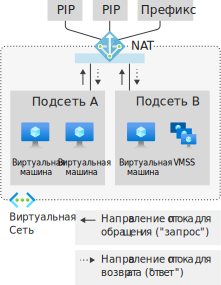
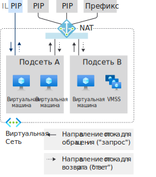
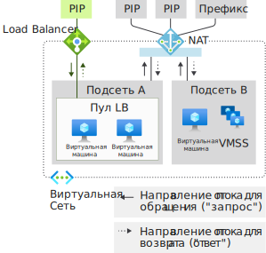
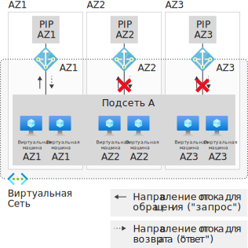
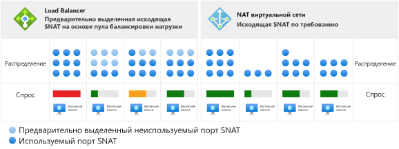
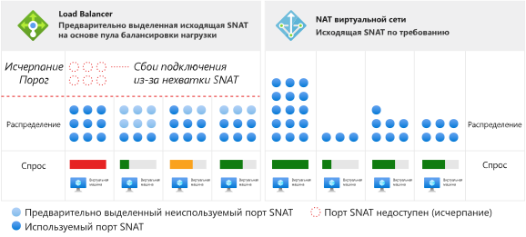

# Проектирование виртуальных сетей с использованием ресурсов шлюза преобразования сетевых адресов (NAT)

Ресурсы шлюза NAT входят в [виртуальную сеть NAT](nat-overview.md) и обеспечивают исходящее подключение к Интернету для одной или нескольких подсетей виртуальной сети. В подсети виртуальной сети указывается, какой шлюз NAT будет использоваться. NAT обеспечивает преобразование исходных сетевых адресов (SNAT) в подсети.  Ресурсы шлюза NAT определяют, какие статические IP-адреса используют виртуальные машины при создании исходящих потоков. Статические IP-адреса берутся из ресурсов общедоступных IP-адресов (PIP), ресурсов префикса общедоступного IP-адреса или обоих типов. Если используется ресурс префикса общедоступного IP-адреса, то ресурсы шлюза NAT потребляют все IP-адреса префикса общедоступного IP-ресурса. Один ресурс шлюза NAT может использовать до 16 статических IP-адресов.

  

*Рисунок. NAT виртуальной сети для исходящего интернет-трафика*

## Развертывание NAT

Настройка и использование шлюза NAT намеренно реализованы в упрощенном виде.  

Ресурс шлюза NAT
- Создайте региональный или зональный (ограниченный зоной) ресурс шлюза NAT.
- Назначьте IP-адреса.
- При необходимости измените время ожидания простоя протокола TCP.  Проверьте [таймеры](#timers), <ins>прежде</ins> чем изменять значения по умолчанию.

Виртуальная сеть
- Настройте использование шлюза NAT в подсети виртуальной сети.

Определяемые пользователем маршруты не нужны.

## Ресурс

Ресурс спроектирован для простоты использования, как можно увидеть в следующем примере с Azure Resource Manager в формате, аналогичном шаблону.  Этот формат, похожий на шаблон, показан для иллюстрации основной идеи и структуры.  Измените пример в соответствии со своими потребностями.  Этот документ не предназначен для использования в качестве учебника.

На следующей схеме показаны доступные для записи ссылки между различными ресурсами Azure Resource Manager.  Стрелка указывает направление ссылки, откуда ее можно записать. Просмотр 

  

*Рисунок. Объектная модель NAT виртуальной сети*

Рекомендуем использовать NAT для большинства рабочих нагрузок, если в вашей сети нет определенной зависимости от [исходящих подключений Load Balancer на основе пула](../load-balancer/load-balancer-outbound-connections.md).  

Можно выполнить миграцию из Load Balancer (цен. категории "Стандартный"), в том числе [правил для исходящего трафика](../load-balancer/load-balancer-outbound-rules-overview.md), в шлюз NAT. Чтобы выполнить миграцию, переместите ресурсы префикса общедоступного IP-адреса и общедоступного IP-адреса из внешних интерфейсов подсистемы балансировки нагрузки в шлюз NAT. Новые IP-адреса для шлюза NAT не требуются. Ресурсы стандартного общедоступного IP-адреса и префикс общедоступного IP-адреса можно использовать повторно, если общее количество IP-адресов не превышает 16. Планируйте миграцию с учетом прерывания работы во время перехода.  Прерывание можно максимально ограничить, автоматизировав процесс. Сначала протестируйте миграцию в промежуточной среде.  Во время перехода входящие потоки не затрагиваются.

Следующий пример — это фрагмент из шаблона Azure Resource Manager.  Этот шаблон позволяет развернуть несколько ресурсов, в том числе шлюз NAT.  В шаблоне используются следующие параметры примера:

- **natgatewayname** — имя шлюза NAT;
- **location** — регион Azure, в котором расположен ресурс;
- **publicipname** — имя исходящего общедоступного IP-адреса, связанного со шлюзом NAT;
- **vnetname** — имя виртуальной сети;
- **subnetname** — имя подсети, связанной со шлюзом NAT.

Общее число IP-адресов, предоставленных всеми ресурсами IP-адресов и префиксов, не может превышать 16. Разрешено любое число IP-адресов от 1 до 16.

:::code language="json" source="~/quickstart-templates/101-nat-gateway-vnet/azuredeploy.json" range="81-96":::

После создания ресурса шлюза NAT его можно использовать в одной или нескольких подсетях виртуальной сети. Укажите, какие подсети должны использовать этот ресурс шлюза NAT. Шлюз NAT нельзя использовать для более чем одной виртуальной сети. Не требуется назначать один и тот же шлюз NAT всем подсетям виртуальной сети. Для отдельных подсетей можно настроить разные ресурсы шлюза NAT.

В сценариях, которые не используют зоны доступности, будет использоваться регион (без указания зоны). Если вы используете зоны доступности, можно указать зону для изоляции NAT. Избыточность в пределах зоны не поддерживается. Ознакомьтесь с разделом [Зоны доступности](#availability-zones).

:::code language="json" source="~/quickstart-templates/101-nat-gateway-vnet/azuredeploy.json" range="1-146" highlight="81-96":::

Шлюзы NAT определяются с помощью свойства подсети в виртуальной сети. Потоки, которые создают виртуальные машины в подсети **subnetname** виртуальной сети **vnetname**, будут использовать шлюз NAT. Все исходящие подключения будут использовать IP-адреса, связанные с **natgatewayname**, в качестве исходного IP-адреса.

Дополнительные сведения о шаблоне Azure Resource Manager, используемом в этом примере, см. в следующих статьях:

- [Краткое руководство. Создание шлюза NAT с помощью шаблона Resource Manager](quickstart-create-nat-gateway-template.md)
- [NAT виртуальной сети](https://azure.microsoft.com/resources/templates/101-nat-gateway-1-vm/)

## Руководство по проектированию

Ознакомьтесь с рекомендациями в этом разделе, чтобы узнать как проектировать виртуальные сети с использованием NAT.  

1. [Оптимизация затрат](#cost-optimization)
1. [Сосуществование входящего и исходящего трафика](#coexistence-of-inbound-and-outbound)
2. [Управление базовыми ресурсами](#managing-basic-resources)
3. [Зоны доступности](#availability-zones)

### Оптимизация затрат

[Конечные точки службы](virtual-network-service-endpoints-overview.md) и [приватный канал](../private-link/private-link-overview.md) — это варианты, которые следует учитывать при оптимизации затрат. Для этих служб NAT не требуется. Трафик, направленный в конечные точки службы или приватный канал, не обрабатывается в ходе NAT виртуальной сети.  

Конечные точки службы связывают ресурсы службы Azure с виртуальной сетью и контролируют доступ к ресурсам службы Azure. Например, при доступе к службе хранилища Azure можно использовать конечную точку службы для хранилища, чтобы избежать платы за обработку данных NAT. Плата за использование конечных точек службы не взимается.

Приватный канал предоставляет службу PaaS Azure (или другие службы, размещенные в приватном канале) в качестве частной конечной точки в виртуальной сети.  Плата за использование приватного канала взимается на основе продолжительности обработки и объема данных.

Рассмотрите, подходит ли один или оба этих подхода для вашего сценария и при необходимости используйте их.

### Сосуществование входящего и исходящего трафика

Шлюз NAT совместим с:

 - подсистемой балансировки нагрузки (цен. категории "Стандартный");
 - общедоступными IP-адресами (цен. категории "Стандартный");
 - префиксами общедоступных IP-адресов (цен. категории "Стандартный").

При разработке нового развертывания начните с планирования номеров SKU (цен. категории "Стандартный").

  

*Рисунок. NAT виртуальной сети для исходящего интернет-трафика*

Сценарий с исключительно исходящим интернет-трафиком, который предусматривает шлюз NAT, можно улучшить, добавив функции приема входящего интернет-трафика. Каждый ресурс учитывает направление, из которого поступает поток. В подсети со шлюзом NAT у шлюза есть приоритет над любыми сценариями исходящего интернет-трафика. Сценарии входящего интернет-трафика осуществляются соответствующим ресурсом.

#### NAT и виртуальная машина с общедоступным IP-адресом уровня экземпляра

  

*Рисунок. NAT виртуальной сети и виртуальная машина с общедоступным IP-адресом уровня экземпляра*

| Направление | Ресурс |
|:---:|:---:|
| Входящий трафик | Виртуальная машина с общедоступным IP-адресом уровня экземпляра |
| Исходящие | Шлюз NAT |

Виртуальная машина будет использовать шлюз NAT для исходящего трафика.  Входящие подключения не затрагиваются.

#### NAT и виртуальная машина с общедоступной подсистемой балансировки нагрузки

  

*Рисунок. NAT виртуальной сети и виртуальная машина с общедоступной подсистемой балансировки нагрузки*

| Направление | Ресурс |
|:---:|:---:|
| Входящий трафик | Общедоступная подсистема балансировки нагрузки |
| Исходящие | Шлюз NAT |

У шлюза NAT есть приоритет над всеми настройками исходящего трафика из правила балансировки нагрузки или правил для исходящего трафика.  Входящие подключения не затрагиваются.

#### NAT и виртуальная машина с общедоступным IP-адресом уровня экземпляра и общедоступной подсистемой балансировки нагрузки

  

*Рисунок. NAT виртуальной сети и виртуальная машина с общедоступным IP-адресом уровня экземпляра и общедоступной подсистемой балансировки нагрузки*

| Направление | Ресурс |
|:---:|:---:|
| Входящий трафик | Виртуальная машина с общедоступным IP-адресом уровня экземпляра и общедоступной подсистемой балансировки нагрузки |
| Исходящие | Шлюз NAT |

У шлюза NAT есть приоритет над всеми настройками исходящего трафика из правила балансировки нагрузки или правил для исходящего трафика.  Виртуальная машина также будет использовать шлюз NAT для исходящего трафика.  Входящие подключения не затрагиваются.

### Управление базовыми ресурсами

Load Balancer (цен. категории "Стандартный"), общедоступный IP-адрес и префикс общедоступного IP-адреса совместимы со шлюзом NAT. Шлюзы NAT работают в области подсети. SKU уровня "Базовый" этих служб необходимо развертывать в подсети без шлюза NAT. Это разделение позволяет обоим вариантам номера SKU сосуществовать в одной виртуальной сети.

Шлюзы NAT имеют приоритет над сценариями исходящего трафика подсети. Load Balancer (цен. категории "Базовый") или общедоступный IP-адрес (и все управляемые службы, созданные с их использованием) невозможно настроить с использованием правильного преобразования. Шлюз NAT управляет исходящим интернет-трафиком в подсети. Входящий трафик в Load Balancer (цен. категории "Базовый") и по общедоступному IP-адресу недоступен. Входящий трафик Load Balancer (цен. категория "Базовый") и/или по общедоступному IP-адресу, настроенному на виртуальной машине, не будет доступен.

### зоны доступности;

#### Изоляция зоны с зональные стеками

  

*Рисунок. NAT виртуальных сетей с изоляцией зоны, создание нескольких зональных стеков*

Даже без зон доступности NAT является устойчивым и может выдержать множество сбоев компонентов инфраструктуры.  Зоны доступности повышают устойчивость с помощью сценариев изоляции зон для NAT.

Виртуальные сети и их подсети являются региональными конструкциями.  Подсети не ограничиваются зоной.

Зональное обязательство для изоляции зоны действует, если экземпляр виртуальной машины, использующий ресурс шлюза NAT, находится в той же зоне, что и ресурс шлюза NAT и его общедоступные IP-адреса. Чтобы изолировать зону, создайте зональный стек для каждой зоны доступности.  Такой зональный стек включает экземпляры виртуальных машин, ресурсы шлюза NAT, ресурсы общедоступных IP-адресов и (или) префикса в подсети, которая предположительно обслуживает только эту одну зону.   Операции уровня управления и уровень данных выполняются только в указанной зоне и ограничиваются ею. 

Сбой в зоне, отличной от той, где реализуется сценарий, не повлияет на NAT. Из-за изоляции зоны произойдет сбой передачи исходящего трафика от виртуальных машин одной и той же зоны.  

#### Интеграция входящих конечных точек

Если для вашего сценария требуются входящие конечные точки, у вас есть два варианта:

| Параметр | Модель | Пример | За | Против |
|---|---|---|---|---|
| (1) | **Согласование** входящих конечных точек с соответствующими **зональными стеками**, созданными для исходящего трафика. | Создание подсистемы балансировки нагрузки ценовой категории "Стандартный" с зональным внешним интерфейсом. | Одинаковая модель обеспечения работоспособности и режим сбоя для входящего и исходящего трафика. Проще в использовании. | К отдельным IP-адресам в зоне, возможно, потребуется применить маску с общим DNS-именем. |
| (2) | **Наложение** **межзональных** входящих конечных точек на зональные стеки. | Создание подсистемы балансировки нагрузки ценовой категории "Стандартный" с избыточным между зонами внешним интерфейсом. | Один IP-адрес для входящей конечной точки. | Различные модели обеспечения работоспособности и режимы сбоя для входящего и исходящего трафика.  Сложнее в использовании. |

>[!NOTE]
> Шлюзу NAT с зоной изоляции требуются IP-адреса, соответствующие зоне шлюза NAT. Ресурсы шлюза NAT с IP-адресами из другой зоны или без зонального ограничения не разрешены.

#### Сценарии межзонального исходящего трафика не поддерживаются

  

*Рисунок. Служба NAT виртуальных сетей не совместима с подсетью, охватывающей зоны*

При развертывании экземпляров виртуальных машин в нескольких зонах в пределах одной подсети вы не можете реализовать зональное обязательство с помощью ресурсов шлюза NAT.   Даже если к подсети подключено несколько зональных шлюзов NAT, экземпляр виртуальной машины не сможет определить, какой ресурс шлюза NAT следует выбрать.

Зональные обещание не существует, когда a) зона экземпляра виртуальной машины и зона шлюза зональные NAT не согласованы, или b) ресурс шлюза NAT используется с экземплярами виртуальных машин зональные.

Хотя будет казаться, что такой сценарий работает, его модель работоспособности и режим сбоя не будут определены в контексте зоны доступности. Мы рекомендуем использовать зональные стеки или все региональные ресурсы.

>[!NOTE]
>Свойство зон в ресурсе шлюза NAT не является изменяемым.  Следует повторно развернуть ресурс шлюза NAT с использованием предпочитаемых параметров региона или зоны.

>[!NOTE] 
>IP-адреса сами по себе не являются избыточными между зонами, если зона не указана.  Интерфейс [Load Balancer (цен. категории "Стандартный") является избыточным между зонами](../load-balancer/load-balancer-standard-availability-zones.md#frontend), если IP-адрес не создается в определенной зоне.  Данное условие не применяется к NAT.  Поддерживается только региональный режим или режим изоляции в пределах зоны.

## Производительность

Каждый ресурс шлюза NAT может обеспечивать пропускную способность до 50 Гбит/с. Вы можете разделить развертывания на несколько подсетей и назначить каждой подсети или группе подсетей шлюз NAT для масштабирования.

Каждый шлюз NAT может поддерживать потоки 64 000 для TCP и UDP соответственно для каждого назначенного исходящего IP-адреса.  Дополнительные сведения см. в следующем разделе "Преобразование исходных сетевых адресов", а также ознакомьтесь со статьей об [устранении неполадок](https://docs.microsoft.com/azure/virtual-network/troubleshoot-nat), чтобы получить рекомендации по решению конкретных проблем.

## Преобразование исходных сетевых адресов

Преобразование адреса исходной сети (SNAT) переопределяет источник потока, чтобы он исходил из другого IP-адреса.  Ресурсы шлюза NAT используют вариант SNAT, обычно называемый преобразованием адресов портов (PAT). При PAT переписывается исходный адрес и порт источника. При использовании SNAT отсутствует фиксированная связь между числом частных адресов и их преобразованными общедоступными адресами.  

### Основные сведения

Чтобы объяснить основную концепцию, рассмотрим пример с четырьмя потоками.  Шлюз NAT использует 65.52.1.1 ресурсов общедоступного IP-адреса, и виртуальная машина подключается к 65.52.0.1.

| Поток | Исходный кортеж | Целевой кортеж |
|:---:|:---:|:---:|
| 1 | 192.168.0.16:4283 | 65.52.0.1:80 |
| 2 | 192.168.0.16:4284 | 65.52.0.1:80 |
| 3 | 192.168.0.17.5768 | 65.52.0.1:80 |

После PAT эти потоки могут выглядеть следующим образом:

| Поток | Исходный кортеж | Исходный кортеж в подключении SNAT | Целевой кортеж | 
|:---:|:---:|:---:|:---:|
| 1 | 192.168.0.16:4283 | **65.52.1.1:1234** | 65.52.0.1:80 |
| 2 | 192.168.0.16:4284 | **65.52.1.1:1235** | 65.52.0.1:80 |
| 3 | 192.168.0.17.5768 | **65.52.1.1:1236** | 65.52.0.1:80 |

Назначение будет видеть источник потока как 65.52.0.1 (исходный кортеж SNAT) с отображаемым назначенным портом.  Как показано в предыдущей таблице, PAT также называется SNAT с маскировкой портов.  Несколько частных источников маскируются за IP-адресами и портами.  

#### повторное использование порта для источника (SNAT)

Шлюзы NAT рационально повторно используют порты источника (SNAT).  Ниже показана эта концепция в качестве дополнительного потока для предшествующего набора потоков.  Виртуальная машина в этом примере является потоком для 65.52.0.2.

| Поток | Исходный кортеж | Целевой кортеж |
|:---:|:---:|:---:|
| 4 | 192.168.0.16:4285 | 65.52.0.2:80 |

Шлюз NAT, скорее всего, преобразует поток 4 в порт, который может использоваться и для других назначений.  Дополнительные сведения о правильном изменении размера подготовки IP-адресов см. в статье [масштабирование](https://docs.microsoft.com/azure/virtual-network/nat-gateway-resource#scaling) .

| Поток | Исходный кортеж | Исходный кортеж в подключении SNAT | Целевой кортеж | 
|:---:|:---:|:---:|:---:|
| 4 | 192.168.0.16:4285 | 65.52.1.1:**1234** | 65.52.0.2:80 |

Не следует зависеть от конкретного способа назначения портов источника в приведенном выше примере.  Описанный выше принцип является только иллюстрацией основной концепции.

SNAT, которое обеспечивается NAT, отличается от SNAT, обеспечиваемого [Load Balancer](../load-balancer/load-balancer-outbound-connections.md) в нескольких аспектах.

### По запросу

NAT предоставляет порты SNAT по запросу для новых исходящих потоков трафика. Все доступные порты SNAT в инвентаризационных данных используют все виртуальные машины в подсетях, в которых настроено NAT. 

  

*Рисунок. Исходящие SNAT-подключения по требованию для виртуальной сети NAT*

При любой конфигурации IP-адресов виртуальной машины можно создавать исходящие потоки по требованию.  Не требуется предварительное выделение, а также поэкземплярное планирование, в том числе худшего сценария избыточной подготовки для каждого экземпляра.  

  

*Рисунок. Различия в сценариях исчерпания*

После освобождения порта SNAT он доступен для использования любой виртуальной машиной в подсетях, в которых настроено NAT.  Выделение по запросу позволяет при динамических и дивергентных рабочих нагрузках в подсетях использовать порты SNAT по мере необходимости.  Пока есть доступные порты SNAT, потоки SNAT будут выполняться. Вместо этого порты SNAT с наибольшей нагрузкой будут обрабатывать больший объем инвентаризации. Порты SNAT не остаются неиспользуемыми для виртуальных машин, которые в них не нуждаются в это время.

### Масштабирование

Масштабирование NAT в первую очередь является функцией управления общими доступными данными инвентаризации портов SNAT. Службе NAT требуется наличие достаточного количества портов SNAT, чтобы можно было справиться с ожидаемой пиковой нагрузкой исходящих потоков во всех подсетях, подключенных к ресурсу шлюза NAT.  Вы можете использовать ресурсы общедоступных IP-адресов, ресурсы префиксов общедоступных IP-адресов или оба типа, чтобы создать порты SNAT.  

>[!NOTE]
>При назначении ресурса префикса общедоступного IP-адреса будет использоваться весь префикс общедоступного IP-адреса.  Вы не можете назначить ресурс префикса общедоступного IP-адреса, а затем прервать отдельные IP-адреса, чтобы назначить их другим ресурсам.  Если вы хотите назначить отдельные IP-адреса из префикса общедоступного-IP-адреса нескольким ресурсам, необходимо создать отдельные общедоступные IP-адреса из ресурса префикса общедоступного IP-адреса и назначить их нужным образом вместо ресурса префикса общедоступного IP.

SNAT сопоставляет частные адреса с одним или несколькими общедоступными IP-адресами, заменяя исходный адрес и порт источника в процессах. Ресурс шлюза NAT будет использовать 64 000 портов (SNAT) на каждый общедоступный IP-адрес при этом преобразовании. Ресурсы шлюза NAT могут увеличивать масштаб до 16 IP-адресов и 1 000 000 портов SNAT. Если указан ресурс префикса общедоступного IP-адреса, каждый IP-адрес с таким префиксом предоставляет порты SNAT. Добавление общедоступных IP-адресов увеличивает количество доступных портов SNAT в инвентаризации. Протоколы TCP и UDP являются отдельными и несвязанными инвентаризационными ресурсами портов SNAT.

Ресурсы шлюза NAT рационально повторно используют порты источника (SNAT). В качестве руководства по проектированию для масштабирования необходимо предположить, что каждый поток требует наличия нового порта SNAT и масштабирует общее количество доступных IP-адресов для исходящего трафика.  Следует тщательно продумать масштаб, который вы разрабатываете, и подготавливать соответствующие IP-адреса.

Порты SNAT для различных назначений, скорее всего, будут использоваться повторно по возможности. И в качестве подхода к исчерпанию портов SNAT потоки могут не выполняться.  

См. раздел [основы SNAT](https://docs.microsoft.com/azure/virtual-network/nat-gateway-resource#source-network-address-translation) , например.

### Протоколы

Ресурсы шлюза NAT взаимодействуют с IP-адресами и заголовками транспортных IP-протоколов потоков UDP и TCP и не зависят от полезных данных уровня приложения.  Другие IP-протоколы не поддерживаются.

### Таймеры

>[!IMPORTANT]
>Таймер длительного простоя может без необходимости увеличить вероятность нехватки SNAT. Чем большее время вы зададите для таймера, тем дольше NAT будет удерживать порты SNAT, пока они не будут освобождены из-за простоя. Если для потоков истекает время ожидания, они в итоге будут завершаться сбоем и без необходимости занимать порты SNAT.  Потоки, которые завершаются сбоем через два часа, завершились бы сбоем и через четыре минуты (значение по умолчанию). Увеличивайте время ожидания при простое только в исключительных случаях. Если поток не простаивает, на него не повлияет таймер простоя.

Время ожидания простоя протокола TCP можно настроить в диапазоне от 4 минут (по умолчанию) до 120 минут (2 часа) для всех потоков.  Кроме того, таймер простоя можно сбросить для трафика в потоке.  Рекомендуемым шаблоном для обновления длительных простаивающих подключений и обнаружения активных конечных точек является проверка активности TCP-подключений.  Проверки активности TCP-подключений отображаются в качестве дублирующих подтверждений для конечных точек, у этих проверок низкая нагрузка и они не видны на уровне приложения.

Для освобождения портов SNAT используются следующие таймеры:

| Таймер | Значение |
|---|---|
| TCP FIN | 60 секунд |
| TCP RST | 10 с |
| TCP-порт в состоянии "Полуоткрытый" | 30 секунд |

Порт SNAT становится доступным для повторного использования с тем же конечным IP-адресом и конечным портом через 5 секунд.

>[!NOTE] 
>Эти параметры таймера можно изменить. Эти значения предназначены для устранения неполадок и сейчас вы не будете зависеть от конкретных таймеров.

## Ограничения

- NAT совместимо с общедоступным IP-адресом номера SKU (цен. категории "Стандартный"), префиксами общедоступного IP-адреса и ресурсами подсистемы балансировки нагрузки.   Ресурсы ценовой категории "Базовый"(например, базовая подсистема балансировки нагрузки) и все производные от них продукты несовместимы с NAT.  Базовые ресурсы необходимо размещать в подсети, в которой не настроено NAT.
- Поддерживается семейство IPv4-адресов.  NAT не взаимодействует с семейством IPv6-адресов.  NAT нельзя развернуть в подсети с префиксом IPv6.
- NAT не распространяется на несколько виртуальных сетей.

## Предложения

Нам важно знать, как можно улучшить эту услугу. Вам не хватает какой-либо возможности? Поделитесь своими идеями на странице [UserVoice](https://aka.ms/natuservoice).

## Дальнейшие действия

* Дополнительные сведения о [NAT виртуальной сети](nat-overview.md).
* Дополнительные сведения о [метриках и оповещениях для ресурсов шлюза NAT](nat-metrics.md).
* Дополнительные сведения об [устранении неполадок ресурсов шлюза NAT](troubleshoot-nat.md).
* Учебники по проверке шлюза NAT
  - [Azure CLI](tutorial-create-validate-nat-gateway-cli.md)
  - [PowerShell](tutorial-create-validate-nat-gateway-powershell.md)
  - [Портал](tutorial-create-validate-nat-gateway-portal.md)
* Краткие руководства по развертыванию ресурса шлюза NAT
  - [Azure CLI](./quickstart-create-nat-gateway-cli.md)
  - [PowerShell](./quickstart-create-nat-gateway-powershell.md)
  - [Портал](./quickstart-create-nat-gateway-portal.md)
  - [Шаблон](./quickstart-create-nat-gateway-template.md)
* Дополнительные сведения об API ресурса шлюза NAT
  - [REST API](https://docs.microsoft.com/rest/api/virtualnetwork/natgateways)
  - [Azure CLI](https://docs.microsoft.com/cli/azure/network/nat/gateway)
  - [PowerShell](https://docs.microsoft.com/powershell/module/az.network/new-aznatgateway)
* Дополнительные сведения о [зонах доступности](../availability-zones/az-overview.md).
* Дополнительные сведения о [подсистеме балансировки нагрузки ценовой категории "Стандартный"](../load-balancer/load-balancer-standard-overview.md).
* Дополнительные сведения о [зонах доступности и подсистеме балансировки нагрузки ценовой категории "Стандартный"](../load-balancer/load-balancer-standard-availability-zones.md).
* [Расскажите в UserVoice, что нам следует создать далее для NAT виртуальной сети](https://aka.ms/natuservoice).
