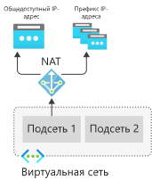
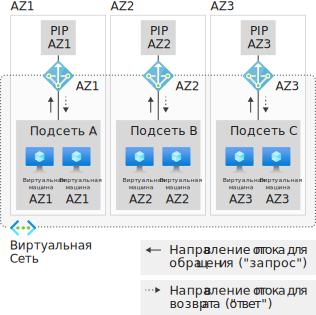

# Что такое NAT виртуальной сети?

NAT (преобразование сетевых адресов) виртуальной сети упрощает возможность исходящего интернет-подключения для виртуальных сетей. При настройке NAT в подсети все исходящие подключения используют указанные статические общедоступные IP-адреса.  Исходящее подключение возможно без подсистемы балансировки нагрузки или общедоступных IP-адресов путем прямого подключения к виртуальным машинам. NAT полностью управляемое и отличается высокой устойчивостью.

<!-- 

-->

  

*Рисунок. NAT виртуальной сети*

## Статические IP-адреса только для исходящего трафика

Исходящие подключения можно определить для каждой подсети с использованием NAT.  У нескольких подсетей в одной виртуальной сети могут быть разные ресурсы NAT. Подсеть настраивается путем указания того, какой ресурс шлюза NAT использовать. Все исходящие потоки UDP и TCP из любого экземпляра виртуальной машины будут использовать NAT. 

NAT совместимо с ресурсами общедоступного IP-адреса с SKU "Стандартный", ресурсами префикса общедоступного IP-адреса или их сочетанием.  Вы можете использовать префикс общедоступного IP-адреса напрямую или распространять общедоступные IP-адреса префикса по нескольким ресурсам шлюза NAT. NAT будет очищать весь трафик, кроме трафика в диапазоне IP-адресов префикса.  Это облегчает работу с любым списком разрешенных IP-адресов для развертываний.

Весь исходящий трафик для подсети автоматически обрабатывается NAT без каких-либо пользовательских настроек.  Определяемые пользователем маршруты не нужны. У NAT есть приоритет над другими сценариями исходящих подключений, и оно заменяет стандартный адрес назначения в Интернете для подсети.

## SNAT по запросу при использовании нескольких IP-адресов для масштабирования

NAT использует "преобразование сетевых адресов портов" (PNAT или PAT), которое рекомендуется для большинства рабочих нагрузок. Динамические или дивергентные рабочие нагрузки можно легко разместить с помощью выделения исходящего потока по запросу. Исключается расширенное предварительное планирование, предварительное распределение и, как следствие, избыточная подготовка исходящих ресурсов. Ресурсы портов SNAT являются общими, доступны во всех подсетях, использующих конкретный ресурс шлюза NAT, и предоставляются при необходимости.

По одному общедоступному IP-адресу NAT можно выполнять до 64 000 параллельных потоков UDP и TCP. Можно начать с одного IP-адреса и увеличить масштаб до 16 общедоступных IP-адресов.

NAT позволяет создавать потоки из виртуальной сети в Интернете. Возврат трафика из Интернета разрешен только в ответ на активный поток.

В отличие от исходящих SNAT-подключений подсистемы балансировки нагрузки, NAT не имеет ограничений на то, какой частный IP-адрес экземпляра виртуальной машины может устанавливать исходящие подключения.  Дополнительные конфигурации IP-адресов могут создавать исходящее подключение к Интернету с использованием NAT.

## Сосуществование входящего и исходящего трафика

NAT совместимо со следующими ресурсами SKU "Стандартный":

- Подсистема балансировки нагрузки
- Общедоступный IP-адрес
- Префикс общедоступного IP-адреса

При совместном использовании с NAT эти ресурсы обеспечивают входящее подключение к Интернету для подсетей. NAT обеспечивает все исходящие подключения к Интернету из ваших подсетей.

В отношении NAT и совместимых функций SKU "Стандартный" учитывается направление запуска потока. Сценарии входящих и исходящих подключений могут сосуществовать. Эти сценарии будут получать правильные преобразованные сетевые адреса, так как эти функции учитывают направление потока. 

<!-- 

-->

  

*Рисунок. Направление потоков в NAT виртуальной сети*

## Полное управление и высокая устойчивость

NAT полностью горизонтально масштабируется с самого начала. Не требуются операции по увеличению или расширению.  Azure управляет работой NAT.  NAT всегда располагает несколькими доменами сбоя и может выдерживать многочисленные сбои без простоя.

## Сброс TCP для неопознанных потоков

Частная сторона NAT отправляет пакеты сброса TCP при попытках обмена данными в рамках TCP-подключения, которого не существует. Одним из таких примеров являются подключения, время ожидания простоя которых истекло. Следующий полученный пакет вернет сброс TCP по частному IP-адресу, чтобы сообщить о закрытии и принудительно закрыть подключение.

Общедоступная сторона NAT не создает пакеты сброса TCP или любой другой трафик.  Создается только трафик, генерируемый пользовательской виртуальной сетью.

## Настраиваемое время ожидания в режиме простоя для TCP-подключения

По умолчанию время ожидания в режиме простоя для TCP-подключения равно 4 минутам, но его можно увеличить до 120 минут. Любое действие с потоком также может повлечь сброс таймера простоя, в том числе проверка активности TCP-подключения.

## Региональная и зональная изоляция с помощью зон доступности

По умолчанию NAT действует в пределах региона. При создании сценариев с [зонами доступности](../availability-zones/az-overview.md) NAT можно изолировать в пределах определенной зоны (зональное развертывание).

<!-- 

-->

  

*Рисунок. NAT виртуальной сети с зонами доступности*

## Многомерные метрики для наблюдаемости

Вы можете отслеживать работу NAT, используя многомерные метрики, доступные в Azure Monitor. Эти метрики можно использовать для отслеживания использования и устранения неполадок.  Ресурсы шлюза NAT предполагают следующие метрики:
- Байты
- Пакеты
- Отброшенные пакеты
- Общее число подключений SNAT
- Число переходов состояния подключения SNAT за интервал

<!-- "ADD when PM is done" Learn more about [NAT gateway metrics](./nat-gateway-metrics.md) -->

## Соглашение об уровне обслуживания

В общедоступной версии услуга NAT доступна не менее чем на 99,9 %.

## Цены

Шлюз NAT оплачивается по двум отдельным единицам измерения:

| средство измерения. | Тариф |
| --- | --- |
| Часы использования ресурса | 0,045 долл. США в час |
| Обработанные данные | 0,045 долл. США за ГБ |

Часы использования ресурса учитываются как период времени, в течение которого существует ресурс шлюза NAT.
Учитываются обработанные данные всего трафика, проходящего через ресурс шлюза NAT.

## Доступность

NAT виртуальной сети и ресурс шлюза NAT поддерживаются во всех [регионах](https://azure.microsoft.com/global-infrastructure/regions/) общедоступного облака Azure.

## Поддержка

Поддержка NAT осуществляется с помощью стандартных каналов.

## Отзывы

Нам важно знать, как можно улучшить эту услугу. Кроме того, вы можете вносить предложения и идеи для NAT в разделе [UserVoice](https://aka.ms/natuservoice).

## Ограничения

* NAT совместимо с общедоступным IP-адресом номера SKU (цен. категории "Стандартный"), префиксами общедоступного IP-адреса и ресурсами подсистемы балансировки нагрузки. Ресурсы ценовой категории "Базовый"(например, Load Balancer ценовой категории "Базовый") и все производные от них продукты несовместимы с NAT.  Базовые ресурсы необходимо размещать в подсети, в которой не настроено NAT.
* Поддерживается семейство IPv4-адресов.  NAT не взаимодействует с семейством IPv6-адресов.  NAT нельзя развернуть в подсети с префиксом IPv6.
* Ведение журнала потоков NSG не поддерживается при использовании NAT.
* NAT не распространяется на несколько виртуальных сетей.

## Дальнейшие действия

* Дополнительные сведения о [ресурсе шлюза NAT](./nat-gateway-resource.md).
* [Расскажите в UserVoice, что нам следует создать далее для NAT виртуальной сети](https://aka.ms/natuservoice).

