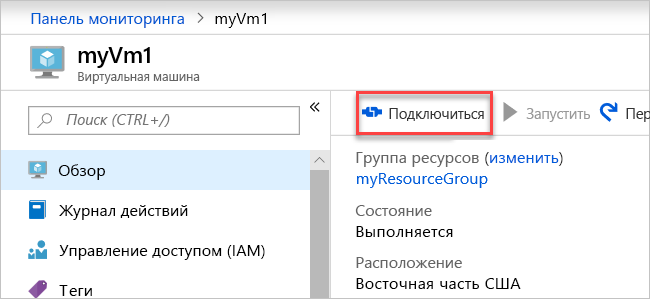

# <a name="quickstart-create-a-virtual-network-using-the-azure-portal"></a>Краткое руководство. Создание виртуальной сети с помощью портала Azure

Виртуальная сеть позволяет ресурсам Azure, таким как виртуальные машины, обмениваться данными в частном порядке и взаимодействовать через Интернет. Из этого краткого руководства вы узнаете, как создать виртуальную сеть. Создав виртуальную сеть, разверните в ней две виртуальные машины. Затем вы подключитесь к виртуальным машинам из Интернета и установите частную связь между двумя виртуальными машинами.

Если у вас еще нет подписки Azure, [создайте бесплатную учетную запись](https://azure.microsoft.com/free/?WT.mc_id=A261C142F).

## <a name="sign-in-to-azure"></a>Вход в Azure

Войдите на [портале Azure](https://portal.azure.com).

## <a name="create-a-virtual-network"></a>Создать виртуальную сеть

1. Вверху с левой стороны экрана последовательно выберите **Создать ресурс** > **Сети** > **Виртуальная сеть**.

1. В подменю **Создать виртуальную сеть** введите или выберите следующую информацию:

    | Параметр | Значение |
    | ------- | ----- |
    | ИМЯ | Введите *myVirtualNetwork*. |
    | Пространство адресов | Введите *10.1.0.0/16*. |
    | Подписка | Выберите свою подписку.|
    | Группа ресурсов | Выберите **Создать**, а затем введите *myResourceGroup* и нажмите кнопку **ОК**. |
    | Расположение | Выберите **Восточная часть США**.|
    | Имя подсети | Введите *myVirtualSubnet*. |
    | Диапазон адреса подсети | Введите *10.1.0.0/24*. |

1. Сохраните остальные значения по умолчанию и нажмите кнопку **Создать**.

## <a name="create-virtual-machines"></a>Создание виртуальных машин

Создайте две виртуальные машины в виртуальной сети.

### <a name="create-the-first-vm"></a>Создание первой виртуальной машины

1. В верхней левой части экрана последовательно выберите **Создать ресурс** > **Вычисления** > **Windows Server 2016 Datacenter**.

1. В окне **Создание виртуальной машины — Основы** введите или выберите следующую информацию:

    | Параметр | Значение |
    | ------- | ----- |
    | **Сведения о проекте** | |
    | Подписка | Выберите свою подписку. |
    | Группа ресурсов | Выберите **MyResourceGroup**. Вы ее создали в предыдущем разделе. |
    | **Подробности об экземпляре** |  |
    | Имя виртуальной машины | Введите *myVm1*. |
    | Регион | Выберите **Восточная часть США**. |
    | Параметры доступности | Оставьте значение по умолчанию **No infrastructure redundancy required** (Избыточность инфраструктуры не требуется). |
    | Образ — | Оставьте значение по умолчанию **Microsoft Windows Server 2016 Datacenter**. |
    | Размер | Оставьте значение по умолчанию **Standard DS1 v2**. |
    | **Учетная запись администратора** |  |
    | Имя пользователя | Введите выбранное имя пользователя. |
    | Пароль | Введите выбранный пароль. Пароль должен включать минимум 12 символов и соответствовать [определенным требованиям к сложности](../virtual-machines/windows/faq.md?toc=%2fazure%2fvirtual-network%2ftoc.json#what-are-the-password-requirements-when-creating-a-vm).|
    | Подтверждение пароля | Введите пароль еще раз. |
    | **Правила входящего порта** |  |
    | Общедоступные входящие порты | Оставьте значение по умолчанию **Отсутствует**. |
    | **Экономия** |  |
    | Already have a Windows license? (У вас уже есть лицензия Windows?) | Оставьте значение по умолчанию **Нет**. |

1. Выберите **Далее: Диски**.

1. В окне **Создание виртуальной машины — Диски** оставьте значения по умолчанию и выберите **Далее: Сети**.

1. В окне **Создание виртуальной машины — Сети** выберите такую информацию:

    | Параметр | Значение |
    | ------- | ----- |
    | Виртуальная сеть | Оставьте значение по умолчанию **myVirtualNetwork**. |
    | Подсеть | Оставьте значение по умолчанию **myVirtualSubnet (10.1.0.0/24)**. |
    | Общедоступный IP-адрес | Оставьте значение по умолчанию **(new) myVm-ip**. |
    | Network security ports (Порты безопасности сети) | Выберите **Разрешить выбранные порты**. |
    | Выбрать входящие порты | Выберите **HTTP** и **RDP**.

1. Выберите **Далее: Управление**.

1. В окне **Создание виртуальной машины — Управление** в поле **Учетная запись хранения диагностики** выберите **Создать**.

1. В подменю **Создание учетной записи хранения** введите или выберите следующую информацию:

    | Параметр | Значение |
    | ------- | ----- |
    | ИМЯ | Введите *myvmstorageaccount*. |
    | Тип учетной записи | Оставьте значение по умолчанию **Storage (general purpose v1)** (Хранилище (общего назначения версии 1)). |
    | Производительность | Оставьте значение по умолчанию **Стандартная**. |
    | Репликация | Оставьте значение по умолчанию **Локально избыточное хранилище (LRS)**. |

1. Нажмите кнопку **ОК**.

1. Выберите **Review + create** (Просмотреть и создать). Вы будете перенаправлены на страницу **Review + create** (Просмотр и создание), и Azure проверит вашу конфигурацию.

1. Когда увидите оповещение **Проверка пройдена**, щелкните **Создать**.

### <a name="create-the-second-vm"></a>Создание второй виртуальной машины

1. Выполните приведенные выше шаги 1–9.

    > [!NOTE]
    > На шаге 2 в качестве **имени виртуальной машины** введите *myVm2*.
    >
    > На шаге 7 в качестве **учетной записи хранения диагностики** выберите **myvmstorageaccount**.

1. Выберите **Review + create** (Просмотреть и создать). Вы будете перенаправлены на страницу **Review + create** (Просмотр и создание), и Azure проверит вашу конфигурацию.

1. Когда увидите оповещение **Проверка пройдена**, щелкните **Создать**.

## <a name="connect-to-a-vm-from-the-internet"></a>Подключение к виртуальной машине из Интернета

После создания виртуальной машины *myVm1* подключитесь к ней через Интернет.

1. На портале в строке поиска введите *myVm1*.

1. Нажмите кнопку **Подключиться**.

    

    После нажатия кнопки **Подключиться** откроется окно **Connect to virtual machine** (Подключение к виртуальной машине).

1. Щелкните **Скачать RDP-файл**. Azure создаст и скачает на ваш компьютер файл протокола удаленного рабочего стола (*RDP*).

1. Откройте скачанный файл *RDP*.

    1. При появлении запроса выберите **Подключиться**.

    1. Введите имя пользователя и пароль, указанные при создании виртуальной машины.

        > [!NOTE]
        > Возможно, потребуется выбрать **More choices** > **Use a different account** (Дополнительные варианты > Использовать другую учетную запись), чтобы указать учетные данные, введенные при создании виртуальной машины.

1. Нажмите кнопку **ОК**.

1. При входе в систему может появиться предупреждение о сертификате. В таком случае выберите **Да** или **Продолжить**.

1. Когда появится рабочий стол виртуальной машины, сверните его, чтобы вернуться на локальный рабочий стол.

## <a name="communicate-between-vms"></a>Взаимодействие между виртуальными машинами

1. На удаленном рабочем столе *myVm1* откройте PowerShell.

1. Укажите `ping myVm2`.

    Вы получите сообщение, аналогичное следующему:

    ```powershell
    Pinging myVm2.0v0zze1s0uiedpvtxz5z0r0cxg.bx.internal.clouda
    Request timed out.
    Request timed out.
    Request timed out.
    Request timed out.

    Ping statistics for 10.1.0.5:
    Packets: Sent = 4, Received = 0, Lost = 4 (100% loss),
    ```

    Выполнение `ping` завершилось ошибкой, так как `ping` использует протокол ICMP. По умолчанию ICMP запрещен брандмауэром Windows.

1. Чтобы разрешить виртуальной машине *myVm2* проверять связь с *myVm1* на дальнейшем этапе, введите следующую команду:

    ```powershell
    New-NetFirewallRule –DisplayName “Allow ICMPv4-In” –Protocol ICMPv4
    ```

    Эта команда разрешает входящий трафик ICMP через брандмауэр Windows:

1. Закройте подключение к удаленному рабочему столу *myVm1*.

1. Снова выполните шаги из раздела [Подключение к виртуальной машине из Интернета](#connect-to-a-vm-from-the-internet), но теперь подключитесь к *myVm2*.

1. Из командной строки введите `ping myvm1`.

    Вы получите сообщение, аналогичное следующему:

    ```powershell
    Pinging myVm1.0v0zze1s0uiedpvtxz5z0r0cxg.bx.internal.cloudapp.net [10.1.0.4] with 32 bytes of data:
    Reply from 10.1.0.4: bytes=32 time=1ms TTL=128
    Reply from 10.1.0.4: bytes=32 time<1ms TTL=128
    Reply from 10.1.0.4: bytes=32 time<1ms TTL=128
    Reply from 10.1.0.4: bytes=32 time<1ms TTL=128

    Ping statistics for 10.1.0.4:
        Packets: Sent = 4, Received = 4, Lost = 0 (0% loss),
    Approximate round trip times in milli-seconds:
        Minimum = 0ms, Maximum = 1ms, Average = 0ms
    ```

    Вы получите ответы от *myVm1*, так как на предыдущем шаге разрешили использовать ICMP через брандмауэр Windows на виртуальной машине *myVm1*.

1. Закройте подключение к удаленному рабочему столу *myVm2*.

## <a name="clean-up-resources"></a>Очистка ресурсов

После завершения работы с виртуальной сетью и виртуальными машинами удалите группу ресурсов и все содержащиеся в ней ресурсы:

1. В поле **Поиск** в верхней части портала введите *myResourceGroup*.

1. Когда группа ресурсов **myResourceGroup** появится в результатах поиска, выберите ее.

1. Выберите **Удалить группу ресурсов**.

1. Введите *myResourceGroup* в поле **Введите имя группы ресурсов** и нажмите кнопку **Удалить**.

## <a name="next-steps"></a>Дополнительная информация

Следуя инструкциям в этом кратком руководстве, вы создали виртуальную сеть по умолчанию и две виртуальные машины. Затем вы подключились к одной виртуальной машине из Интернета и установили частную связь между двумя виртуальными машинами. Дополнительные сведения о параметрах виртуальной сети см. в статье об [управлении виртуальной сетью](manage-virtual-network.md).

По умолчанию Azure не накладывает ограничения на частную связь между виртуальными машинами. Она разрешает только входящие подключения к удаленному рабочему столу виртуальных машин Windows из Интернета. Дополнительные сведения о разрешении или ограничении различных типов сетевого взаимодействия с виртуальными машинами см. в статье [Руководство. Фильтрация сетевого трафика с помощью групп безопасности сети, используя портал Azure](tutorial-filter-network-traffic.md).