# Переход на Виртуальную глобальную сеть Azure
Виртуальная глобальная сеть Azure позволяет компаниям упростить архитектуру своих глобальных подключений и воспользоваться преимуществами масштабирования в глобальной сети Microsoft. В этом техническом документе приводятся технические сведения для компаний, стремящихся перейти с существующей управляемой клиентом звездообразной топологии на схему с использованием концентраторов виртуальной глобальной сети под управлением корпорации Майкрософт.

В статье [Архитектура глобальной транзитной сети и Виртуальная глобальная сеть](virtual-wan-global-transit-network-architecture.md) приведены преимущества использования Виртуальной глобальной сети Azure для предприятий, на которых используется современная корпоративная глобальная сеть.

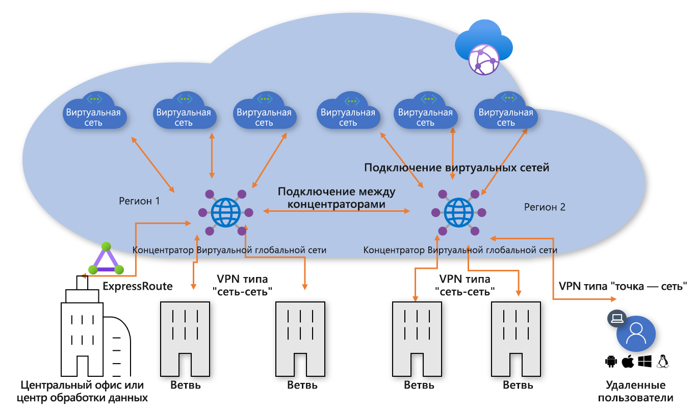
**Рис. 1. Виртуальная глобальная сеть Azure**

Звездообразная модель подключения концентратора виртуального ЦОД Azure была реализована тысячами наших клиентов для использования транзитной маршрутизации Azure для создания простых и масштабируемых облачных сетей. Виртуальная глобальная сеть Azure основывается на этих концепциях и предоставляет новые возможности, позволяющие использовать глобальные топологии подключения не только между локальными расположениями и Azure, но и позволяя клиентам использовать масштаб сети Майкрософт для расширения их существующих глобальных сетей.

В этой статье описывается, как перенести существующую гибридную среду в виртуальную глобальную сеть.

## Сценарий

Contoso — это глобальная финансовая организация с офисами в Европе и Азии. Эта компания планирует переместить существующие приложения с локального контроллера домена в Azure и создать базовую архитектуру на основе виртуальных ЦОД, в том числе региональных виртуальных сетей, управляемых клиентом, для гибридных подключений. Во время перехода на облачные технологии группа разработчиков сети выполнила задачу по обеспечению оптимизации возможностей подключения для ведения бизнеса.

На рис. 2 изображена общая схема существующей глобальной сети, в том числе подключение к нескольким регионам Azure.

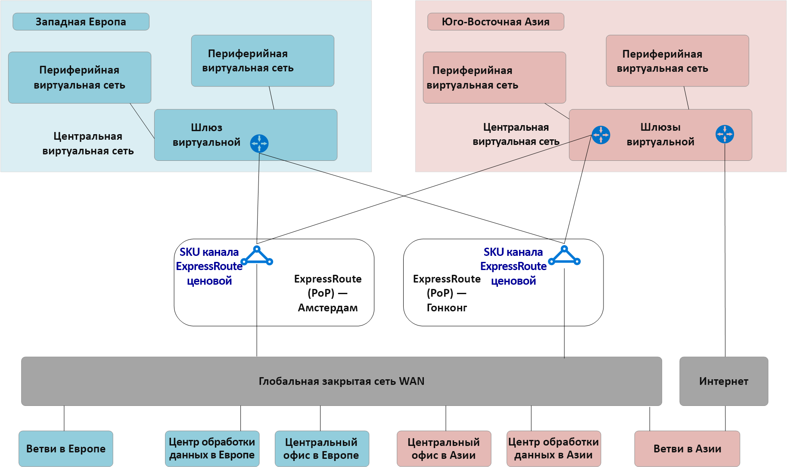
**Рис. 2. Топология существующей сети Contoso**

Из существующей топологии сети могут быть понятны следующие моменты.
 
- Звездообразная модель топологии, используемая в нескольких регионах. Использование каналов ExpressRoute Premium для подключения к общей частной глобальной сети.
- Некоторые из этих сайтов также имеют VPN-туннели непосредственно в Azure для доступа к приложениям, размещенным в облаке Майкрософт.

## Требования
Группе разработчиков сети была поставлена задача реализовать модель глобальной сети, которая может поддерживать миграцию Contoso в облако и должна оптимизироваться в отношении затрат, масштабирования и производительности. В целом должны соблюдаться следующие требования.
- Обеспечить как штаб-квартиру, так и филиалы с оптимизированным доступом к размещенным в облаке приложениям. 
- Исключить зависимость между существующими локальными контроллерами домена для отказа от VPN, и в то же время сохранить перечисленные ниже возможности подключения.
    - **Филиал — виртуальная сеть**. Подключенные через VPN офисы должны иметь возможность доступа к приложениям, перенесенным в облако в локальном регионе Azure.
    - **Филиал — концентратор — концентратор — виртуальная сеть**. Подключенные через VPN офисы должны иметь возможность доступа к приложениям, перенесенным в облако в удаленном регионе Azure. 
    - **Филиал — филиал**. Региональные подключенные через VPN офисы должны иметь возможность обмениваться данными друг с другом и с подключенными к ExpressRoute сайтами штаб-квартиры и ЦОД. 
    - **Филиал — концентратор — концентратор — филиал**. Глобально разнесенные подключенные через VPN офисы должны иметь возможность обмениваться данными друг с другом и с любыми подключенными к ExpressRoute сайтами штаб-квартиры и ЦОД.
    - **Филиал — Интернет**. Подключенные сайты должны иметь доступ к Интернету, и этот трафик должен быть отфильтрован и зарегистрирован.
    - **Виртуальная сеть — виртуальная сеть**. Сегменты виртуальных сетей в одном регионе должны иметь возможность обмениваться данными друг с другом.
    - **Виртуальная сеть — концентратор — концентратор — виртуальная сеть**. Сегменты виртуальных сетей в разных регионах должны иметь возможность обмениваться данными друг с другом.
- Предоставить пользователям Contoso (ноутбуки и телефоны) в сторонних сетях возможность доступа к ресурсам компании извне корпоративной сети.

## Архитектура виртуальной глобальной сети Azure

На рис. 3 изображена общая схема обновленной целевой топологии, использующей виртуальную глобальную сеть Azure для удовлетворения требований, описанных в предыдущем разделе.

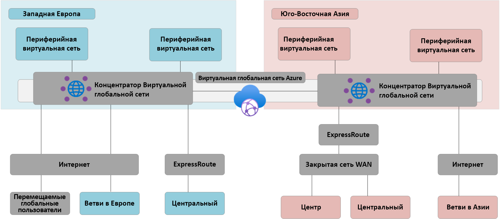
**Рис. 3. Архитектура виртуальной глобальной сети Azure**

В разделе "Сводка" сделайте следующее. 
- Штаб-квартира в Европе сохраняет подключение ExpressRoute, а локальные ЦОД в Европе полностью перенесены Azure и теперь выведены из эксплуатации.
- ЦОД в Азии и штаб-квартира остаются подключенными к частной глобальной сети. Виртуальная глобальная сеть Azure теперь используется для расширения локальной несущей сети и предоставления глобального подключения 
- Виртуальные глобальные концентраторы Azure, развернутые в регионах Azure "Западная Европа" и "Юго-Восточная Азия" для предоставления концентратора подключения для устройств с подключениями ExpressRoute и VPN. 
- Концентраторы также предоставляют VPN-подключение для пользователей в сторонних сетях с несколькими типами клиентов, используя подключение OpenVPN к глобальной облачной сети, предоставляя доступ не только к приложениям, перенесенным в Azure, но и к другим ресурсам, которые остаются в локальной среде. 
- Подключение к Интернету для ресурсов в виртуальной сети, предоставляемый виртуальной глобальной сетью Azure. Подключение к Интернету для удаленных сайтов, предоставляемый виртуальной глобальной сетью Azure. Локальная коммутация Интернет-подключений поддерживается партнерской интеграцией для оптимизации доступа к SaaS-службам, таким как Office 365.

## Переход на Виртуальную глобальную сеть Azure

В этом разделе описаны различные шаги для перехода на виртуальную глобальную сеть Azure.
 
### Один регион с виртуальным ЦОД в звездообразной топологии

На следующем рисунке показана топология с одним регионом для Contoso до развертывания виртуальной глобальной сети Azure.

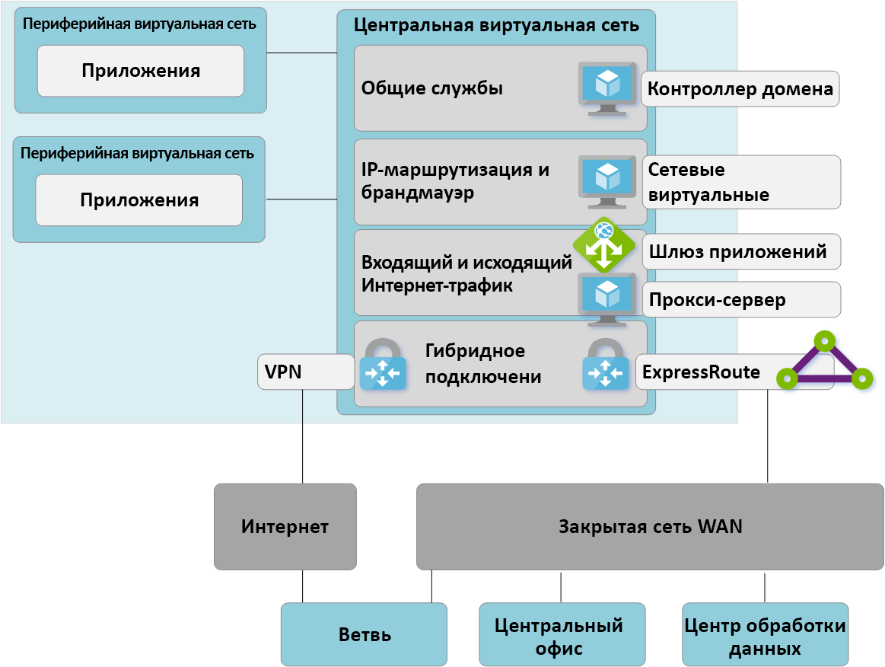

 **Рис. 4. Один регион с виртуальным ЦОД в звездообразной топологии, шаг 1**

В соответствии с моделью виртуального центра обработки данных, управляемая клиентом виртуальная сеть концентратора содержит несколько функциональных блоков.
- Общие службы (любая общая функция, необходимая для нескольких периферийных серверов), которые использует Contoso, например, это контроллеры домена IaaS Windows Server на виртуальных машинах инфраструктуры как услуги (IaaS).
- Службы брандмауэра IP-адресации/маршрутизации предоставляются сторонним сетевым виртуальным модулем, что обеспечивает IP-маршрутизацию между сегментами уровня 3. 
- Входящие и исходящие службы Интернета, включая шлюз приложений Azure для входящих HTTPS-запросов и сторонние прокси-службы, работающие на виртуальных машинах для фильтрованного исходящего доступа к Интернет-ресурсам.
- Шлюз ExpressRoute и виртуальная сеть VPN для подключения к локальным сетям.

### Развертывание виртуальных концентраторов глобальной сети

Первый шаг предусматривает развертывание виртуального концентратора глобальной сети в каждом регионе. Разверните виртуальный концентратор глобальной сети с помощью VPN-шлюза и шлюза Express Route, как описано в следующих статьях: 
- [Руководство. Создание подключения "сеть — сеть" с помощью Виртуальной глобальной сети Azure](virtual-wan-site-to-site-portal.md)
- [Руководство. связывании ExpressRoute с помощью Виртуальной глобальной сети Azure](virtual-wan-expressroute-portal.md) 

> [!NOTE]
> Виртуальная глобальная сеть Azure должна использовать номер SKU "Стандартный" для включения некоторых путей трафика, описанных в этой статье.

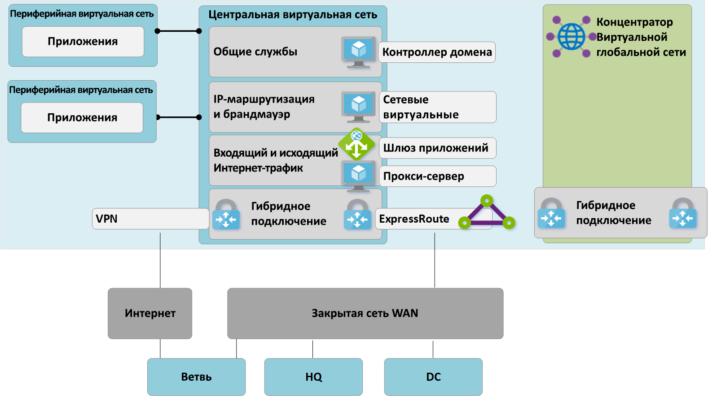
**Рис. 5. Перенос виртуального ЦОД в звездообразной топологии на виртуальную локальную сеть, шаг 2**

### Подключение удаленных сайтов (ExpressRoute и VPN) к виртуальной глобальной сети

Теперь подключите виртуальный концентратор глобальной сети к каналам ExpressRoute предприятия и настройте VPN-подключение типа "сеть — сеть" через Интернет к любым удаленным филиалам.

> [!NOTE]
> Для подключения к виртуальному концентратору глобальной сети необходимо обновить каналы Express Route до типа SKU "Премиум".

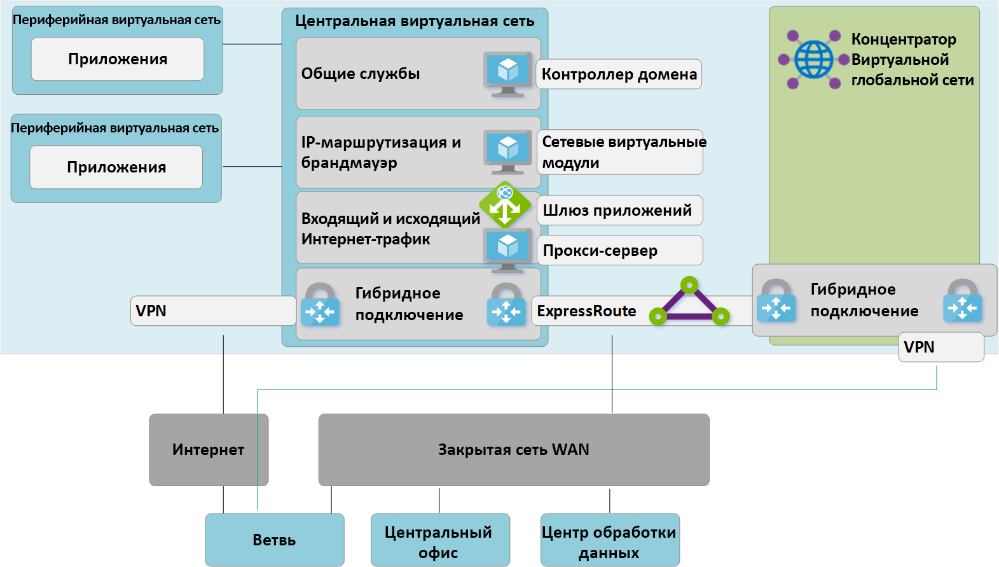
**Рис. 6. Перенос виртуального ЦОД в звездообразной топологии на виртуальную локальную сеть, шаг 3**

На этом этапе локальное сетевое оборудование начнет принимать маршруты, соответствующие пространству IP-адресов, назначенных виртуальной сети концентратора, управляемого виртуальной глобальной сетью. Удаленные филиалы, подключенные через VPN, на этом этапе увидят два пути к существующим приложениям в сегментах виртуальных сетей. Эти устройства должны быть настроены так, чтобы по-прежнему использовать туннель с концентратором виртуального ЦОД, чтобы обеспечить симметричную маршрутизацию на этапе перехода.

### Тестирование гибридного подключения через виртуальную глобальную сеть

Прежде чем использовать управляемый виртуальный концентратор глобальной сети для подключения к рабочему каналу, рекомендуется настроить тестовый сегмент виртуальной сети и подключение к виртуальной глобальной сети. Прежде чем продолжить, убедитесь, что подключения к этой тестовой среде работают через подключения ExpressRoute и VPN типа "сеть — сеть".

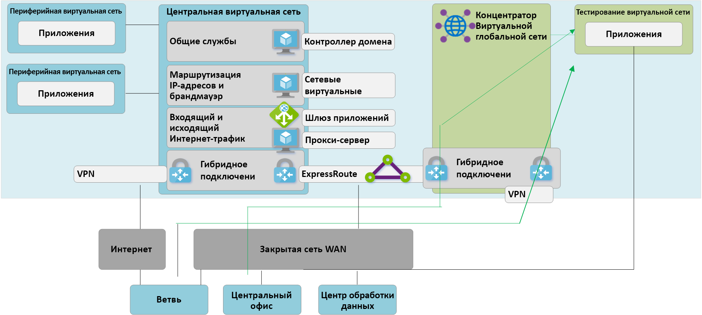
**Рис. 7. Перенос виртуального ЦОД в звездообразной топологии на виртуальную локальную сеть, шаг 4**

### Переходное подключение к концентратору виртуальной глобальной сети

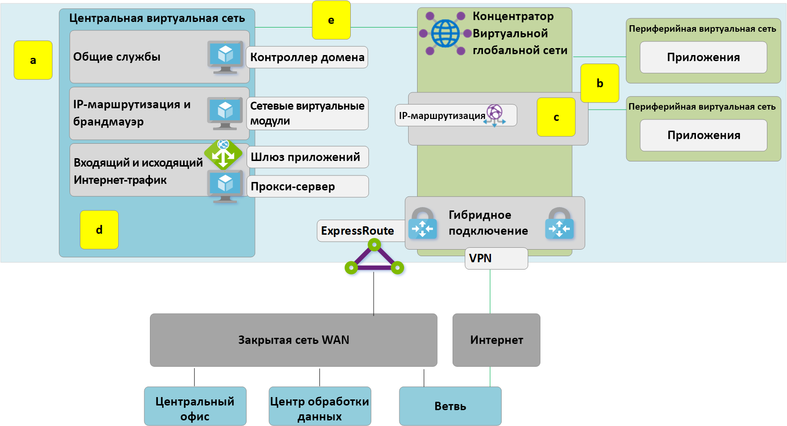
**Рис. 8. Перенос виртуального ЦОД в звездообразной топологии на виртуальную локальную сеть, шаг 5**

**a**. Удалите существующие пиринговые подключения из сегментов виртуальных сетей к старому концентратору виртуального ЦОД. Доступ к приложениям в сегментах виртуальных сетей невозможен, пока не будут выполнены шаги а–в.

**б**. Подключите сегменты виртуальных сетей к виртуальному концентратору глобальной сети через подключения к виртуальной сети.

**в**. Удалите все определяемые пользователем маршруты (UDR), которые ранее использовались в сегментах виртуальных сетей для связи между сегментами. Этот путь теперь активируется динамической маршрутизацией, доступной в виртуальном концентраторе глобальной сети.

**г**. Существующие шлюзы ExpressRoute и VPN в концентраторе виртуального ЦОД отключены, чтобы иметь возможность перейти к шагу 5.

**д**. Подключите старый концентратор виртуального ЦОД (виртуальную сеть концентратора) к виртуальному концентратору глобальной сети через новое подключение к виртуальной сети.

### Старый концентратор становится сегментом общих служб

Теперь мы перестроили сеть Azure, чтобы сделать концентратор виртуальной глобальной сети центральным точкой в нашей новой топологии.

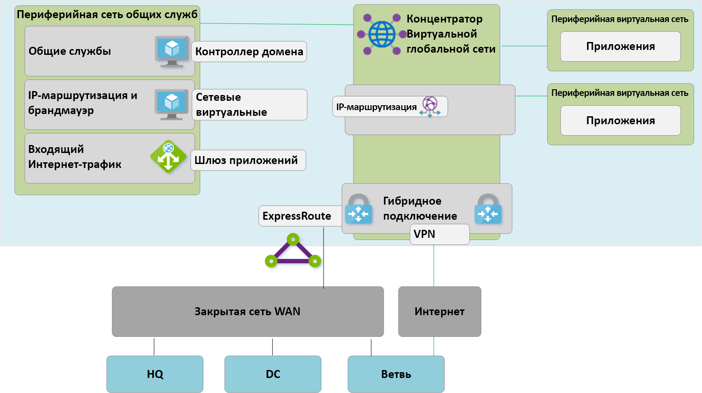
**Рис. 9. Перенос виртуального ЦОД в звездообразной топологии на виртуальную локальную сеть, шаг 6**

Так как концентратор виртуальной глобальной сети является управляемой сущностью и не допускает развертывания настраиваемых ресурсов, таких как виртуальные машины, этот блок общих служб теперь существует как резервная виртуальная сеть, в которой размещаются такие функции, как доступ из Интернета через шлюз приложений Azure или виртуализированное сетевое устройство. Трафик между средой общих служб и серверными виртуальными машинами теперь передается в виртуальный концентратор, управляемый глобальной сетью.

### Оптимизация локального подключения для максимально полного использования виртуальной глобальной сети

На этом этапе компания Contoso в основном выполнила перенос бизнес-приложений в облако Майкрософт, за счет чего в локальном контроллере домена осталось лишь несколько устаревших приложений.

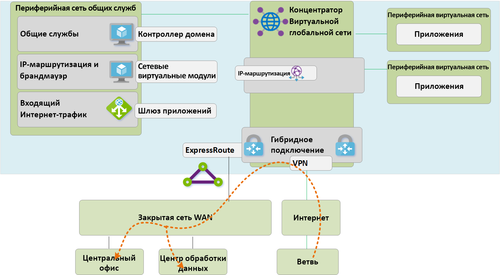
**Рис. 10. Перенос виртуального ЦОД в звездообразной топологии на виртуальную локальную сеть, шаг 7**

 Чтобы использовать все функции виртуальной глобальной сети Azure, компания Contoso решила вывести из эксплуатации устаревшее локальное VPN-подключение. Все филиалы, которые продолжают получать доступ к сетям штаб-квартиры или ЦОД, могут использовать глобальную сеть Майкрософт с помощью встроенной транзитной маршрутизации виртуальной глобальной сети Azure. ExpressRoute Global Reach — это альтернативный вариант для клиентов, желающих использовать магистральную сеть Майкрософт для дополнения своих существующих частных сетей.

## Архитектура конечного состояния и пути трафика

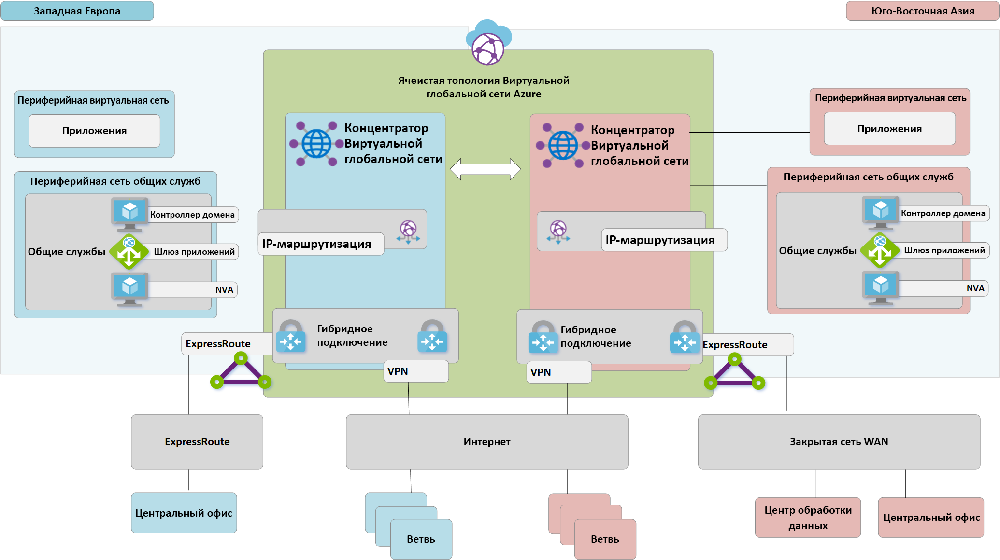
**Рис. 11. Виртуальная глобальная сеть с двумя регионами**

В этом разделе рассматривается то, как эта топология соответствует исходным требованиям, на примере нескольких последовательностей трафика.

### Путь 1

Путь 1 описывает последовательность трафика из VPN-филиала Азии в виртуальную сеть Azure в регионе "Юго-Восточная Азия".

Трафик направляется следующим образом:
- Филиал в Азии подключен через устойчивые туннели S2S с поддержкой BGP к виртуальному концентратору глобальной сети в Юго-Восточной Азии.
- Азиатский виртуальный концентратор глобальной сети направляет трафик локально в подключенную виртуальную сеть.

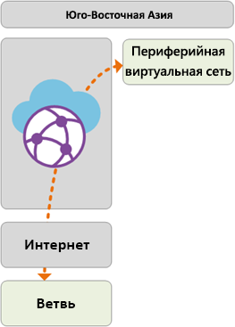

### Путь 2
Путь 2 описывает последовательность трафика из ExpressRoute, подключенного к виртуальной сети Azure в регионе "Юго-Восточная Азия".

Трафик направляется следующим образом:
- Европейская штаб-квартира подключена через стандартный канал ExpressRoute к виртуальному концентратору глобальной сети в Западной Европе.
- Подключение "концентратор виртуальной глобальной сети — концентратор" обеспечивает бесперебойный транзитный трафик в виртуальную сеть, подключенную в удаленном регионе.

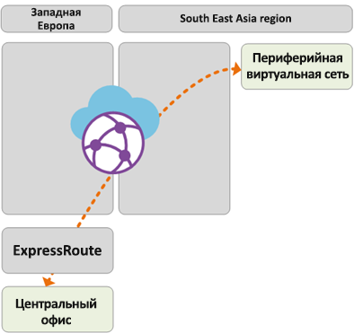

### Путь 3
Путь 3 описывает последовательность трафика из локального ЦОД в Азии, подключенного к частной глобальной сети, к филиалу, подключенному к европейскому S2S.

Трафик направляется следующим образом:
- ЦОД в Азии подключен к локальной частной службе глобальной сети.
- Канал ExpressRoute локально завершается в частной глобальной сети, которая подключается к виртуальному концентратору глобальной сети в Юго-Восточной Азии.
- Подключение "концентратор виртуальной глобальной сети — концентратор" позволяет легко передавать трафик филиала, подключенного к удаленному концентратору в Европе.

### Путь 4
Путь 4 описывает последовательность трафика из виртуальной сети Azure в регионе "Юго-Восточная Азия" для виртуальной сети Azure в регионе "Западная Европа".

Трафик направляется следующим образом:
- Подключение "концентратор виртуальной глобальной сети — концентратор" позволяет осуществлять встроенное переподключение всех подключенных виртуальных сетей Azure без дальнейшей настройки пользователей.

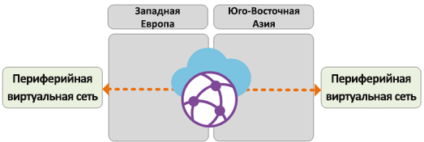

### Путь 5
Путь 5 описывает последовательность трафика от VPN-пользователя (P2S) в сторонней сети к виртуальной сети Azure в регионе "Западная Европа".

Трафик направляется следующим образом:
- Пользователи ноутбуков и телефонов используют клиент OpenVPN для прозрачного подключения в к VPN-шлюзу P2S в Западной Европе.
- Виртуальный концентратор глобальной сети в Западной Европе направляет трафик локально в подключенную виртуальную сеть.

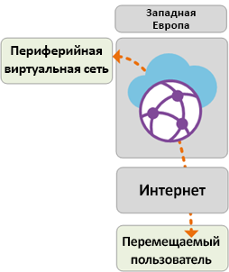

## Управление политиками и безопасностью с помощью брандмауэра Azure

Теперь компания Contoso проверила связь между всеми филиалами и виртуальными сетями в соответствии с требованиями, описанными выше в этом документе. Для удовлетворения требований к управлению безопасностью и сетевой изоляции им нужно по-прежнему разделять и отслеживать трафик через сеть концентратора, что ранее выполнялось с помощью NVA. Компании Contoso также нужно вывести из эксплуатации свои существующие прокси-службы и использовать собственные службы Azure для фильтрации исходящего трафика в Интернет. 

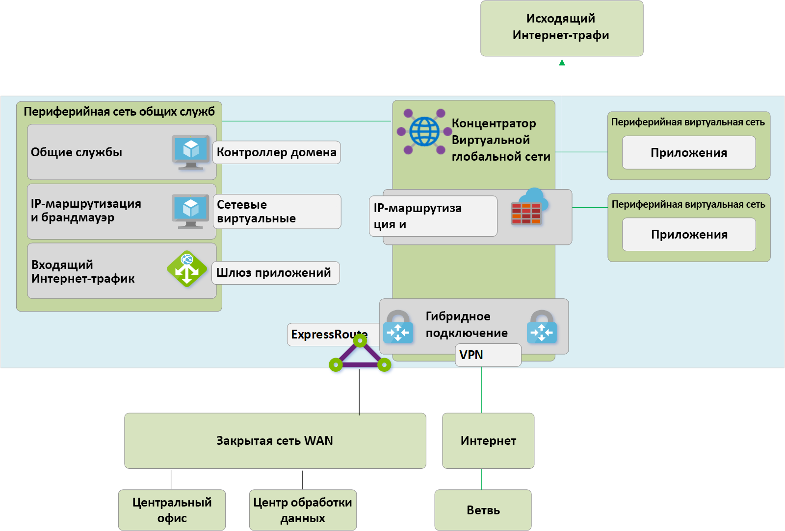
**Рис. 12. Брандмауэр Azure в виртуальной глобальной сети (защищенный виртуальный концентратор)**

Для внедрения брандмауэра Azure в виртуальные глобальные концентраторы, чтобы обеспечить единую точку управления политикой, необходимо выполнить следующее. Этот процесс и концепция защищенных виртуальных концентраторов подробно описаны [здесь](https://go.microsoft.com/fwlink/?linkid=2107683).
- Создание политики Брандмауэра Azure
- Связь политики брандмауэра с виртуальным концентратором глобальной сети Azure.
Этот шаг позволяет использовать существующий виртуальный концентратор глобальной сети в качестве защищенного виртуального концентратора и развертывать необходимые ресурсы брандмауэра Azure.

> [!NOTE]
> Если брандмауэр Azure развернут в стандартном виртуальном концентраторе глобальной сети (номер SKU: "Стандартный"): Политики брандмауэра V2V, B2V, V2I и B2I применяются только к трафику, исходящему из виртуальных сетей, и филиалов, подключенных к определенному концентратору, в котором развертывается сервер брандмауэра Azure (защищенный концентратор). Трафик, исходящий из удаленных виртуальных сетей и филиалов, подключенных к другим виртуальным концентраторам глобальной сети в той же виртуальной сети, не будет защищен брандмауэром, хотя эти удаленные филиалы и виртуальные сети связаны между собой с помощью подключений концентратора виртуальной глобальной сети. Поддержка брандмауэра между концентраторами предусмотрена стратегией виртуальной глобальной сети и диспетчера брандмауэра Azure.

Следующие пути описывают последовательности подключения, формируемые защищенными виртуальными концентраторами Azure.

### Путь 6
Путь 6 описывает последовательность транзитного трафика между виртуальными сетями в пределах одного региона.

Трафик направляется следующим образом:
- Виртуальные сети, подключенные к одному и тому же защищенному виртуальному концентратору, теперь направляют трафик через брандмауэр Azure.
- Брандмауэр Azure может применять политики к этому трафику.

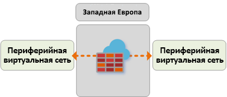

### Путь 7
Путь 7 описывает поток трафика из виртуальной сети в Интернет или сторонние службы безопасности.

Трафик направляется следующим образом:
- Виртуальные сети, подключенные к защищенному виртуальному концентратору, могут передавать трафик в общедоступные места назначения в Интернете, используя безопасный концентратор в качестве центральной точки доступа к Интернету.
- Этот трафик можно отфильтровать локально с помощью правил FQDN Брандмауэра Azure или отправить в стороннюю службу безопасности для проверки.

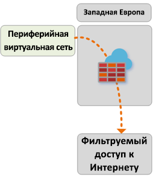

### Путь 8
В пути 8 описывается обмен данными между ветвью и Интернетом или сторонней службой безопасности.

Трафик направляется следующим образом:
- Филиалы, подключенные к защищенному виртуальному концентратору, могут передавать трафик в общедоступные места назначения в Интернете, используя безопасный концентратор в качестве центральной точки доступа к Интернету.
- Этот трафик можно отфильтровать локально с помощью правил FQDN Брандмауэра Azure или отправить в стороннюю службу безопасности для проверки.

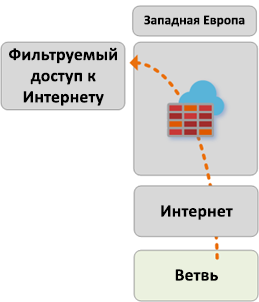 

## Дополнительная информация
Дополнительные сведения о [виртуальной глобальной сети Azure](virtual-wan-about.md)
