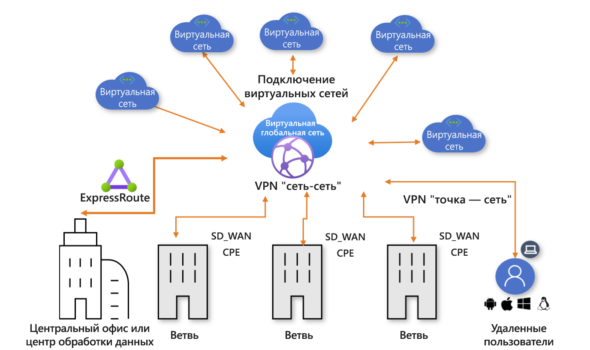

# Что такое Виртуальная глобальная сеть Azure?

Виртуальная глобальная сеть Azure — это сетевая служба, которая обеспечивает оптимизированное и автоматизированное подключение типа "ветвь — ветвь" через Azure. Регионы Azure служат в качестве концентраторов, к которым вы можете подключить ветви. Вы можете использовать магистральную сеть Azure также для подключения ветвей и воспользоваться преимуществами подключения ветвей к виртуальной сети. Мы предоставляем список партнеров, поддерживающих автоматизацию подключения с помощью VPN Виртуальной глобальной сети Azure. Дополнительные сведения см. в статье [Virtual WAN partners and virtual hub locations](virtual-wan-locations-partners.md) (Партнеры Виртуальной глобальной сети и расположения виртуальных концентраторов).

Виртуальная глобальная сеть Azure объединяет множество служб подключения к облаку Azure, таких как VPN типа "сеть — сеть" (общедоступно), ExpressRoute (предварительная версия) и пользовательский VPN типа "точка — сеть" в один интерфейс операций. Подключение к виртуальным сетям Azure устанавливается с помощью подключения по виртуальной сети.

В этой статье представлены краткие сведения о сетевых подключениях в Виртуальной глобальной сети Azure. Виртуальная глобальна сеть обеспечивает следующие преимущества.

* **Интегрированные решения для подключения в звездообразной модели.** Автоматизируйте конфигурацию и подключение "сеть — сеть" между локальными сетями и концентратором Azure.
* **Автоматическая настройка и конфигурация периферийных зон**. Подключайте виртуальные сети и рабочие нагрузки к концентратору Azure просто и эффективно.
* **Интуитивное устранение неполадок**. Вы можете посмотреть поток "узел — узел" в Azure и использовать эту информацию для принятия необходимых действий.

## Ресурсы Виртуальной глобальной сети

Чтобы настроить виртуальную глобальную сеть типа "узел — узел", необходимо создать следующие ресурсы.

* **virtualWAN.** Ресурс virtualWAN представляет собой виртуальное наложение сети Azure и является коллекцией из нескольких ресурсов. Он содержит ссылки на все виртуальные концентраторы, которые необходимо иметь в глобальной виртуальной сети. Ресурсы Виртуальной глобальной сети изолированы друг от друга и не могут содержать общий концентратор. В Виртуальной глобальной сети концентраторы не взаимодействуют друг с другом. Свойство "Allow branch to branch traffic" (Разрешить трафик между ветвями) позволяет разрешить трафик между сетями VPN, а также установить VPN-подключение к сетям ExpressRoute (в настоящее время находится в предварительной версии).

* **Концентратор.** Виртуальный концентратор — это виртуальная сеть, управляемая корпорацией Майкрософт. Концентратор содержит разные конечные точки службы, чтобы обеспечить подключения с локальной сетью (vpnsite). Концентратор является основой сети в регионе. Может существовать только один концентратор в каждом регионе Azure. При создании концентратора на портале Azure создается виртуальная сеть и VPN-шлюз для виртуального концентратора.

  Шлюз концентратора отличается от виртуального сетевого шлюза, который используется для служб ExpressRoute и VPN-шлюз. Например, при использовании Виртуальной глобальной сети, не нужно создавать подключение типа "сеть — сеть" от локального компьютера непосредственно к виртуальной сети. Вместо этого создается подключение типа "сеть — сеть" к концентратору. Трафик всегда направляется через шлюз концентратора. Это значит, что виртуальным сетям не требуется их собственные шлюзы виртуальных сетей. Использование Виртуальной глобальной сети позволяет легко использовать масштабирование виртуальных сетей через виртуальный концентратор и виртуальный шлюз концентратора.

* **Виртуальное сетевое подключение концентратора**. Ресурс виртуального сетевого подключения концентратора используется для беспрепятственного подключения концентратора к виртуальной сети. На сегодняшний день можно подключаться только к виртуальным сетям, которые находятся в одном и том же регионе концентратора.

* **Таблица маршрутов концентратора**.  Вы можете создать маршрут виртуального концентратора и добавить его в таблицу маршрутов виртуального концентратора. В эту таблицу можно добавить несколько маршрутов.

**Дополнительные ресурсы Виртуальной глобальной сети**

  * **Сайт.** Этот ресурс используется только для подключений типа "сеть — сеть". Ресурс узла **vpnsite**. Он представляет локальное VPN-устройство и его параметры. При работе с участником Виртуальной глобальной сети экспорт информации в Azure осуществляется автоматически.

## Подключение

Виртуальная глобальная сеть позволяет использовать три типа подключений: "сеть — сеть", "точка — сеть" (предварительная версия) и ExpressRoute (предварительная версия).

### VPN-подключение типа "сеть —сеть"

При создании подключения типа "сеть — сеть" Виртуальной глобальной сети можно работать с доступным партнером. Если вы не хотите использовать партнера, вы можете настроить подключение вручную. Дополнительные сведения см. в статье [Руководство. Создание подключения "сеть — сеть" с помощью Виртуальной глобальной сети Azure](virtual-wan-site-to-site-portal.md).

#### Рабочий процесс партнера Виртуальной глобальной сети

При работе с партнером Виртуальной глобальной сети рабочий процесс будет следующим:

1. Контроллер устройства филиала (VPN или SDWAN) проходит аутентификацию для экспорта данных о сети в Azure с помощью [субъекта-службы Azure](../active-directory/develop/howto-create-service-principal-portal.md).
2. Контроллер устройства ветви (VPN/SDWAN) получает конфигурацию подключения Azure и обновляет локальное устройство. Это автоматизирует конфигурацию загрузки, редактирования и обновления локального устройства VPN.
3. Как только устройство будет иметь нужную конфигурацию Azure, устанавливается подключение "сеть — сеть" (два активных туннеля) с глобальной сетью Azure. Azure поддерживает протоколы IKEv1 и IKEv2. Узел BGP является необязательным.

#### Партнеры для подключений Виртуальной глобальной сети типа "сеть — сеть"

Список доступных партнеров и расположений см. в статье [Virtual WAN partners and virtual hub locations](virtual-wan-locations-partners.md) (Партнеры Виртуальной глобальной сети и расположения виртуальных концентраторов).

### VPN-подключение типа "точка — сеть" (предварительная версия)

Подключение типа "точка — сеть" позволяет создать безопасное подключение к виртуальной сети с отдельного клиентского компьютера. Подключение типа "точка — сеть" сначала устанавливается на клиентском компьютере. Это эффективное решение для сотрудников, которым нужно подключаться из удаленного расположения, например, если они находятся дома или на конференции. Такую конфигурацию также удобно использовать вместо VPN-подключения типа "сеть — сеть" при наличии небольшого числа клиентов, которым требуется подключение.

Сведения о том, как создать подключение, см. в статье [Руководство. Создание подключения "точка — сеть" с помощью Виртуальной глобальной сети Azure (предварительная версия)](virtual-wan-point-to-site-portal.md).

### Подключения ExpressRoute (предварительная версия)

ExpressRoute позволяет подключать локальные сети владельца Azure по частному подключению. Сведения о том, как создать подключение, см. в руководстве [Руководство. Создание связи ExpressRoute с помощью Виртуальной глобальной сети Azure (предварительная версия)](virtual-wan-expressroute-portal.md).

## Расположения

Сведения о расположении см. в статье [Virtual WAN partners and virtual hub locations](virtual-wan-locations-partners.md) (Партнеры Виртуальной глобальной сети и расположения виртуальных концентраторов).

## Часто задаваемые вопросы

[!INCLUDE [Virtual WAN FAQ](../../includes/virtual-wan-faq-include.md)]

## Дополнительная информация

[Руководство. Создание подключения "сеть — сеть" с помощью Виртуальной глобальной сети Azure](virtual-wan-site-to-site-portal.md)
