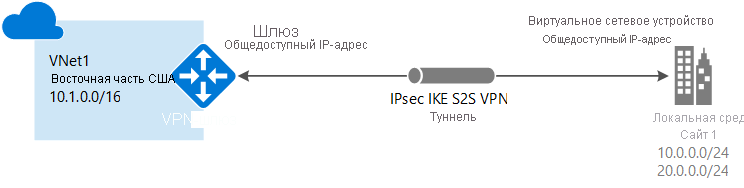

# Создание подключения типа "сеть — сеть" на портале Azure

В этой статье показано, как с помощью портала Azure создать подключение типа "сеть — сеть" с использованием VPN-шлюза между вашей локальной сетью к виртуальной. Приведенные в этой статье инструкции относятся к модели развертывания с помощью Resource Manager. Эту конфигурацию также можно создать с помощью разных средств или моделей развертывания, выбрав вариант из следующего списка:

> [!div class="op_single_selector"]
> * [портал Azure](vpn-gateway-howto-site-to-site-resource-manager-portal.md)
> * [PowerShell](vpn-gateway-create-site-to-site-rm-powershell.md)
> * [CLI](vpn-gateway-howto-site-to-site-resource-manager-cli.md)
> * [Портал Azure (классический)](vpn-gateway-howto-site-to-site-classic-portal.md)
> 
>

Подключение VPN-шлюза типа "сеть — сеть" используется для подключения между локальной сетью и виртуальной сетью Azure через туннель VPN по протоколу IPsec/IKE (IKEv1 или IKEv2). Для этого типа подключения требуется локальное VPN-устройство, которому назначен внешний общедоступный IP-адрес. Дополнительные сведения о VPN-шлюзах см. в [этой статье](vpn-gateway-about-vpngateways.md).

## Перед началом работы

Перед началом настройки убедитесь, что удовлетворены следующие требования:

* Убедитесь, что у вас есть совместимое VPN–устройство и пользователь, который может настроить его. Дополнительные сведения о совместимых устройствах VPN и их настройке см. в [этой статье](vpn-gateway-about-vpn-devices.md).
* Убедитесь, что у вас есть общедоступный IPv4–адрес для вашего VPN–устройства.
* Если вы не знаете диапазоны IP-адресов в своей конфигурации локальной сети, найдите того, кто сможет предоставить вам нужную информацию. При создании этой конфигурации необходимо указать префиксы диапазона IP-адресов, которые Azure будет направлять к локальному расположению. Ни одна из подсетей локальной сети не может перекрывать виртуальные подсети, к которым вы хотите подключиться. 

### Примеры значений

В примерах этой статьи мы используем следующие значения. Эти значения можно использовать для создания тестовой среды или для лучшего понимания примеров в этой статье. Общие сведения о параметрах VPN-шлюза см. в статье [Сведения о параметрах конфигурации VPN-шлюза](vpn-gateway-about-vpn-gateway-settings.md).

* **Имя виртуальной сети:** Виртуальная сеть 1
* **Адресное пространство:** 10.1.0.0/16
* **Подписка**: Подписка, которая будет использоваться
* **Группа ресурсов:** TestRG1
* **Расположение**. East US
* **Подсеть**. Внешний интерфейс: 10.1.0.0/24, серверная часть: 10.1.1.0/24 (необязательно для этого упражнения)
* **Имя подсети шлюза:** GatewaySubnet (автоматически заполняется на портале)
* **Диапазон адресов подсети шлюза:** 10.1.255.0/27
* **Имя шлюза виртуальной сети:** VNet1GW
* **Общедоступный IP-адрес:** VNet1GWIP
* **Тип VPN:** на основе маршрута
* **Тип подключения:** "сеть — сеть" (IPsec)
* **Тип шлюза:** VPN
* **Имя шлюза локальной сети:** Site1
* **Имя подключения:** VNet1toSite1
* **Общий ключ:** в этом примере мы используем abc123. Но можно использовать любой ключ, совместимый с оборудованием VPN. Важно, чтобы значения совпадали на обеих сторонах подключения.

## 1. Создать виртуальную сеть

[!INCLUDE [Create a virtual network](../../includes/vpn-gateway-create-virtual-network-portal-include.md)]

## 2. Создание VPN-шлюза

На этом шаге вы создадите шлюз для своей виртуальной сети. Создание шлюза часто занимает 45 минут и более, в зависимости от выбранного SKU шлюза.

[!INCLUDE [About gateway subnets](../../includes/vpn-gateway-about-gwsubnet-portal-include.md)]

[!INCLUDE [Create a vpn gateway](../../includes/vpn-gateway-add-gw-rm-portal-include.md)]

[!INCLUDE [NSG warning](../../includes/vpn-gateway-no-nsg-include.md)]

## 3. Создание шлюза локальной сети

Обычно термин "шлюз локальной сети" означает локальное расположение. Присвойте сайту имя, по которому Azure может обращаться к этому сайту, а затем укажите IP-адрес локального VPN-устройства, к которому вы подключитесь. Вы можете также указать префиксы IP-адресов, которые будут направляться через VPN-шлюз к VPN-устройству. Указываемые префиксы адресов расположены в локальной сети. Если вы внесли изменения в локальной сети или вам нужно изменить общедоступный IP-адрес для VPN-устройства, значения можно легко обновить позже.

[!INCLUDE [Add a local network gateway](../../includes/vpn-gateway-add-local-network-gateway-portal-include.md)]

## 4. Настройка устройства VPN

Для подключения типа "сеть — сеть" к локальной сети требуется VPN-устройство. На этом этапе мы настроим VPN-устройство. Чтобы настроить локальное VPN-устройство, вам потребуется следующее:

- Общий ключ. Это тот же общий ключ, который указывается при создании VPN-подключения "сеть — сеть". В наших примерах мы используем простые общие ключи. Для практического использования рекомендуется создавать более сложные ключи.
- Общедоступный IP-адрес шлюза виртуальной сети. Общедоступный IP-адрес можно просмотреть с помощью портала Azure, PowerShell или CLI. Чтобы найти общедоступный IP-адрес VPN-шлюза с помощью портала Azure, перейдите к разделу **Шлюзы виртуальной сети** и щелкните имя шлюза.

[!INCLUDE [Configure a VPN device](../../includes/vpn-gateway-configure-vpn-device-include.md)]

## 5. Создание VPN-подключения

Создайте VPN-подключение типа "сеть — сеть" между шлюзом виртуальной сети и локальным VPN-устройством.

[!INCLUDE [Add a site-to-site connection](../../includes/vpn-gateway-add-site-to-site-connection-portal-include.md)]

## 6. Проверка VPN-подключения

[!INCLUDE [Verify the connection](../../includes/vpn-gateway-verify-connection-portal-include.md)]

## Подключение к виртуальной машине

[!INCLUDE [Connect to a VM](../../includes/vpn-gateway-connect-vm-s2s-include.md)]

## Как сбросить VPN-шлюз

Сброс настроек VPN-шлюза Azure полезен при потере распределенного VPN-подключения в одном или нескольких VPN-туннелях типа "сеть-сеть". В этой ситуации все локальные VPN-устройства работают правильно, но не могут взаимодействовать с VPN-шлюзами Azure через туннели IPsec. Пошаговые инструкции см. в статье [Сброс VPN-шлюза](vpn-gateway-resetgw-classic.md).

## Как изменить SKU шлюз (изменить размер шлюза)

Пошаговые инструкции для изменения SKU шлюза см. в статье [Работа со SKU шлюза виртуальной сети (старые версии SKU)](vpn-gateway-about-vpn-gateway-settings.md#gwsku).

## Как добавить дополнительное подключение к VPN-шлюзу

Вы можете добавлять дополнительные подключения при условии, что ни один из диапазонов адресов не перекрывается между подключениями.

1. Чтобы добавить дополнительное подключение, перейдите к VPN-шлюзу и щелкните **Подключения**. Откроется страница "Подключения".
2. Нажмите кнопку **+ Добавить**, чтобы добавить подключение. Задайте соответствующий тип соединения: "виртуальная сеть — виртуальная сеть" (при подключении к другому шлюзу виртуальной сети) или "сеть — сеть".
3. Если вы используете подключение "сеть — сеть", но еще не создали шлюз для локальной сети, к которой подключаетесь, создайте этот шлюз.
4. Укажите необходимый общий ключ и нажмите кнопку **ОК**, чтобы создать подключение.

## Следующие шаги

* Сведения о BGP см. в статьях [Обзор использования BGP с VPN-шлюзами Azure](vpn-gateway-bgp-overview.md) и [Настройка BGP на VPN-шлюзах Azure с помощью Azure Resource Manager и PowerShell](vpn-gateway-bgp-resource-manager-ps.md).
* Сведения о принудительном туннелировании см. в статье [Настройка принудительного туннелирования с помощью модели развертывания Azure Resource Manager](vpn-gateway-forced-tunneling-rm.md).
* Сведения о высокодоступных подключениях в режиме "активный — активный" см. в статье [Настройка высокодоступных подключений: распределенных и между виртуальными сетями](vpn-gateway-highlyavailable.md).
* Сведения об ограничении сетевого трафика к ресурсам в виртуальной сети см. в статье [Безопасность сети](../virtual-network/security-overview.md).
* Сведения о том, как Azure маршрутизирует трафик между средой Azure, локальной средой и интернет-ресурсами, см. в статье [Маршрутизация трафика в виртуальной сети](../virtual-network/virtual-networks-udr-overview.md).
* Сведения о создании VPN-подключения "сеть — сеть" с помощью шаблона Azure Resource Manager см. в разделе [Create a Site-to-Site VPN Connection](https://azure.microsoft.com/resources/templates/101-site-to-site-vpn-create/) (Создание VPN-подключения "сеть — сеть").
* Сведения о создании VPN-подключения "виртуальная сеть — виртуальная сеть" с помощью шаблона Azure Resource Manager см. в разделе [Deploy HBase geo replication](https://azure.microsoft.com/resources/templates/101-hdinsight-hbase-replication-geo/) (Развертывание георепликации HBase).
