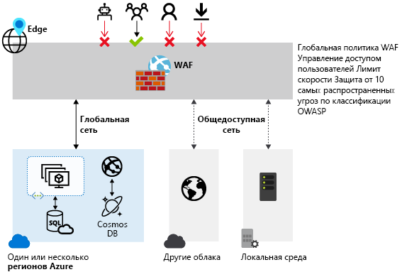

# Брандмауэр веб-приложения Azure в Azure Front Door

Брандмауэр веб-приложения Azure (WAF) в Azure Front Door обеспечивает централизованную защиту веб-приложений, которые доставляются на глобальном уровне с помощью Azure Front Door. Он разработан и предназначен для защиты веб-служб от распространенных эксплойтов и уязвимостей, обеспечения высокой доступности службы для пользователей и соблюдения требований соответствия.

WAF в Azure Front Door — это глобальное и централизованное решение. Он развернут в расположениях граничной сети Azure по всему миру, и каждый входящий запрос к веб-приложениям с поддержкой WAF в рамках Front Door, проверяется в этой граничной сети. Это позволяет WAF перехватить вредоносные атаки предельно близко к их источникам, то есть еще до того, как они попадут в виртуальную сеть. Это позволяет обеспечить глобальную защиту в большом масштабе без ущерба для производительности. Политику WAF можно легко связать с любым профилем Front Door в любой подписке, а новые правила развертываются буквально за несколько минут, что позволит вам быстро реагировать на новые тенденции цифровых угроз.

## Политика и правила WAF

Вы можете настроить политику WAF и связать ее с любым числом интерфейсов Front Door, чтобы защитить их. Политика WAF состоит из правил безопасности двух типов:

- настраиваемые правила, созданные пользователем;

- управляемые наборы правил, которые представляют собой управляемую Azure коллекцию предварительно настроенных правил.

Если используются правила обоих типов, то настраиваемые правила обрабатываются раньше, чем правила из управляемого службой набора правил. Каждое правило определяет условие соответствия, приоритет и действие. Поддерживаются следующие типы действий: ALLOW (разрешить), BLOCK (блокировать), LOG (занести в журнал) и REDIRECT (перенаправить). Вы можете создать полностью настраиваемую политику в соответствии с индивидуальными требованиями к защите приложения, комбинируя управляемые и пользовательские правила.

Правила в этой политике обрабатываются в порядке приоритета, который определяется в виде уникального целого числа для каждого правила. Чем меньше это значение, тем выше приоритет правила, а значит оно будет обработано раньше правил с более высоким значением. Когда обнаруживается подходящее правило, к запросу применяется действие, определенное в этом правиле. После обработки обнаруженного соответствия правила с более низким приоритетом не обрабатываются.

Веб-приложение на платформе Front Door может иметь только одну связанную политику WAF в любой момент времени. Но вы можете использовать конфигурацию Front Door, с которой не связана ни одна политика WAF. Если политика WAF присутствует, она реплицируется во все наши граничные расположения, чтобы согласованно применять политики безопасности по всему миру.

## Режимы WAF

Для политики WAF можно настроить один из следующих двух режимов работы.

- **Режим обнаружения**. В режиме обнаружения WAF не предпринимает никаких действий, кроме отслеживания запросов, ведения журнала запросов и занесения соответствий с правилами WAF в журнал WAF. Вы можете включить ведение журнала диагностики для Front Door (например, перейдя на портале Azure к разделу **Диагностика**).

- **Режим предотвращения**. Если настроено выполнение в режиме предотвращения, WAF выполняет указанное действие, когда запрос соответствует правилу, прекращая проверку правил с низким приоритетом после первого совпадения. Все запросы, для которых обнаружены совпадающие правила, также регистрируются в журналах WAF.

## Действия WAF

Пользователи WAF могут выбрать одно из следующих действий для применения к запросу, который соответствует условиям правила.

- **Разрешить:**  запрос пропускается через WAF и передается в серверную часть. Никакие правила с более низким приоритетом не могут блокировать такой запрос.
- **Block** (блокировать). Запрос блокируется, и WAF самостоятельно отправляет клиенту ответ, не передавая запрос в серверную часть.
- **Log** (занести в журнал).  WAF записывает запрос в свои журналы и продолжает анализ правил с более низким приоритетом.
- **Redirect** (перенаправить). WAF перенаправляет запрос на указанный URI. Этот URI задается в параметре уровня политики. После настройки URI на него передаются все запросы, которые соответствуют правилам с действием **Redirect**.

## Правила WAF

Политика WAF может состоять из правил безопасности двух типов — настраиваемые правила, созданные пользователем, и управляемые Azure наборы предварительно настроенных правил.

### Созданные пользователем правила

Пользовательские правила WAF можно настроить следующим образом.

- **Списки разрешенных и запрещенных IP-адресов**. Вы можете настроить пользовательские правила для управления доступом к веб-приложениям на основе списка или диапазонов IP-адресов клиентов. Поддерживаются типы адресов IPv4 и IPv6. В этом списке вы можете разрешать или блокировать запросы, у которых исходный IP-адрес присутствует в заданном списке.

- **Управление доступом на основе географического региона**. Вы можете настроить пользовательские правила для управления доступом к веб-приложениям на основе кода страны, связанного с IP-адресом клиента.

- **Управление доступом на основе параметров HTTP-запроса**. Вы можете настроить пользовательские правила на основе сопоставления строк и параметров запроса HTTP или HTTPS, таких как строка запроса, аргументы POST, URI запроса, заголовок запроса и текст запроса.

- **Управление доступом на основе метода запроса**. Вы можете настроить пользовательские правила на основе метода HTTP-запроса, например GET, WHERE или HEAD.

- **Ограничение по размеру**. Вы можете настроить пользовательские правила на основе размера отдельных частей запроса, например строки запроса, URI или текста запроса.

- **Правила ограничения частоты**. Правило управления скоростью позволяет ограничить аномально интенсивный трафик, поступающий с какого-либо IP-адреса клиента. Вы можете задать предельное число веб-запросов, пропускаемых с одного IP-адреса клиента в течение минуты. Это отличается от пользовательского правила разрешения или блокировки на основе списка IP-адресов, которое разрешает или блокирует все запросы с определенного IP-адреса клиента. Ограничение частоты можно сочетать с дополнительными условиями, например с параметрами запроса HTTP(S), чтобы более точно управлять частотой.

### Управляемые Azure наборы правил

Наборы правил, управляемые Azure, позволяют легко развернуть защиту от типичного набора угроз безопасности. Этими наборами правил управляет Azure, а значит они быстро обновляются по мере необходимости для защиты от новых сигнатур атак. В общедоступной предварительной версии предоставляется управляемый Azure стандартный набор правил с защитой от следующих категорий угроз:

- Межсайтовые сценарии.
- Атаки Java.
- Включение локального файла.
- Атака путем внедрения кода PHP.
- Удаленное выполнение команд.
- Включение удаленного файла.
- Фиксация сеанса.
- Защита от внедрения кода SQL.
- Атаки на протокол.

Номер версии набора правил по умолчанию будет увеличиваться при каждом добавлении сигнатур атак в набор правил.
Стандартный набор правил по умолчанию включен в режиме обнаружения во всех политиках WAF. Вы можете отключить или включить отдельные правила в стандартном наборе правил в соответствии с требованиями приложения. Можно также настроить действия (ALLOW, BLOCK, REDIRECT, LOG) для каждого правила. По умолчанию используется действие BLOCK. Кроме того, в той же политике WAF можно настроить пользовательские правила, если вы хотите обойти какие-то из предварительно настроенных правил в стандартном наборе правил.
Пользовательские правила всегда применяются до оценки правил в стандартном наборе правил. Если запрос соответствует пользовательскому правилу, применяется действие из этого правила и запрос блокируется либо передается в серверную часть. После этого пользовательские правила или правила из стандартного набора не вызываются. Кроме того, вы всегда можете удалить стандартный набор правил из политик WAF.

### Набор правил защиты от ботов (предварительная версия)

Для WAF можно включить управляемый набор правил защиты от ботов, чтобы выполнять пользовательские действия с запросами от известных категорий ботов. Поддерживаются три категории ботов: плохие, хорошие и неизвестные боты. Подписи ботов управляются и динамически обновляются платформой WAF. Вредоносные IP-адреса плохих ботов передаются из канала Microsoft Threat Intelligence. [Intelligent Security Graph](https://www.microsoft.com/security/operations/intelligence) поддерживает Microsoft Threat Intelligence и используется во множестве служб, включая Центр безопасности Azure. Хорошие боты включают в себя проверенные поисковые системы. Неизвестные категории включают в себя дополнительные группы ботов. Вы можете настроить пользовательские действия для блокировки, разрешения, регистрации или перенаправления для различных типов ботов.

> [!IMPORTANT]
> Сейчас набор правил защиты от ботов предоставляется в общедоступной предварительной версии и поддерживается соглашением об уровне обслуживания для предварительной версии. Некоторые функции могут не поддерживаться или их возможности могут быть ограничены.  См. [дополнительные условия использования для предварительных версий Microsoft Azure](https://azure.microsoft.com/support/legal/preview-supplemental-terms/).

Если защита от ботов включена, входящие запросы, соответствующие обоим правилам, регистрируются в журнале FrontdoorWebApplicationFirewallLog. Доступ к журналам WAF можно получить через учетную запись хранения, концентратор событий или Log Analytics.

## Конфигурация

Настройка и развертывание правил WAF любого типа полностью поддерживаются на портале Azure, интерфейсами REST API, шаблонами Azure Resource Manager и Azure PowerShell.

## Мониторинг

Функции мониторинга WAF в Front Door интегрированы с Azure Monitor, что позволяет удобно отслеживать оповещения и изменения в характере трафика.

## Дополнительная информация

- Подробные сведения о брандмауэре веб-приложения для Шлюза приложений Azure см. [здесь](../ag/ag-overview.md).
