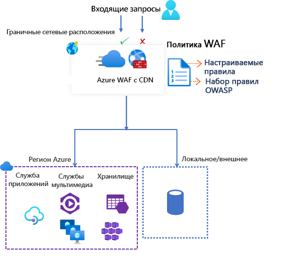

# Брандмауэр веб-приложения Azure в сети доставки содержимого Azure

Брандмауэр веб-приложения Azure (WAF) в сети доставки содержимого Azure (CDN) от Майкрософт обеспечивает централизованную защиту веб-содержимого. WAF защищает веб-службы от распространенных эксплойтов и уязвимостей. Он обеспечивает высокую доступность службы для пользователей и помогает отвечать требованиям соответствия.

> [!IMPORTANT]
> WAF в Azure CDN от Майкрософт сейчас предоставляется в общедоступной предварительной версии и поддерживает соглашение об уровне обслуживания для предварительной версии. Некоторые функции могут не поддерживаться или их возможности могут быть ограничены.  См. [дополнительные условия использования для предварительных версий Microsoft Azure](https://azure.microsoft.com/support/legal/preview-supplemental-terms/).

WAF в Azure CDN — это глобальное и централизованное решение. Он разворачивается в граничных расположениях сети Azure по всему миру. WAF останавливает вредоносные атаки вблизи их источников, до того как они достигнут ваших устройств. Вы получаете глобальную защиту в большом масштабе, не жертвуя производительностью. 

Политика WAF легко связывается с любой конечной точкой CDN в вашей подписке. Новые правила можно развернуть в течение нескольких минут, что позволяет быстро реагировать на изменения моделей угроз.

## Политика и правила WAF

Вы можете настроить политику WAF и связать ее с любым числом конечных точек CDN в целях защиты. Политика WAF состоит из правил безопасности двух типов:

- настраиваемые правила, которые вы можете создать самостоятельно;

- управляемые наборы правил, которые представляют собой управляемую Azure коллекцию предварительно настроенных правил.

Если используются правила обоих типов, то настраиваемые правила обрабатываются раньше, чем правила из управляемого службой набора правил. Каждое правило определяет условие соответствия, приоритет и действие. Поддерживаются следующие типы действий: *ALLOW* (разрешить), *BLOCK* (блокировать), *LOG* (занести в журнал) и *REDIRECT* (перенаправить). Вы можете создать полностью настраиваемую политику в соответствии с индивидуальными требованиями к защите приложения, комбинируя управляемые и пользовательские правила.

Правила в рамках политики обрабатываются в приоритетном порядке. Приоритет — это уникальное число, определяющее порядок обработки правил. Чем меньше это число, тем выше приоритет правила, то есть оно будет обработано раньше правил с более высоким значением. Когда обнаруживается подходящее правило, к запросу применяется действие, определенное в этом правиле. После обработки обнаруженного соответствия правила с более низким приоритетом не обрабатываются.

Веб-приложение на платформе Azure CDN может иметь только одну связанную политику WAF в любой момент времени. Но вы можете использовать конечную точку CDN и без политик WAF. Если политика WAF присутствует, она реплицируется во все наши граничные расположения, чтобы применять согласованные политики безопасности по всему миру.

## Режимы WAF

Для политики WAF можно настроить один из следующих двух режимов работы.

- *Режим обнаружения*. В режиме обнаружения WAF не предпринимает никаких действий, кроме отслеживания запросов, ведения журнала запросов и занесения соответствий с правилами WAF в журнал WAF. Для CDN можно включить ведение журнала диагностики. При использовании портала перейдите к разделу **Диагностика**.

- *Режим предотвращения*. В режиме предотвращения WAF выполняет указанное действие, если запрос соответствует правилу. Правила с более низким приоритетом не оцениваются, если найдено совпадение. Все запросы, для которых обнаружены совпадающие правила, также регистрируются в журналах WAF.

## Действия WAF

Вы можете выбрать одно из следующих действий для применения к запросу, который соответствует условиям правила:

- *Allow*. Запрос пропускается через WAF и передается в серверную часть. Никакие правила с более низким приоритетом не могут блокировать такой запрос.
- *Block*. Запрос блокируется, и WAF самостоятельно отправляет клиенту ответ, не передавая запрос в серверную часть.
- *Log*.  Запрос сохраняется в журналах WAF, и WAF продолжает анализ правил с более низким приоритетом.
- *Redirect*. WAF перенаправляет запрос на указанный URI. Этот URI задается в параметре уровня политики. После настройки URI на него передаются все запросы, которые соответствуют правилам с действием *Redirect*.

## Правила WAF

Политика WAF состоит из правил безопасности двух типов:

- *пользовательские правила* — созданные вами правила; 
- *управляемые наборы правил* — предварительно настроенные правила, управляемые Azure.

### Настраиваемые правила

Настраиваемые правила могут включать правила сопоставления и правила управления частотой.

Вы можете настроить следующие правила сопоставления:

- *Списки разрешенных и запрещенных IP-адресов*. Вы можете управлять доступом к веб-приложениям на основе списка или диапазонов IP-адресов клиентов. Поддерживаются типы адресов IPv4 и IPv6. В этом списке вы можете разрешать или блокировать запросы, у которых исходный IP-адрес присутствует в заданном списке.

- *Управление доступом на основе географического региона*. Вы можете управлять доступом к веб-приложениям на основе кода страны, связанного с IP-адресом клиента.

- *Управление доступом на основе параметров HTTP-запроса*. Правила можно основывать на совпадениях строк в параметрах запроса HTTP/HTTPS.  Например, строках запроса, аргументах POST, URI запроса, Заголовке запроса и Тексте запроса.

- *Управление доступом на основе метода запроса*. Вы определяете правила по методам HTTP-запросов. Например, GET, PUT или HEAD.

- *Ограничение по размеру*. Вы можете основывать правила на размере отдельных частей запроса, например строки запроса, URI или текста запроса.

Правило управления скоростью ограничивает аномально интенсивный трафик с любого из IP-адресов клиента.

- *Правила ограничения частоты*. Вы можете задать предельное число веб-запросов, допустимых с одного IP-адреса клиента в течение минуты. Это правило отличается от пользовательского правила разрешения или блокировки на основе списка IP-адресов, которое разрешает или блокирует все запросы с определенного IP-адреса клиента. Ограничения частоты можно сочетать с дополнительными условиями соответствия, например с параметром запроса HTTP(S), чтобы более точно управлять частотой.

### Управляемые Azure наборы правил

Наборы правил, управляемые Azure, позволяют легко развернуть защиту от типичного набора угроз безопасности. Этими наборами правил управляет Azure, а значит они быстро обновляются по мере необходимости для защиты от новых сигнатур атак. Стандартный набор правил, управляемый Azure, содержит правила для защиты от следующих категорий угроз:

- Межсайтовые сценарии.
- Атаки Java.
- Включение локального файла.
- Атака путем внедрения кода PHP.
- Удаленное выполнение команд.
- Включение удаленного файла.
- Фиксация сеанса.
- Защита от внедрения кода SQL.
- Атаки на протокол.

Номер версии набора правил по умолчанию увеличивается при каждом добавлении сигнатур атак в набор правил.
Стандартный набор правил по умолчанию включен в *режиме обнаружения* во всех политиках WAF. Вы можете отключить или включить отдельные правила в стандартном наборе правил в соответствии с требованиями приложения. Можно также настроить действия (ALLOW, BLOCK, REDIRECT, LOG) для каждого правила. По умолчанию для стандартного управляемого набора правил используется *действие блокировки*.

Пользовательские правила всегда применяются до оценки правил в стандартном наборе правил. Соответствующее действие правила применяется, если запрос соответствует пользовательскому правилу. Запрос будет либо заблокирован, либо передан на сервер. Никакие другие пользовательские правила или правила из стандартного набора правил не обрабатываются. Вы можете также удалить стандартный набор правил из политик WAF.

## Конфигурация

Правила WAF любого типа можно настроить и развернуть с помощью портала Azure, интерфейсов REST API, шаблонов Azure Resource Manager и Azure PowerShell.

## Наблюдение

Функции мониторинга WAF в CDN интегрированы с Azure Monitor, что позволяет удобно отслеживать оповещения и изменения в характере трафика.

## Дальнейшие действия

- [Руководство. Создание политики WAF в Azure CDN при помощи портала Azure](waf-cdn-create-portal.md)
