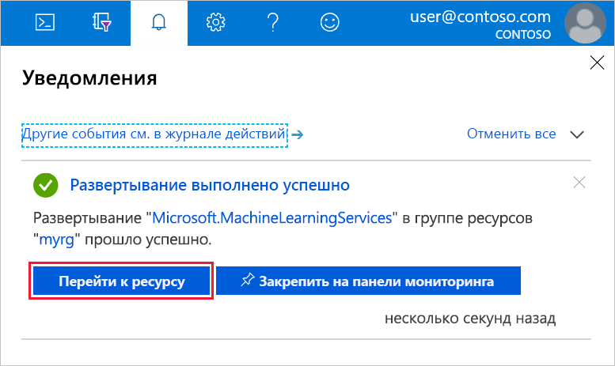

1. Войдите на [портал Azure](https://portal.azure.com/) с помощью учетных данных для используемой подписки Azure. 

   

1. Выберите **Создать ресурс** в левом верхнем углу портала.

   

1. В строке поиска введите **машинное обучение**. Выберите результат поиска **рабочей области Службы машинного обучения**.

   

1. Прокрутите вниз панель **рабочей области Службы машинного обучения** и выберите **Создать**, чтобы начать создание.

   

1. Настройте рабочую область на панели **рабочей области Службы машинного обучения**.

   Поле|ОПИСАНИЕ
   ---|---
   имя рабочей области. |Введите уникальное имя для идентификации рабочей области. В этом примере мы используем **docs-ws**. Имена должны быть уникальными в группе ресурсов. Используйте имя, которое легко запомнить и отличить от рабочих областей, созданных другими пользователями.  
   Подписка |Выберите подписку Azure, которую нужно использовать.
   Группа ресурсов | Используйте группу ресурсов, которая есть в подписке, или введите имя, чтобы создать группу ресурсов. Группа ресурсов — это контейнер, содержащий связанные ресурсы для решения Azure. В этом примере мы используем **docs-aml**. 
   Расположение | Выберите ближайшее к пользователям и ресурсам данных расположение. В нем будет создана рабочая область.

   

1. Чтобы начать процесс создания, выберите **Создать**. Создание рабочей области может занять несколько минут.

1. Вы можете проверить состояние развертывания, щелкнув значок уведомлений (**колокольчик**) на панели инструментов.

1. По завершении процесса появится сообщение об успешном развертывании. Оно также присутствует в области уведомлений. Чтобы просмотреть новую рабочую область, выберите **Перейти к ресурсу**.

   
