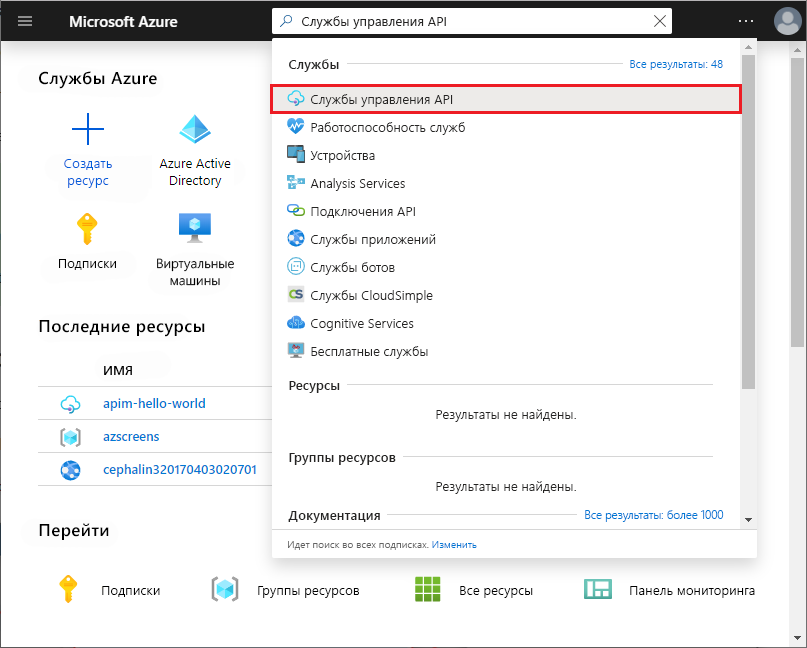
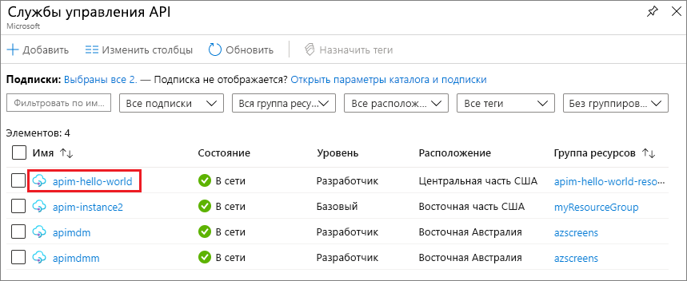

## Перейдите к экземпляру службы управления API.

1. На портале Azure найдите и выберите **Службы управления API**.

   

1. На экране **Управление API** выберите экземпляр службы "Управление API".

   

