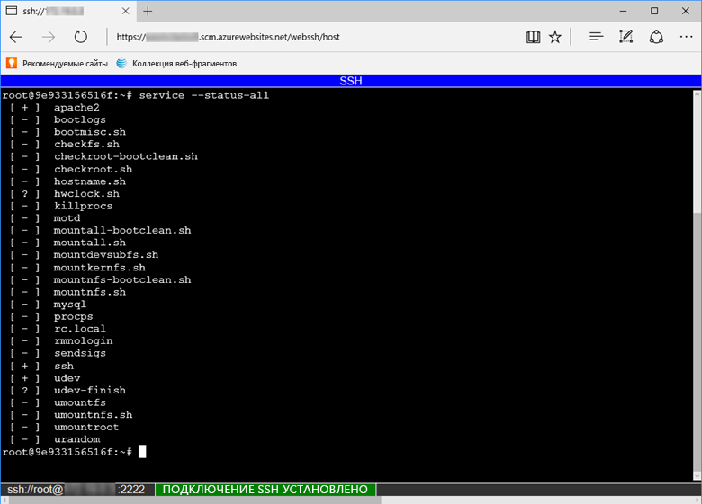

Чтобы открыть прямой сеанс SSH с контейнером, необходимо запустить приложение.

Вставьте следующий URL-адрес в браузер и замените \<app_name> именем вашего приложения:

```
https://<app-name>.scm.azurewebsites.net/webssh/host
```

Если вы не прошли аутентификацию, это потребуется сделать, подключившись с помощью подписки Azure. После выполнения проверки подлинности отобразится оболочка в браузере. Здесь можно запускать команды внутри контейнера.


