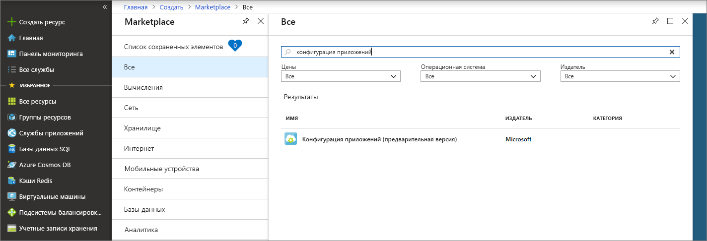

1. Чтобы создать хранилище Конфигурации приложений, войдите на [портал Azure](https://portal.azure.com). Выберите **+ Создать ресурс** в левом верхнем углу страницы. В поле **Поиск в Marketplace** введите **App Configuration** и нажмите клавишу ВВОД.

    

1. В результатах поиска выберите **Конфигурация приложений** и щелкните **Создать**.

1. В области **Конфигурация приложений** > **Создать** введите приведенные ниже параметры.

    | Параметр | Рекомендуемое значение | ОПИСАНИЕ |
    |---|---|---|
    | **Имя ресурса** | Глобально уникальное имя | Введите уникальное имя для ресурса хранилища Конфигурации приложений. Имя должно быть строкой длиной от 1 до 63 символов и содержать только цифры, буквы и символ `-`. Имя не может начинаться или заканчиваться символом `-`. Кроме того, не допускается последовательное использование символов `-`.  |
    | **Подписка** | Ваша подписка | Выберите подписку Azure, которую нужно использовать для тестирования конфигурации приложений. Если в вашей учетной записи есть только одна подписка, она выбирается автоматически, а список **Подписка** не отображается. |
    | **Группа ресурсов** | *AppConfigTestResources* | Выберите или создайте группу ресурсов для ресурса хранилища Конфигурации приложений. Эта группа может быть полезна для упорядочения нескольких ресурсов, которые может потребоваться удалить одновременно путем удаления группы ресурсов. Дополнительные сведения см. в статье [Управление ресурсами Azure через портал](/azure/azure-resource-manager/resource-group-overview). |
    | **Местоположение.** | *Центральная часть США* | В поле **Расположение** укажите, где будет географически располагаться хранилище конфигураций приложения. Для наилучшей производительности создайте ресурс в одном регионе с другими компонентами приложения. |

    

1. Нажмите кнопку **Создать**. Завершение развертывания может занять несколько минут.

1. После завершения развертывания выберите **Параметры** > **Ключи доступа**. Запишите строку подключения для первичного ключа с атрибутом только для чтения или чтения и записи. Она пригодится позже для настройки обмена данными между приложением и созданным хранилищем Конфигурации приложений.
