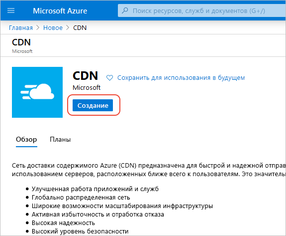
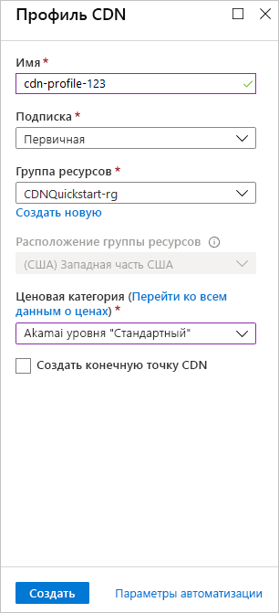

## Создание нового профиля сети CDN

Профиль CDN — это контейнер для конечных точек сети CDN, который определяет ценовую категорию.

1. На портале Azure слева вверху выберите **Создать ресурс**. 
    
    Появится панель **Создание**.
   
2. Выберите **Интернет и мобильные устройства**, а затем — **CDN**.
   
    

    Появится панель **Профили CDN**.

3. Для параметров профиля CDN используйте значения, указанные в следующей таблице:
   
    | Параметр  | Значение |
    | -------- | ----- |
    | **Имя** | Введите *my-cdn-profile-123* в качестве имени профиля. Это имя должно быть глобально уникальным. Если оно уже используется, введите другое имя. |
    | **Подписка** | В раскрывающемся списке выберите подписку Azure. |
    | **Группа ресурсов** | Щелкните **Создать** и введите *my-resource-group-123* в качестве имени группы ресурсов. Если это имя уже используется, вы можете ввести другое имя или в разделе **Use existing** (Использовать существующее) выбрать в раскрывающемся списке **my-resource-group-123**. | 
    | **Расположение группы ресурсов** | В раскрывающемся списке выберите **Central US**. |
    | **Ценовая категория** | В раскрывающемся списке выберите **Verizon уровня "Стандартный"** . |
    | **Создать конечную точку CDN** | Не устанавливайте этот флажок. |  
   
    

4. Чтобы сохранить созданный профиль на панели мониторинга установите флажок **Закрепить на панели мониторинга**.
    
5. Нажмите кнопку **Создать**, чтобы создать профиль. 

    Для профилей **Azure CDN уровня "Стандартный" от Майкрософт** (исключительно) заполнение обычно завершается в течение двух часов. 

