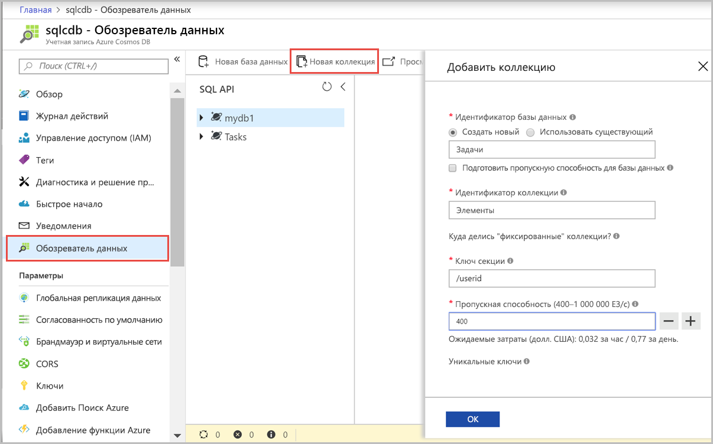

Теперь вы можете использовать средство обозреватель данных на портале Azure для создания базы данных и контейнера. 

1. Щелкните **Обозреватель данных** > **Создать контейнер**. 
    
    Справа отобразится область **Добавить контейнер**. Возможно, вам придется прокрутить экран вправо, чтобы увидеть ее.

    

2. На странице **Добавить контейнер** введите параметры для нового контейнера.

    |Параметр|Рекомендуемое значение|ОПИСАНИЕ
    |---|---|---|
    |**Идентификатор базы данных**|Задачи|Введите *ToDoList* в качестве имени новой базы данных. Имена баз данных должны быть длиной от 1 до 255 символов и не могут содержать символы `/, \\, #, ?` или пробел в конце. Проверьте параметр **Provision database throughput** (Подготовка пропускной способности базы данных), который позволяет предоставить общий доступ к пропускной способности, подготовленной для базы данных всех контейнеров в пределах базы данных. Этот параметр также способствует экономии денежных средств. |
    |**Пропускная способность**|400|Для пропускной способности сохраните значение в 400 единиц запроса в секунду. Чтобы сократить задержку, позже вы можете увеличить масштаб пропускной способности.| 
    |**Идентификатор контейнера**|Items|Введите *Items* в качестве имени нового контейнера. Для идентификаторов контейнеров предусмотрены те же требования к символам, что и для имен баз данных.|
    |**Ключ секции**| /category| В примере, описанном в этой статье, используется ключ секции */category*.|
    
    Помимо указанных выше параметров вы также можете добавить **уникальные ключи** для контейнера. В рамках этого примера оставим это поле пустым. Уникальные ключи предоставляют разработчикам возможность добавить слой целостности данных в базу данных. Создавая политику уникальных ключей при создании контейнера, вы гарантируете уникальность одного или нескольких значений ключа секции. Дополнительные сведения см. в статье [Уникальные ключи в Azure Cosmos DB](../articles/cosmos-db/unique-keys.md).
    
    Нажмите кнопку **ОК**. В обозревателе данных отобразится новая база данных и контейнер.