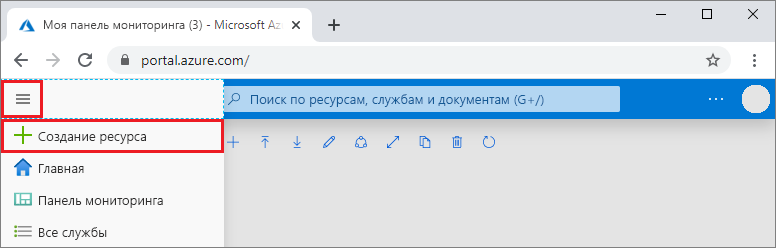
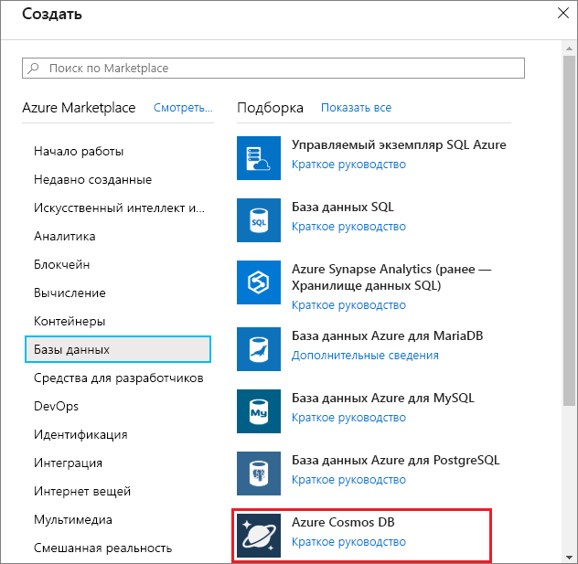
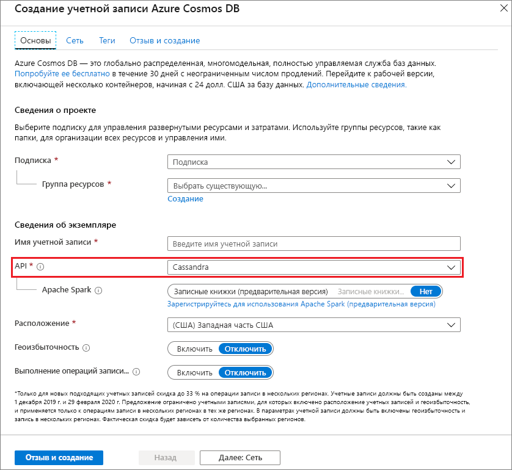

1. В новом окне браузера войдите на [портал Azure](https://portal.azure.com/).

2. В меню слева выберите **Создать ресурс**.
   
   
   
3. На странице **New** (Новый) выберите **Базы данных** > **Azure Cosmos DB**.
   
   
   
3. На странице **Создание учетной записи Azure Cosmos DB** введите параметры для новой учетной записи Azure Cosmos DB. 
 
    Параметр|Значение|Описание
    ---|---|---
    Подписка|Ваша подписка|Вы подписку Azure, которую нужно использовать для этой учетной записи Azure Cosmos DB. 
    Группа ресурсов|Создание  Затем введите имя, использованное для учетной записи|Выберите **Создать**. Затем введите новое имя группы ресурсов для учетной записи. Для удобства можно использовать то же имя, которое присвоено учетной записи Azure Cosmos. 
    Имя учетной записи|Введите уникальное имя.|Введите уникальное имя для идентификации вашей учетной записи Azure Cosmos DB. URI вашей учетной записи *cassandra.cosmos.azure.com* будет добавлен к уникальному имени учетной записи.  Имя может содержать только строчные буквы, цифры и дефисы. Его длина должна быть от 3 до 31 знаков.
    API|Cassandra|API определяет тип учетной записи, которую нужно создать. Azure Cosmos DB предоставляет пять API: API Core (SQL) для баз данных документов, API Gremlin для графовых баз данных, API MongoDB для баз данных документов, API таблиц Azure и API Cassandra. Для каждого API требуется создать отдельную учетную запись.   Выберите **Cassandra**, так как в рамках этого краткого руководства вы создадите таблицу, которая работает с API Cassandra.   [Дополнительные сведения об API Cassandra](../articles/cosmos-db/cassandra-introduction.md).|
    Расположение|Выберите ближайший к пользователям регион|Выберите географическое расположение для размещения учетной записи Azure Cosmos DB. Используйте ближайшее к пользователям расположение, чтобы предоставить им максимально быстрый доступ к данным.

    Выберите **Просмотр и создание**. Можете пропустить разделы **Сеть** и **Теги**. 

    

4. Создание учетной записи займет несколько минут. Дождитесь, пока на портале откроется страница с сообщением **Congratulations! Your Azure Cosmos DB account was created** (Поздравляем! Ваша учетная запись Azure Cosmos DB создана).

